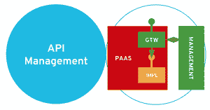
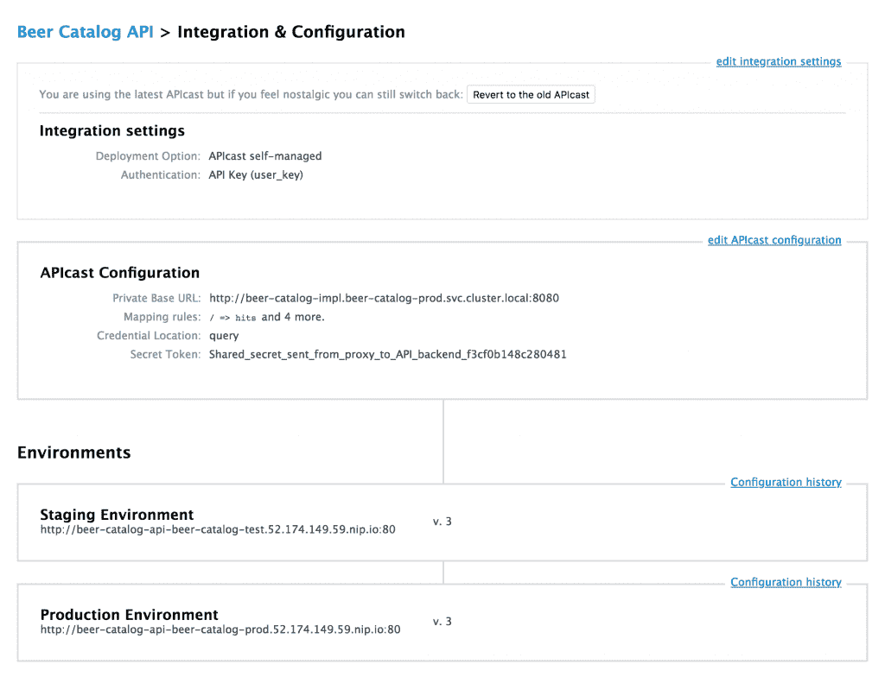
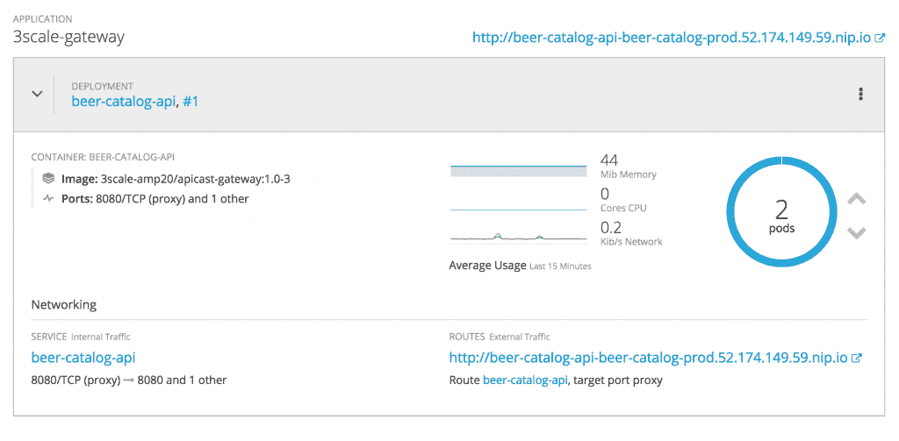
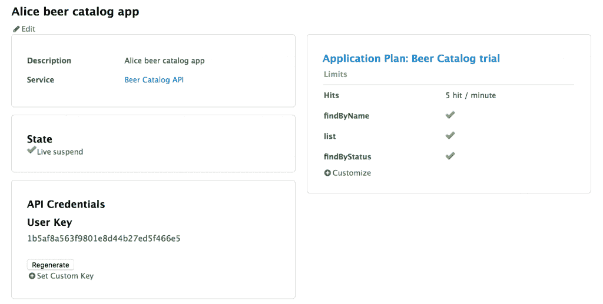
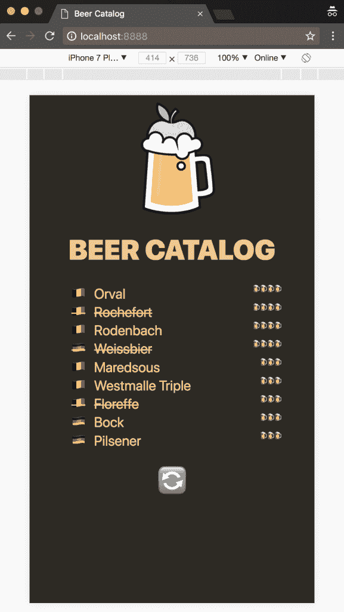
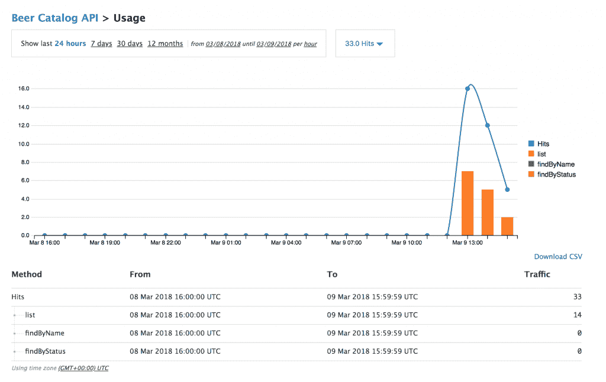
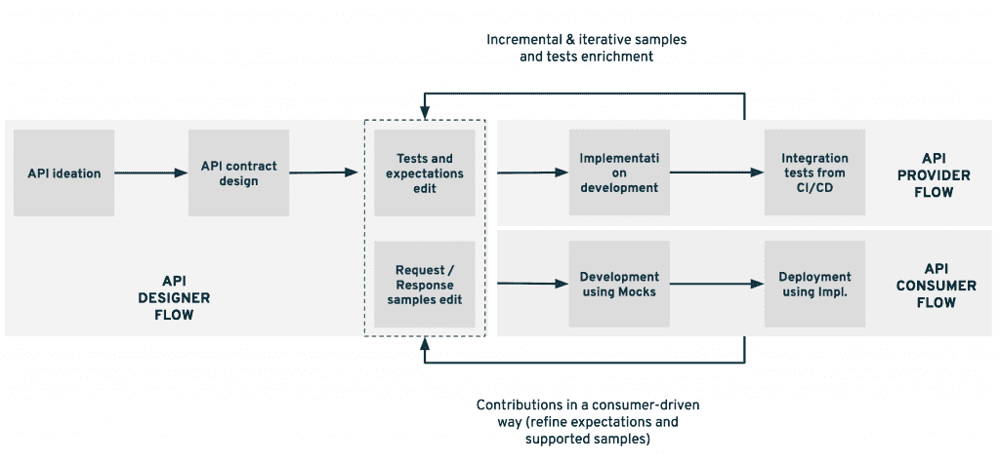
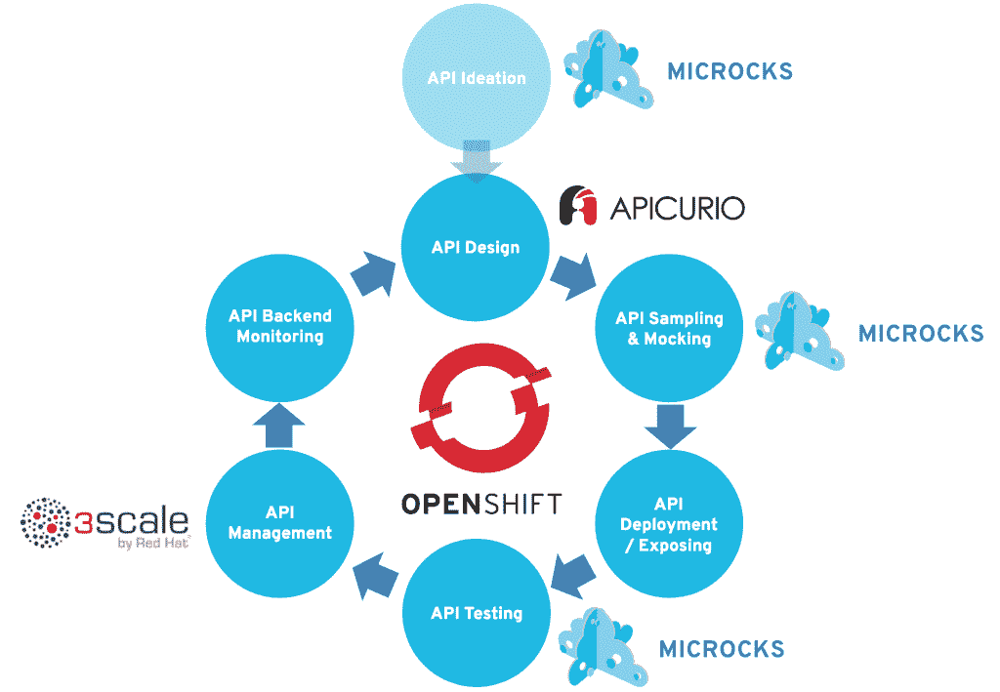

# API 之旅:以敏捷的方式从想法到部署——第三部分

> 原文：<https://developers.redhat.com/blog/2018/04/26/api-journey-idea-deployment-agile-way-part3>

这是一个由三部分组成的系列的第三部分，描述了一个敏捷 API 生命周期的建议方法:从构思到生产部署。如果您错过了或需要复习，请花些时间阅读第一部分的[和第二部分](https://developers.redhat.com/blog/2018/04/11/api-journey-idea-deployment-agile-part1/)的[。](https://developers.redhat.com/blog/2018/04/19/api-journey-idea-deployment-agile-way-part2/)

这个系列是与 Nicolas Massé合著的，他也是一名红帽商，它是基于我们在与我们遇到的红帽顾客打交道时的真实经历。

在第二部分中，我们发现 ACME Inc .如何为其新的`Beer Catalog API`部署进行敏捷 API 之旅。ACME 建立了现代技术，用于在持续集成/持续交付(CI/CD)管道中持续测试其 API 实现。让我们现在去保护博览会。

## 里程碑 6: API 对外公开

我们旅程的最后一个里程碑在这里。这个阶段的目的是安全地向外界公开我们的 API。这是 API 管理和相关网关解决方案的典型用例。在向外界公开 API 时应用 API 管理可以更好地分离关注点。

API 网关通常用于:

*   通过 API 密钥的交付应用消费者的识别
*   使用 OAuth 或 SAML 等标准实施安全策略
*   应用消费策略，如速率限制或版本控制
*   防止拒绝服务攻击和脚本注入等攻击
*   从流量和峰值使用方面更好地了解您的 API 的使用情况

管理层更适合:

*   分发官方文件(合同、模拟和测试)
*   开发人员入职，注册并访问 API 论坛或常见问题解答
*   构建使用情况分析报告
*   应用货币化政策并生成收费/反馈报告

API 管理解决方案其实并不新鲜，但我们想强调的是，它们的架构发生了转变。正如最新的 [ThoughtWorks 技术雷达](https://www.thoughtworks.com/radar/platforms/overambitious-api-gateways) 中所述，过于雄心勃勃的 API 网关现已搁置。我们正在转向一个微网关的世界，这些微网关必须部署在受保护的后端附近，并且应该专注于流量管理的核心问题(身份验证、访问控制和服务级别协议)。

下面的模式描述了我们试图实现的目标:在我们的实施附近部署一个简单、轻量级的网关，因此部署在同一个云就绪的 PaaS 平台上。

我们现在介绍的解决方案是红帽的 [3scale API 管理](https://www.3scale.net/) 解决方案。3scale 是一个混合架构解决方案，具有轻量级网关，可轻松部署在 OpenShift 上，就在您的后端。因此，我们将为我们的 ACME `Beer Catalog API` 部署一个 3scale 网关。

在开始部署网关之前，在 3scale 管理控制台中有许多设置要做。基本上，我们必须声明这个新的 API，它的应用程序计划和服务计划，以及它的集成细节。

您可以在下面的屏幕截图中看到这一点。在这里，网关只会将传入流量路由到 `http://beer-catalog-impl.beer-catalog-prod.svc.cluster.local:8080` URL，这是我们后端的内部 Kubernetes URL。有了 3scale，就不需要让后端可以从外部世界到达。

如前所述，我们可以使用定制脚本在我们的 `beer-catalog-prod` 环境中部署 3scale 网关。该脚本名为 `deploy-3scale.sh` ，位于 [GitHub 库](https://github.com/microcks/api-lifecycle/tree/master/beer-catalog-demo) 。在运行 3scale 安全令牌之前，您必须对其进行调整。

因此，只要在登录到 OpenShift 环境后执行这个脚本，您就会在 `beer-catalog-prod` 项目中看到一个新的 3scale 网关。

现在我们已经部署并保护了我们的实现，是时候进行最后的测试了。我们还将回顾一下它能为 3scale API gateway 带来哪些见解和强大的功能。

假设 ACME 的一个经销商合作伙伴刚刚开发了一个新的移动应用程序，供其客户浏览 ACME brewery 目录。我们将测试它。在此之前，我们将模拟注册爱丽丝 ，一个新的开发者想使用我们的 `Beer Catalog API` 。只需从管理控制台的 `Developer` 组中创建一个新的开发者。

然后，在 Alice 的帐户中创建一个新应用程序。这个我们称之为 `Alice beer catalog app`， 的应用程序应该使用一个`Application Plan`和一个`Service Plan`来连接你的 API。

该注册的目标是检索我们在上面的截图中看到的 `User Key` 。此密钥是我们应该提供的访问凭据，以便在 3scale 网关上进行识别。最后，我们可以设置位于 [GitHub 库](https://github.com/microcks/api-lifecycle/tree/master/beer-catalog-demo) 的 `/api-consumer` 目录下的手机 app。复制关键点然后编辑 `config.js` 文件粘贴到关键点中。然后，在 web 服务器上运行该目录中的所有内容。

比如你可以简单的运行 `python -m SimpleHTTPServer 8888` ，在 `http://localhost:8888` 上打开一个新的浏览器窗口。您可以调整移动设备的显示，以便更好地了解未来的使用情况。

点击几次刷新按钮，根据您的应用程序计划费率限制，当点击 API 次数过多时，您应该会发出一些异常消息。现在，让我们回到 3scale 管理控制台，查看正在更新的 API 分析，反映实时流量，如下所示:

现在是时候尝试一些功能了，如费率限制和货币化政策，以了解 3scale gateway 的全部优势。

## 端到端流量

我们已经到达了 ACME Inc. API 之旅的终点。这一旅程使我们将 API 部署到生产环境中，但也使用了新的方法，如在向世界其他地方交付 API 时进行模拟和持续测试。我们还测试了一款使用我们的 API 的移动应用，通过 3scale 管理解决方案进行管理。

当你看着后视镜时，你可能会问，是否所有这些阶段都可以由一个人按顺序完成。这正是我们想要在下一张图中强调的。整个生命周期确实涉及不同的流程和不同的参与者。我们至少可以分离:

*   包含我们旅程的第一个里程碑的 API Designer 流程:从构思到模拟和测试准备就绪的里程碑。我们认为这些活动主要由个人负责。
*   API 提供者流程负责我们旅程中的以下里程碑:从开发到持续测试再到部署。
*   API 消费者流程，在生命周期中引入取样和模拟步骤时可能会受到影响。当采样和模仿完成时，这种流动在时间线中可以显著地更快和更早。

当然，这些流程应该有交互作用，并且各方之间应该整合反馈回路。通常，提供者可能能够丰富样本集，以说明在初始化期间可能被遗漏的一些边缘情况。它的贡献也非常有助于使样本在业务规则或期望方面更加清晰。当涉及到契约设计时，API 消费者反馈也有很大的作用。 **消费者驱动的期望是后来在 API 提供者的交付管道中实现的非回归测试的黄金。**

当使用开放和协作工具时，所有这些反馈循环都很容易建立和管理，就像我们在 ACME Inc .用例中所做的那样。对 API 操作有任何疑问吗？看一下 Microcks 知识库。想要通过添加新的异常情况来丰富 API 吗？编辑 Postman 集合，并在 Git 存储库上实现一个 Pull/Merge 请求。想通过 API 的契约强调它的一种特殊用法吗？你明白了...

## API 生命周期

在我们的旅程中，我们经历了构成一个循环的里程碑。不同的阶段——API 构思、设计、采样、部署等等——构建了一个真正的迭代和增量循环，使您在部署 API 时更加高效。此外，它允许消费者通过使用采样和模仿技术，在开发周期的早期开始使用 API。

还记得我们 API 旅程的每一个里程碑吗？这是我们在不同阶段使用的不同工具和技术的全貌。

除了我们在用例中开发的 API，本系列中介绍的所有工具也可以部署在 Red Hat OpenShift 容器平台上。它们可以部署在内部或云中，具体取决于您企业的混合云战略。

我们在这里想要强调的是 **OpenShift 作为敏捷 API 之旅真正推动者的独特定位。**

使用 OpenShift，您将能够轻松地部署在第一阶段使用的工具:Microcks 和 Apicurio 都可以安装在 OpenShift 上。容器平台还为所有可用于现代应用程序开发的语言和框架提供了广泛的支持。这些可以是面向微服务的框架，如 Spring Boot、VertX、NodeJS 或 WildFly Swarm，以及集成解决方案，如 JBoss Fuse。通过 Jenkins 管道的支持和集成，OpenShift 中的连续测试和交付变得非常容易。Microcks 来拯救测试合同和期望。3 规模微网关可在数秒内部署，以实施安全和访问策略。而且，您最终将获得所需的一切—从指标和日志收集到分布式跟踪和自动恢复—以卓越运营的方式运行和监控您的后端和这些组件。绝对值得一试，不是吗？

## 关键要点

随着 API 管理解决方案成为主流，安全地向世界公开 API 变得越来越容易。 然而，一个真正敏捷的 API 交付流程不仅仅是一个 API 管理解决方案。

API 之旅经历了许多里程碑，包括合同设计、模仿和测试。您的交付过程应该包含所有这些活动，以便真正敏捷并加速您的开发，以及满足您的客户和合作伙伴的需求。

我们提出的方法建立在开源工具的实际使用上，允许生态系统中的项目和消费者之间进行真正的协作和交流。基于容器平台的现代开发方法也有助于建立持续的部署和改进循环。

如果你已经使用了这种方法，如果你浏览了这个博客系列的例子，或者如果你想进一步讨论这个问题，请随时联系作者:洛朗 [@lbroudoux](https://twitter.com/lbroudoux) 和尼古拉斯 [@nmasse_itix](https://twitter.com/nmasse_itix) 。

*Last updated: September 3, 2019*