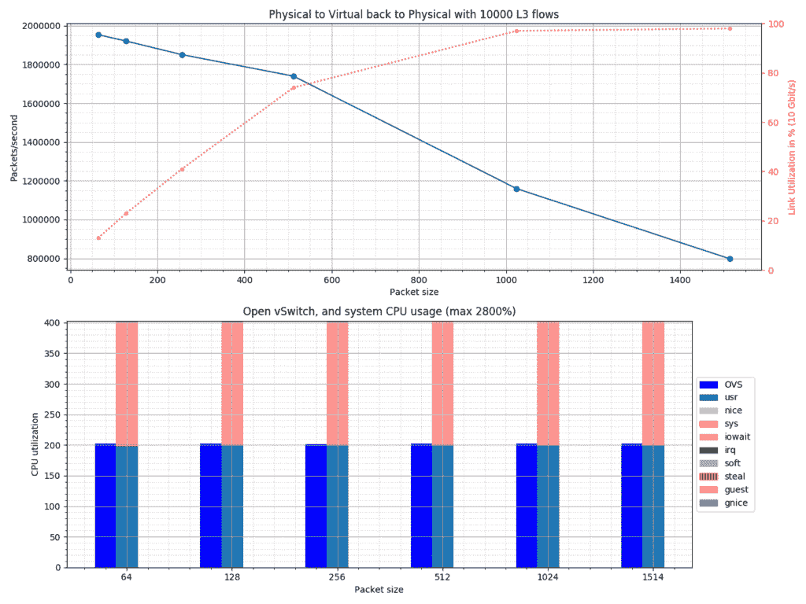
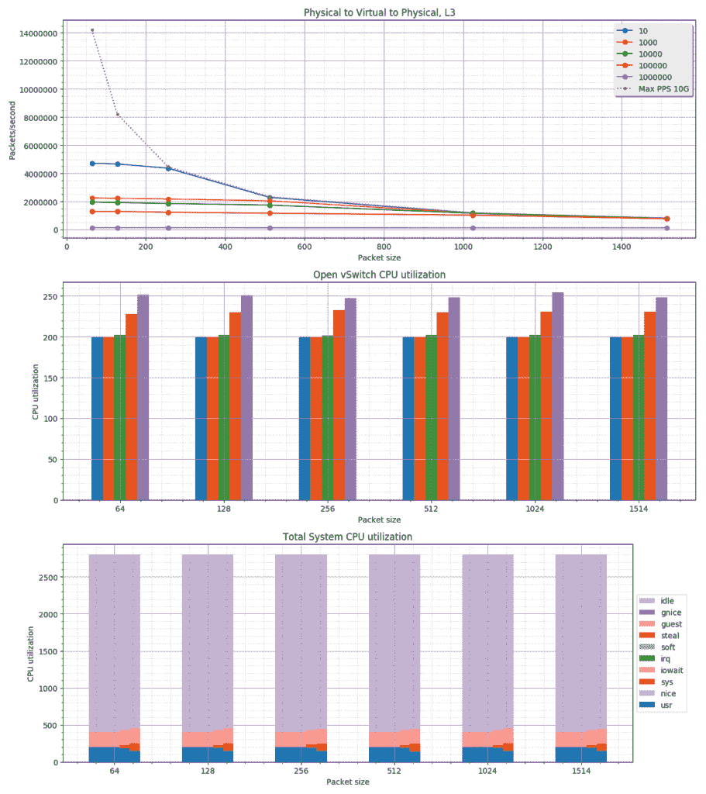

# 自动化开放式虚拟交换机 PVP 测试

> 原文：<https://developers.redhat.com/blog/2017/09/28/automated-open-vswitch-pvp-testing>

本博客描述了如何使用脚本来自动化 Open vSwitch PVP 测试。该 PVP 脚本的目标是提供一种快速(简单)的方法来验证开放式 vSwitch (DPDK)设置的性能(变化)。这个脚本要么与[谢轩网络流量生成器](http://xenanetworks.com/)一起工作，要么与 [T-Rex 真实流量生成器](https://trex-tgn.cisco.com)一起工作。有关 PVP 测试的详细信息，请参考下面的博客文章，[测量和比较 Open vSwitch 性能。](https://developers.redhat.com/blog/2017/06/05/measuring-and-comparing-open-vswitch-performance/)

本安装教程需要两台装有 Red Hat Enterprise Linux 的机器，在本例中，我们使用 7.3 版。一台机器将被用作使用 T-Rex 的流量生成器；另一个是运行开放式 vSwitch 的 DUT。我们使用两个 Intel 82599ES 10G 适配器来互连机器。

# 设置霸王龙流量生成器

我们将用于 T-Rex 流量生成器的两台机器之一。我们还将使用这台机器来运行实际的 PVP 脚本，因此一些额外的设置步骤与此相关。

请查阅 [T-Rex 安装手册](https://trex-tgn.cisco.com/trex/doc/trex_manual.html#_download_and_installation)了解运行 T-Rex 的最低系统要求。例如拥有 Haswell 或更新的 CPU。另外，不要忘记在 BIOS 中启用 VT-d。

## 注册红帽企业版 Linux

安装完 Red Hat Enterprise Linux 之后，我们继续这里的内容。首先，需要注册系统，这样我们就可以下载我们需要的所有软件包:

```
# subscription-manager register
Registering to: subscription.rhsm.redhat.com:443/subscription
Username: user@domain.com
Password:
The system has been registered with ID: xxxxxxxx-xxxx-xxxx-xxxxxxxxxxxxxxxxxx

# subscription-manager attach --pool=xxxxxxxxxxxxxxxxxxxxxxxxxxxxxxxx
Successfully attached a subscription for: xxxxxxxxxxxxxxxxxx
```

## 安装我们需要的软件包

为一些 python 包添加 epel 存储库:

```
yum -y install https://dl.fedoraproject.org/pub/epel/epel-release-latest-7.noarch.rpm
```

现在我们可以安装我们需要的软件包了:

```
yum -y clean all
yum -y update
yum -y install lshw emacs gcc git python-devel python-setuptools python-pip \
           tmux tuned-profiles-cpu-partitioning wget
```

## 调整内核

我们没有使用默认的 2M 大页面，而是配置了 32 个 1G 页面。您可以根据系统的规格进行调整。在这一步中，我们还启用了 T-Rex 使用的一些 DPDK PMD 驱动程序所需的 iommu:

```
sed -i -e 's/GRUB_CMDLINE_LINUX="/GRUB_CMDLINE_LINUX="default_hugepagesz=1G hugepagesz=1G hugepages=32 iommu=on intel_iommu=pt /'  /etc/default/grub
grub2-mkconfig -o /boot/grub2/grub.cfg
```

## 霸王龙的下载和安装

下载并解压缩 T-Rex 流量生成器:

```
mkdir trex
cd trex
wget http://trex-tgn.cisco.com/trex/release/v2.29.tar.gz
tar -xvzf v2.29.tar.gz
cd v2.29
```

使用 *lshw* 实用程序计算出我们想要使用的卡的 PCI 地址:

```
# lshw -c network -businfo
Bus info          Device     Class          Description
=======================================================
pci@0000:01:00.0  em1        network        82599ES 10-Gigabit SFI/SFP+ Network
pci@0000:01:00.1  em2        network        82599ES 10-Gigabit SFI/SFP+ Network
pci@0000:07:00.0  em3        network        I350 Gigabit Network Connection
pci@0000:07:00.1  em4        network        I350 Gigabit Network Connection
```

在我们的例子中，我们将使用 em1，因此 PCI 0000:01:00.0。然而，由于 T-Rex 喜欢端口对，我们也将 em2，0000:01:00.1 分配给 T-Rex。

**注意**:确保你的网卡已经加载了内核驱动，即在上面的输出中有一个*设备*名称，否则下面步骤中的配置可能会失败。

下一步是配置霸王龙:

```
# cd ~/trex/v2.29
# ./dpdk_setup_ports.py -i
By default, IP based configuration file will be created. Do you want to use MAC based config? (y/N)y
+----+------+---------+-------------------+------------------------------------------------+-----------+-----------+----------+
| ID | NUMA |   PCI   |        MAC        |                      Name                      |  Driver   | Linux IF  |  Active  |
+====+======+=========+===================+================================================+===========+===========+==========+
| 0  | 0    | 01:00.0 | 24:6e:96:3c:4b:c0 | 82599ES 10-Gigabit SFI/SFP+ Network Connection | ixgbe     | em1       |          |
+----+------+---------+-------------------+------------------------------------------------+-----------+-----------+----------+
| 1  | 0    | 01:00.1 | 24:6e:96:3c:4b:c2 | 82599ES 10-Gigabit SFI/SFP+ Network Connection | ixgbe     | em2       |          |
+----+------+---------+-------------------+------------------------------------------------+-----------+-----------+----------+
| 2  | 0    | 07:00.0 | 24:6e:96:3c:4b:c4 | I350 Gigabit Network Connection                | igb       | em3       | *Active* |
+----+------+---------+-------------------+------------------------------------------------+-----------+-----------+----------+
| 3  | 0    | 07:00.1 | 24:6e:96:3c:4b:c5 | I350 Gigabit Network Connection                | igb       | em4       |          |
+----+------+---------+-------------------+------------------------------------------------+-----------+-----------+----------+
Please choose even number of interfaces from the list above, either by ID , PCI or Linux IF
Stateful will use order of interfaces: Client1 Server1 Client2 Server2 etc. for flows.
Stateless can be in any order.
Enter list of interfaces separated by space (for example: 1 3) : 0 1

For interface 0, assuming loopback to it's dual interface 1.
Destination MAC is 24:6e:96:3c:4b:c2\. Change it to MAC of DUT? (y/N).
For interface 1, assuming loopback to it's dual interface 0.
Destination MAC is 24:6e:96:3c:4b:c0\. Change it to MAC of DUT? (y/N).
Print preview of generated config? (Y/n)y
### Config file generated by dpdk_setup_ports.py ###

- port_limit: 2
  version: 2
  interfaces: ['01:00.0', '01:00.1']
  port_info:
  - dest_mac: 24:6e:96:3c:4b:c2 # MAC OF LOOPBACK TO IT'S DUAL INTERFACE
    src_mac:  24:6e:96:3c:4b:c0
  - dest_mac: 24:6e:96:3c:4b:c0 # MAC OF LOOPBACK TO IT'S DUAL INTERFACE
    src_mac:  24:6e:96:3c:4b:c2

  platform:
  master_thread_id: 0
  latency_thread_id: 27
  dual_if:
    - socket: 0
      threads: [1,2,3,4,5,6,7,8,9,10,11,12,13,14,15,16,17,18,19,20,21,22,23,24,25,26]

Save the config to file? (Y/n)y
Default filename is /etc/trex_cfg.yaml
Press ENTER to confirm or enter new file:
Saved to /etc/trex_cfg.yaml.
```

因为我们希望在这台机器上运行性能脚本，所以我们决定不将所有 CPU 都专用于 T-Rex。下面您会看到我们在/etc/trex_cfg.yaml 文件中做了哪些更改，以排除线程 1-3:

```
17c17
< threads: [1,2,3,4,5,6,7,8,9,10,11,12,13,14,15,16,17,18,19,20,21,22,23,24,25,26]
---
> threads: [4,5,6,7,8,9,10,11,12,13,14,15,16,17,18,19,20,21,22,23,24,25,26]

```

## 调整系统以适应霸王龙的使用

我们知道哪些线程会被霸王龙使用；让我们把他们奉献给这项任务。我们通过应用 cpu 分区配置文件并配置隔离核心掩码来实现这一点:

```
systemctl enable tuned
systemctl start tuned
echo isolated_cores=4,5,6,7,8,9,10,11,12,13,14,15,16,17,18,19,20,21,22,23,24,25,26 >> /etc/tuned/cpu-partitioning-variables.conf
tuned-adm profile cpu-partitioning
```

现在是时候重启机器来激活隔离的内核并使用配置的 1G 大页面了:

```
# reboot
```

## 启动 T-Rex 服务器

现在，我们已经准备好在 tmux 会话中启动 T-Rex 服务器，因此，如果需要，我们可以查看控制台:

```
cd ~/trex/v2.29
tmux
./t-rex-64 -i
```

# 设置 T-Rex 主机运行实际的 PVP 脚本

因为我们的 T-Rex 机器有足够的资源来运行 PVP 脚本，所以我们决定在那里运行它。然而，理论上，你可以在第三台机器上运行 PVP 脚本，甚至可以在 DUT 上运行。但是一定要让机器靠近流量生成器(无论是 T-Rex 还是谢轩)，因为它需要与它通信来捕获统计数据。

## 安装 PVP 脚本

首先，我们需要在机器上安装脚本:

```
git clone https://github.com/chaudron/ovs_perf.git
```

## 安装 PVP 脚本所需的附加包

我们需要安装一些 PVP 脚本所需的 Python 库。我们将使用 pip 来完成这项工作:

```
pip install --upgrade enum34 natsort netaddr matplotlib scapy spur
```

我们还需要谢轩网络流量生成器库:

```
cd ~
git clone https://github.com/fleitner/XenaPythonLib
cd XenaPythonLib/
python setup.py install
```

最后，我们需要安装 T-Rex 无状态库:

```
cd ~/trex/v2.29
tar -xzf trex_client_v2.29.tar.gz
cp -r trex_client/stl/trex_stl_lib/ ~/pvp_test
cp -r trex_client/external_libs/ ~/pvp_test/trex_stl_lib/

```

# 设置被测设备(DUT)，打开 vSwitch

在本教程中，我们将 Open vSwitch 与 DPDK、用户空间数据路径结合使用。在本文的最后，我们还解释了如何重新配置以使用 Linux 内核数据路径。

## 注册红帽企业版 Linux

与 T-Rex 系统一样，我们首先需要注册系统:

```
# subscription-manager register
Registering to: subscription.rhsm.redhat.com:443/subscription
Username: user@domain.com
Password:
The system has been registered with ID: xxxxxxxx-xxxx-xxxx-xxxxxxxxxxxxxxxxxx

# subscription-manager attach --pool=xxxxxxxxxxxxxxxxxxxxxxxxxxxxxxxx
Successfully attached a subscription for: xxxxxxxxxxxxxxxxxx
```

## 添加我们需要的包

对于 Open vSwitch，我们需要*“红帽企业 Linux 快速数据路径 7”*，对于 Qemu，我们需要*“红帽虚拟化 4”*。如果您无权访问这些存储库，请联系您的 Red Hat 代表。

```
subscription-manager repos --enable=rhel-7-fast-datapath-rpms
subscription-manager repos --enable=rhel-7-server-rhv-4-mgmt-agent-rpms
```

为 sshpass 等添加 epel 存储库:

```
yum -y install https://dl.fedoraproject.org/pub/epel/epel-release-latest-7.noarch.rpm
```

现在我们可以安装我们需要的软件包了:

```
yum -y clean all
yum -y update
yum -y install aspell aspell-en autoconf automake bc checkpolicy \
           desktop-file-utils driverctl emacs gcc gcc-c++ gdb git graphviz \
           groff hwloc intltool kernel-devel libcap-ng libcap-ng-devel \
           libguestfs libguestfs-tools-c libtool libvirt lshw openssl \
           openssl-devel openvswitch procps-ng python python-six \
           python-twisted-core python-zope-interface qemu-kvm-rhev \
           rpm-build selinux-policy-devel sshpass sysstat systemd-units \
           tcpdump time tmux tuned-profiles-cpu-partitioning \
           virt-install virt-manager wget
```

## 调整系统以适应 OVS-DPDK 和 Qemu 的使用

Open vSwitch DPDK 正在与 SELinux 配合使用，但目前最简单的方法是禁用它:

```
sed -i -e 's/SELINUX=enforcing/SELINUX=permissive/' /etc/selinux/config
setenforce permissive
```

我们没有使用默认的 2M 大页面，而是配置了 32 个 1G 页面。您可以根据系统的规格进行调整。在此步骤中，我们还启用了 DPDK PMD 驱动程序所需的 iommu:

```
sed -i -e 's/GRUB_CMDLINE_LINUX="/GRUB_CMDLINE_LINUX="default_hugepagesz=1G hugepagesz=1G hugepages=32 iommu=pt intel_iommu=on/'  /etc/default/grub
grub2-mkconfig -o /boot/grub2/grub.cfg
```

我们的系统是一个使用超线程的单 NUMA 节点，我们希望将第一个超线程对用于系统使用。我们希望将剩余的线程用于 Qemu 并打开 vSwitch。

**注意:**如果您有一个多 NUMA 系统，您分配给 Open vSwitch 和 Qemu 的核心需要与网卡位于同一个 NUMA 节点上。更多的背景资料，见 [OVS-DPDK 参数:处理多 NUMA](https://developers.redhat.com/blog/2017/06/28/ovs-dpdk-parameters-dealing-with-multi-numa/) 博客帖子。

为了计算线程的数量，以及第一个线程对，我们执行以下操作:

```
# lscpu |grep -E "^CPU\(s\)|On-line|Thread\(s\) per core"
CPU(s):                28
On-line CPU(s) list:   0-27
Thread(s) per core:    2

# lstopo-no-graphics
Machine (126GB)
  Package L#0 + L3 L#0 (35MB)
L2 L#0 (256KB) + L1d L#0 (32KB) + L1i L#0 (32KB) + Core L#0
  PU L#0 (P#0)
  PU L#1 (P#14)
L2 L#1 (256KB) + L1d L#1 (32KB) + L1i L#1 (32KB) + Core L#1
  PU L#2 (P#1)
  PU L#3 (P#15)
L2 L#2 (256KB) + L1d L#2 (32KB) + L1i L#2 (32KB) + Core L#2
  ...
  ...
```

现在，我们应用 cpu 分区配置文件，并配置隔离核心掩码:

```
systemctl enable tuned
systemctl start tuned
echo isolated_cores=1-13,15-27 >> /etc/tuned/cpu-partitioning-variables.conf
tuned-adm profile cpu-partitioning
```

现在是时候重启机器来激活隔离的内核，并使用配置的 1G 大页面:

```
# reboot
...
# cat /proc/cmdline
BOOT_IMAGE=/vmlinuz-3.10.0-693.1.1.el7.x86_64 root=/dev/mapper/rhel_wsfd--netdev67-root ro default_hugepagesz=1G hugepagesz=1G hugepages=4 crashkernel=auto rd.lvm.lv=rhel_wsfd-netdev67/root rd.lvm.lv=rhel_wsfd-netdev67/swap console=ttyS1,115200 nohz=on nohz_full=1-13,15-27 rcu_nocbs=1-13,15-27 tuned.non_isolcpus=00004001 intel_pstate=disable nosoftlockup
```

## 设置打开 vSwitch

在 Open vSwitch DPDK 配置中，物理接口由 DPDK 直接控制，因此需要从内核中移除。为此，我们首先需要找出接口的 PCI 地址。一种简单的方法是使用 *lshw* 实用程序:

```
# lshw -c network -businfo
Bus info          Device      Class          Description
========================================================
pci@0000:01:00.0  em1         network        82599ES 10-Gigabit SFI/SFP+ Network Connection
pci@0000:01:00.1  em2         network        82599ES 10-Gigabit SFI/SFP+ Network Connection
pci@0000:07:00.0  em3         network        I350 Gigabit Network Connection
pci@0000:07:00.1  em4         network        I350 Gigabit Network Connection
```

对于我们的性能测试，我们希望使用 10GbE 接口 *em1* 。您可以使用 *dpdk-devbind* 实用程序将接口绑定到 DPDK；但是，这种配置不会在重新启动后继续存在。首选解决方案是使用*驱动*:

```
# driverctl -v set-override 0000:01:00.0 vfio-pci
driverctl: setting driver override for 0000:01:00.0: vfio-pci
driverctl: loading driver vfio-pci
driverctl: unbinding previous driver ixgbe
driverctl: reprobing driver for 0000:01:00.0
driverctl: saving driver override for 0000:01:00.0

# lshw -c network -businfo
Bus info          Device      Class          Description
========================================================
pci@0000:01:00.0              network        82599ES 10-Gigabit SFI/SFP+ Network Connection
pci@0000:01:00.1  em2         network        82599ES 10-Gigabit SFI/SFP+ Network Connection
pci@0000:07:00.0  em3         network        I350 Gigabit Network Connection
pci@0000:07:00.1  em4         network        I350 Gigabit Network Connection

```

启动 Open vSwitch，并在每次重新启动后自动启动它:

```
systemctl enable openvswitch
systemctl start openvswitch
```

对于 OVS-DPDK，我们希望将第二个超线程对(CPU 1，15)用于 PMD 线程。第三个超线程对(CPU 2，16)用于非 PMD DPDK 线程。为此，我们执行以下命令:

```
ovs-vsctl set Open_vSwitch . other_config:dpdk-init=true
ovs-vsctl set Open_vSwitch . other_config:dpdk-socket-mem=2048
ovs-vsctl set Open_vSwitch . other_config:pmd-cpu-mask=0x00008002
ovs-vsctl set Open_vSwitch . other_config:dpdk-lcore-mask=0x00010004
systemctl restart openvswitch
```

对于物理到虚拟回到物理(PVP)测试，我们只需要一个带有两个端口的网桥。此外，我们将使用两个接收队列配置我们的接口:

```
ovs-vsctl --if-exists del-br ovs_pvp_br0
ovs-vsctl add-br ovs_pvp_br0 -- \
      set bridge ovs_pvp_br0 datapath_type=netdev
ovs-vsctl add-port ovs_pvp_br0 dpdk0 -- \
      set Interface dpdk0 type=dpdk -- \
      set Interface dpdk0 options:dpdk-devargs=0000:01:00.0 -- \
      set interface dpdk0 options:n_rxq=2 \
        other_config:pmd-rxq-affinity="0:1,1:15" -- \
      set Interface dpdk0 ofport_request=1
ovs-vsctl add-port ovs_pvp_br0 vhost0 -- \
      set Interface vhost0 type=dpdkvhostuserclient -- \
      set Interface vhost0 options:vhost-server-path="/tmp/vhost-sock0" -- \
      set interface vhost0 options:n_rxq=2 \
        other_config:pmd-rxq-affinity="0:1,1:15" -- \
      set Interface vhost0 ofport_request=2
```

## 创建环回虚拟机

获取[红帽企业版 Linux 7.4 KVM 访客镜像](https://access.redhat.com/downloads/content/69/ver=/rhel---7/7.4/x86_64/product-software)。如果您无法访问该图像，请联系您的 Red Hat 代表。复制供 qemu 使用的映像:

```
# ls -l ~/*.qcow2
-rw-r--r--. 1 root root 556247552 Jul 13 06:10 rhel-server-7.4-x86_64-kvm.qcow2
```

```
mkdir -p /opt/images
cp ~/rhel-server-7.4-x86_64-kvm.qcow2 /opt/images
```

启动并启用 libvirtd:

```
systemctl enable libvirtd.service
systemctl start libvirtd.service
```

尽可能通过调用 *virt-install* 进行设置:

```
# virt-install --connect=qemu:///system \
  --network vhostuser,source_type=unix,source_path=/tmp/vhost-sock0,source_mode=server,model=virtio,driver_queues=2 \
  --network network=default \
  --name=rhel_loopback \
  --disk path=/opt/images/rhel-server-7.4-x86_64-kvm.qcow2,format=qcow2 \
  --ram 8192 \
  --memorybacking hugepages=on,size=1024,unit=M,nodeset=0 \
  --vcpus=4,cpuset=3,4,5,6 \
  --check-cpu \
  --cpu Haswell-noTSX,+pdpe1gb,cell0.id=0,cell0.cpus=0,cell0.memory=8388608 \
  --numatune mode=strict,nodeset=0 \
  --nographics --noautoconsole \
  --import \
  --os-variant=rhel7
```

如果您有一个多 NUMA 系统，并且您不在 NUMA 节点 0 上，那么您需要相应地更改上面的*节点集*值。

请注意，我们已经为 OVS 使用了内核 1、2、15、16，并且我们已经为环回虚拟机(VM)分配了内核 3-6。为了获得最佳性能，我们需要将 vCPUs 固定到真实的 CPU 上。此外，我们还将为 Qemu 相关任务分配一个额外的核心，以确保它们不会中断虚拟机中运行的任何 PMD 线程:

```
virsh vcpupin rhel_loopback 0 3
virsh vcpupin rhel_loopback 1 4
virsh vcpupin rhel_loopback 2 5
virsh vcpupin rhel_loopback 3 6
virsh emulatorpin rhel_loopback 7
```

我们需要手动调整一些虚拟机配置文件设置，因为不是所有选项都可以通过 *virt-install* 获得。这与内存共享以及将虚拟机固定到专用 CPU 有关(上述命令在重启后将失效)。我们将使用*虚拟编辑*来实现这一点。以下是所使用的命令，以及所应用更改的差异:

```
# virsh shutdown rhel_loopback
# virsh edit rhel_loopback

diff:
@@ -18,2 +18,9 @@
 <vcpu placement='static' cpuset='3-6'>4</vcpu>
+ <cputune>
+ <vcpupin vcpu='0' cpuset='3'/>
+ <vcpupin vcpu='1' cpuset='4'/>
+ <vcpupin vcpu='2' cpuset='5'/>
+ <vcpupin vcpu='3' cpuset='6'/>
+ <emulatorpin cpuset='7'/>
+ </cputune>
 <numatune>
@@ -33,3 +40,3 @@
 <numa>
- <cell id='0' cpus='0' memory='8388608' unit='KiB'/>
+ <cell id='0' cpus='0' memory='8388608' unit='KiB' memAccess='shared'/>
 </numa>

```

调整虚拟机，使其具有通过网络管理器命名的接口，并在下次引导时删除云配置:

```
# LIBGUESTFS_BACKEND=direct virt-customize -d rhel_loopback \
  --root-password password:root \
  --firstboot-command 'rm /etc/systemd/system/multi-user.target.wants/cloud-config.service' \
  --firstboot-command 'rm /etc/systemd/system/multi-user.target.wants/cloud-final.service' \
  --firstboot-command 'rm /etc/systemd/system/multi-user.target.wants/cloud-init-local.service' \
  --firstboot-command 'rm /etc/systemd/system/multi-user.target.wants/cloud-init.service' \
  --firstboot-command 'nmcli c | grep -o --  "[0-9a-fA-F]\{8\}-[0-9a-fA-F]\{4\}-[0-9a-fA-F]\{4\}-[0-9a-fA-F]\{4\}-[0-9a-fA-F]\{12\}" | xargs -n 1 nmcli c delete uuid' \
  --firstboot-command 'nmcli con add con-name ovs-dpdk ifname eth0 type ethernet ip4 1.1.1.1/24' \
  --firstboot-command 'nmcli con add con-name management ifname eth1 type ethernet' \
  --firstboot-command 'reboot'
```

启动虚拟机，并连接到控制台:

```
# virsh start rhel_loopback
Domain rhel_loopback started

# virsh console rhel_loopback
Connected to domain rhel_loopback
Escape character is ^]

[root@localhost ~]#
```

虚拟机需要与 OVS-DPDK 实例相同的调整。下面是一个需要在虚拟机上执行的快速命令序列。有关详细信息，请参见[设置被测设备(DUT)的开头，打开上面的 vSwitch](#DUTsetup) 部分:

```
[root@localhost ~]# subscription-manager register
[root@localhost ~]# subscription-manager attach --pool=xxxxxxxxxxxxxxxxxxxxxxxxx
[root@localhost ~]# subscription-manager repos --enable=rhel-7-fast-datapath-rpms
[root@localhost ~]# yum -y clean all
[root@localhost ~]# yum -y update
[root@localhost ~]# yum -y install driverctl gcc kernel-devel numactl-devel tuned-profiles-cpu-partitioning wget
[root@localhost ~]# yum -y update kernel
[root@localhost ~]# sed -i -e 's/GRUB_CMDLINE_LINUX="/GRUB_CMDLINE_LINUX="default_hugepagesz=1G hugepagesz=1G hugepages=2 /'  /etc/default/grub
[root@localhost ~]# grub2-mkconfig -o /boot/grub2/grub.cfg
[root@localhost ~]# echo "options vfio enable_unsafe_noiommu_mode=1" > /etc/modprobe.d/vfio.conf
[root@localhost ~]# driverctl -v set-override 0000:00:02.0 vfio-pci
[root@localhost ~]# systemctl enable tuned
[root@localhost ~]# systemctl start tuned
[root@localhost ~]# echo isolated_cores=1,2,3 >> /etc/tuned/cpu-partitioning-variables.conf
[root@localhost ~]# tuned-adm profile cpu-partitioning
[root@localhost ~]# reboot
```

我们需要这个虚拟机上 DPDK 的 *testpmd* 工具。作为练习，我们从源代码构建它:

```
[root@localhost ~]# cd ~
[root@localhost ~]# wget http://fast.dpdk.org/rel/dpdk-17.08.tar.xz
[root@localhost ~]# tar xf dpdk-17.08.tar.xz
[root@localhost ~]# cd dpdk-17.08
[root@localhost dpdk-17.08]# make install T=x86_64-native-linuxapp-gcc DESTDIR=_install
[root@localhost dpdk-17.08]# ln -s /root/dpdk-17.08/x86_64-native-linuxapp-gcc/app/testpmd /usr/bin/testpmd
```

您可以通过启动 *testpmd* 快速检查您的虚拟机是否设置正确，如下所示:

```
[root@localhost dpdk-17.08]# cd ~
[root@localhost dpdk-17.08]# testpmd -c 0x7 -n 4 --socket-mem 1024,0 -w 0000:00:02.0 -- \
  --burst 64 --disable-hw-vlan -i --rxq=2 --txq=2 \
  --rxd=4096 --txd=1024 --coremask=0x6 --auto-start \
  --port-topology=chained

EAL: Detected 4 lcore(s)
EAL: Probing VFIO support...
EAL: WARNING: cpu flags constant_tsc=yes nonstop_tsc=no -> using unreliable clock cycles !
EAL: PCI device 0000:00:02.0 on NUMA socket -1
EAL:   Invalid NUMA socket, default to 0
EAL:   probe driver: 1af4:1000 net_virtio
Interactive-mode selected
previous number of forwarding cores 1 - changed to number of configured cores 2
Auto-start selected
USER1: create a new mbuf pool : n=163456, size=2176, socket=0
Configuring Port 0 (socket 0)
Port 0: 52:54:00:70:39:86
Checking link statuses...
Done
Start automatic packet forwarding
io packet forwarding - ports=1 - cores=2 - streams=2 - NUMA support enabled, MP over anonymous pages disabled
Logical Core 1 (socket 0) forwards packets on 1 streams:
  RX P=0/Q=0 (socket 0) -> TX P=0/Q=0 (socket 0) peer=02:00:00:00:00:00
Logical Core 2 (socket 0) forwards packets on 1 streams:
  RX P=0/Q=1 (socket 0) -> TX P=0/Q=1 (socket 0) peer=02:00:00:00:00:00

  io packet forwarding - CRC stripping enabled - packets/burst=64
  nb forwarding cores=2 - nb forwarding ports=1
  RX queues=2 - RX desc=4096 - RX free threshold=0
  RX threshold registers: pthresh=0 hthresh=0 wthresh=0
  TX queues=2 - TX desc=1024 - TX free threshold=0
  TX threshold registers: pthresh=0 hthresh=0 wthresh=0
  TX RS bit threshold=0 - TXQ flags=0xf00
testpmd> quit
Telling cores to stop...
Waiting for lcores to finish...

  ---------------------- Forward statistics for port 0  ----------------------
  RX-packets: 0              RX-dropped: 0             RX-total: 0
  TX-packets: 0              TX-dropped: 0             TX-total: 0
  ----------------------------------------------------------------------------

  +++++++++++++++ Accumulated forward statistics for all ports+++++++++++++++
  RX-packets: 0              RX-dropped: 0             RX-total: 0
  TX-packets: 0              TX-dropped: 0             TX-total: 0
  ++++++++++++++++++++++++++++++++++++++++++++++++++++++++++++++++++++++++++++

Done.

Shutting down port 0...
Stopping ports...
Done
Closing ports...
Done

Bye...

Shutting down port 0...
Stopping ports...
Done
Closing ports...
Port 0 is already closed
Done

Bye...
[root@localhost ~]#
```

最后，获取分配给这个虚拟机的 IP 地址，因为我们稍后在执行 PVP 脚本时需要它。

```
[root@localhost ~]# ip address show eth1
3: eth1: <BROADCAST,MULTICAST,UP,LOWER_UP> mtu 1500 qdisc pfifo_fast state UP qlen 1000
link/ether 52:54:00:06:7e:0a brd ff:ff:ff:ff:ff:ff
inet 192.168.122.5/24 brd 192.168.122.255 scope global dynamic eth1
   valid_lft 3590sec preferred_lft 3590sec
inet6 fe80::1c38:e5d7:1687:d254/64 scope link
   valid_lft forever preferred_lft forever
```

# 运行 PVP 脚本

现在我们已经准备好运行 PVP 脚本了。我们回到 T-Rex 主机，因为我们使用它来执行脚本。

在开始之前，我们需要将后端设置为不使用 GUI，并创建一个目录来存储结果:

```
echo export MPLBACKEND="agg" >> ~/.bashrc
source ~/.bashrc
mkdir ~/pvp_results
cd ~/pvp_results/
```

现在我们可以用 1000 个流快速运行一个 64 字节的包。有关支持的 PVP 脚本选项的详细信息，请参见 GitHub 文档中的 [ovs_performance.py 支持的选项](https://github.com/chaudron/ovs_perf#ovs_performancepy-supported-options):

```
# ~/pvp_test/ovs_performance.py \
  -d -l testrun_log.txt \              # Enable script debugging, and save the output to testrun_log.txt
  --tester-type trex \                 # Set tester type to T-Rex
  --tester-address localhost \         # IP address of the T-Rex server
  --tester-interface 0 \               # Interface number used on the T-Rex
  --ovs-address 10.19.17.133 \         # DUT IP address
  --ovs-user root \                    # DUT login user name
  --ovs-password root \                # DUT login user password
  --dut-vm-address 192.168.122.5 \     # Address on which the VM is reachable, see above
  --dut-vm-user root \                 # VM login user name
  --dut-vm-password root \             # VM login user password
  --dut-vm-nic-queues=2 \              # Number of rx/tx queues to use on the VM
  --physical-interface dpdk0 \         # OVS Physical interface, i.e. connected to T-Rex
  --physical-speed=10 \                # Speed of the physical interface, for DPDK we can not detect it reliably
  --virtual-interface vhost0 \         # OVS Virtual interface, i.e. connected to the VM
  --dut-vm-nic-pci=0000:00:02.0 \      # PCI address of the interface in the VM
  --packet-list=64 \                   # Comma separated list of packets to test with
  --stream-list=1000 \                 # Comma separated list of number of flows/streams to test with
  --no-bridge-config \                 # Do not configure the OVS bridge, assume it's already done (see above)
  --skip-pv-test                       # Skip the Physical to Virtual test

- Connecting to the tester...
- Connecting to DUT, "10.19.17.133"...
- Stop any running test tools...
- Get OpenFlow and DataPath port numbers...
- Get OVS datapath type, "netdev"...
- Create "test_results.csv" for writing results...
- [TEST: test_p2v2p(flows=1000, packet_size=64)] START
  * Create OVS OpenFlow rules...
  * Clear all OpenFlow/Datapath rules on bridge "ovs_pvp_br0"...
  * Create 1000 L3 OpenFlow rules...
  * Create 1000 L3 OpenFlow rules...
  * Verify requested number of flows exists...
  * Initializing packet generation...
  * Clear all statistics...
  * Start packet receiver on VM...
  * Start CPU monitoring on DUT...
  * Start packet generation for 20 seconds...
  * Stop CPU monitoring on DUT...
  * Stopping packet stream...
  * Stop packet receiver on VM...
  * Gathering statistics...
- Packets send by Tester      :          270,574,060
- Packets received by physical:           44,172,736 [Lost 226,401,324, Drop 226,401,324]
- Packets received by virtual :           44,172,290 [Lost 446, Drop 446]
- Packets send by virtual     :           44,171,170 [Lost 1,120, Drop 0]
- Packets send by physical    :           44,171,170 [Lost 0, Drop 0]
- Packets received by Tester  :           44,171,170 [Lost 0]
- Receive rate on VM: 2,319,236 pps
  ! Result, average: 2,254,424.93125 pps
  * Restoring state for next test...
- [TEST: test_p2v2p(flows=1000, packet_size=64)] END
- Done running performance tests!

```

如果这是成功的，我们可以继续做全面运行。根据硬件配置，这大约需要一个小时:

```
rm -rf ~/pvp_results
mkdir ~/pvp_results
cd ~/pvp_results/
~/pvp_test/ovs_performance.py \
  -d -l testrun_log.txt \
  --tester-type trex \
  --tester-address localhost \
  --tester-interface 0 \
  --ovs-address 10.19.17.133 \
  --ovs-user root \
  --ovs-password root \
  --dut-vm-address 192.168.122.5 \
  --dut-vm-user root \
  --dut-vm-password root \
  --dut-vm-nic-queues=2 \
  --physical-interface dpdk0 \
  --physical-speed=10 \
  --virtual-interface vhost0 \
  --dut-vm-nic-pci=0000:00:02.0 \
  --no-bridge-config \
  --skip-pv-test
```

# 分析结果

上面的完整运行将生成以下文件:

```
# ls | more
test_p2v2p_1000000_l3.png
test_p2v2p_100000_l3.png
test_p2v2p_10000_l3.png
test_p2v2p_1000_l3.png
test_p2v2p_10_l3.png
test_p2v2p_all_l3.png
test_p2v2p_all_l3_ref.png
test_results_l3.csv
testrun_log.txt
```

***test _ results _ L3 . CSV***文件包含所有的吞吐量数字和 CPU 利用率细节。下面是一个输出示例，删除了 CPU 数据，因为它会产生一些噪声:

```
# cat test_results_l3.csv | grep -v cpu
"Physical port, ""dpdk0"", speed 10 Gbit/s"

"Physical to Virtual to Physical test, L3 flows"
,Packet size
Number of flows,64,128,256,512,1024,1514
10,4727031.0,4667014.3125,4364770.8125,2287722.54375,1173820.56875,789753.2374999999
1000,2250850.53125,2220449.0625,2173334.875,2046172.8687500001,1163426.2874999999,792140.7312500001
10000,1953503.9875,1920673.01875,1850640.8375,1739899.65,1159738.70625,797117.66875
100000,1282826.4,1291901.2249999999,1230113.23125,1163795.4125,1027805.6124999999,771230.91875
1000000,135964.475,131447.69375,134586.19999999998,129209.65624999997,125609.67500000003,125875.18125000001
```

对于每个流量大小，除了两个总体图形之外，还创建一个单独的图形，***test _ p2v2p _ XXX _ L3 . png***。***test _ p2v2p _ all _ L3 _ ref . png***将在一个图表中显示所有流量大小，并加上理论最大值，***test _ p2v2p _ all _ L3 . png***不显示理论最大值。

下面你会发现以***test _ p2v2p _ 10000 _ L3 . png***和***test _ p2v2p _ all _ L3 _ ref . png***的内容为例。

### *test _ p2 v2 p _ 10000 _ L3 . png*:



### *test _ p2 v2 p _ all _ L3 _ ref . png*:



以下系统配置用于收集这些数字并创建图表:

*   Dell PowerEdge R730，单插槽
*   英特尔氙 E5-2690 v4 @ 2.60GHz
*   128G 系统内存
*   英特尔 82599ES 10G 适配器

*Last updated: September 18, 2018*