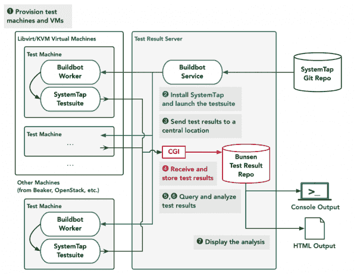

# SystemTap 的自动化测试过程，第 1 部分:使用 libvirt 和 Buildbot 进行自动化测试

> 原文：<https://developers.redhat.com/blog/2021/05/06/automating-the-testing-process-for-systemtap-part-1-test-automation-with-libvirt-and-buildbot>

在过去的一年里，我一直在实现一个自动化的基础设施来测试 SystemTap 项目，并收集和分析测试结果。SystemTap 是一种脚本语言，用于创建工具来观察实时运行的 [Linux](/topics/linux) 内核和用户空间应用程序。SystemTap 语言翻译器产生 Linux 内核模块。这些模块依赖于 Linux 内核的内部细节，这些细节在不同版本的 Linux 之间有很大的不同。

开发 SystemTap 项目并为各种 Linux 内核版本维护它的过程需要一种策略来检测和修复意外的 bug。bug 不仅可能来自 SystemTap 项目中的更改，也可能来自 Linux 内核新版本中的更改。

为了验证 SystemTap 的安全性和正确行为，SystemTap 项目包含了一个基于 [DejaGnu](https://www.gnu.org/software/dejagnu/) 框架的测试套件。然而，到目前为止，还没有一个系统可以在每次有人提交 SystemTap Git 存储库时运行这个测试套件。在 SystemTap 开发过程中，能够自动运行测试套件并报告新的测试失败的基础设施对于尽早检测和修复 bug 非常有帮助。

本文是两篇文章中的第一篇，总结了我开发并用来自动化测试 SystemTap 和检测测试失败的过程的工具。出于这些文章的目的，我认为测试过程由七个步骤组成。我描述了每个步骤的实现，最后总结了我的关键设计思想，并概述了未来可能的改进。

这些文章中提出的想法可能对其他具有复杂测试需求的[开源](/topics/open-source)项目有用。

## 成功测试的七个步骤

在开发用于测试和测试结果分析的基础设施时，我发现常用的[持续集成](/topics/ci-cd) (CI)系统不足以测试 SystemTap。大多数 CI 系统假设了一个问题公式，在这个公式中，一个项目的提交应该被接受或拒绝，这取决于测试结果版本在一组指定的测试用例上是产生“通过”还是“失败”的结果。这种配方不足以测试 SystemTap。

测试 SystemTap 的基础设施必须考虑几个困难的问题。SystemTap 测试套件包含大量不确定的或者环境敏感的测试用例。其中一些测试用例是重要的，而其他的测试用例是用来监控可选的 SystemTap 功能在不同系统上的可用性。很难对整套测试结果做出“通过”或“失败”的判断。

一组测试结果可能包含许多重要的测试失败，这些失败表明应该修复的新错误，与定期发生的不重要的测试失败混杂在一起。测试失败也可能是因为测试环境的变化，特别是内核更新后内核内部的变化。因为这些测试失败不是由 SystemTap 代码中的更改引起的，所以不能通过拒绝或恢复 SystemTap 提交来防止它们。唯一的解决方案是检测测试失败，并修复或扩展 SystemTap 以支持变化的环境。

为了设计一个测试 SystemTap 的基础设施，我从顶层分析了测试过程，并定义了一个由七个步骤组成的测试方案。这些步骤中的一些可以用基本的 shell 脚本和现有的工具自动完成。其他步骤需要我开发全新的软件来分析测试结果。

前三个步骤与测试项目和收集测试结果有关。我认为这些步骤可以用 shell 脚本和现有的软件来处理——即 [libvirt](https://libvirt.org) 虚拟机(VM)供应系统和 [Buildbot](https://buildbot.net) 测试自动化工具包。这些步骤是:

*   步骤 1:供应测试机器和虚拟机。
*   步骤 2:安装 SystemTap 项目并运行测试套件。
*   步骤 3:将测试结果发送到一个中心位置。

剩下的四个步骤与存储收集的测试结果和分析它们以发现和报告新的测试失败有关。为了处理这些步骤，我开发了一个名为 [Bunsen](https://sourceware.org/git/?p=bunsen.git;a=summary) 的测试结果存储和分析工具包。这些步骤是:

*   步骤 4:以紧凑的格式接收和存储测试结果。
*   步骤 5:查询测试结果。当我们获得一组新的测试结果时，我们想要查看这些结果，并将它们与早期版本的测试结果进行比较。
*   步骤 6:分析测试结果。为了从先前发生的失败中过滤出新发生的测试失败，我们需要使用来自测试结果的整个历史的信息。
*   步骤 7:以可读的格式报告分析。

在设备方面，我的测试基础设施由一组测试机器和一台充当*虚拟机主机*和*测试结果存储服务器*的服务器组成。目前，这个基础设施在 Red Hat 内部运行。图 1 总结了测试基础设施的组件以及它们如何交互。

[](/sites/default/files/blog/2020/12/bunsen-2020-12-workflow.png)

Figure 1: Components of the SystemTap testing infrastructure and their interactions.

本文详细解释了测试过程的前三个步骤，以及我的测试基础设施是如何实现这些步骤的。我将在下一篇文章中介绍剩下的四个步骤。

## 步骤 1:调配测试机器和虚拟机

这一步的目的是维护一组具有一系列硬件架构和内核版本的测试机器。SystemTap 必须在多种系统配置上进行测试，因为它对 Linux 内核的内部结构和硬件架构有着复杂的依赖性。

我发现手动维护所需的一组测试机器会带来大量的重复维护负担。我的测试机器的主要来源是一台虚拟机服务器，它运行带有 [libvirt](https://libvirt.org) 虚拟机管理工具的 [KVM](https://www.linux-kvm.org/page/Main_Page) 虚拟机管理程序。我还能够从由 [OpenStack](https://www.openstack.org) 或 [Beaker](https://beaker-project.org) 等系统管理的硬件资源池中临时提供测试机器。

我需要用 Linux 发行版初始化每台测试机器，并将其配置为运行 SystemTap 测试套件。手动操作会导致频繁的重复工作。

当我开发我的测试基础设施时，很明显避免重复的手工维护的最好方法是尽可能简单地提供新的测试机器。

因此，我开发了一个 shell 脚本`buildbot-create-vm.sh`，它调用 [virt-install](https://access.redhat.com/documentation/en-us/red_hat_enterprise_linux/8/html-single/configuring_and_managing_virtualization/index#creating-virtual-machines-using-the-command-line-interface_assembly_creating-virtual-machines) 和 [virt-customize](https://libguestfs.org/virt-customize.1.html) 命令来创建和配置用于测试 SystemTap 的虚拟机。`virt-install`和`virt-customize`是命令行工具，包含在 [libvirt](https://libvirt.org) 和 [libguestfs](https://libguestfs.org) 项目中，可以自动创建虚拟机并修改其文件系统的内容。本节中的示例命令基于`buildbot-create-vm.sh`，并说明了如何使用`virt-install`和`virt-customize`命令。

以下命令调用`virt-install`来创建一个新的虚拟机:

```
NAME=buildbot_example \
LOCATION=http://download.fedoraproject.org/pub/fedora/linux/development/33/Server/x86_64/os/ \
virt-install --name=$NAME --os-variant=fedora32 \
    --vcpus 2 --memory 4096 \
    --disk pool=default,size=25 \
    --autostart --watchdog default \
    --location=$LOCATION \
    --network bridge=br0 \
    --graphics=none --extra-args console=ttyS0 \
    --unattended admin-password-file=$PASSWORD \
    --noreboot

```

该命令假设名为`default`的 libvirt 存储池可用于创建新的虚拟磁盘。`LOCATION`变量指定了 Fedora Linux 网络安装镜像的 URL。

下面的命令调用`virt-customize`用附加配置初始化新创建的虚拟机:

```
NAME=buildbot_example \
REPO_FILE=example_custom.repo \
BUILDBOT_INSTALL_SH=/path/to/buildbot-install.sh \
SSH_PUBLIC_KEY=$(cat id_rsa_casual.pub) \
virt-customize -d $NAME \
    --hostname "$NAME.local" \
    --copy-in $REPO_FILE:/etc/yum.repos.d \
    --copy-in $BUILDBOT_INSTALL_SH:/root \
    --append-line $'/etc/crontab:@reboot\troot\tbash -c "chmod +x /root/buildbot-install.sh; /root/buildbot-install.sh 2>&1 >/root/crontab-firstboot.log"' \
    --edit $'/etc/ssh/sshd_config:s/^# ?PermitRootLogin .*/PermitRootLogin yes/' \
    --mkdir /root/.ssh \
    --append-line "/root/.ssh/authorized_keys:$SSH_PUBLIC_KEY" \
    --chmod $'0600:/root/.ssh/authorized_keys'

```

该命令创建一个 crontab 文件，当虚拟机开始运行时，该文件将运行脚本`buildbot-install-stap.sh`。如下一节所述，这个脚本安装了一个 SystemTap 开发环境，并对其进行配置以进行自动化测试。

`REPO_FILE`变量包含定制 DNF 包存储库的名称，而`BUILDBOT_INSTALL_SH`指定了下一节中描述的`buildbot-install-stap.sh`脚本的位置。此外，`SSH_PUBLIC_KEY`变量用 SSH 公钥初始化，该公钥将用于远程登录到测试机器。

## 步骤 2:安装 SystemTap 项目并运行测试套件

这一步的目的是用 SystemTap 开发环境设置新提供的测试机器，并配置机器，以便每当对 sourceware.org 上的主 SystemTap Git 存储库进行提交时，自动启动 SystemTap 测试套件。

为了建立 SystemTap 开发环境，我开发了几个 shell 脚本:`buildbot-install-stap.sh`和 [stap-install.sh](https://sourceware.org/git/?p=bunsen.git;a=blob;f=scripts-guest/systemtap/stap-install.sh;hb=HEAD) 来安装构建 SystemTap 所需的开发工具，以及 [stap-test.sh](https://sourceware.org/git/?p=bunsen.git;a=blob;f=scripts-guest/systemtap/stap-test.sh;hb=HEAD) 来从源代码下载、编译和测试 SystemTap 项目。这些脚本假设测试机器将专门用于测试 SystemTap。

对于 SystemTap 的长期测试，使用专用的测试机器是最安全的，因为完整的 SystemTap 测试套件包括许多“压力测试”，这些测试故意削弱或禁用 SystemTap 的一些安全机制。在极少数情况下，这些测试用例之一的失败结果会导致内核崩溃或硬锁定。

在启动 SystemTap 测试套件之前，`stap-test.sh`执行了一些 SystemTap 项目的`make installcheck`测试套件命令没有处理的有用的配置步骤，包括:

*   `stap-test.sh`确保安装的`kernel-devel`包的版本与当前运行的内核完全匹配。需要一个`kernel-devel`包来允许 SystemTap 编译可以进行系统范围观察的内核模块。因为一些发行版的包仓库只提供每个包的最新版本，所以当前运行的内核的`kernel-devel`包可能不再可用。在这种情况下，`stap-test.sh`更新内核以匹配`kernel-devel`包的可用版本，并重启测试机器。
*   `stap-test.sh`检查[debuginfod.elfutils.org](https://debuginfod.elfutils.org)服务器是否为测试机上的 Linux 发行版和当前运行的内核提供 debuginfo，并相应地启用或禁用 SystemTap 对通过`debuginfod`检索内核 debuginfo 的支持。当`debuginfod`支持被禁用时，`stap-test.sh`运行 SystemTap 提供的`stap-prep`脚本，尝试为当前内核安装一个 debuginfo 包。关于 SystemTap 对`debuginfod`支持的更多信息可以在 Aaron Merey 的文章[介绍 debuginfod，elfutils debuginfo 服务器](/blog/2019/10/14/introducing-debuginfod-the-elfutils-debuginfo-server/)中找到。
*   `stap-test.sh`运行 [dmesg](https://man7.org/linux/man-pages/man1/dmesg.1.html) 命令，将 Linux 内核的环形缓冲区输出捕获到最终测试结果所包含的附加文件中。根据我的经验，获取这个输出很重要，因为它可能包含关于 SystemTap 测试用例触发的内核警告或崩溃的附加信息。

我已经为那些对快速建立 SystemTap 环境和运行测试套件感兴趣的人发布了 [stap-install.sh](https://sourceware.org/git/?p=bunsen.git;a=blob;f=scripts-guest/systemtap/stap-install.sh;hb=HEAD) 和 [stap-test.sh](https://sourceware.org/git/?p=bunsen.git;a=blob;f=scripts-guest/systemtap/stap-test.sh;hb=HEAD) 脚本。

为了在全套测试机器上自动启动 SystemTap 测试套件，我使用了一个 [Buildbot](https://buildbot.net) 系统的实例。Buildbot 系统运行在测试结果服务器上，并接受来自运行在测试机器上的 Buildbot 工作人员的连接。

每当提供一个新的测试机器时，Buildbot worker 会自动由`buildbot-install-stap.sh`在机器上安装和配置。在连接到 Buildbot 系统之后，Buildbot 工作程序等待测试请求。

Buildbot 服务定期检查 sourceware.org 上的 SystemTap Git 存储库中的新提交。当提交 SystemTap Git 存储库时，Buildbot 服务向每台测试机器上的 Buildbot worker 发送一个请求。Buildbot 工作人员然后调用`stap-test.sh`脚本。

还可以在一台测试机上手动调用`buildbot-install-stap.sh`脚本，该测试机可以是手动提供的，也可以是由 OpenStack 或 Beaker 等系统管理的一批测试机上提供的。这个手动调用选项被证明对于在除 x86 之外的各种体系结构上快速设置测试机器非常有用。

Buildbot 系统包括一些收集和显示测试结果的功能，但是我决定不依赖它。Buildbot 假设一个测试过程被建模为一系列的阶段，每个阶段都有一个简单的“通过”或“失败”的结果。正如前面提到的，这个模型适合于持续集成系统，但是对于像 SystemTap 这样的项目来说太简单了，因为它的测试套件包括许多不确定的或者依赖于环境的测试用例。

## 步骤 3:将测试结果发送到中心位置

此步骤的目的是在一个位置收集由各种测试机器产生的 SystemTap 测试结果。

在运行 SystemTap 测试套件之后， [stap-test.sh](https://sourceware.org/git/?p=bunsen.git;a=blob;f=scripts-guest/systemtap/stap-test.sh;hb=HEAD) 脚本将测试结果打包到一个 tar 归档文件中，并将它们发送到测试结果服务器。SystemTap 的 [DejaGnu](https://www.gnu.org/software/dejagnu/) 测试套件产生的测试结果由一个`systemtap.log`和一个`systemtap.sum`文件组成。

`systemtap.log`文件包含测试套件中每一个测试用例的详细输出，而`systemtap.sum`文件包含每一个测试用例结果的压缩摘要。

除了 DejaGnu 输出之外，`stap-test.sh`脚本还发送一个由 [stap-report](https://man7.org/linux/man-pages/man1/stap-report.1.html) 命令收集的系统诊断文件，以及一个名为`systemtap.dmesg`的文件，其中包含测试套件执行期间捕获的内核环形缓冲区数据。

来自`stap-test.sh`的以下命令将测试结果日志文件打包并发送给测试结果服务器:

```
tar cvzf - $LOGPATH/systemtap.log* $LOGPATH/systemtap.sum* $LOGPATH/systemtap.dmesg* $LOGPATH/stap-report.* | curl -X POST -F 'project=systemtap' -F 'tar=@-' $BUNSEN_URL/bunsen-upload.py

```

这里，变量`LOGPATH`指定测试结果日志文件的位置，变量`BUNSEN_URL`指定测试结果服务器的位置。

在测试结果服务器上，CGI 脚本接受测试结果，并将日志文件添加到由 Bunsen toolkit 管理的测试结果存储库中，这将在本系列的下一篇文章中描述。

## 待续...

本文描述了我为 SystemTap 项目开发的自动化测试基础设施。下一篇文章将描述 Bunsen，我为测试结果存储和分析开发的工具包。

*Last updated: May 5, 2021*