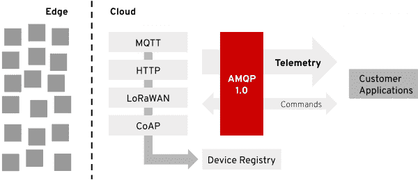

# 将物联网引入红帽 AMQ 在线

> 原文：<https://developers.redhat.com/blog/2019/05/14/bringing-iot-to-red-hat-amq-online>

[红帽 AMQ 在线 1.1](https://access.redhat.com/documentation/en-us/red_hat_amq/7.2/html/amq_online_1.1_on_openshift_container_platform_release_notes/index) 最近发布了，我对此很兴奋，因为它包含了我们的物联网( [IoT)支持](https://access.redhat.com/documentation/en-us/red_hat_amq/7.2/html/amq_online_1.1_on_openshift_container_platform_release_notes/tech-preview-online#internet_of_things_iot_functionality)的技术预览。AMQ 在线是 AMQ 红帽公司的“信息即服务解决方案”。利用我们在 [Eclipse Hono](https://www.eclipse.org/hono/) 上所做的工作，我们可以将一个[可扩展的](https://dentrassi.de/2018/07/25/scaling-iot-eclipse-hono/)云原生物联网特性集成到这个通用消息传递层中。您需要物联网消息层的全部原因是，您可以专注于将您的云端应用程序与您现有的数百万设备连接起来。

## 什么是 Eclipse Hono？

Eclipse Hono 是一个物联网抽象层。它定义了 API，以便在云中构建物联网堆栈，处理设备证书、协议和可扩展性等事宜。对于其中一些 API，它附带了一个现成的实现，比如 MQTT 协议适配器。对于其他的，比如设备注册表，它只定义了必要的 API。必须向系统提供实际的实现。

[](/sites/default/files/blog/2019/05/hono-overview2.svg_.png)Eclipse Hono overview

Eclipse Hono overview

Hono 的一个关键特性是，它在 [AMQP 1.0](http://www.amqp.org/specification/1.0/amqp-org-download) 上标准化了不同的物联网特定协议。该协议在数据中心端很常见，它能够很好地处理吞吐量和背压方面的需求。然而，在物联网设备方面，其他协议可能对某些用例有更多好处。MQTT 是许多人的最爱，普通 HTTP 也是如此，因为它很简单。洛拉万、CoAP、西格福克斯等。各有利弊。如果你想加入物联网世界，你只需要支持他们。即使在定制协议方面，Hono 也提供了一个软件栈来轻松实现您的定制协议。

## AMQ 在线

Hono 需要一个 AMQP 1.0 消息后端。它需要一个代理和一个称为“路由器”的组件(路由器不拥有消息，只是将消息转发给正确的接收者)。当然，它希望 AMQP 层像 Hono 本身一样具有可扩展性。AMQ 在线是一个“自助式”的云消息解决方案。所以让 Hono 在上面运行是有意义的。我们在 Hono 有一段时间采用了这种部署模式，允许使用[EnMasse](https://enmasse.io/)(AMQ 在线的上游项目)。

## 自助式物联网

在一个由 Kubernetes 和运营商组成的世界里，你实际上在寻找的东西更像这样:

```
kind: IoTProject
 apiVersion: iot.enmasse.io/v1alpha1
 metadata:
   name: iot
   namespace: myapp
 spec:
   downstreamStrategy:
     managedStrategy:
       addressSpace:
         name: iot
         plan: standard-unlimited
       addresses:
         telemetry:
           plan: standard-small-anycast
         event:
           plan: standard-small-queue
         command:
           plan: standard-small-anycast

```

您只需使用`kubectl create -f`创建一个新的自定义资源来定义您的物联网项目，就大功告成了。如果您部署了 AMQ 在线 1.1 版的物联网运营商，它将为您创建必要的地址空间，并设置所需的地址。

物联网项目也将自动充当 Hono 租户。在这个例子中，Hono 租户将是`myapp.iot`，因此例如`sensor1`的完整认证 ID 将是`sensor1@myapp.iot`。物联网项目还保存了`.spec.configuration`部分下的所有可选租户配置。

使用 [Hono 管理工具，](https://github.com/ctron/hat)你可以快速注册一个新设备(文档还会告诉你如何使用`curl`实现相同的功能):

```
$ # register the new context once with 'hat'
$ hat context create myapp1 --default-tenant myapp.iot https://$(oc -n messaging-infra get routes device-registry --template='{{ .spec.host }}')

$ # register a new device and set credentials
$ hat reg create 4711
$ hat cred set-password sensor1 sha-512 hono-secret --device 4711

```

有了这些，你可以像往常一样简单地使用 Hono。首先，启动消费者:

```
$ # from the hono/cli directory
$ export MESSAGING_HOST=$(oc -n myapp get addressspace iot -o jsonpath={.status.endpointStatuses[?(@.name==\'messaging\')].externalHost})
$ export MESSAGING_PORT=443

$ mvn spring-boot:run -Drun.arguments=--hono.client.host=$MESSAGING_HOST,--hono.client.port=$MESSAGING_PORT,--hono.client.username=consumer,--hono.client.password=foobar,--tenant.id=myapp.iot,--hono.client.trustStorePath=target/config/hono-demo-certs-jar/tls.crt,--message.type=telemetry

```

然后向遥测通道发布一些数据:

```
$ curl -X POST -i -u sensor1@myapp.iot:hono-secret -H 'Content-Type: application/json' --data-binary '{"temp": 5}' https://$(oc -n enmasse-infra get routes iot-http-adapter --template='{{ .spec.host }}')/telemetry

```

更多详细说明，请参见:[AMQ 在线](https://access.redhat.com/documentation/en-us/red_hat_amq/7.2/html/evaluating_amq_online_on_openshift_container_platform/assembly-iot-messaging)物联网(IoT)入门。

## 物联网集成

如前所述，你做 IoT 不仅仅是为了好玩(嗯，也许在家里，用一个 Raspberry Pi，Node.js，OpenHAB，和 mosquitto)。但是，当您想要将数百万台设备与您的云后端连接起来时，您需要开始处理这些数据。使用 Hono 给你一个非常简单的开始。您需要的一切都是 AMQP 1.0 连接。假设您使用 Apache Camel，将遥测数据推送到 Kafka 集群很容易(参见[ctron/hono-example-bridge](https://github.com/ctron/hono-example-bridge)):

```
<route id="store">
  <from uri="amqp:telemetry/myapp.iot" />

  <setHeader id="setKafkaKey" headerName="kafka.KEY">
    <simple>${header[device_id]}</simple>
  </setHeader>

  <to uri="kafka:telemetry?brokers={{kafka.brokers}}" />
</route>
```

将像 [Red Hat Fuse](https://www.redhat.com/en/technologies/jboss-middleware/fuse) 、 [AMQ](https://www.redhat.com/en/technologies/jboss-middleware/amq) 和[决策管理器](https://www.redhat.com/en/technologies/jboss-middleware/decision-manager)这样的解决方案结合在一起，让您在数据中心的定制逻辑(您的增值服务)访问物联网变得更加容易。

## 下一步是什么？

AMQ 在线 1.1 是第一个将物联网作为技术预览的版本。所以，试一试，玩一玩，但也要记住，这是一个技术预览。

在上游项目 EnMasse 中，我们目前正在基于 [Infinispan](https://infinispan.org/) 创建一个可扩展的通用设备注册表。Hono 本身没有带设备注册表，只定义了它需要的 API。然而，我们认为提供一个现成的可扩展的设备注册表是有意义的，可以帮助您入门。在 AMQ 在线，这将通过使用[红帽数据网格](https://www.redhat.com/en/technologies/jboss-middleware/data-grid)来支持。

在接下来的几个月里，我们希望也能看到 Eclipse Hono 1.0 的发布，并让这个项目从孵化阶段毕业。对于 Eclipse 的项目来说，这是一大步，但也是应该做的事情。Eclipse Hono 已经准备好了，项目的毕业意味着我们将更加关注 API 和稳定性。尽管如此，像 LoRaWAN，maybe Sigfox 和一个适当的 HTTP API 设备注册表定义这样的新特性已经在开发中。

因此，我们希望在 AMQ 在线 1.2 中引入许多新的特性和增强功能。

*Last updated: September 3, 2019*