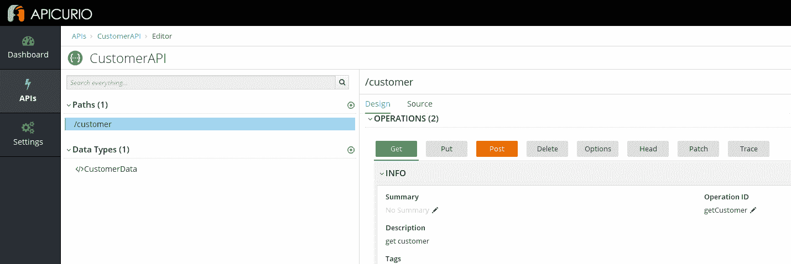
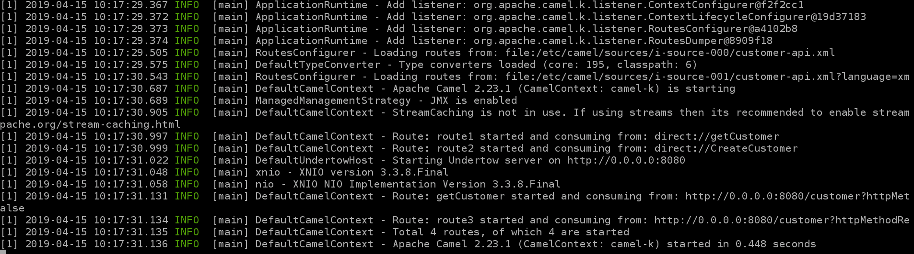
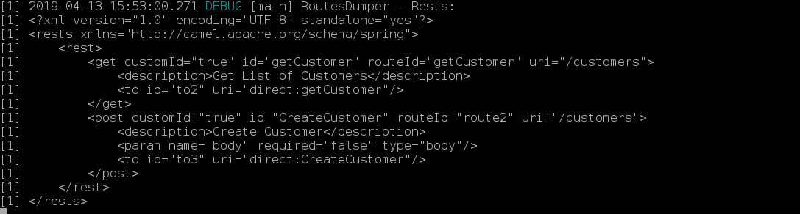

# 在 Red Hat OpenShift 上使用 Camel K 构建和部署 API

> 原文：<https://developers.redhat.com/blog/2019/04/25/build-and-deploy-an-api-with-camel-k-on-red-hat-openshift>

随着 API 和[微服务](https://developers.redhat.com/topics/microservices/)的数量越来越多，给予创建和集成它们的时间变得越来越短。这就是为什么我们需要一个带有工具的集成框架来快速构建一个 API，并包含完整 API 生命周期的功能。Camel K 可以让你在不到一秒钟的时间内在 [Kubernetes](https://developers.redhat.com/topics/kubernetes/) 或 Red Hat OpenShift 上构建和部署你的 API。难以置信，不是吗？

对于那些不熟悉它的人来说， [Camel K](https://github.com/apache/camel-k) 是 Apache Camel 的一个子项目，目标是构建一个轻量级的运行时，直接在 Kubernetes 和 [Red Hat OpenShift](https://developers.redhat.com/blog/2019/03/18/getting-started-with-codeready-workspaces-and-red-hat-openshift-application-runtimes/) 这样的云平台上运行集成代码。它受无服务器原则的启发，不久也将瞄准 Knative。尼古拉·费拉罗的[文章](https://www.nicolaferraro.me/2018/10/15/introducing-camel-k/)会给你一个很好的介绍。

在本文中，我将展示如何使用 Camel K 构建 API。为此，我们将首先使用基于 [OpenAPI 标准](https://github.com/OAI/OpenAPI-Specification)的 [Apicurio Studio](http://www.apicur.io/) 设计我们的 API，然后我们将向 Camel K 提供 OpenAPI 标准文档，以便实现 API 并将其部署到 Red Hat OpenShift。

## 在 Apicurio 中设计您的 API

Apicurio 是一个基于 web 的开源工具，用于基于 OpenAPI 规范进行设计。转到[https://www.apicur.io/](https://www.apicur.io/)，然后你可以通过点击*创建新的 API* 开始。

本质上，您需要:

*   创建 API
*   创建数据定义
*   添加路径，定义参数、操作，并返回对路径的响应

对于每个操作(GET、POST)，您应该配置*操作 ID。*Camel K 在构建 REST 路由时使用该字段，以便将该请求重定向到与操作 ID 同名的直接端点。这意味着您的集成路由应该从一个直接端点开始(比如 direct://getCustomer，direct://createCustomer ),以便应用集成模式并处理这些 REST 请求:



一旦你完成了你的 API 的设计，下载一个基于 OpenAPI v2 规范的 JSON 文件。下面是一个 [CustomerAPI 的 OpenAPI 标准规范的例子。](https://github.com/abouchama/CamelK-customerAPI/blob/master/customer-api.json)

## 使用 Camel K 构建您的 API

要开始使用 Camel K，您需要`kamel`二进制文件，它可以用于配置集群和运行集成。参考[发布页面](https://github.com/apache/camel-k/releases)获取最新版本的`kamel`工具。

有了`kamel`二进制文件后，使用标准的`oc` (OpenShift)或`kubectl` (Kubernetes)客户端工具登录到您的集群，并执行以下命令来安装 Camel K:

```
kamel install
```

此时，您只需用 Camel K 支持的多种语言开发您的集成路线。在我的示例中， [CamelK-customerAPI](https://github.com/abouchama/CamelK-customerAPI) ，我使用普通的 XML: [customer-api.xml.](https://github.com/abouchama/CamelK-customerAPI/blob/master/customer-api.xml)

现在您已经准备好构建和部署您的 API 了:

```
git clone https://github.com/abouchama/CamelK-customerAPI.git
cd CamelK-customerAPI
kamel run --dev --name customers --dependency camel-undertow --property camel.rest.port=8080 --open-api customer-api.json customer-api.xml
```

您可以通过运行以下命令来检查集成的状态:

```
oc get it
NAME      PHASE   CONTEXT
customers Running  ctx-biq59ca78n55k4851cjg
```

日志显示:



恭喜你！您的第一个 API 在不到一秒钟的时间内就在 Red Hat OpenShift 上构建和部署好了，您可以从日志的最后一行看到这一点。

## 技巧

通过将日志记录级别设置为 DEBUG，您可以看到从参数`--open-api`中提供的 OpenAPI 规范转换而来的 rests 路由的输出:

```
kamel run --dev --name customers --dependency camel-undertow --property camel.rest.port=8080 --open-api customer-api.json --logging-level org.apache.camel.k=DEBUG customer-api.xml
```



要用 Hawtio 监控你的 Camel K 路线，只需启用 *jolokia* trait ( `-t jolokia.enabled=true`)，按钮*打开 Java 控制台*就会出现。要使用普罗米修斯进行监控，您只需启用*普罗米修斯*特性(`-t prometheus.enabled=true`):

```
kamel run --dev --name customers --dependency camel-undertow --property camel.rest.port=8080 -t jolokia.enabled=true -t prometheus.enabled=true -t prometheus.service-monitor=false --open-api customer-api.json --logging-level org.apache.camel.k=DEBUG customer-api.xml
```

感谢阅读，我希望你喜欢这篇文章。

下面的视频介绍了我在本文中所涉及的内容:

[https://www.youtube.com/embed/WE8K6872w1U](https://www.youtube.com/embed/WE8K6872w1U)