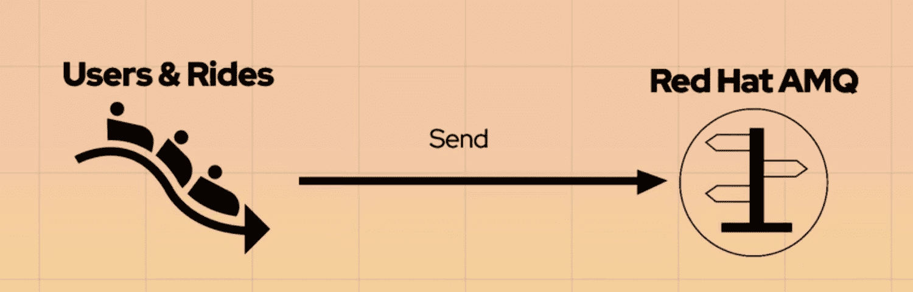
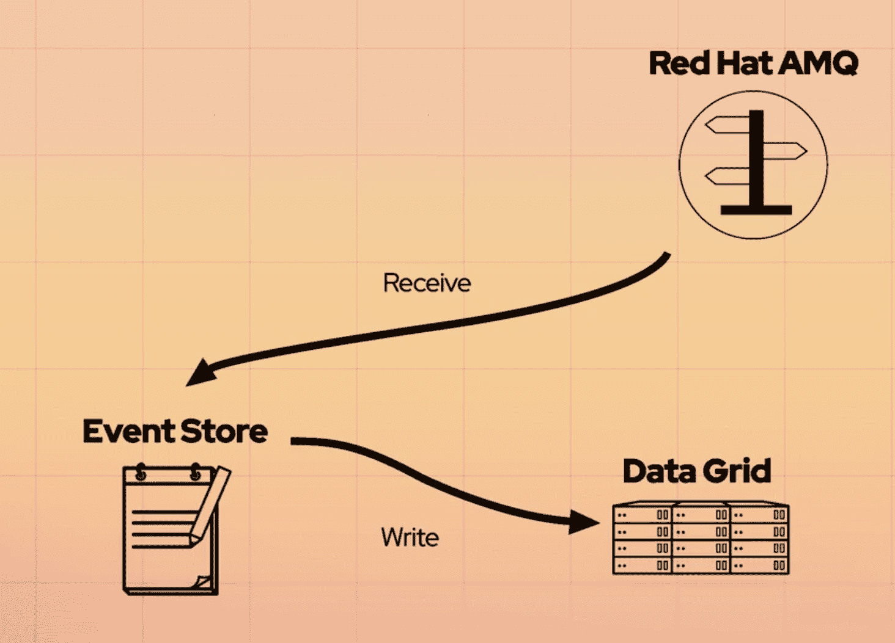
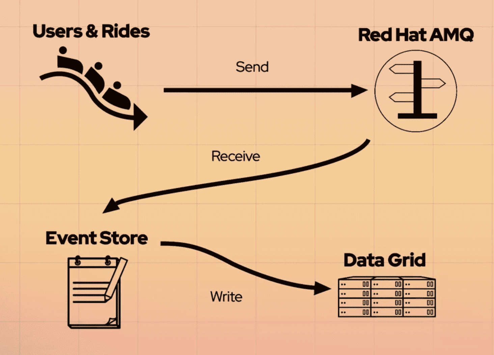
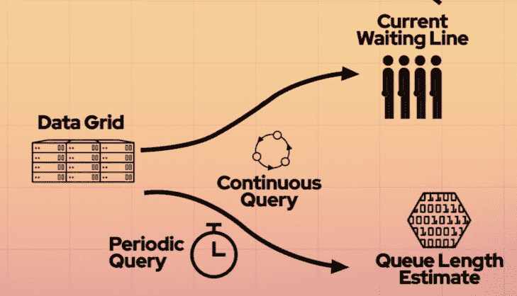
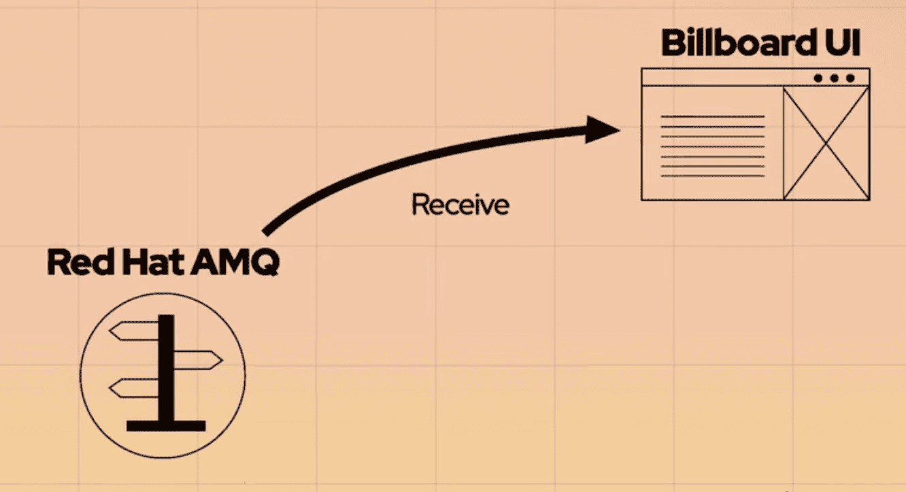
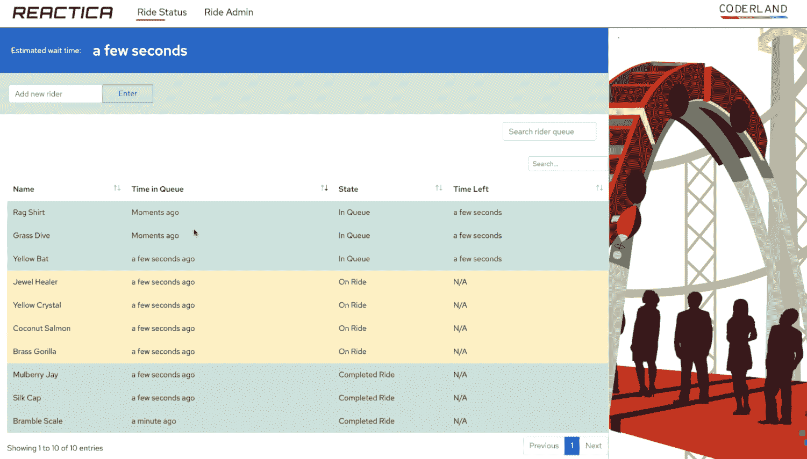
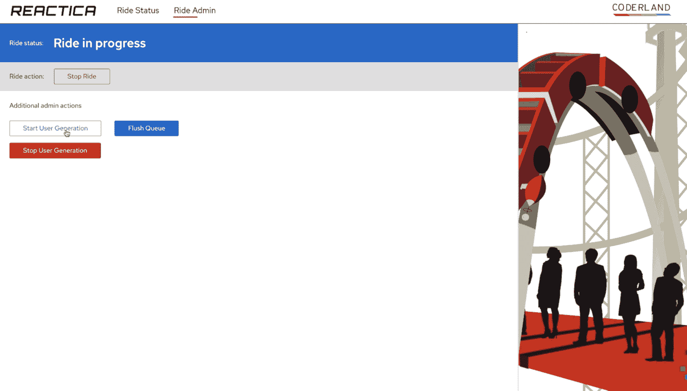

# 第 2 部分:构建一个反应系统

> 原文：<https://developers.redhat.com/coderland/reactive/building-a-reactive-system>

## 建立一个反应系统

既然我们已经了解了反应式编程和 Vert.x 框架，那么是时候真正开始编写代码了。该代码是由 Clement Escoffier、James Falkner、Thomas Qvarnströ和 Rodney Russ 组成的优秀团队编写的。向他们的努力致敬。

当然，第一步是在 github.com/reactica/rhte-demo 克隆或派生回购协议。repo 包含创建 Red Hat OpenShift 集群、安装必要的中间件、配置 coaster 并将其部署到集群所需的一切。

但是在运行代码之前，让我们先讨论一下它是如何工作的。我们将按以下顺序讨论不同的部分:

*   `domain-model`:整个系统中使用的`User`和`Ride`对象的定义。

*   `event-generator`:每隔一定时间创建新的`User`和`Ride`对象。这些对象被序列化，并通过`Events`对象发送到红帽 AMQ。

*   `event-store`:从 AMQ 代理获取`User`事件，并将它们存储在 Red Hat 数据网格中。

*   `queue-length-calculator`:使用数据网格中的数据计算游乐设备的预计等待时间。

*   `current-line-updater`:每当有变化时更新队列，包括新的`User`和`Ride`或者现有的`User`或`Ride`的状态变化。

*   `billboard`:前端。这是排队等候的游客在等待时看到的，它代表了所有其他微服务一起工作的结果。

repo 还有另外两个组件:`amqp-verticle`，这是 Clement 编写的一个适配器，用于 Vert.x 应用程序与 Red Hat AMQ 通信。这个垂直通道是 Vert.x 事件总线和 AMQP 之间的桥梁。另一个组件是`vertx-data-grid-client`，它是 Red Hat 数据网格的 Vert.x 客户端。可以说，它们处理我们的代码和中间件之间的交互。

最后，还有一个额外的目录`vertx-examples`，其中包含了本练习中没有用到的示例代码。

## 系统结构

在本文和随附的视频中，我们使用该图来展示反应式系统的工作原理:


## 领域模型

`domain-model`包定义了两个类:`User`和`Ride`。它们都很简单，并且代表了我们整个反应系统中使用的数据。

### `User`

一个`User`是客人；他们有一个名字，一个`currentState`，以及指示他们何时排队和何时结束旅程的数据。起初,`User`完成旅程的时间是空白的。稍后通过`RIDE_COMPLETED`事件对其进行更新。(顺便说一下，域模型的两个部分都有惟一的 id，但是它们对我们这里的讨论并不重要。)用户的可能状态是:

*   `UNKNOWN`–如果在`User`构造函数中没有指定，则为默认值

*   他们在排队等候乘车

*   他们实际上在过山车上(这些州的名字很聪明，不是吗？)

*   他们已经完成了旅程

为了将来的目的，`User`对象还包括一个名为`RIDE_ID`的字段。当前值为“`reactica`”，但系统被编写为可以计算其他 Coderland 游乐设施的等待时间。未来公园范围内的仪表板可以让管理员快速查看多次乘坐的等待时间。

随意为[编译驱动](https://developers.redhat.com/coderland/serverless/)实现一整套微服务！这是我们希望看到的公关。

### `Ride`

A `Ride`代表过山车的一个来回。过山车完成一次往返所需的时间长度是可配置的；默认情况下，它是 30 秒。一次能坐过山车的人数也是可以配置的。默认骑手数为 5。更改这些值显然会影响等待时间。随着能同时乘坐的人越来越少，旅程越来越长，等待时间也越来越长。如果过山车可以同时承载更多的乘客，往返时间更短，等待时间就更短。稍后，我们将研究如何更改这些值。

一个对象可以有三种我们关心的状态:

*   `PLANNED`–创建`Ride`对象时的初始状态

*   `IN_PROGRESS`—`Ride`已经离开车站，意味着游乐设备上的所有`User`转换到`ON_RIDE`状态

*   `COMPLETED`—`Ride`已经返回车站，这意味着游乐设备上的所有`User`转换到`COMPLETED_RIDE`状态。

一个`Ride`对象上不包含一个`User`列表。当一个新的`Ride`被创建时，`eventstore`组件中的微服务获取适当数量的`User`，并将它们的每个状态更改为`ON_RIDE`。

## 生成事件

`event-generator`组件包含几个一起工作生成事件的垂直组件。第一个是`MainVerticle`，它完成任何需要的初始化工作，并根据需要创建其他类和垂直类的实例。(除了`billboard`，每个组件都有一个`MainVerticle`。)它实现了用户图中的&乘车框:



### 事件

从整体应用的角度来看，我们关心几件事:

*   一名游客排队乘坐过山车

*   一位客人上了过山车

*   一位客人从过山车上下来

*   一骑开始(`RIDE_STARTED`)

*   一骑绝尘(`RIDE_COMPLETED`)

当一个客人排队时，`User`对象的`currentState`字段被设置为`USER_IN_QUEUE`。当一个`Ride`启动时，其`state`域被设置为`RIDE_STARTED`。当一个`Ride`离开站点时，一些`User`的`currentState`被设置为`USER_ON_RIDE`。(记住，`Ride`不包含`User`的列表)如果 10 个人可以同时乘坐过山车，那么最多 10 个`User`的状态被更新。(显然如果只有三个人排队，只修改三个`User`。)默认情况下，`Ride`需要 30 秒，因此在`Ride`的状态设置为`RIDE_STARTED`30 秒后，其`state`变为`RIDE_COMPLETED`。依次将`ON_RIDE`上所有`User`的`currentStates`设置为`COMPLETED_RIDE`。

一旦`MainVerticle`建立了到 AMQ 的连接，它就部署一个`BusinessEventTransformer`vertical。(顺便说一句，有些类名包含单词“verticle”，有些不包含。在我们进行的过程中，我会具体说明。)T2 代码通过名为`to-ride-event-queue`的队列将游乐设备事件发送到 Vert.x 事件总线`User`事件被发送到“`to-user-queue`”和“`to-enter-event-queue`”当一个`User`或`Ride`被创建时，`to-**x**-event`队列让其他组件跟踪。“`to-user-queue`”用于跟踪`User`的状态变化。`User`状态变化显示在广告牌中；`Ride`状态变化不。

`MainVerticle`部署两个垂直设备来设置模拟:`RideSimulatorVerticle`和`UserSimulatorVerticle`。它们被配置为在创建事件时使用数据网格。

只要过山车还在运行，`RideSimulatorVerticle`就会不断创造新的`Ride`物体。一辆`Ride`的生命周期是:

*   `Ride`是用状态`PLANNED`创建的。

*   多达*n*s 被选择乘坐，其中 *n* 是一次可以乘坐的游客的最大数量。

*   所有选定用户的状态都变为`ON_RIDE`。

*   `Ride`的状态被设置为`IN_PROGRESS`。

*   在经过 *n* 秒后，其中 *n* 是`Ride`的持续时间，`Ride`的状态被设置为`COMPLETED`。

*   `Ride`上的每个`User`的状态被设置为`COMPLETED_RIDE`。

另一方面，只要启用了用户生成，`UserSimulatorVerticle`就会创建新的`User`对象。一辆`User`的生命周期是:

*   `User`被创建。`User`有一个`name`，但是没有其他数据传递给构造函数。

*   通过带有`USER_IN_QUEUE`标志的`Events`类传递`User`(稍后将详细介绍)。

`User`的状态被设置为`ON_RIDE`并最终被设置为`COMPLETED_RIDE`，因为其他事件是由组件生成的，我们很快就会看到。

为了给`User`创建一个名字，`UserSimulatorVerticle`调用了`CuteNameService`类。那个类有一组形容词和一组名词。当`UserSimulatorVerticle`需要一个新名字时，`CuteNameService`从两个数组中随机选择一个单词来创建一个名字。

上`Events`课。它不是一个 verticle，它是一个实用程序类，如您所料，它创建事件。`Events`类的一个实例包含关于一个`User`或`Ride`对象的信息。我们马上会谈到`Events`对象的 JSON 结构。

最后，`event-generator`组件包含了`WebVerticle`，一个为`BillboardVerticle`类使用的一些实用方法实现 REST API 的类。当我们谈到`billboard`组件时，我们将会更多地讨论`WebVerticle`。就`event-generator`组件而言就是这样。

### 事件格式

为了简单起见(无论如何，最简单的 ***er*** )，所有的事件都有相同的 JSON 格式:

```
{"event": EVENT, 
 "user": USER, 
 "ride": RIDE} 
```

如果这是一个`User`事件，`EVENT`的值是`user-events`，`USER`是一个`User`对象的 JSON 版本，`RIDE`是`null`。同样，如果这是一个`Ride`事件，`EVENT`的值是`ride-events`，`USER`是`null`，`RIDE`是一个`Ride`对象的 JSON 版本。

**注意**:一个`Ride`物体指的是过山车的车厢从车站出发，沿着轨道，然后再返回的往返行程，运载着一些`User` s。它不是指 Reactica 过山车本身。

## 存储事件

下一步是获取`User`事件并将它们存储在数据网格中。这是由`event-store`包完成的，它实现了架构图中的事件存储框:



`event-store`包包含三个垂直部分:

*   `MainVerticle`–配置 AMQ 和数据网格之间的连接。它还设置了`UserEventReceiverVerticle`。

*   `UserEventReceiverVerticle`–从 AMQ 获取`User`事件数据，并将其存储在数据网格中。

*   `UserMarshaller`–顾名思义，通过将`User`对象转换成 [ProtoBuff](https://iamninad.com/serializing-data-using-google-protobuff/) 来编组它们，反之亦然。它使用 [Infinispan ProtoStream](https://github.com/infinispan/protostream) 库来完成它的工作。

随着这些组件的启动和运行，任何放入 AMQ 的`User`事件都存储在数据网格中。从那里，`current-line-updater`和`queue-length-calculator`组件使用数据网格交付`billboard`组件完成工作所需的数据。

与系统中的所有组件一样，键入`oc get pods`查找组件的 pod 名称，然后键入`oc logs [pod name]`查看日志。在下面的例子中，`event-store` pod 的名称是`event-store-1-p455g`。从这个名为 Quill 的`User`的日志摘录中，您可以看到`User`生命周期中由`event-store component`处理的部分:

```
oc logs event-store-1-p455g | grep Quill
17:46:31.325 [vert.x-eventloop-thread-0] INFO  UserEventReceiverVerticle - RECEIVED USER EVENT: {"id":"Quill Carpet","name":"Quill Carpet","rideId":"reactica","currentState":"IN_QUEUE","enterQueueTime":1562435191,"completedRideTime":0}
17:46:31.335 [vert.x-eventloop-thread-0] INFO  UserEventReceiverVerticle - Saved user with id Quill Carpet to the Data Grid
17:48:58.103 [vert.x-eventloop-thread-0] INFO  UserEventReceiverVerticle - RECEIVED USER EVENT: {"id":"Quill Carpet","name":"Quill Carpet","rideId":"reactica","currentState":"ON_RIDE","enterQueueTime":1562435191,"completedRideTime":0}
17:48:58.139 [vert.x-eventloop-thread-0] INFO  UserEventReceiverVerticle - Saved user with id Quill Carpet to the Data Grid
17:49:58.917 [vert.x-eventloop-thread-0] INFO  UserEventReceiverVerticle - RECEIVED USER EVENT: {"id":"Quill Carpet","name":"Quill Carpet","rideId":"reactica","currentState":"COMPLETED_RIDE","enterQueueTime":1562435191,"completedRideTime":1562435398}
17:49:58.942 [vert.x-eventloop-thread-0] INFO  UserEventReceiverVerticle - Saved user with id Quill Carpet to the Data Grid 
```

正如您所料，`User`经历了状态`IN_QUEUE`、`ON_RIDE`和`COMPLETED_RIDE`。根据日志消息的时间戳，Quill Carpet 等待了大约 27 秒才登上游乐设备，而游乐设备持续了大约 60 秒。对于每个事件，`UserEventReceiverVerticle`将数据存储在数据网格中。正如我们前面所说，一个响应系统是消息驱动的。注意，这个 verticle 不知道哪个组件生成了每个事件；没关系。随着事件的发生，它们被移动到数据网格中，在那里它们可以被其他组件处理。当然，其他垂直领域也不知道哪些组件*消耗了*事件。

## 盘点

它涵盖了生成事件的组件。这些组件实现了原始图表的左侧:



`event-generator`组件实际上创建了`User`和`Ride`对象。`User`对象被发送到 AMQ 代理。作为响应，`event-store`组件从 AMQ 代理获取`User`事件，并将它们存储在数据网格中。现在是时候看看消耗这些事件的组件了。这分两个阶段进行:首先，`queue-length-calculator`和`current-line-updater`组件处理数据网格中的信息，并将信息发送给 AMQ 代理。其次，`billboard`组件接收来自 AMQ 代理的信息，并更新显示当前等待时间和当前队列的 web 页面。

我们接下来要关注的两个事件消费者是图中所示的`current-line-updater`和`queue-length-calculator`组件:



我们现在来看看这些事件消费者。

## 当前行

`current-line-updater`组件从`MainVerticle`类开始。`MainVerticle`完成一些配置任务，然后部署`CurrentLineUpdaterVerticle`。该 verticle 对数据网格中处于状态`IN_QUEUE`、`ON_RIDE`或`COMPLETED_RIDE`的所有`User`进行连续查询，指定处于`COMPLETED_RIDE`状态的用户不超过 10 个。(我们并不那么在意已经完成骑行的欣喜的客人；知道最后 10 个就足够了。)一旦建立了查询，它就注册`UserContinuousQueryListener`类来接收来自查询的事件。

在我们继续之前，先说一下连续查询。连续查询基本上是[观察者模式](https://en.wikipedia.org/wiki/Observer_pattern)的实现。`CurrentLineUpdaterVerticle`向数据网格注册连续查询。当建立连续查询时，数据网格用所有匹配查询的数据进行响应。从那里，我们使用`UserContinuousQueryListener`vertical 来处理来自数据网格的任何通知。每当添加新的`User`或者现有的`User`的状态改变时，数据网格都会通知监听器。`UserContinuousQueryListener`然后将更改后的数据发送到 AMQ 代理的`CL_QUEUE`。我们稍后会谈到这一点，但最终 billboard 组件会通过更新 web UI 中的`User`列表来响应新数据。

这个包中的最后一个类是`UserMarshaller`类的另一个实例。

## 队列长度

`queue-length-calculator`组件计算刚刚排队的`User`在登上过山车之前必须等待多长时间。计算是基于有多少个`User`在排队，多少个`User`可以同时乘坐过山车，以及一个`Ride`需要多长时间。如果有 20 人排队，10 人可以同时乘坐，并且`Ride`持续 60 秒，那么刚刚排队的人将不得不等待大约 3 分钟。换句话说，在新的`User`前面的每个人都坐上过山车之前，两个完整的`Ride`必须发生。两个完整的`Ride`需要 2 分钟，所以等待时间大致为 3 分钟。如果有 19 人排队，新的`User`可以登上第二个`Ride`，所以他们大约会等 2 分钟才能登上。

和到目前为止的所有组件一样，队列长度计算器从一个`MainVerticle`开始配置连接和设置环境。然后它创建一个`QueueLengthCalculator`vertical 来建立一个定期查询，每 10 秒查询一次数据网格。该查询返回所有状态为`IN_QUEUE`的`User`；`User`在过山车上或者已经结束乘坐的人不影响等待时间。一旦`QueueLengthCalculator`确定了等待时间，它就向 AMQ 队列`QLC_QUEUE`发送指示等待时间的消息。

这个组件中唯一的另一个类是另一个`UserMarshaller`。

## 广告牌

我们的反应系统中事件的另一个消费者是`billboard`组件。到目前为止，我们所做的一切只是为了创建广告牌所需的数据，以向公园游客显示他们需要等待多长时间才能登上过山车，以及谁在排队。组件的所有工作都由`BillboardVerticle`类处理。该图清楚地显示了 billboard 组件如何从 AMQ 代理获取数据:



`billboard`组件监视 AMQ 代理两个不同队列中的消息:`CL_QUEUE`，它拥有来自`current-line-updater`组件的关于当前队列的信息；以及`QLC_QUEUE`，其具有来自`queue-length-calculator`的关于当前等待时间的信息。

准确地说，AMQ 代理将这些队列中的数据发送到 Vert.x 事件总线。反过来，来自事件总线的更新数据通过 web 套接字发送到`BillboardVerticle`类。这使得显示屏在新数据发送到`CL_QUEUE`或`QLC_QUEUE`时保持最新。基本显示如下:



预计等待时间在显示屏顶部以粗体显示。这个例子显示了队列中的 10 名乘客。底部三个绿色的是已经完成旅程的游客。四个穿黄色衣服的骑手正在骑行，而三个穿蓝色衣服的骑手正在排队等候。面板顶部是一个输入字段，让我们可以将用户直接添加到队列中。

UI 还包括一个管理控制台来控制游乐设备。管理员可以启动或停止过山车，他们可以启动或停止新的`User`的生成，他们可以完全清除等待队列。



管理界面使用由`event-generator`组件中的`WebVerticle`类定义的 REST 端点。当`admin.html`内部的管理员点击一个按钮，比如开始用户生成，`admin.html`内部的 JavaScript 将消息`start-user-simulator`发送到 Vert.x 事件总线上名为`control`的地址。`BillboardVerticle`类接收`control`地址上的消息，并调用 REST 端点。管理界面使用以下方法:

| HTTP 动词 | 入口点 | 目的 |
| --- | --- | --- |
| `POST` | `/user` | 添加一个新的`User`(实际上由主 UI 中的输入字段使用) |
| `POST` | `/simulators/users` | 开始或停止生成新的`User` |
| `DELETE` | `/simulators/users` | 删除所有的`User` |
| `POST` | `/simulators/ride` | 开始或停止生成新的`Ride` |

## 下一步是什么

这就完成了我们的代码之旅。既然我们已经了解了反应式系统是如何工作的，那么是时候进入第 3 部分[了，反应式系统正在发挥作用](https://developers.redhat.com/coderland/reactive/reactive-system-in-action/)。那篇文章向您展示了如何部署和运行 Reactica 代码。

一如既往，我们希望收到您的来信！如果您有任何意见或问题，我们是 coderland@redhat.com。

*Last updated: April 21, 2021*