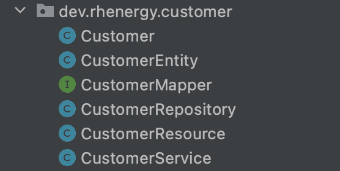

# 从头开始使用 quartus 构建 api

> 原文：<https://developers.redhat.com/blog/2021/05/11/building-an-api-using-quarkus-from-the-ground-up>

构建一个生产就绪的应用程序需要大量的活动部件。大多数时候，开发人员使用某种工具(比如 Maven 原型)创建一个新项目，然后从一个教程到另一个教程，将应用程序所需的一切拼凑在一起。本文试图将所有的部分整合在一起，并提供一个完整的参考来说明一个 [Quarkus](/products/quarkus/getting-started) 应用程序需要完成的工作。你可以在 GitHub 上找到[这篇文章中的所有例子。](https://github.com/stephennimmo/quarkus-ground-up/tree/BLOG_POST)

## quartus 示例的技术堆栈

以下是我们将使用的技术的快速列表:

*   [胃](https://maven.apache.org/)
*   夸尔库斯
    *   [RestEasy](https://quarkus.io/guides/rest-json)
    *   [派头](https://quarkus.io/guides/hibernate-orm-panache)
    *   [Bean 验证](https://quarkus.io/guides/validation)
*   [小黑麦](https://smallrye.io/)
*   [OpenAPI](https://quarkus.io/guides/openapi-swaggerui)
*   [MapStruct](https://mapstruct.org/)
*   [飞行路线](https://quarkus.io/guides/flyway)
*   [PostgreSQL](https://www.postgresql.org/)
*   [JUnit 5](https://junit.org/junit5/docs/current/user-guide/)
    *   [评估](https://assertj.github.io/doc/)
*   [Testcontainers](https://testcontainers.org/)

## 项目范围和开始

像任何项目一样，我们需要从定义我们的范围开始。这个项目的目标是建立一个客户 API。我们希望支持通过 REST API 公开的基本 CRUD(创建、读取、更新和删除)功能，将数据保存到关系数据库，并将数据更改发布到消息传递主题以供外部异步使用。本文的范围是建立一个 API 并运行功能集成测试。

以下命令创建您的初始项目，并在 Quarkus [dev 模式](https://quarkus.io/guides/getting-started#development-mode)下启动项目。这提供了一个项目已经成功创建并准备工作的快速验证。

```
$ mvn io.quarkus:quarkus-maven-plugin:1.13.3.Final:create \
    -DprojectGroupId=dev.rhenergy.customer \
    -DprojectArtifactId=customer-api \
    -DclassName="dev.rhenergy.customer.CustomerResource" \
    -Dpath="/api/customers"
$ cd customer-api
$ ./mvnw clean quarkus:dev
```

在您选择的 IDE 中打开项目，让我们开始吧。

**注意**:我特意省略了本文的样板代码:getters、setters、`hashCode`、`equals`和`toString`，最明显的是。此外，我们想花点时间关注我们开发工作中的一个微妙的考虑:关注您的导入。不要只是开始进口东西。当我添加导入时，我有意识地试图限制我对第三方库的接触，专注于抽象层，比如微概要抽象。请记住，您导入的每一个库现在都是您的责任。

## 架构层:资源、服务、存储库

我喜欢坚持传统的资源服务存储库分层模式，如图 1 所示。在这个模式中，`Repository`类返回一个`Entity`对象，它与底层数据库结构紧密耦合。`Service`类接受并返回`Domain`对象，`Resource`层简单地管理其余的关注点，可能处理从`Domain`对象到特定`View`对象的额外数据转换。

[](/sites/default/files/blog/2021/05/img_resource_layers.png)Figure 1: Architecture for the customer project.

Figure 1: Architecture for the customer project.

我也喜欢把所有相关的东西放在同一个包里。过去，我将包分解成不同的架构层，如下所示:

```
dev.rhenergy.customer.repository
dev.rhenergy.customer.repository.entity
dev.rhenergy.customer.resource
dev.rhenergy.customer.service
```

但是随着我的[微服务](/topics/microservices)越来越专注于单个领域，我现在只是把它们都放在`dev.rhenergy.customer`包中，如图 2 所示。

[](/sites/default/files/blog/2021/05/img_6092f3dcb4600.png)

Figure 2: The full stack of classes all reside in the same domain package.

## quartus 应用程序依赖性

我们将从对`pom.xml`文件的一些更改开始我们的编码。

### Yaml 属性

我们首先改变的是管理属性的方式。比起属性文件，我更喜欢 YAML，所以我在`pom.xml`中添加了以下内容:

```
<dependency>
    <groupId>io.quarkus</groupId>
    <artifactId>quarkus-config-yaml</artifactId>
</dependency>
```

然后，将`application.properties`文件重命名为`application.yaml`。

### 数据库:飞行路线和派头

数据交互将由 [Quarkus Panache](https://quarkus.io/guides/hibernate-orm-panache) 扩展来管理。我们还将使用 [Flyway](https://flywaydb.org/) 来版本化我们的数据库模式，它有一个 [Quarkus 扩展](https://quarkus.io/guides/flyway)。首先，让我们给`pom.xml`文件添加扩展名:

```
<dependency>
    <groupId>io.quarkus</groupId>
    <artifactId>quarkus-hibernate-orm-panache</artifactId>
</dependency>
<dependency>
    <groupId>io.quarkus</groupId>
    <artifactId>quarkus-jdbc-postgresql</artifactId>
</dependency>
<dependency>
    <groupId>io.quarkus</groupId>
    <artifactId>quarkus-flyway</artifactId>
</dependency>
```

### 候鸟迁徙所经的路径

使用 Flyway，我们可以快速组装我们的第一个表，即`customer`表。

**注意**:我对这个应用程序做了一些改动。是否需要电子邮件地址？是否需要电话号码？也许是，也许不是。

我们将把第一个 Flyway SQL 文件放在正常部署位置，`src/main/resources/db/migration/V1__customer_table_create.sql`:

```
CREATE TABLE customer (
    customer_id     SERIAL PRIMARY KEY,
    first_name      VARCHAR(100) NOT NULL,
    middle_name     VARCHAR(100),
    last_name       VARCHAR(100) NOT NULL,
    suffix          VARCHAR(100),
    email           VARCHAR(100),
    phone           VARCHAR(100)
);
```

**注意**:关于模式改变应该如何在生产中推广有很多讨论。现在，我们只是让嵌入式 Flyway 库在应用程序启动时迁移更改。如果您的应用程序需要更高级的展开，比如 blue-green 或 canary，您将需要分割管道，以使模式更改独立展开并向后兼容。

### 派头十足的 JPA

基于用 Flyway 创建的表，我们将创建我们的第一个`Entity`对象。我使用[存储库模式](https://quarkus.io/guides/hibernate-orm-panache#solution-2-using-the-repository-pattern)，因为我喜欢那里额外的`Repository`接口。以下是一个名为`src/main/java/dev/rhenergy/customer/CustomerEntity.java`的文件:

```
@Entity(name = "Customer")
@Table(name = "customer")
public class CustomerEntity {

    @Id
    @GeneratedValue(strategy = GenerationType.*IDENTITY*)
    @Column(name = "customer_id")
    private Integer customerId;

    @Column(name = "first_name")
    @NotEmpty
    private String firstName;

    @Column(name = "middle_name")
    private String middleName;

    @Column(name = "last_name")
    @NotEmpty
    private String lastName;

    @Column(name = "suffix")
    private String suffix;

    @Column(name = "email")
    @Email
    private String email;

    @Column(name = "phone")
    private String phone;

    ...

}
```

关于实体的一些注释:

*   我喜欢用后缀`Entity`来命名我所有的 Java 持久性 API (JPA)实体类。它们有一个用途:映射回数据库表。我总是在`Domain`对象和`Entity`对象之间提供一个间接层，因为当它丢失时，我损失的时间比我花在创建和管理数据复制过程上的时间还要多。
*   由于 JPA 创建目标对象名称的方式，您必须显式地加入`@Entity`注释，这样您的 HQL 查询就没有引用`CustomerEntity`。
*   我喜欢用注释`@Table`和`@Column`明确地命名表格和列。为什么？当代码重构无意中破坏了假定的命名契约时，我所损失的时间比我编写一些额外的注释所花费的时间还要多。
*   我的数据库列名是 snake_case，实体的类变量是 camelCase。

存储库接口如下:

```
@ApplicationScoped
public class CustomerRepository implements PanacheRepositoryBase<CustomerEntity, Integer> {
}
```

它看起来很简单，但它在所有正确的地方都有动力。该文件被命名为`CustomerRepository.java`。`PanacheRepositoryBase`接口填写了图 3 所示的所有代码。

[](/sites/default/files/blog/2021/05/img_panache_fill.png)Figure 3: Code filled in by the PanacheRepositoryBase interface.

Figure 3: Code filled in by the PanacheRepositoryBase interface.

## 域，然后是服务，然后是资源

这个应用程序的第一个版本的客户域对象非常简单。以下内容保存在一个名为`Customer.java`的文件中:

```
public class Customer {

    private Integer customerId;

    @NotEmpty
    private String firstName;

    private String middleName;

    @NotEmpty
    private String lastName;

    private String suffix;

    @Email
    private String email;

    private String phone;

}
```

## 实体到域对象映射

我们需要在域对象和实体对象之间创建映射。出于这些目的，我们将使用 [MapStruct](https://mapstruct.org/) 。它要求我们添加实际的依赖关系，并通过配置来增强编译器插件:

```
<mapstruct.version>1.4.2.Final</mapstruct.version>
...
<dependency>
    <groupId>org.mapstruct</groupId>
    <artifactId>mapstruct</artifactId>
    <version>${mapstruct.version}</version>
</dependency>
...
<plugin>
    <artifactId>maven-compiler-plugin</artifactId>
    <version>${compiler-plugin.version}</version>
    <configuration>
        <annotationProcessorPaths>
            <path>
                <groupId>org.mapstruct</groupId>
                <artifactId>mapstruct-processor</artifactId>
                <version>${mapstruct.version}</version>
            </path>
        </annotationProcessorPaths>
    </configuration>
</plugin>

```

映射器本身非常简单，因为它基本上是对象之间一对一的映射。在下面的代码中，从名为`CustomerMapper.java`的文件中，注意附加的`componentModel = "cdi"`定义。这允许映射器被注入:

```
@Mapper(componentModel = "cdi")
public interface CustomerMapper {

    CustomerEntity toEntity(Customer domain);

    Customer toDomain(CustomerEntity entity);

}
```

## 异常处理

我通常创建一个单独的异常，扩展`RuntimeException`，然后基于自定义逻辑将它用于我的所有异常，并包装检查过的异常。因为只能抛出一个异常，所以如果我以后需要以任何方式定制响应，我不必编写大量的映射器。以下内容保存在一个名为`ServiceException.java`的文件中:

```
public class ServiceException extends RuntimeException

    public ServiceException(String message) {
        super(message);
    }

}
```

## 构建服务类

我们现在可以构建`Service`类来处理 CRUD。下面是一个名为`CustomerService.java`的文件:

```
@ApplicationScoped
public class CustomerService {

    private final CustomerRepository customerRepository;
    private final CustomerMapper customerMapper;
    private final Logger logger;

    public CustomerService(CustomerRepository customerRepository, CustomerMapper customerMapper, Logger logger) {
        this.customerRepository = customerRepository;
        this.customerMapper = customerMapper;
        this.logger = logger;
    }

    public List<Customer> findAll(){
        return customerRepository.findAll().stream()
                .map(customerMapper::toDomain)
                .collect(Collectors.toList());
    }

    public Optional<Customer> findById(Integer customerId) {
        return customerRepository.findByIdOptional(customerId).map(customerMapper::toDomain);
    }

    @Transactional
    public Customer save(Customer customer) {
        CustomerEntity entity = customerMapper.toEntity(customer);
        customerRepository.persist(entity);
        return customerMapper.toDomain(entity);
    }

    @Transactional
    public Customer update(Customer customer) {
        if (customer.getCustomerId() == null) {
            throw new ServiceException("Customer does not have a customerId");
        }
        Optional<CustomerEntity> optional = customerRepository.findByIdOptional(customer.getCustomerId());
        if (optional.isEmpty()) {
            throw new ServiceException(String.format("No Customer found for customerId[%s]", customer.getCustomerId()));
        }
        CustomerEntity entity = optional.get();
        entity.setFirstName(customer.getFirstName());
        entity.setMiddleName(customer.getMiddleName());
        entity.setLastName(customer.getLastName());
        entity.setSuffix(customer.getSuffix());
        entity.setEmail(customer.getEmail());
        entity.setPhone(customer.getPhone());
        customerRepository.persist(entity);
        return customerMapper.toDomain(entity);
    }

}
```

注意`save`和`update`方法的`@Transactional`注释。这个注释是默认行为，即创建一个新的客户记录或使用一个现有的记录。您还会注意到构造函数中注入的记录器。Logger 注入是在您的类中包含一个用于 Java 的[简单日志门面](http://slf4j.org/manual.html) (SLF4J) logger 的一种便捷方式，而不必剪切和粘贴相同的代码。`LoggerProducer`看起来是这样的:

```
@Singleton
public class LoggerProducer {

    @Produces
    Logger createLogger(InjectionPoint injectionPoint) {
        return LoggerFactory.getLogger(injectionPoint.getMember().getDeclaringClass().getName());
    }

}
```

## 构建资源类

现在让我们构建出`Resource`。首先，我们使用 [OpenAPI](https://www.openapis.org/) 规范来创建一个符合的 REST API。让我们获取 Quarkus 扩展，并将其放入我们的`pom.xml`文件:

```
<dependency>
    <groupId>io.quarkus</groupId>
    <artifactId>quarkus-smallrye-openapi</artifactId>
</dependency>
```

您也可以使用以下命令通过 [Quarkus Maven 插件](https://quarkus.io/guides/maven-tooling)添加扩展。我通常记不住名字，所以我只是从一个例子中剪切和粘贴，但这是一个选项:

```
./mvnw quarkus:add-extension -Dextensions="quarkus-smallrye-openapi"
```

因为我们将使用 JSON 来回序列化对象，所以我们还需要添加扩展来处理 JSON 序列化和反序列化:

```
<dependency>
    <groupId>io.quarkus</groupId>
    <artifactId>quarkus-resteasy-jsonb</artifactId>
</dependency>
```

### 对象验证

我们还使用了 [Hibernate Bean 验证框架](https://quarkus.io/guides/validation)。这允许您在方法参数上放置`@Valid`注释来触发 beans 的 `javax.validation.contraints`注释，例如`@NotEmpty`和`@Email`:

```
<dependency>
    <groupId>io.quarkus</groupId>
    <artifactId>quarkus-hibernate-validator</artifactId>
</dependency>
```

### 资源类

下面是`Resource`类，有一些脚注。代码进入`CustomerResource.java`文件。

```
@Path("/api/customers")
@Produces(MediaType.APPLICATION_JSON)
@Consumes(MediaType.APPLICATION_JSON)
public class CustomerResource {

    private final CustomerService customerService;
    private final Logger logger;

    public CustomerResource(CustomerService customerService, Logger logger) {
        this.customerService = customerService;
        this.logger = logger;
    }

    @GET
    @APIResponses(
            value = {
                    @APIResponse(
                            responseCode = "200",
                            description = "Get All Customers",
                            content = @Content(mediaType = "application/json",
                                    schema = @Schema(type = SchemaType.ARRAY, implementation = Customer.class)))
            }
    )
    public Response get() {
        return Response.ok(customerService.findAll()).build();
    }

    @GET
    @Path("/{customerId}")
    @APIResponses(
            value = {
                    @APIResponse(
                            responseCode = "200",
                            description = "Get Customer by customerId",
                            content = @Content(mediaType = "application/json",
                                    schema = @Schema(type = SchemaType.OBJECT, implementation = Customer.class))),
                    @APIResponse(
                            responseCode = "404",
                            description = "No Customer found for customerId provided",
                            content = @Content(mediaType = "application/json")),
            }
    )
    public Response getById(@PathParam("customerId") Integer customerId) {
        Optional<Customer> optional = customerService.findById(customerId);
        return !optional.isEmpty() ? Response.ok(optional.get()).build() : Response.status(Response.Status.NOT_FOUND).build();
    }

    @POST
    @APIResponses(
            value = {
                    @APIResponse(
                            responseCode = "201",
                            description = "Customer Created",
                            content = @Content(mediaType = "application/json",
                                    schema = @Schema(type = SchemaType.OBJECT, implementation = Customer.class))),
                    @APIResponse(
                            responseCode = "400",
                            description = "Customer already exists for customerId",
                            content = @Content(mediaType = "application/json")),
            }
    )
    public Response post(@Valid Customer customer) {
        final Customer saved = customerService.save(customer);
        return Response.status(Response.Status.CREATED).entity(saved).build();
    }

    @PUT
    @APIResponses(
            value = {
                    @APIResponse(
                            responseCode = "200",
                            description = "Customer updated",
                            content = @Content(mediaType = "application/json",
                                    schema = @Schema(type = SchemaType.OBJECT, implementation = Customer.class))),
                    @APIResponse(
                            responseCode = "404",
                            description = "No Customer found for customerId provided",
                            content = @Content(mediaType = "application/json")),
            }
    )
    public Response put(@Valid Customer customer) {
        final Customer saved = customerService.update(customer);
        return Response.ok(saved).build();
    }

}
```

关于代码的一些注释:

*   `@Produces`和`@Consumes`注释可以在类级别，而不是方法级别，减少了重复。
*   `@APIResponses`定义是一种将 Swagger 文档直接嵌入代码的方式。注释会产生一些噪音，但是减少了将实现类与 Swagger 定义分开维护的需要。
*   注意，所有的方法实际上都返回了一个`Response`对象。我发现管理`Response`数据要容易得多，比如 HTTP 状态代码。如果你返回一个对象本身，框架会自动将它包装在一个 200 响应代码中。这在一个`GET`上很好，但是当我有一个`POST`时，我想看看那个漂亮的 201 响应代码。
*   如果使用`Response`类，那么`@ApiResponses`将作为响应体中返回的实际有效负载的文档。OpenAPI 扩展自动为您生成所有的 Swagger APIs 和 Swagger UI。

## 其他 OpenAPI 文档

我们可以在`application.yaml`文件中配置 OpenAPI Swagger API 和 UI 如下:

```
mp
  openapi:
    extensions:
      smallrye:
        info:
          title: Customer API
          version: 0.0.1
          description: API for retrieving customers
          contact:
            email: techsupport@rhenergy.dev
            name: Customer API Support
            url: http://rhenergy.github.io/customer-api
          license:
            name: Apache 2.0
            url: http://www.apache.org/licenses/LICENSE-2.0.html
```

## 测试应用程序

现在我们已经有了完整的堆栈。我们去做测试吧。首先将 AssertJ 库添加到`pom.xml`文件中。流畅的断言允许更精简的测试断言，并减少了重复代码的数量:

```
<dependency>
    <groupId>org.assertj</groupId>
    <artifactId>assertj-core</artifactId>
    <scope>test</scope>
</dependency>
```

现在开始测试，在一个名为`CustomerResourceTest.java`的文件中:

```
@QuarkusTest
public class CustomerResourceTest {

    @Test
    public void getAll() {
        given()
                .when().get("/api/customers")
                .then()
                .statusCode(200);
    }

    @Test
    public void getById() {
        Customer customer = createCustomer();
        Customer saved = given()
                .contentType(ContentType.JSON)
                .accept(ContentType.JSON)
                .body(customer)
                .post("/api/customers")
                .then()
                .statusCode(201)
                .extract().as(Customer.class);
        Customer got = given()
                .when().get("/api/customers/{customerId}", saved.getCustomerId())
                .then()
                .statusCode(200)
                .extract().as(Customer.class);
        assertThat(saved).isEqualTo(got);
    }

    @Test
    public void post() {
        Customer customer = createCustomer();
        Customer saved = given()
                .contentType(ContentType.JSON)
                .accept(ContentType.JSON)
                .body(customer)
                .post("/api/customers")
                .then()
                .statusCode(201)
                .extract().as(Customer.class);
        assertThat(saved.getCustomerId()).isNotNull();
    }

    @Test
    public void postFailNoFirstName() {
        Customer customer = createCustomer();
        customer.setFirstName(null);
        given()
                .contentType(ContentType.JSON)
                .accept(ContentType.JSON)
                .body(customer)
                .post("/api/customers")
                .then()
                .statusCode(400);
    }

    @Test
    public void put() {
        Customer customer = createCustomer();
        Customer saved = given()
                .contentType(ContentType.JSON)
                .accept(ContentType.JSON)
                .body(customer)
                .post("/api/customers")
                .then()
                .statusCode(201)
                .extract().as(Customer.class);
        saved.setFirstName("Updated");
        Customer updated = given()
                .contentType(ContentType.JSON)
                .accept(ContentType.JSON)
                .body(saved)
                .put("/api/customers")
                .then()
                .statusCode(200)
                .extract().as(Customer.class);
        assertThat(updated.getFirstName()).isEqualTo("Updated");
    }

    @Test
    public void putFailNoLastName() {
        Customer customer = createCustomer();
        Customer saved = given()
                .contentType(ContentType.JSON)
                .accept(ContentType.JSON)
                .body(customer)
                .post("/api/customers")
                .then()
                .statusCode(201)
                .extract().as(Customer.class);
        saved.setLastName(null);
        given()
                .contentType(ContentType.JSON)
                .accept(ContentType.JSON)
                .body(saved)
                .put("/api/customers")
                .then()
                .statusCode(400);
    }

    private Customer createCustomer() {
        Customer customer = new Customer();
        customer.setFirstName(RandomStringUtils.randomAlphabetic(10));
        customer.setMiddleName(RandomStringUtils.randomAlphabetic(10));
        customer.setLastName(RandomStringUtils.randomAlphabetic(10));
        customer.setEmail(RandomStringUtils.randomAlphabetic(10) + "@rhenergy.dev");
        customer.setPhone(RandomStringUtils.randomNumeric(10));
        return customer;
    }

}
```

我绝不认为这一组测试是完整的，但是它在普通用例上做得很好。当您尝试运行测试时，您会很快意识到我们还没有连接所需的数据库。我们接下来将解决这个问题。

## 用 Testcontainers 进行集成测试

Quarkus 的 1.13 版本包括一套新工具，称为 [devservices](https://quarkus.io/guides/datasource#devservices-configuration-free-databases) 。通过 devservices，Quarkus 应用程序会根据项目中包含的特定的`quarkus-jdbc`扩展，自动为适当的数据库构建一个新的[测试容器](https://www.testcontainers.org/modules/databases/)。当 JUnit 测试开始时，这将连接在后台运行 PostgreSQL 容器所需的所有基础设施。但是有一个缺失的部分:应用程序配置。以下是完整的`application.yaml`文件的子集，仅显示了与数据库相关的部分:

```
quarkus:
  banner:
    enabled: false
  datasource:
    db-kind: postgresql
    devservices:
      image-name: postgres:13
  hibernate-orm:
    database:
      generation: none

"%dev":
  quarkus:
    log:
      level: INFO
      category:
        "dev.rhenergy":
          level: DEBUG
    hibernate-orm:
      log:
        sql: true
    flyway:
      migrate-at-start: true
      locations: db/migration,db/testdata

"%test":
  quarkus:
    log:
      level: INFO
      category:
        "dev.rhenergy":
          level: DEBUG
    hibernate-orm:
      log:
        sql: true
    flyway:
      migrate-at-start: true
      locations: db/migration,db/testdata
```

对 devservices 所做的唯一调整是指定使用特定的 Postgres 容器。

现在运行您的测试:

```
./mvnw clean test

```

测试编译并启动一个完全运行的应用程序。测试是针对实际的 HTTP 端点运行的。

## 摘要

希望本文能让您对从头构建一个新的 REST API 的范围有一个很好的了解。以后的文章将会介绍 Quarkus 开发的整个生命周期，并展示产品环境的完整部署，以及需要的一切。快乐编码。

*Last updated: October 14, 2022*