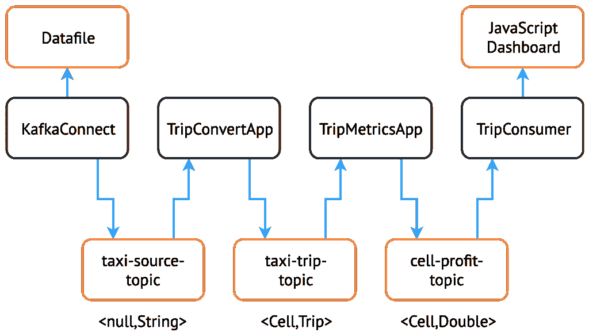
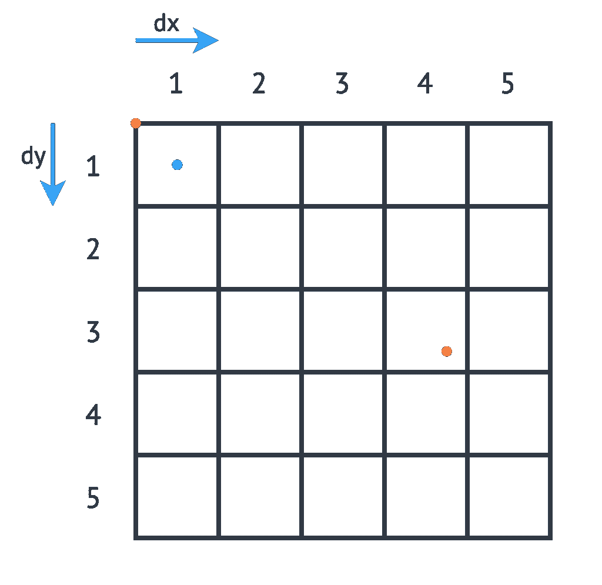
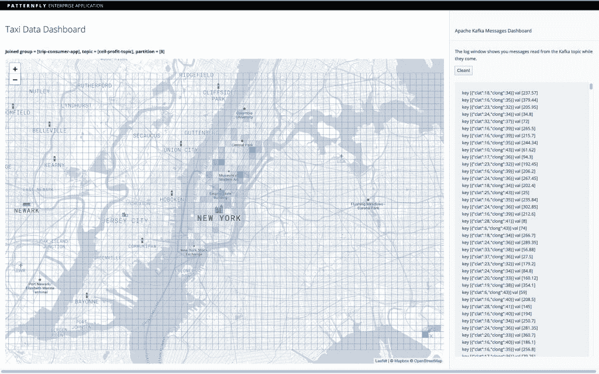
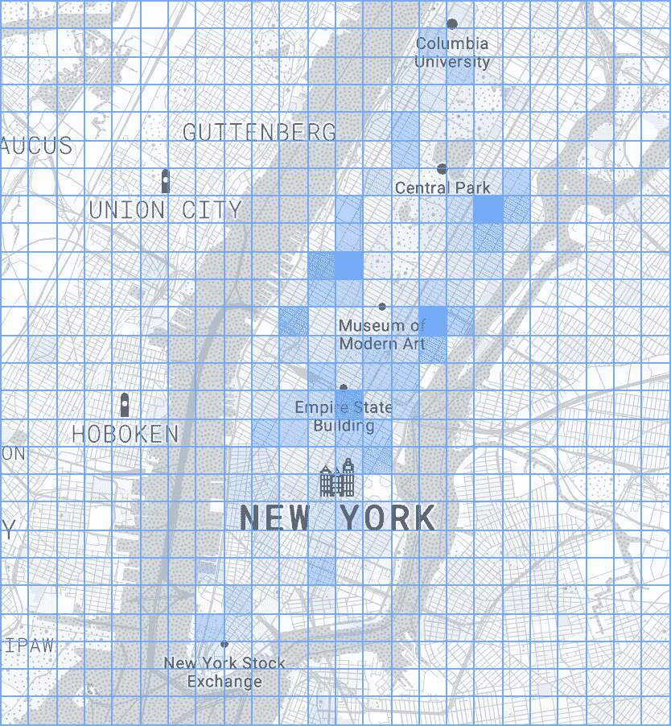

# 使用红帽 AMQ 流构建 Apache Kafka 流应用程序:第 2 部分

> 原文：<https://developers.redhat.com/blog/2019/06/18/building-apache-kafka-streams-applications-using-red-hat-amq-streams-part-2>

这个 [Apache Kafka](https://developers.redhat.com/videos/youtube/CZhOJ_ysIiI/) 项目包括一个[流](https://kafka.apache.org/22/documentation/streams/developer-guide/dsl-api.html) [域特定语言(](https://kafka.apache.org/22/documentation/streams/developer-guide/dsl-api.html) [DSL)](https://kafka.apache.org/22/documentation/streams/developer-guide/dsl-api.html) 构建在底层[流处理器 API](https://kafka.apache.org/10/documentation/streams/developer-guide/processor-api.html) 之上。这个 DSL 为开发人员提供了执行数据处理操作的简单抽象。然而，如何用 Kafka 在一个容器化的环境中建立一个流处理管道还不清楚。这是由两部分组成的系列文章中的第二篇，它使用前一篇文章中的基础知识，使用[红帽 AMQ 流](https://developers.redhat.com/products/amq/overview)构建一个示例应用程序。

现在，让我们创建一个对真实世界数据进行操作的多级管道，并消费和可视化这些数据。

## 系统架构

在本文中，我们按照下面的架构图构建了一个解决方案。对于每一个新组件，这里都值得参考一下:



## 数据集和问题

我们为此示例选择的数据是 2013 年的纽约市出租车旅程信息，该数据用于 2015 年的 [ACM 分布式基于事件的系统(DEBS)大挑战。你可以在这里找到数据来源](http://www.debs2015.org/call-grand-challenge.html)[的描述](https://chriswhong.com/open-data/foil_nyc_taxi/)。

此示例的数据集以 CSV 文件的形式提供，其列详述如下:

| 圆柱 | 描述 |
| 大奖章 | 出租车-车辆绑定的标识符的 md5sum |
| 黑客 _ 许可证 | 出租车牌照标识符的 md5sum |
| pickup_datetime | 乘客被接走的时间 |
| 衰减日期时间 | 乘客下车的时间 |
| 行程时间(秒) | 旅行持续时间 |
| 行程距离 | 以英里为单位的行程距离 |
| 收件人 _ 经度 | 提货地点的经度坐标 |
| 皮卡 _ 纬度 | 提货地点的纬度坐标 |
| 经度下降 | 卸货地点的经度坐标 |
| 衰减纬度 | 卸货地点的纬度坐标 |
| 付款类型 | 付款方式-信用卡或现金 |
| 票价 _ 金额 | 美元票价金额 |
| 额外费 | 美元附加费 |
| mta _ 税 | 美元税 |
| 小费 _ 金额 | 美元小费 |
| 通行费 _ 金额 | 以美元计算的桥梁和隧道通行费 |
| 总计 _ 金额 | 以美元支付的总金额 |

*来源: [DEBS 2015 大挑战。](http://www.debs2015.org/call-grand-challenge.html)*

我们可以在该数据集中探索有趣的途径，例如跟踪特定的出租车来计算:

*   一天中从一辆出租车上赚的钱。
*   从上一个下车点到下一个上车点的距离，以确定他们是否在没有乘客的情况下行驶了很远。
*   利用距离和时间计算出租车行驶的平均速度；然后，我们使用上下车坐标来猜测遇到的流量。

## 这个例子

我们为这个例子选择的处理相对简单。我们计算城市特定区域内的总收入(`fare_amount + tip_amount`)，基于从那里开始的旅程。这种计算包括将输入数据分割成由不同单元格组成的网格，然后对从任何单元格出发的每次旅行所花费的总金额进行求和。为了实现这一点，我们必须考虑以一种确保输出正确的方式来分割处理。

我们将使用我们在[第 1 部分](https://developers.redhat.com/blog/?p=599817)中学到的知识逐步构建这个示例。

### 将数据发送到 Apache Kafka

首先，我们需要使我们的数据集可以从集群中访问。这项任务通常会涉及到连接到一个服务，该服务允许我们实时轮询实时数据，但是所选择的数据是历史数据，因此我们必须模拟实时行为。

[Kafka Connect](https://kafka.apache.org/documentation.html#connect) 是这类功能的理想选择，也正是我们最终要使用的。然而，现在，我们避免了额外的复杂性，并使用了第 1 部分中讨论的 [Kafka Producer](https://kafka.apache.org/documentation.html#producerapi) 应用程序。我们通过在 JAR 中包含(较小的)数据文件并逐行读取它以发送给 Kafka 来实现这一点。参见 [TaxiProducerExample](https://github.com/adam-cattermole/strimzi-lab/tree/add-taxi-example/taxi-example/taxi-producer/src/main/java/io/strimzi/TaxiProducerExample.java) 了解其工作原理。首先，我们在部署配置中将`TOPIC`设置为将数据写入`taxi-source-topic`。

现在让我们检查数据是否流向主题:

```
$ oc run kafka-consumer -ti --image=registry.access.redhat.com/amq7/amq-streams-kafka:1.1.0-kafka-2.1.1 --rm=true --restart=Never -- bin/kafka-console-consumer.sh --bootstrap-server my-cluster-kafka-bootstrap:9092 --topic taxi-source-topic --from-beginning

```

```
  07290D3599E7A0D62097A346EFCC1FB5,E7750A37CAB07D0DFF0AF7E3573AC141,2013-01-01 00:00:00,2013-01-01 00:02:00,120,0.44,-73.956528,40.716976,-73.962440,40.715008,CSH,3.50,0.50,0.50,0.00,0.00,4.50
  22D70BF00EEB0ADC83BA8177BB861991,3FF2709163DE7036FCAA4E5A3324E4BF,2013-01-01 00:02:00,2013-01-01 00:02:00,0,0.00,0.000000,0.000000,0.000000,0.000000,CSH,27.00,0.00,0.50,0.00,0.00,27.50
  0EC22AAF491A8BD91F279350C2B010FD,778C92B26AE78A9EBDF96B49C67E4007,2013-01-01 00:01:00,2013-01-01 00:03:00,120,0.71,-73.973145,40.752827,-73.965897,40.760445,CSH,4.00,0.50,0.50,0.00,0.00,5.00
  ...

```

### 创建卡夫卡流操作

现在我们有了一个关于`String`数据的主题，我们可以开始创建我们的应用程序逻辑了。首先，让我们设置 Kafka Streams 应用程序的配置选项。我们在一个单独的配置类中这样做——参见[TripConvertConfig](https://github.com/adam-cattermole/strimzi-lab/tree/add-taxi-example/taxi-example/trip-convert-app/src/main/java/io/strimzi/TripConvertConfig.java)——它使用与第 1 部分中描述的读取环境变量相同的方法。请注意，我们使用相同的方法为我们构建的每个新应用程序提供配置。

我们现在可以生成配置选项:

```
TripConvertConfig config = TripConvertConfig.fromMap(System.getenv());
Properties props = TripConvertConfig.createProperties(config);

```

如基本示例中所述，我们执行的操作将是从一个主题读取，对数据执行某种操作，并写出到另一个主题。

让我们用之前看到的相同方法来创建源流:

```
StreamsBuilder builder = new StreamsBuilder();
KStream<String, String> source = builder.stream(config.getSourceTopic());

```

我们目前收到的数据格式不便于使用。我们的长 CSV 数据表示为一个`String`，我们不能访问单个字段。

为了对数据执行操作，我们需要转换 `(`) events into a type we know. For this purpose, we created a [Plain Old Java Object (POJO)](https://en.wikipedia.org/wiki/Plain_old_Java_object), representing the `Trip`数据类型，以及表示每个数据元素的列的`enum TripFields,`。函数`constructTripFromString`获取 CSV 数据的每一行并将其转换为`Trip` s。该函数在 [TripConvertApp](https://github.com/adam-cattermole/strimzi-lab/tree/add-taxi-example/taxi-example/trip-convert-app/src/main/java/io/strimzi/TripConvertApp.java) 类中实现。``

 ``Kafka Streams DSL 可以轻松地为我们收到的每个新记录执行此功能:

```
KStream<String, Trip> mapped = source
                .map((key, value) -> {
                    new KeyValue<>(key, constructTripFromString(value))
                });

```

我们现在可以将`mapped`流写出到接收器主题。然而，我们的值字段的[序列化/反序列化(SerDes)](https://en.wikipedia.org/wiki/SerDes) 过程已经从我们在 [TripConvertConfig](https://github.com/adam-cattermole/strimzi-lab/tree/add-taxi-example/taxi-example/trip-convert-app/src/main/java/io/strimzi/TripConvertConfig.java) 类中设置的`Serdes.String()`改变了。因为我们的`Trip`类型是为我们的应用程序定制的，所以我们必须创建自己的 SerDes 实现。

这就是 [JsonObjectSerde](https://github.com/adam-cattermole/strimzi-lab/tree/add-taxi-example/taxi-example/trip-convert-app/src/main/java/io/strimzi/json/JsonObjectSerde.java) 类发挥作用的地方。我们使用这个类来处理自定义对象与 JSON 之间的相互转换，让 [Vertx JsonObject](https://vertx.io/docs/apidocs/io/vertx/core/json/JsonObject.html) 类来完成繁重的工作。对象的构造函数需要一些注释，这在[位置](https://github.com/adam-cattermole/strimzi-lab/blob/add-taxi-example/taxi-example/trip-convert-app/src/main/java/io/strimzi/trip/Location.java)类中很容易看到。

我们现在准备输出到我们的`sinkTopic`，使用下面的命令:

```
final JsonObjectSerde tripSerde = new JsonObjectSerde<>(Trip.class);
mapped.to(config.getSinkTopic(), Produced.with(Serdes.String(), tripSerde));

```

### 生成特定于应用的信息

我们的应用程序的目的是计算从任何特定单元出发的所有旅程收到的总金额。因此，我们必须使用旅程起点的纬度和经度来执行计算，以确定它属于哪个像元。我们使用 [DEBS 大挑战](http://www.debs2015.org/call-grand-challenge.html)中的逻辑来定义网格细节。请参见下图中的示例:



我们必须设置网格的原点(蓝点)，它代表网格单元(1，1)的中心，并为网格中的每个单元设置以米为单位的大小。接下来，我们将单元格大小分别转换为经纬度距离，`dy`和`dx`，并计算网格的左上位置(红点)。对于任何新的到达点，我们可以很容易地计算出距离坐标有多少个`dy`和`dx`，因此在上面的例子(黄点)中，我们可以确定旅程从单元(3，4)开始。

在[单元格](https://github.com/adam-cattermole/strimzi-lab/tree/add-taxi-example/taxi-example/trip-convert-app/src/main/java/io/strimzi/trip/Cell.java)类和 [TripConvertApp](https://github.com/adam-cattermole/strimzi-lab/tree/add-taxi-example/taxi-example/trip-convert-app/src/main/java/io/strimzi/TripConvertApp.java) 中的附加应用程序逻辑执行这个计算，我们将新记录的键设置为`Cell`类型。为了写入`sinkTopic`，我们需要一个新的 SerDes，它的创建方式与我们之前创建的相同。

由于我们选择了默认的分区策略，记录是基于键的不同值进行分区的，因此这一更改确保了对应于特定拾取`Cell`的每个`Trip`都被分配到同一个分区。当我们执行下游处理时，相同的处理节点接收对应于相同拾取单元的所有记录，确保操作的正确性和可重复性。

### 汇总数据

我们现在已经将所有传入的数据转换为类型`<Cell, Trip>`，并且可以执行聚合操作。我们的目的是在设定的时间段内，计算从一个拾音器单元开始的每个行程的总和`fare_amount + tip_amount`。

因为我们的数据是历史的，我们使用的时间窗应该与事件发生的原始时间相关，而不是事件进入 Kafka 系统的时间。为此，我们需要提供一个从每个记录中提取这些信息的方法:一个实现`TimestampExtractor`的类。`Trip`字段已经包含了接送时间的信息，所以实现很简单——详见 [TripTimestampExtractor](https://github.com/adam-cattermole/strimzi-lab/tree/add-taxi-example/taxi-example/trip-metrics-app/src/main/java/io/strimzi/trip/TripTimestampExtractor.java) 中的实现。

尽管我们读到的主题已经按单元进行了分区，但是单元的数量比分区的数量多得多，因此我们的每个副本都将处理多个单元的数据。为了确保窗口和聚集是在逐个单元格的基础上执行的，我们首先调用`groupByKey()`函数，然后是后续的窗口操作。如下所示，窗口大小很容易改变，但是现在，我们选择了 15 分钟的窗口。

现在可以汇总数据，生成我们想要的输出指标。这样做很简单，只需提供一个累加器值和对每条记录执行的操作。输出是类型`KTable`，其中每个键代表一个特定的窗口，值是我们聚合操作的输出。我们使用`toStream()`函数将输出转换回 Kafka 流，这样它就可以输出到 sink profit。

```
KStream<Cell, Trip> source = builder.stream(config.getSourceTopic(), Consumed.with(cellSerde, tripSerde));
KStream<Windowed, Double> windowed = source
        .groupByKey(Serialized.with(cellSerde, tripSerde))
        .windowedBy(TimeWindows.of(TimeUnit.MINUTES.toMillis(15)))
        .aggregate(
                () -> (double) 0,
                (key, value, profit) -> {
                    profit + value.getFareAmount() + value.getTipAmount()
                },
                Materialized.<Cell, Double, WindowStore<Bytes, byte[]>>as("profit-store")
                        .withValueSerde(Serdes.Double()))
        .toStream();

```

因为我们不需要值属于哪个窗口的信息，所以我们将单元格重置为记录的键，并将值四舍五入到两位小数。

```
KStream<Cell, Double> rounded = windowed
                .map((window, profit) -> new KeyValue<>(window.key(), (double) Math.round(profit*100)/100));

```

最后，现在可以使用前面定义的相同方法将数据写入输出主题:

```
rounded.to(config.getSinkTopic(), Produced.with(cellSerde, Serdes.Double()));

```

### 消费和可视化数据

我们现在有了输出到最后一个主题的基于单元格的窗口度量，所以最后一步是消费和可视化数据。对于这一步，我们使用 [Vertx Kafka 客户端](https://vertx.io/docs/vertx-kafka-client/java)从我们的主题中读取数据，并使用 [Vertx EventBus](https://vertx.io/docs/vertx-core/java/#event_bus) 和 [SockJS](https://github.com/sockjs) (WebSockets)将其传输到 JavaScript 仪表板。实现见 [TripConsumerApp](https://github.com/adam-cattermole/strimzi-lab/tree/add-taxi-example/taxi-example/trip-consumer-app/src/main/java/io/strimzi/TripConsumerApp.java) 。

这个消费者应用程序注册一个处理程序，该处理程序将到达的记录转换成可读的 JSON 格式，并通过出站 EventBus 通道发布输出。JavaScript 连接到这个通道，并为所有传入的消息注册一个处理程序，该处理程序执行相关的操作来可视化数据:

```
KafkaConsumer<String, Double> consumer = KafkaConsumer.create(vertx, props, String.class, Double.class);
consumer.handler(record -> {
    JsonObject json = new JsonObject();
    json.put("key", record.key());
    json.put("value", record.value());
    vertx.eventBus().publish("dashboard", json);
});

```

我们将原始度量信息记录在一个窗口中，以便可以看到，并使用地理映射库([活页](https://leafletjs.com/))绘制原始单元格，根据度量值修改不透明度:



通过在[index.html](https://github.com/adam-cattermole/strimzi-lab/tree/add-taxi-example/taxi-example/trip-consumer-app/src/main/resources/webroot/index.html)和 [TripConvertApp](https://github.com/adam-cattermole/strimzi-lab/tree/add-taxi-example/taxi-example/trip-convert-app/src/main/java/io/strimzi/TripConvertApp.java) 中修改起始纬度和经度——或单元格大小，您可以更改正在使用的网格。您还可以调整聚合函数的逻辑，根据数据计算替代指标:



### 创建 Kafka 连接器

到目前为止，我们使用的生产者已经足够了，即使 JAR(和图像)由于额外的数据文件而变得更加臃肿。但是，如果我们想要处理完整的 12GB 数据集，我们现有的解决方案并不理想。

我们构建的示例连接器依赖于在 FTP 服务器上托管文件，但是对于几个不同的文件存储已经有了连接器。我们选择了 FTP 服务器，因为它允许我们的连接器轻松地与集群外部的文件进行通信。为了方便起见，我们使用 Python 库`pyftpdlib`来托管文件，用户名和密码设置为`amqstreams`。但是，将文件托管在任何可公开访问的 FTP 服务器上就足够了。

Kafka 连接器由自身和任务(也称为 workers)组成，任务通过调用`poll()`函数来执行数据检索。连接器将配置传递给工作器，可以根据`tasks.max`参数调用几个工作器。为此，我们创建了一个 [FTPConnection](https://github.com/adam-cattermole/strimzi-lab/tree/add-taxi-example/taxi-example/taxi-connect/src/main/java/io/strimzi/util/FTPConnection.java) 类，它提供了我们需要的来自 [Apache Commons FTPClient](https://commons.apache.org/proper/commons-net/apidocs/org/apache/commons/net/ftp/FTPClient.html) 的功能。在每次调用`poll()`时，我们从文件中检索下一行，并将该记录发布到配置中提供的主题。

我们现在需要将我们的连接器插件添加到现有的`amq-streams-kafka-connect` [Docker](https://www.docker.com/) 映像，这是通过将 JAR 添加到插件文件夹来完成的，如[红帽 AMQ 流文档](https://access.redhat.com/documentation/en-us/red_hat_amq/7.3/html/using_amq_streams_on_openshift_container_platform/getting-started-str#using-kafka-connect-with-plug-ins-str)中所述。然后，我们可以使用来自[默认 KafkaConnect 示例](https://access.redhat.com/documentation/en-us/red_hat_amq/7.3/html/using_amq_streams_on_openshift_container_platform/getting-started-str#deploying-kafka-connect-openshift-str)的指令部署 Kafka Connect 集群，但是改为将`spec.image`字段添加到我们的`kafka-connect.yaml`中，并指向包含我们插件的映像。

Kafka Connect 是作为 RESTful 资源公开的，因此要检查存在哪些连接器插件，我们可以运行下面的`GET`请求:

```
$ oc exec -c kafka -i my-cluster-kafka-0 -- curl -s -X GET \
    http://my-connect-cluster-connect-api:8083/connector-plugins

```

```
  [{"class":"io.strimzi.TaxiSourceConnector","type":"source","version":"1.0-SNAPSHOT"},{"class":"org.apache.kafka.connect.file.FileStreamSinkConnector","type":"sink","version":"2.1.0"},{"class":"org.apache.kafka.connect.file.FileStreamSourceConnector","type":"source","version":"2.1.0"}]

```

类似地，要创建一个新的连接器，我们可以`POST`JSON 配置，如下例所示。这个新的连接器实例建立了到服务器的 FTP 连接，并将数据传输到`taxi-source-topic`。要使此过程正常工作，必须正确设置以下配置选项:

*   `connect.ftp.address`–FTP 连接 URL 主机:端口。
*   `connect.ftp.filepath`–从根目录到远程 FTP 服务器上文件的路径。

如果需要，添加以下可选配置:

*   `connect.ftp.attempts`–检索有效 FTP 连接的最大尝试次数(默认值:3)。
*   `connect.ftp.backoff.ms`–连接尝试之间的回退时间，以毫秒为单位(默认值:10000 毫秒)。

```
$ oc exec -c kafka -i my-cluster-kafka-0 -- curl -s -X POST \
    -H "Accept:application/json" \
    -H "Content-Type:application/json" \
    http://my-connect-cluster-connect-api:8083/connectors -d @- <<'EOF'

{
    "name": "taxi-connector",
    "config": {
        "connector.class": "io.strimzi.TaxiSourceConnector",
        "connect.ftp.address": "<ip-address>",
        "connect.ftp.user": "amqstreams",
        "connect.ftp.password": "amqstreams",
        "connect.ftp.filepath": "sorteddata.csv",
        "connect.ftp.topic": "taxi-source-topic",
        "tasks.max": "1",
        "value.converter": "org.apache.kafka.connect.storage.StringConverter"
    }
}
EOF

```

```
  {"name":"taxi-connector","config":{"connector.class":"io.strimzi.TaxiSourceConnector","connect.ftp.address":"<ip-address>","connect.ftp.user":"amqstreams","connect.ftp.password":"amqstreams","connect.ftp.filepath":"sorteddata.csv","connect.ftp.topic":"taxi-source-topic","tasks.max":"1","value.converter":"org.apache.kafka.connect.storage.StringConverter","name":"taxi-connector"},"tasks":[],"type":null}

```

我们可以`GET`当前部署的连接器:

```
$ oc exec -c kafka -i my-cluster-kafka-0 -- curl -s -X GET \
    http://my-connect-cluster-connect-api:8083/connectors

```

```
  ["taxi-connector"]

```

我们可以像在第[节将数据发送到 Apache Kafka](#getting-data-into-kafka) 中一样，检查数据是否流向主题。有关调试信息，请参见`my-connect-cluster-connect`的日志。要停止插件，我们可以用下面的命令删除它:

```
$ oc exec -c kafka -i my-cluster-kafka-0 -- curl -s -X DELETE \
    http://my-connect-cluster-connect-api:8083/connectors/taxi-connector

```

就是这样。我们设法创建了一个更复杂的 Red Hat AMQ 流应用程序，其中我们使用 Kafka 连接器获取真实世界的历史数据，通过多个处理点对其进行流式处理，并将其转化为可视化数据。

### 阅读更多

使用红帽 AMQ 流构建 Apache Kafka 流应用程序:第 1 部分

*Last updated: September 3, 2019*``