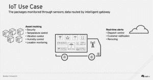
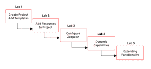

# 在 OpenShift 实验室上构建集装箱化物联网解决方案

> 原文：<https://developers.redhat.com/blog/2017/06/29/building-containerized-iot-solutions-on-openshift-lab>

随着技术继续颠覆第一波浪潮之后的行业(由网飞、亚马逊、优步等引领)。)，企业正在拥抱数字化转型以迎接挑战。实现数字化转型的关键技术之一是容器，它具有打包(原子的，为 CI/CD 构建)、协作和运行时(轻量级、可分发、可移植)的固有优势。

在波士顿的 Red Hat 峰会上，我和 Andrew Block 就如何在 Red Hat OpenShift 上构建一个集装箱化的智能物联网(IoT)网关进行了一次动手实验 。该应用通过运行在 [Red Hat OpenShift 容器平台](https://www.openshift.com/container-platform/) 上的微服务，在 容器化物联网工作负载上部署为容器内的一组微服务。

**物联网用例-资产跟踪**

本实验室的使用案例代表一家物流公司，该公司希望监控高价值、脆弱且时间紧迫的资产，并实时采取纠正措施来保护这些资产。每个包装类别(如器官、精密机器设备等)都有自己的最佳环境条件阈值。

将监控包裹的温度、振动、光线和位置数据。传感器将数据传输到智能物联网网关，该网关将转换、存储和转发这些数据以进行进一步处理。如果包裹超过了环境条件的阈值，将发送警报以触发纠正措施。

希望在企业级 OpenShift 容器平台上构建现代物联网解决方案的公司可以使用本实验室中使用的方法。

实验室的核心组件包括:

*   [红帽 JBoss Fuse 集成服务](https://access.redhat.com/documentation/en/red-hat-xpaas/version-0/red-hat-xpaas-fuse-integration-services-image/)【FIS】:利用[Apache Camel](http://camel.apache.org/)技术，促进消息和协议的集成、路由和转换的工具。
*   [红帽 JBoss A-MQ](https://access.redhat.com/documentation/en/red-hat-xpaas/0/paged/red-hat-xpaas-a-mq-image/) :基于 Apache ActiveMQ 的消息代理容器镜像，用于通过 [MQTT 协议接收和存储来自传感器的遥测数据。](http://mqtt.org/)
*   [【阿帕奇齐柏林】](https://zeppelin.apache.org/) :交互式数据可视化与分析。
*   [PostgreSQL](https://docs.openshift.com/container-platform/3.4/using_images/db_images/postgresql.html) :为传感器数据提供持久性。
*   模拟软件传感器: 一个简单的 Spring Boot 应用程序，模拟温度、振动、光线和 GPS 传感器数据。

**实验室工作流程**

在实验室练习中，参与者在 OpenShift 中创建项目，使用模板进行实例化，然后部署应用程序。一旦所有应用程序成功运行，Zeppelin 可视化工具就被配置为可视化传感器数据。

参与者还学习了如何使用 ConfigMap 动态增强软件传感器的功能，以支持新的传感器类型。

随着终端设备数量或传感器数据量的增加，OpenShift 可以自动扩展资源，以保持业务功能的运行，而无需人工干预。

对于那些对重建这个实验室感兴趣的人来说，所有的代码和文档都可以在 Github 的 [上找到。](https://github.com/sabre1041/iot-ocp/tree/summit-lab-2017)

*Last updated: June 27, 2017*