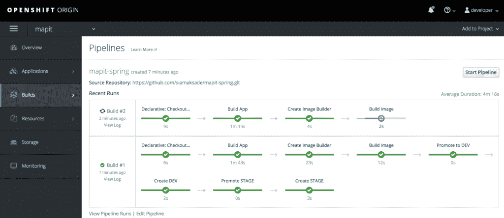

# 用 OpenShift DSL 插件构建声明性管道

> 原文：<https://developers.redhat.com/blog/2017/11/20/building-declarative-pipelines-openshift-dsl-plugin>

从第 2 版开始，它们才成为 Jenkins 的一部分，但很快就成为与 Jenkins 一起构建持续交付渠道的事实标准。`Jenkinsfile`允许使用 groovy DSL 语法将管道定义为代码，并将其签入源代码版本控制，这样您就可以像管理应用程序源代码一样，跟踪、审查、审计和管理持续交付管道的变更生命周期。

虽然 groovy DSL 语法(称为“脚本化语法”)是构建 Jenkins 管道的更广为人知和已建立的语法，并且是 Jenkins 2 发布时的默认语法。从 Jenkins 2.5 开始，还增加了对更新的[声明性语法](https://jenkins.io/doc/book/pipeline/syntax/#declarative-pipeline)的支持，以便为控制管道的所有方面提供一种简化的方式。尽管脚本化和声明性语法提供了两种定义管道的方法，但它们都转换成 Jenkins 中的相同执行块，并获得相同的结果。

最简单形式的声明性语法由一个代理组成，该代理定义了用于执行流水线的 Jenkins 从机和多个阶段，每个阶段有多个要执行的步骤。

```
pipeline {
  agent {}

  stages {
    stage('Build') {
      steps {
        ...
      }
    }
  }
}

```

OpenShift 一直通过 [OpenShift Pipeline 插件](https://jenkins.io/doc/pipeline/steps/openshift-pipeline/)提供与 Jenkins 的紧密集成，该插件预装在 OpenShift 上提供的[认证的 Jenkins 映像上，并且可以安装在](https://docs.openshift.org/latest/using_images/other_images/jenkins.html)[任何 Jenkins 服务器上](https://blog.openshift.com/using-openshift-pipeline-plugin-external-jenkins/)。OpenShift Pipeline 插件提供了许多可用于执行构建、部署等操作的步骤。部署在 OpenShift 上的应用程序。尽管 OpenShift Pipeline 插件很有用，但它最初是为 Jenkins 1.x buildsteps 设计的，并支持在连续交付管道中与 OpenShift 交互所需的操作子集。

[OpenShift 客户端(DSL)插件](https://github.com/openshift/jenkins-client-plugin)是 OpenShift 管道插件的下一代，旨在为与 OpenShift 的交互提供可读且全面的流畅语法，并通过 OpenShift CLI 镜像 [OpenShift 命令行界面(CLI)](https://docs.openshift.org/latest/cli_reference/index.html) 的全部功能，这是一个显著的优势。

尽管 OpenShift 客户端插件也可以与 Jenkins 脚本化管道语法一起工作，但将它与声明性管道语法相结合可以提供一个强大的组合，既易于读写，又能够跨多个 OpenShift 集群执行复杂的操作。这种组合的一个例子是在 OpenShift 上部署名为 [MapIt](https://github.com/siamaksade/mapit-spring) 的地理空间 Spring Boot 应用程序的以下管道:

```
pipeline {
  stages {
    stage('Build') {
      when {
        expression {
          openshift.withCluster() {
            return !openshift.selector('bc', 'mapit-spring').exists();
          }
        }
      }
      steps {
        script {
          openshift.withCluster() {
            openshift.newApp('redhat-openjdk18-openshift:1.1~https://github.com/siamaksade/mapit-spring.git')
          }
        }
      }
    }
  }
}

```

使用 OpenShift 客户端插件提供的流畅语法，管道首先检查应用程序是否已经创建，如果没有，它将首先在 OpenShift 上创建应用程序。然后，它将使用[open shift Source-to-Image(S2I)](https://docs.openshift.org/latest/architecture/core_concepts/builds_and_image_streams.html#source-build)从 GitHub 上的源代码构建应用程序，然后部署它。

流畅的语法使得查询有关应用程序的 OpenShift 并相应地调整管道行为变得很简单。下面是一个更复杂的示例，它使用 Maven 构建应用程序，然后将应用程序部署到开发和登台环境中:

```
pipeline {
  agent {
      label 'maven'
  }
  stages {
    stage('Build App') {
      steps {
        sh "mvn install"
      }
    }
    stage('Create Image Builder') {
      when {
        expression {
          openshift.withCluster() {
            return !openshift.selector("bc", "mapit").exists();
          }
        }
      }
      steps {
        script {
          openshift.withCluster() {
            openshift.newBuild("--name=mapit", "--image-stream=redhat-openjdk18-openshift:1.1", "--binary")
          }
        }
      }
    }
    stage('Build Image') {
      steps {
        script {
          openshift.withCluster() {
            openshift.selector("bc", "mapit").startBuild("--from-file=target/mapit-spring.jar", "--wait")
          }
        }
      }
    }
    stage('Promote to DEV') {
      steps {
        script {
          openshift.withCluster() {
            openshift.tag("mapit:latest", "mapit:dev")
          }
        }
      }
    }
    stage('Create DEV') {
      when {
        expression {
          openshift.withCluster() {
            return !openshift.selector('dc', 'mapit-dev').exists()
          }
        }
      }
      steps {
        script {
          openshift.withCluster() {
            openshift.newApp("mapit:latest", "--name=mapit-dev").narrow('svc').expose()
          }
        }
      }
    }
    stage('Promote STAGE') {
      steps {
        script {
          openshift.withCluster() {
            openshift.tag("mapit:dev", "mapit:stage")
          }
        }
      }
    }
    stage('Create STAGE') {
      when {
        expression {
          openshift.withCluster() {
            return !openshift.selector('dc', 'mapit-stage').exists()
          }
        }
      }
      steps {
        script {
          openshift.withCluster() {
            openshift.newApp("mapit:stage", "--name=mapit-stage").narrow('svc').expose()
          }
        }
      }
    }
  }
}

```

`agent`块指定 Jenkins 应该在带有`maven`标签的 Jenkins 从节点上运行这个管道，标签指向特定从节点上的 Maven 支持。**构建应用**阶段从 GitHub 克隆应用的源代码，并使用 Maven 构建一个 jar 档案。因为这个应用程序是一个 Spring Boot 应用程序，所以它可以直接在 Java 运行时上运行。**构建映像**阶段使用生成的 jar 归档文件，并将其放在 OpenShift 中经过认证的 OpenJDK 映像上，为 MapIt 应用程序构建一个不可变的容器映像。当 MapIt 映像准备就绪时，在**部署开发**阶段，它被标记为用于开发并部署在开发环境中。在**部署阶段**阶段，先前构建并部署到开发环境中的 MapIt 映像通过标记为阶段映像而提升到阶段环境中，并出于测试目的进行部署。

遵循只构建一次的原则，这个 MapIt jar 归档文件和 MapIt 容器映像在整个管道中只构建一次，并跨环境进行升级，以确保所有测试都在同一版本的应用程序中进行。

您可以使用 Minishift (> 1.7.0)在本地工作站上轻松运行上述管道，这为您提供了一个用于开发目的的本地 OpenShift 集群。使用 [Minishift 安装指南](https://docs.openshift.org/latest/minishift/getting-started/installing.html)安装 Minishift，然后使用以下命令配置管道:

```
$ minishift addon enable xpaas
$ minishift start --memory 4096 --openshift-version=v3.7.0-rc.0
$ oc login -u developer
$ oc new-project mapit
$ oc new-app https://github.com/siamaksade/mapit-spring.git --strategy=pipeline

```

`--strategy=pipeline`指示 OpenShift 使用指定 Git 存储库的根中可用的`Jenkinsfile`作为管道定义。这允许管理管道的版本以及应用程序代码。管道的每次调用都将使用指定 Git 存储库中可用的最新版本的`Jenkinsfile`,这允许直接通过代码存储库而不是在 OpenShift 或 Jenkins 中更新管道定义。

转到 OpenShift Web 控制台，然后 **Builds → Pipelines** 查看 MapIt pipeline 的进度，并将 MapIt 应用程序部署到 DEV 和 STAGE 中。




## 结论

OpenShift 提供了与 Jenkins 的紧密集成，有助于构建持续的交付渠道。新的 OpenShift 客户端(DSL)插件增强了这种集成，它通过连续交付管道提供了与 OpenShift 交互的流畅而全面的语法，并通过`Jenkinsfile`公开了完整的 OpenShift CLI 功能。此外，它简化了与多个 OpenShift 集群上的多个项目交互的复杂管道的构建，并允许查询 OpenShift 和基于 OpenShift 上的应用程序的状态调整管道行为。

* * *

**[**红帽 OpenShift 容器平台**](https://www.openshift.com/container-platform/) **可供下载。****