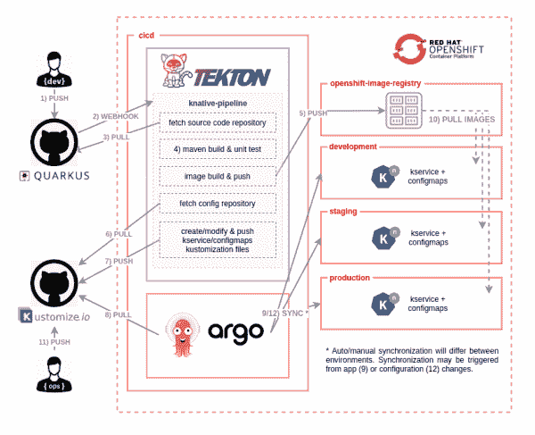
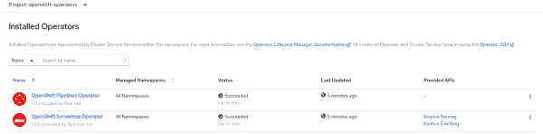
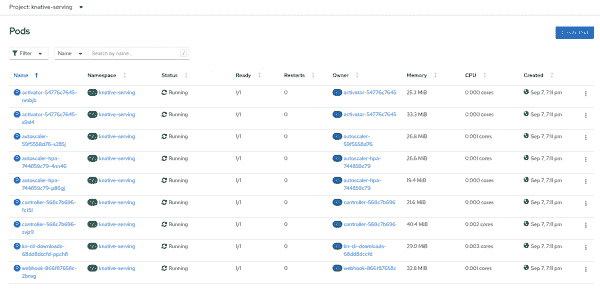
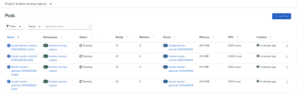
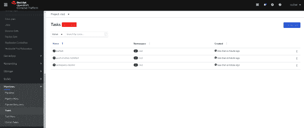
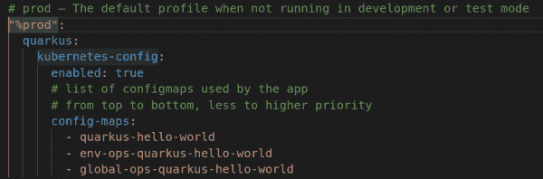
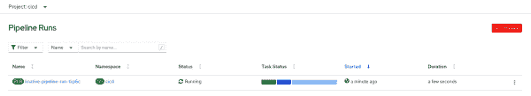
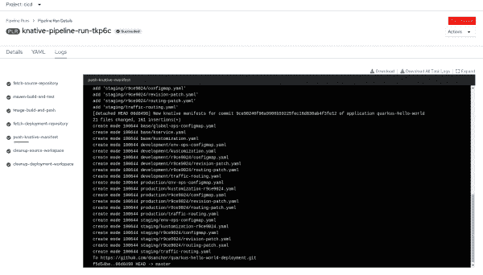
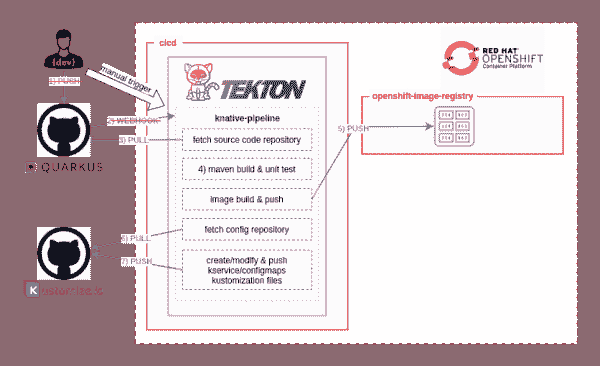

# 使用 Red Hat OpenShift 管道和 Argo CD 为无服务器应用程序构建现代 CI/CD 工作流，第 1 部分

> 原文：<https://developers.redhat.com/blog/2020/10/01/building-modern-ci-cd-workflows-for-serverless-applications-with-red-hat-openshift-pipelines-and-argo-cd-part-1>

最近的一篇文章， [*红帽 OpenShift*](https://developers.redhat.com/blog/2020/09/03/the-present-and-future-of-ci-cd-with-gitops-on-red-hat-openshift/) 上的 CI/CD 与 GitOps 的现在和未来，提出了 [Tekton](https://developers.redhat.com/blog/2020/08/14/introduction-to-cloud-native-ci-cd-with-tekton-kubecon-europe-2020/) 作为云原生 CI/CD 管道的框架，Argo CD 作为其 GitOps 的完美合作伙伴。 [GitOps](https://developers.redhat.com/devnation/tech-talks/gitops/watch) 实践支持混合、多集群 [Kubernetes](https://developers.redhat.com/topics/kubernetes) 环境中的连续交付。

在这篇由两部分组成的文章中，我们将构建一个 CI/CD 工作流，展示结合 Tekton 和 GitOps 的潜力。还将向您介绍 [Red Hat OpenShift 无服务器](https://developers.redhat.com/topics/serverless-architecture)，因为我们将在 CI/CD 工作流程中使用 [Knative](https://knative.dev/) 服务资源。让我们从概述我们将在演示中实施的 CI/CD 工作流开始。

## CI/CD 工作流

图 1 中的图表说明了 CI/CD 工作流。在应用的源代码存储库中发起的提交触发了一个完整的 CI/CD 过程，该过程以部署在开发、试运行和生产环境中的无服务器应用的新版本结束，如图 1 所示。

[](/sites/default/files/blog/2020/09/cicd-knative.png)

Figure 1: The sample CI/CD workflow for the demonstration.

让我们更仔细地看看工作流程中的每个步骤:

1.  开发人员在应用程序的源代码库中推出新的变更。
2.  在源代码存储库中配置的 webhook(这里是 GitHub)触发了 [Tekton 管道](https://github.com/tektoncd/pipeline)。
3.  一旦管道启动，第一个任务就是从存储库中获取源代码。
4.  Maven 任务将应用程序代码打包成 JAR 文件，并在构建容器映像之前运行单元测试。
5.  一个 [buildah](https://buildah.io/) 任务构建容器映像并将其推送到注册中心。然后，图像被推送到 OpenShift 内部注册表。
6.  管道获取存储库，该存储库保存示例应用程序的配置和部署描述符的期望状态。在 GitOps 方法中，我们使用 Git 存储库作为部署内容和部署位置的唯一来源。
7.  最初，Git 存储库可能是空的，所以这个任务足够智能，可以用第一次运行应用程序所需的所有 Kubernetes 清单(在本例中是 [Knative](https://knative.dev/) 服务和`ConfigMaps`)来初始化存储库。后续的存储库提交将只使用新的应用程序版本、canary 测试的独立路径和相关配置来更新现有的描述符。一旦创建或修改了所有清单文件，该任务就会将更改推送到存储库中。这一步是由 [Tekton 管道](https://github.com/tektoncd/pipeline)执行的持续集成和由 [Argo CD](https://argoproj.github.io/argo-cd/) 管理的持续部署之间的粘合剂。
8.  Argo CD 从配置库中提取并同步现有的 Kubernetes 清单，这些清单是使用 [Kustomize](https://kustomize.io/) 文件指定的。这个操作在`development`、`staging`和`production`名称空间中创建最终的 Kubernetes 对象。根据目标命名空间的要求，同步可以是自动的，也可以是手动的。
9.  在工作流的最后一部分，可能需要从 OpenShift 内部注册表中提取部署 Kubernetes 清单中引用的图像。运营团队也可能会推动配置更改，例如，更改目标微服务的 URL 或开发团队未知的某些信息。这最后一步还可以在 [Argo CD](https://argoproj.github.io/argo-cd/) 中创建一个`OutOfSync`状态，这将导致一个新的同步过程(参见图 1 中的步骤 9)。

接下来，我们将使用我们需要的 OpenShift 操作符和服务来设置我们的集群。

## 配置 OpenShift 集群

我们将使用一组脚本来配置和安装本次演示所需的所有组件。要开始设置演示环境，请克隆以下源代码库:

```
$ git clone https://github.com/dsanchor/rh-developers-cicd.git

```

接下来，确保您的系统中安装了以下所有工具。当您运行脚本时，您将需要预先安装这些程序:

*   [掌舵](https://helm.sh/docs/intro/install/) : `helm *version*`
*   [去](https://git-scm.com/book/en/v2/Getting-Started-Installing-Git)去`git *version*`
*   [oc](https://docs.openshift.com/container-platform/4.5/cli_reference/openshift_cli/getting-started-cli.html) : `oc *version*`
*   [kustomize](https://kubernetes-sigs.github.io/kustomize/installation/) v 3.1.0 或更高版本:`customize *version*`
*   envsubst (gettext): `envsubst --help`
*   [tkn](https://github.com/tektoncd/cli) (可选 Tekton CLI): `tkn *version*`

检查完上述要求后，作为集群管理员用户登录到 OpenShift 集群:

```
$ oc login -u *USERNAME* -p *PASSWORD* https://api.*YOUR_CLUSTER_DOMAIN*:6443

```

### 运算符、命名空间和角色绑定

最初，我们将在`openshift-operators`名称空间中安装 [OpenShift 管道](https://docs.openshift.com/container-platform/4.5/pipelines/installing-pipelines.html)和 [OpenShift 无服务器](https://docs.openshift.com/container-platform/4.5/serverless/installing_serverless/installing-openshift-serverless.html)操作符。

我们还将创建四个新的名称空间:`cicd`、`development`、`staging`和`production`。图像在`cicd`名称空间的边界内被推送，因此所有其他名称空间都需要`system:image-puller`特权来拉取新图像。

最后，我们将为默认服务帐户`development`、`staging`和`production`添加一个新的`view`角色。这个角色提供从我们的 [Quarkus](https://developers.redhat.com/products/quarkus/getting-started) 应用程序盒到`ConfigMaps`和`Secrets`的访问。(稍后我会介绍 Quarkus 应用程序。)

下面是脚本，它基本上使用了三个舵图来进行所需的安装:

```
$ ./bootstrap.sh
---------------
Installing openshift-pipelines operator
Release "openshift-pipelines" does not exist. Installing it now.
NAME: openshift-pipelines
LAST DEPLOYED: Thu Sep 10 10:55:14 2020
NAMESPACE: default
STATUS: deployed
REVISION: 1
TEST SUITE: None

Installing openshift-serverless
Release "openshift-serverless" does not exist. Installing it now.
NAME: openshift-serverless
LAST DEPLOYED: Thu Sep 10 10:55:16 2020
NAMESPACE: default
STATUS: deployed
REVISION: 1
TEST SUITE: None

Creating cicd, development, staging and production namespaces
Added cicd system:image-puller role to default sa in development, staging and production namespaces
Added view role to default sa in development, staging and production namespaces
Release "bootstrap-projects" does not exist. Installing it now.
NAME: bootstrap-projects
LAST DEPLOYED: Thu Sep 10 10:55:18 2020
NAMESPACE: default
STATUS: deployed
REVISION: 1
TEST SUITE: None

```

您可以按原样执行脚本，或者独立使用舵图表，覆盖您希望的任何值。例如，您可以覆盖每个 OpenShift 操作符的通道订阅值。

图 2 显示了到目前为止的安装情况，两个操作符都安装在`openshift-operators`名称空间下。

[](/sites/default/files/blog/2020/09/installed-openshift-operators.png)

Figure 2: The OpenShift Serverless and OpenShift Pipelines Operators installed under openshift-operators.

验证 OpenShift 管道运算符是否安装在版本 1.1.1 或更高版本中。

接下来，我们将通过安装[被动服务](https://knative.dev/docs/serving/)控制平面来完成 OpenShift 无服务器组件的安装。

### 安装一个已知的服务实例

我们需要创建一个 [Knative Serving](https://docs.openshift.com/container-platform/4.5/serverless/installing_serverless/installing-knative-serving.html#installing-knative-serving) 实例，它将为我们的应用程序提供一组无服务器功能。运行以下命令创建 Knative 服务实例并安装控制平面:

```
$ ./add-knative-serving.sh
------------------------------
Creating knative-serving namespace
namespace/knative-serving created
Installing basic knative serving control plane
knativeserving.operator.knative.dev/knative-serving created

```

我们已经在`knative-serving`名称空间中部署了一组代表基本 Knative 服务控制平面的 pod，如图 3 所示。

[](/sites/default/files/blog/2020/09/knative-serving-ns-1.png)

Figure 3: The Knative Serving control plane in the knative-serving namespace.

如图 4 所示，我们还为 Knative 安装的入口网关创建了一个新的名称空间`knative-serving-ingress`。

[](/sites/default/files/blog/2020/09/knative-serving-ingress.png)

Figure 4: The new knative-serving-ingress namespace.

我们已经安装了 OpenShift 操作符，并创建了名称空间和 Knative 服务实例来管理我们的无服务器工作负载。我们现在准备创建运行持续集成管道所需的 [Tekton](https://github.com/tektoncd/pipeline) 资源。

## 配置 Tekton 任务和管道

当您安装 OpenShift Pipelines 操作符时，它附带了一组现成的集群任务，您可以使用这些任务来构建您的管道。在某些情况下，您将需要其他任务来执行特定的功能。您可以在 Tekton 中轻松创建这些任务。您还可以在 [Tekton Hub](https://hub-preview.tekton.dev/) 中搜索可重用的任务和可以使用的管道。

对于我们的管道，我们将使用来自 Tekton Hub 的一个任务和两个定制任务。为了使这些任务对我们的管道可用，我们需要在`cicd`名称空间中创建它们。(注意，如果您认为您将在不同名称空间的不同管道中重用它们，您可以创建`ClusterTask`。)运行以下脚本来安装所需的任务，并在相同的名称空间中创建管道。

```
$ ./add-tekton-customs.sh cicd
------------------------------
Installing buildah task from https://hub-preview.tekton.dev/
task.tekton.dev/buildah created
Installing custom tasks
task.tekton.dev/push-knative-manifest created
task.tekton.dev/workspace-cleaner created
Installing knative-pipeline
pipeline.tekton.dev/knative-pipeline created

```

导航到 OpenShift 控制台，打开**管道**菜单和项目 **cicd** 。您将发现您的新任务，如图 5 所示。

[](/sites/default/files/blog/2020/09/tasks.png)

Figure 5: New Tekton tasks in the cicd namespace.

图 6 显示了相同名称空间中的新管道。

[](/sites/default/files/blog/2020/09/pipeline.png)

Figure 6: The Tekton pipeline in the cicd namespace.

### Tekton 工作区

我们管道中的一些任务需要从`ConfigMap`加载某些配置，或者存储结果执行的状态，以便与其他任务共享。例如，Maven 任务要求我们在一个`ConfigMap`中包含一个特定的`settings.xml`。另一方面，第一个任务获取应用程序的源代码库。接下来的 Maven 任务将需要这些文件来构建应用程序 JAR。我们使用 OpenShift [持久卷](https://docs.openshift.com/container-platform/4.5/storage/understanding-persistent-storage.html#persistent-volumes_understanding-persistent-storage)来共享这些源文件。

Tekton 为这些目的提供了[工作空间](https://github.com/tektoncd/pipeline/blob/master/docs/workspaces.md#workspaces)的概念。运行以下脚本，将一组`ConfigMap`和一个`PersistentVolumeClaim`添加到`cicd`名称空间:

```
$ ./add-tekton-workspaces.sh cicd
-----------------------------------
Creating knative-kustomize-base ConfigMap with base kustomize files for Knative services
configmap/knative-kustomize-base created
Creating knative-kustomize-environment ConfigMap with environment dependent kustomize files
configmap/knative-kustomize-environment created
Creating maven ConfigMap with settings.xml
configmap/maven created
Creating PVC using default storage class
persistentvolumeclaim/source-pvc created

```

请注意，该脚本创建了一个没有定义[存储类](https://docs.openshift.com/container-platform/4.5/storage/understanding-persistent-storage.html#pvc-storage-class_understanding-persistent-storage)的 [PersistentVolumeClaim](https://docs.openshift.com/container-platform/4.5/storage/understanding-persistent-storage.html#pvc-storage-class_understanding-persistent-storage) 。除非您选择指定一个，否则将使用默认的`StorageClass`。请随意取消所提供脚本中的任何行的注释，以满足您的需要。

## 演示应用程序

到目前为止，我对演示应用程序几乎只字未提。该应用程序基于 [Quarkus](https://quarkus.io/get-started/) ，由于其快速启动时间和低内存消耗，它是无服务器应用程序的完美匹配。应用程序本身是一个简单的“Hello，world”REST API，当点击`/hello` URI 时，它会向用户打招呼。

该应用程序使用 [kubernetes-config](https://quarkus.io/guides/kubernetes-config) 扩展来促进 kubernetes 中`ConfigMap` s 和`Secrets`的消费。“Hello，world”应用程序读取一个`ConfigMap`列表，这让我们有机会管理不同级别的配置，覆盖重复的属性。

图 7 显示了定义了`ConfigMap`列表的 [application.yaml](https://github.com/dsanchor/quarkus-hello-world/blob/c076ee940b1f1d9576b7af3250bbbd7114e82263/src/main/resources/application.yaml#L18) 的摘录

[](/sites/default/files/blog/2020/09/configmap-list-vsc.png)

Figure 7: Application YAML with the list of ConfigMaps.

您可以在本文的 [GitHub 资源库中找到完整的应用程序源代码。请注意，管道还初始化并持续更新不同的存储库，该存储库以声明的方式包含我们的应用程序部署和配置的所有 Kubernetes 清单。在本文的后面，我们将使用](https://github.com/dsanchor/quarkus-hello-world.git) [Kustomize](https://kustomize.io/) 来声明性地定制应用程序配置和部署。

## 创建自己的存储库

在这个阶段，您必须[创建一个 GitHub 存储库](https://docs.github.com/en/github/getting-started-with-github/create-a-repo)，您将使用它来存储演示所需的定制文件。我的存储库被命名为`quarkus-hello-world-deployment`，我将在接下来的脚本中使用这个名称来引用存储库。您可以为存储库使用相同或不同的名称。

GitHub 已经将默认名称改为`main`，如图 8 所示。

[](/sites/default/files/blog/2020/10/default-branch-main.png)Figure 8:

Figure 8: Main is set as the default branch.

请确保通过更改默认设置或手动创建新分支来创建主分支。创建并命名存储库之后，将其保留为空并进行初始化。

为了允许 Tekton 管道将更改推送到新的存储库中，您必须提供一组有效的 GitHub 凭证。您将把凭证存储在一个`Secret`中，并将它们链接到`ServiceAccount`管道，该管道是在`cicd`名称空间中自动创建的。

执行以下脚本:

```
$ ./add-github-credentials.sh cicd YOUR_GITHUB_USER YOUR_GITHUB_PASSWORD
---------------------------------------------------------------------------
Creating secret with github credentials for user dsanchor
secret/github-credentials created
Linking pipeline sa in namespace cicd with your github credentials
serviceaccount/pipeline patched

```

## 手动管道运行

我们现在准备手动测试管道的执行，并查看结果。管道工作流包括自动触发管道的 webhook 设置。我们将把这一部分留到本文的最后(在第 2 部分)；现在，我们将通过手动触发管道来测试工作流。

我提供了两个选项来手动触发管道:

*   从 YAML 文件创建管线运行。
*   使用 [Tekton CLI: tkn](https://github.com/tektoncd/cli) 启动管道。

在这两种情况下，我们都将使用应用程序存储库中给定的`commit`。此外，我们需要提供存储库来保存我们所有的配置和部署清单。在下面的脚本中，[我引用了我的部署存储库](https://github.com/dsanchor/quarkus-hello-world-deployment.git)——您应该用您的存储库的名称替换这个引用。准备就绪后，执行以下操作:

```
$ cat tekton/pipelines/knative-pipeline-run.yaml | \
  SOURCE_REPO=https://github.com/dsanchor/quarkus-hello-world.git \
  COMMIT=9ce90240f96a9906b59225fec16d830ab4f3fe12 \
  SHORT_COMMIT=9ce9024 \
  DEPLOYMENT_REPO=https://github.com/dsanchor/quarkus-hello-world-deployment.git \
  IMAGES_NS=cicd envsubst | \
  oc create -f - -n cicd
------------------------------------------------------------------------------------------
pipelinerun.tekton.dev/knative-pipeline-run-54kpq created

```

如果您愿意，可以使用 *tkn* CLI 启动管道:

```
$ tkn pipeline start knative-pipeline -p application=quarkus-hello-world \
  -p source-repo-url=https://github.com/dsanchor/quarkus-hello-world.git \
  -p source-revision=9ce90240f96a9906b59225fec16d830ab4f3fe12 \
  -p short-source-revision=9ce9024 \
  -p deployment-repo-url=https://github.com/dsanchor/quarkus-hello-world-deployment.git \
  -p deployment-revision=master \
  -p dockerfile=./src/main/docker/Dockerfile.jvm \
  -p image-registry=image-registry.openshift-image-registry.svc.cluster.local:5000 \
  -p image-repository=cicd \
  -w name=source,claimName=source-pvc \
  -w name=maven-settings,config=maven \
  -w name=knative-kustomize-base,config=knative-kustomize-base \
  -w name=knative-kustomize-environment,config=knative-kustomize-environment \
  -n cicd

```

另一种选择是从 OpenShift 控制台触发管道。

### 监控管道的执行

要检查执行进度，请访问 OpenShift 控制台中的**管道运行**仪表板，如图 9 所示。

[](/sites/default/files/blog/2020/09/prun.png)

Figure 9: Use the Pipeline Runs dashboard to check the execution progress.

如果要查看每个管道任务的所有详细信息，请单击管道运行的名称。您将获得每个任务的日志，如图 10 所示:

[](/sites/default/files/blog/2020/09/prun-detail.png)

Figure 10: View the logs for each pipeline task.

如果您使用完全相同的参数触发管道两次(例如，使用我提供的两个示例)，您将会看到第二次运行在推送 *Kustomization* 清单时失败。失败的发生是因为没有新的东西可以提交——太棒了！

### 管道执行的结果

图 11 中的图表显示了我们到目前为止所取得的成就:

[](/sites/default/files/blog/2020/09/ci-manual-knative-2.png)Figure 10: The CI/CD workflow in progress.

Figure 11: The CI/CD workflow in progress.

请注意，我们用基于给定提交 ID 的手动管道触发器替换了与“Push code”和“repository webhook”相关的步骤。

此时，我们已经向 OpenShift 内部注册表推送了一个新的映像。我们还初始化了包含所有配置和部署清单的存储库，以及运行我们的无服务器应用程序的第一个版本所需的所有 Kubernetes 清单。

## 查看部署存储库结构

现在是回顾部署存储库的结构以及我们将使用 [Kustomize](https://kustomize.io/) 生成的最终清单的好时机。如果您不熟悉 Kustomize 及其功能，请随意了解更多信息。理解 Kustomize 可以帮助您更好地理解存储库的结构。

更新您的部署存储库(`git pull`)，您应该会看到类似如下的输出:

```
├── base
│   ├── global-ops-configmap.yaml
│   ├── kservice.yaml
│   └── kustomization.yaml
├── development
│   ├── env-ops-configmap.yaml
│   ├── kustomization.yaml
│   ├── r9ce9024
│   │   ├── configmap.yaml
│   │   ├── revision-patch.yaml
│   │   └── routing-patch.yaml
│   └── traffic-routing.yaml
├── production
│   ├── env-ops-configmap.yaml
│   ├── kustomization-r9ce9024.yaml
│   ├── r9ce9024
│   │   ├── configmap.yaml
│   │   ├── revision-patch.yaml
│   │   └── routing-patch.yaml
│   └── traffic-routing.yaml
├── README.md
└── staging
├── env-ops-configmap.yaml
├── kustomization-r9ce9024.yaml
├── r9ce9024
│   ├── configmap.yaml
│   ├── revision-patch.yaml
│   └── routing-patch.yaml
└── traffic-routing.yaml

```

为简单起见，我现在只关注`base`和`development`文件夹:

*   `base`文件夹包含三个环境之间的所有共享资源。它拥有一个[服务](https://knative.dev/docs/serving/spec/knative-api-specification-1.0/#service)和一个全局配置图的基本结构。
*   `development`文件夹包含用于完成给定应用程序版本的[服务](https://knative.dev/docs/serving/spec/knative-api-specification-1.0/#service)清单生成的覆盖图(一个例子是`r9ce9024`文件夹)和两个与环境和开发人员配置级别或所有权相关的配置映射。revision 文件夹下的那个是从应用程序源代码中复制的，允许开发人员为应用程序提供一组配置属性。

我们正在利用 Knative 服务的简单性，为每个[服务版本](https://knative.dev/docs/serving/spec/knative-api-specification-1.0/#revision)定义独立的[路线](https://knative.dev/docs/serving/spec/knative-api-specification-1.0/#route)，并在版本之间[分流流量。因此，`traffic-routing.yaml`和`routing-patch.yaml`形成了一个 Knative 服务的最终流量路由段。](https://knative.dev/docs/serving/samples/traffic-splitting/)

每次新版本在`development`中可用时，都会为其创建一个独立的路径，以确保其可用于测试。主要路线保持不变(例如，以之前的两个版本为目标)。我们通过不从管道中自动修改主`traffic-routing.yaml`，而是只为新版本添加新路线(`routing-patch.yaml`)来实现这一行为。

当我们在第 2 部分中运行额外的测试时，这些细节将更容易理解。现在，只需注意一下`staging`和`production`名称空间与`development`之间的一个显著区别:CI 管道不会为它们创建一个`kustomization.yaml`文件(使用那个确切的名称)。总会有一个带有附加修订前缀的前缀:`kustomization-r9ce9024.yaml`。除非在`kustomization.yaml`中引用该新版本，否则在同步过程中不会考虑这些更改。需要手动操作才能使 Kustomize 看到这些更改。

**注意**:文件名的不同是为了区分演示:我希望这两个环境有不同的行为，这样它们就需要有人来批准更改。重命名文件是一种简单的批准方法，不会使演示过于复杂。我更喜欢为每个新版本创建一个不同的分支，然后在它准备好升级时生成一个拉请求。

## 把所有的碎片放在一起

我们已经查看了部署存储库的内容和结构，但是我们仍然没有 Knative 服务和`ConfigMap`的最终组合。以下脚本使用`kustomize`来构建最终清单，以便我们可以看到它们的样子:

```
$ kustomize build development
------------------------------
apiVersion: v1
kind: ConfigMap
metadata:
  name: env-ops-quarkus-hello-world
---
apiVersion: v1
kind: ConfigMap
metadata:
  name: global-ops-quarkus-hello-world
---
apiVersion: v1
data:
  application.yaml: |-
    message: hola
    environment:
      name: dev
kind: ConfigMap
metadata:
  name: quarkus-hello-world
---
apiVersion: serving.knative.dev/v1
kind: Service
metadata:
  name: quarkus-hello-world
spec:
  template:
    metadata:
      name: quarkus-hello-world-r9ce9024
    spec:
      containers:
      - image: image-registry.openshift-image-registry.svc.cluster.local:5000/cicd/quarkus-hello-world:9ce90240f96a9906b59225fec16d830ab4f3fe12
        livenessProbe:
          httpGet:
            path: /health/live
        readinessProbe:
          httpGet:
            path: /health/ready
  traffic:
  - percent: 100
    revisionName: quarkus-hello-world-r9ce9024
  - revisionName: quarkus-hello-world-r9ce9024
    tag: r9ce9024

```

## 第一部分的结论

此时，我们可以将我们的对象集应用到`development`名称空间中，以运行一个无服务器应用程序，但是我们不想手动执行部署步骤。在本文的后半部分，我将向您展示如何将 [Argo CD](https://argoproj.github.io/argo-cd/) 集成到我们目前开发的 CI/CD 管道中。

*Last updated: November 11, 2020*