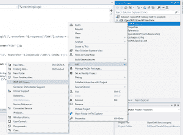
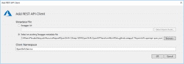
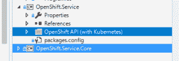
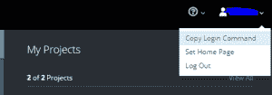

# 如何从 C#调用 OpenShift REST API

> 原文：<https://developers.redhat.com/blog/2018/07/17/calling-the-openshift-rest-api-from-your-c-code>

当您想要使用 Red Hat OpenShift 执行构建和部署的自动化任务时，您可能想要利用 [OpenShift REST API](https://docs.openshift.com/container-platform/3.9/rest_api/index.html) 。在脚本中，你可以使用与 REST APIs 对话的 CLI 命令。然而，有时直接从 C#代码中执行此操作更方便，而不必调用外部程序。这就是拥有一个基础设施平台的价值，该平台通过开放 API 作为服务公开。

如果您想从 C#代码中调用 API，您必须创建一个请求对象，调用 API，并解析响应对象。上游项目 OpenShift Origin 提供了 Swagger 2.0 规范，您可以为每种编程语言生成一个客户端库。当然支持 C#。这并不是一种新方法，Kubernetes 有一个由 Swagger Codegen 生成的知识库。

对于 C#，我们可以使用 Microsoft Visual Studio 为 REST API 生成一个 C#客户端库。在本文中，我将带您完成从定义生成库的过程。

Visual Studio 可以直接接受 Swagger 2.0 定义，但是 OpenShift Swagger 2.0 API 定义在生成 C#库时有一些问题。然而，在 Kubernetes 中，一些转换是使用 JSONPath 定义的，参见 [GitHub repo](https://github.com/kubernetes-client/gen/blob/master/openapi/csharp.xml#L45-L50) 。

在这些转换之后，我编写了一些 C#代码来将所需的转换应用到原始定义中。如果您想为自己的项目生成代码，请随意使用我的项目来转换定义文件。然后，您可以从生成的定义文件中生成 C#代码。

现在，在 Visual Studio 中准备占位符项目。项目框架应该是。NET Framework 而不是。网芯。看来这只是明面上的一个极限。您可以稍后创建一个. NET 核心(`netstandard`或`netcoreapp`)客户端库。创建一个. NET Framework 项目后，右键单击项目中的 **REST API 客户端**上下文菜单，选择**添加**。



然后为生成的定义文件指定文件路径。



如果您想将客户端库与。请创建一个占位符项目。我用的是. NET 核心类库项目。然后，修改`csproj`文件，如下所示，为`Microsoft.Rest.ClientRuntime`添加一个包引用。

```
<Project Sdk="Microsoft.NET.Sdk">

   <PropertyGroup>
     <TargetFrameworks>netstandard2.0</TargetFrameworks>
   </PropertyGroup>

   <ItemGroup>
     <PackageReference Include="Microsoft.Rest.ClientRuntime" Version="2.3.11" />
   </ItemGroup>

</Project>

```

然后简单地复制并粘贴包含生成代码的文件夹。



我为这个生成的项目发布了 [NuGet 包](https://www.nuget.org/packages/OpenShift.Service.Core/3.9.0-sdk-rc1)。由于该项目没有在搜索结果中列出，请指定全名`OpenShift.Service.Core`以将包引用添加到您自己的 C#项目中。您还必须添加`Microsoft.Rest.ClientRuntime`包引用。

现在可以编写 C#代码来调用 OpenShift REST API 了。下面是一个调用 GET pod REST API 的简单示例。

```
//if your master URL has an invalid SSL, please add a custom validation callback.
var handler = new HttpClientHandler
{
    ServerCertificateCustomValidationCallback = HttpClientHandler.DangerousAcceptAnyServerCertificateValidator
};
//replace the acutual OpenShift master host name and your token to log in.
var client = new OpenShiftAPIwithKubernetes(new Uri("https://:8443/"), new TokenCredentials(""), handler);
var pods = await client.ListCoreV1NamespacedPodAsync("");
foreach (var pod in pods.Items)
{
    Console.WriteLine(pod.Metadata.Name + "=" + pod.Status.Phase);
}

```

要获取用于测试目的的令牌，请登录到 OpenShift web 控制台，并从右上角(用户图标右侧)的上下文菜单中选择**复制登录命令**。



粘贴的命令具有以下格式。使用`master_host`值和令牌值。请注意，此令牌将过期。我们建议将[服务账户](https://docs.openshift.com/container-platform/3.9/dev_guide/service_accounts.html)用于生产目的。

```
oc login https://<master_host>:8443 --token=<token>

```

享受编写代码来使用 OpenShift REST API 的乐趣。如果您发现任何问题，请将反馈发送到[我的存储库](https://github.com/tanaka-takayoshi/OpenShift-CSharp-SDK/tree/master)。

*Last updated: February 25, 2022*