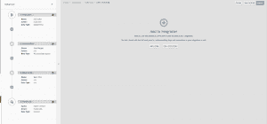
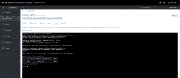
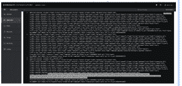
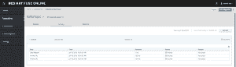
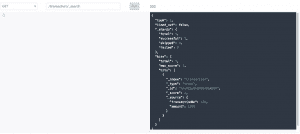

# 疾控中心管道与红帽 AMQ 溪流和红帽保险丝

> 原文：<https://developers.redhat.com/blog/2019/09/03/cdc-pipeline-with-red-hat-amq-streams-and-red-hat-fuse>

变更数据捕获(CDC)是一种模式，它使数据库变更能够被监控并传播到下游系统。这是实现可靠的微服务集成和解决典型挑战的有效方式，例如从现有的单片中逐步提取微服务。

随着[红帽 AMQ 流](https://developers.redhat.com/blog/2019/07/04/announcing-red-hat-amq-streams-1-2-with-apache-kafka-2-2-support/) 1.2 的发布，[红帽集成](https://www.redhat.com/en/products/integration?extIdCarryOver=true&intcmp=701f2000001OMHaAAO&sc_cid=701f2000000RtqCAAS)现在包括了基于上游项目 [Debezium](https://debezium.io/docs/amq-streams/) 的 CDC 特性的开发者预览版。

本文解释了如何利用 Red Hat 集成来创建完整的 CDC 管道。这个想法是让应用程序能够在数据发生变化时立即做出响应。我们使用 Debezium 捕捉发生的变化，并使用红帽 AMQ 流进行流式处理。然后，我们使用 [Red Hat Fuse](https://developers.redhat.com/products/fuse/overview) 过滤和转换数据，并将其发送到 Elasticsearch，在那里数据可以被下游系统进一步分析或使用。


## 架构概述

在这个例子中，当交易数据来自我们的购物网站时，它被持久化到一个交易数据库(MySQL DB)中，然后 Debezium 捕获数据变化并将其发送到带有表名的 AMQ 流主题(在我们的例子中是 transaction)。然后，我们使用 Red Hat Fuse 读取 [Apache Kafka](https://www.redhat.com/en/topics/integration/what-is-apache-kafka?extIdCarryOver=true&intcmp=701f2000001OMHaAAO&sc_cid=701f2000000RtqCAAS) 主题并过滤大型交易(交易> 1000)并将其发送到 Elasticsearch，在那里数据可以被下游系统使用/分析。Fuse Online 是一个集成平台即服务(iPaaS)解决方案，使业务用户能够轻松地与集成专家和应用程序开发人员协作。

## 准备演示环境

让我们在 [Red Hat OpenShift](https://developers.redhat.com/products/openshift/overview) 上安装本演示所需的组件，它支持高效的容器编排，允许快速的容器供应、部署、扩展和管理。OpenShift 上的 Red Hat 集成有助于我们轻松快速地创建和管理网络规模的云原生应用。

OpenShift 容器平台 CLI 公开了用于管理您的应用程序的命令，以及用于与您的系统的每个组件进行交互的低级工具。我们将利用 OC 工具来创建/部署项目和应用程序。首先，我们将创建一个新项目并提供一个 MySQL 数据库。

```
$oc new-project debezium-cdc
$oc new-app --name=mysql debezium/example-mysql:0.9 
                        -e MYSQL_ROOT_PASSWORD=password 
                        -e MYSQL_USER=testUser 
                        -e MYSQL_PASSWORD=password 
                        -e MYSQL_DATABASE=sampledb

```

我们还将为购物网站创建一个交易数据库。

```
$oc get pods
$oc rsh <pod_name>
$mysql -u root -ppassword -h mysql sampledb

mysql> CREATE TABLE transaction (transaction_id serial PRIMARY KEY,userId integer NOT NULL,
amount integer NOT NULL,last_login TIMESTAMP);

```

按照[红帽 AMQ 流文档](https://access.redhat.com/documentation/en-us/red_hat_amq/7.3/html/using_amq_streams_on_openshift_container_platform/getting-started-str#downloads-str)使用 AMQ 流操作器提供红帽 AMQ 流。接下来，我们将部署 [Kafka Connect s2i](https://access.redhat.com/documentation/en-us/red_hat_amq/7.3/html/using_amq_streams_on_openshift_container_platform/getting-started-str#using-kafka-connect-with-plug-ins-str) 。接下来，从 [Debezium 网站](https://debezium.io/docs/amq-streams/)下载必要的 MySQL 驱动程序以及 Debezium MySQL 连接器。确保将驱动程序复制到连接器文件夹中。

现在，我们可以用已经下载的 MySQL Debezium 连接器配置 Kafka connect 实用程序。

```
$oc get buildconfigs
$oc start-build <build-config-name> --from-dir=<connector_dir>

```

现在，我们将使用 POST 命令来配置带有 MySQL DB 配置的 Debezium 连接器。

```
PUT <kafka-connect-pod-route-url>/connectors/debezium-connector-mysql/config

{
    "connector.class": "io.debezium.connector.mysql.MySqlConnector",
    "tasks.max": "1",
    "database.hostname": "mysql", → *Database host name* 
    "database.port": "3306", → *Port*
    "database.user": "root", → *Username*
    "database.password": "password", → *Password*
    "database.server.id": "184054",
    "database.server.name": "sampledb", → *Database name*
    "database.whitelist": "sampledb",
    "database.history.kafka.bootstrap.servers": "my-cluster-kafka-bootstrap.svc:9092", → *Kafka cluster url*
    "database.history.kafka.topic": "changes-topic",
    "decimal.handling.mode" : "double",
    "transforms": "route",
    "transforms.route.type": "org.apache.kafka.connect.transforms.RegexRouter",
    "transforms.route.regex": "([^.]+)\\.([^.]+)\\.([^.]+)",
    "transforms.route.replacement": "$3"
}

```

接下来，我们将在线旋转红帽保险丝。 [按照文档](https://access.redhat.com/documentation/en-us/red_hat_fuse/7.3/html/integrating_applications_with_fuse_online/fuse-online-on-ocp_ug) 在 OpenShift 实例上在线安装 Fuse。 一旦连接器被设置，我们就可以创建集成了。

集成是一个四步流程，从 Kafka 主题中读取数据，映射、过滤模式，并写入到 Elasticsearch 端点。



我们现在需要一个 Elasticsearch 实例，它可以在 OC 上公开托管/安装。创建一个名为 transaction 的索引，我们将从我们的 Fuse Online Integration 推送到这个索引。

最后，让我们部署一个电子购物 web 应用程序。为此，我们将使用 [Quarkus](https://developers.redhat.com/blog/2019/03/07/quarkus-next-generation-kubernetes-native-java-framework/) (超音速亚原子 Java)来构建一个简单的 CRUD UI。Quarkus 为在这个无服务器、微服务、容器、Kubernetes、FaaS 和云的新世界中运行 Java 提供了一个有效的解决方案，因为它在设计时就考虑了这些技术。

```
oc new-app quay.io/quarkus/ubi-quarkus-native-s2i:19.0.2~https://github.com/snandakumar87/quarkus-transaction-crud
oc cancel-build bc/quarkus-transaction-crud
oc patch bc/quarkus-transaction-crud -p '{"spec":{"resources":{"limits":{"cpu":"5", "memory":"6Gi"}}}}'
oc start-build bc/quarkus-transaction-crud
oc expose svc/quarkus-transaction-crud
```

## 疾控中心在行动

https://youtu.be/uox8l1GtPSQ

打开 Red Hat OpenShift 控制台，进入项目(debezium-cdc)。您应该会看到列出了多个应用程序窗格。寻找“quar kus-transaction-crud”pod，并沿着外部路径登录电子购物网页。


在 Macbook Pro 上点击 buy，然后导航回 OpenShift 控制台，寻找应用程序 pod“MySQL”并导航到终端。我们现在将验证 MySQL 数据库中的交易数据。

```
oc rsh <pod_name>)
mysql -u <username> -p<password> -h mysql <databasename>
Select * from transaction;
```



现在数据已经输入到数据库中，我们可以快速查看变更数据捕获。打开卡夫卡连接舱的日志。



这种变化被捕捉并添加到我们的卡夫卡主题中。现在让我们切换到红帽保险丝在线控制台。



我们可以看到，交易已经从 Kafka 主题中读取，经过过滤，并发送到 Elasticsearch。让我们在 elastic search REST 端点上做一个简单的 GET，寻找已经从 Kafka 主题中读取的新记录。

```
GET <elastic-url>/transaction/_search
```



## 摘要

通过使用 Debezium 利用 CDC 特性的强大功能，我们可以在数据更改发生时捕获它们，现在可以对其进行流式处理，以便下游系统可以利用它。Red Hat Fuse 释放潜力[连接这些外部系统](https://developers.redhat.com/products/fuse/connectors)中的几个，从而完成数据管道。

### 参考

*   [红帽整合](https://www.redhat.com/en/products/integration?extIdCarryOver=true&sc_cid=701f20000012i69AAA)
*   [红帽引信](https://developers.redhat.com/products/fuse/overview)
*   [Debezium](https://debezium.io/docs/amq-streams/)
*   夸尔库斯