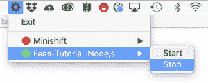

# Red Hat 容器开发工具包 3.7 现已推出

> 原文：<https://developers.redhat.com/blog/2018/12/12/cdk-3-7-now-available>

我们很高兴地宣布 [Red Hat 容器开发工具包](https://developers.redhat.com/products/cdk/overview/) (CDK) 3.7 的可用性。CDK 3.7 基于 [Minishift](https://www.okd.io/minishift/) v1.27.0，这是一个命令行工具，可以在本地机器上快速提供 [OpenShift](https://www.openshift.com/) 和 [Kubernetes](https://developers.redhat.com/topics/kubernetes/) 集群，用于开发基于云和容器的应用。CDK 还包括 OpenShift 容器平台 v3.11.14。您可以在 Windows、macOS 或 Linux 上使用 CDK。

以下是 CDK 3.7 新特性的总结:

## CDK 3.7 中的新功能

*   使用 OpenShift v3.11.14 作为默认的容器平台
*   使用本机系统钥匙串来储存密码

*   时区处理方面的改进

*   hyperkit 的虚拟机驱动程序(`--vm-driver hyperkit`)

*   使用 registry.redhat.io 处理授权和连接

*   新的系统托盘图标(技术预览)使启动/停止`minishift`和选择运行哪个配置文件变得更加容易。第一次运行`minishift`时，图标出现:

    

    在本例中，有两个配置文件，`Minishift`和`Faas-Tutorial-Nodejs`。`Faas-Tutorial-Nodejs`档案目前正在运行。

## 什么是 CDK？

CDK 基于 Red Hat Enterprise Linux，提供了一个预构建的容器开发环境，帮助您使用预配置和本地版本的 OpenShift(业界领先的 Kubernetes 发行版)快速开发[基于容器的应用程序](https://developers.redhat.com/blog/category/containers/)。您构建的容器可以轻松地部署在任何 Red Hat 容器主机或平台上，包括 RHEL、Red Hat OpenStack 平台和 OpenShift 容器平台。

## 今天就开始用容器开发吧

**[立即下载 CDK 3.7](https://developers.redhat.com/products/cdk/download/) 。更多信息请参见 [CDK 产品页面](https://developers.redhat.com/products/cdk)。**

*Last updated: September 3, 2019*