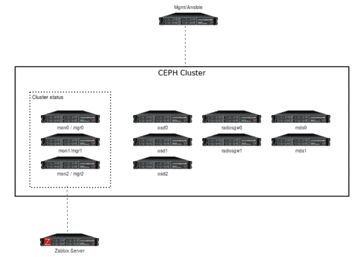
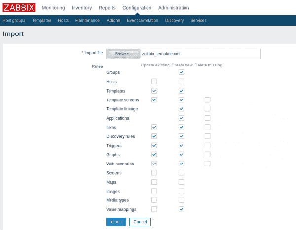
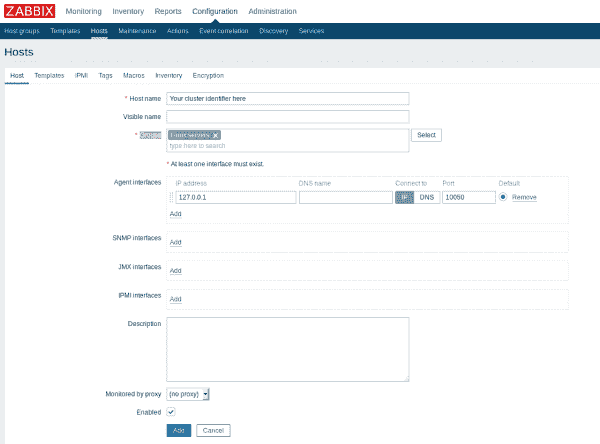
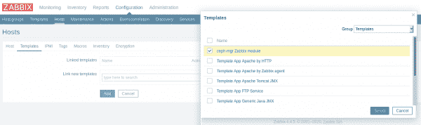

# 使用 Zabbix 监控 Ceph 存储

> 原文：<https://developers.redhat.com/blog/2020/03/23/ceph-storage-monitoring-with-zabbix>

存储价格在下降，而业务需求在增长，公司存储的数据比以往任何时候都多。按照这种增长模式，对涉及软件定义的存储的监控和数据保护的需求也在增长。停机时间成本高昂，会直接影响业务连续性，并给组织带来不可挽回的损失。后果包括资产和信息的损失；服务和运营的中断；违反法律、法规或合同；以及失去客户和损害公司声誉带来的财务影响。

> *[Gartner](https://blogs.gartner.com/andrew-lerner/2014/07/16/the-cost-of-downtime/) 估计，一分钟的停机时间会给企业造成 5600 美元的损失，一个小时的损失超过 30 万美元。*

另一方面，在 DevOps 环境中，有必要考虑*连续监控*，这是一种在整个应用程序及其组件的生命周期中进行监控的主动方法。这种方法有助于确定可能问题的根本原因，然后快速、主动地预防性能问题或未来的停机。在本文中，您将了解如何使用企业开源工具 Zabbix 实现 [Ceph](https://ceph.io/ceph-storage/) 存储监控。

## **什么是 Ceph 存储？**

Ceph storage 是一个开源的*软件定义的存储*系统，具有 Pb 级和分布式存储，主要为云工作负载而设计。传统的 NAS 或 SAN 存储解决方案通常基于昂贵的专有硬件解决方案，而软件定义的存储通常设计为在商用硬件上运行，这使得这些系统比传统存储设备更便宜。

Ceph 存储主要设计用于以下使用情形:

*   OpenStack 环境的映像和虚拟块设备存储(使用 Glance、Cinder 和 Nova)。
*   对使用标准 API 的应用程序进行基于对象的存储访问。
*   容器的持久存储。

根据 Ceph 文档，无论您是想为云平台提供对象存储还是块设备服务，部署文件系统，还是将 Ceph 用于其他目的，所有存储集群部署都是从设置节点、网络和存储集群开始的。Ceph 存储集群至少需要一个监视器(`ceph-mon`)、一个管理器(`ceph-mgr`)和一个对象存储守护进程(`ceph-osd`)。运行 Ceph 文件系统(CephFS)客户端时，还需要元数据服务器(`ceph-mds`)。这些是 Zabbix 将监控的许多组件中的一部分。要了解每个组件的功能，请阅读[产品文档](https://docs.ceph.com/docs/master/start/intro/)。

这里我们提议建立一个实验室，但是如果您计划在生产环境中这样做，您应该首先查看硬件和操作系统建议。

## 什么是 Zabbix，它能提供什么帮助？

Zabbix 是一个企业级开源分布式监控系统。它监控许多网络参数和服务器的健康和完整性。Zabbix 使用灵活的通知机制，允许用户为几乎任何事件配置基于电子邮件的警报，从而对服务器问题做出快速反应。该工具还提供基于存储数据的出色报告和数据可视化功能，因此非常适合容量规划。

它支持轮询和陷印。所有报告和统计数据以及配置参数都可以通过基于 web 的前端进行访问。这个前端确保可以从任何位置评估您的网络状态和服务器的健康状况。如果配置得当，Zabbix 可以在监控 IT 基础设施方面发挥重要作用。对于拥有少量服务器的小型组织和拥有大量服务器的大型公司来说，这一事实同样成立。我不会在这里介绍 Zabbix 的安装，但是在官方文档中有一个很棒的[指南](https://www.zabbix.com/download)和一个[视频](https://youtu.be/yYmkFf3AEBo)。

## **Ceph 管理器守护进程**

Ceph 11.x(也称为*北海巨妖*)和[红帽 Ceph 存储](https://www.redhat.com/en/technologies/storage/ceph)版本 3(也称为*夜光*)中添加了 Ceph 管理器守护程序(`ceph-mgr`)，它是正常操作所必需的，与 monitor 守护程序一起运行以提供额外的监控，并与外部监控和管理系统接口。同时，您可以创建模块和扩展管理器来提供新的特性。在这里，我们将通过一个 Zabbix Python 模块来使用这种能力，该模块负责将总体集群状态和性能导出到 Zabbix 服务器，这是一个执行监控、与 Zabbix 代理和代理交互、计算触发器和发送通知的中央进程——一个中央数据存储库。显然，您仍然可以收集关于操作系统的传统指标，但是 Zabbix Python 模块将收集关于存储指标和性能的特定信息，并将其发送到 Zabbix 服务器。

以下是一些可用指标的示例:

*   Ceph 性能，例如 I/O 操作、带宽和延迟。
*   存储利用率和概述。
*   对象存储守护程序(OSD)状态以及有多少处于运行状态。
*   监视器(mon)和 OSD 的数量。
*   池和放置组的数量。
*   总体 Ceph 状态。

## **实验室环境** 

Ceph 集群安装不在这里讨论，但是你可以在 [Ceph 文档](https://docs.ceph.com/docs/master/)中找到更多关于如何安装的信息。我的存储集群是使用 [`ceph-ansible`](https://github.com/ceph/ceph-ansible) 安装的。

使用的计算资源是具有相同配置的 12 个实例，包括两个 CPU 内核、4GB RAM 和:

*   三个监视器节点和三个管理器节点(位于同一位置)。
*   三个 OSD 节点，每个节点三个磁盘(总共九个 OSD)。
*   两个元数据服务器(MDS)节点。
*   两个 RADOS 网关节点。
*   一个可行的管理节点。
*   一个 Zabbix 服务器节点位于同一位置(Zabbix 服务器、MariaDB 服务器和 Zabbix 前端)。

请参见图 1，获得集群的拓扑结构。

[](/sites/default/files/blog/2020/03/Cephlaptopology.png)Figure 1: The Lab's cluster topology.Figure 1: The Lab's cluster topology.">

本实验室使用的软件资源包括:

*   **所有实例的*基础*操作系统:**红帽企业版 Linux 7.7
*   **集群存储节点:**红帽 Ceph 存储 4.0
*   管理和自动化: Ansible 2.8
*   **监控:** Zabbix 4.4

考虑到我的集群已经安装就绪，下面是运行状况、服务和任务状态:

```
[user@mons-0 ~]$ sudo ceph -s
  cluster:
    id:     7f528221-4110-40d7-84ff-5fbf939dd451
    health: HEALTH_OK
  services:
    mon: 3 daemons, quorum mons-1,mons-2,mons-0 (age 37m)
    mgr: mons-0(active, since 3d), standbys: mons-1, mons-2
    mds: cephfs:1 {0=mdss-0=up:active} 1 up:standby
    osd: 9 osds: 9 up (since 35m), 9 in (since 3d)
    rgw: 2 daemons active (rgws-0.rgw0, rgws-1.rgw0)
  task status:
  data:
    pools:   8 pools, 312 pgs
    objects: 248 objects, 6.1 KiB
    usage:   9.1 GiB used, 252 GiB / 261 GiB avail
    pgs:     312 active+clean

```

### **如何启用 Zabbix 仪表盘模块**

Zabbix 模块包含在`ceph-mgr`包中，您必须在启用管理器服务的情况下部署 Ceph 集群。要在一个`ceph-mgr`节点中用一个命令启用 Zabbix 模块，请使用以下命令:

```
[user@mons-0 ~]$ sudo ceph mgr module enable zabbix
```

您可以通过以下命令检查 Zabbix 模块是否已启用:

```
[user@mons-0 ~]$ sudo ceph mgr module ls | head -5
{
"enabled_modules": [
"dashboard",
"prometheus",
"zabbix"

```

### **从 Ceph 集群向 Zabbix 发送数据**

这个解决方案使用 Zabbix sender 实用程序，这是一个命令行工具，可以将性能数据发送到 Zabbix 服务器进行处理。该实用程序通常在长期运行的用户脚本中使用，用于定期发送可用性和性能数据。它可以使用包管理器安装在大多数发行版上。你应该在*所有运行`ceph-mgr`的*机器上安装`zabbix_sender`可执行文件，以获得高可用性*。*

让我们启用 Zabbix 存储库并在所有 Ceph 管理器节点中安装`zabbix_sender`:

```
[user@mons-0 ~]$ sudo rpm -Uvh https://repo.zabbix.com/zabbix/4.4/rhel/7/x86_64/zabbix-release-4.4-1.el7.noarch.rpm
[user@mons-0 ~]$ sudo yum clean all
[user@mons-0 ~]$ sudo yum install zabbix-sender -y
```

或者，您可以自动执行此安装。不是在三个不同的节点上运行三个命令，而是使用 Ansible 在三个管理器节点中的每一个节点上将它们作为单个命令一起运行:

```
[user@mgmt ~]$ ansible mgrs -m command -a "sudo rpm -Uvh https://repo.zabbix.com/zabbix/4.4/rhel/7/x86_64/zabbix-release-4.4-1.el7.noarch.rpm"
[user@mgmt ~]$ ansible mgrs -m command -a "sudo yum clean all"
[user@mgmt ~]$ ansible mgrs -m command -a "sudo yum install zabbix-sender -y"

```

### **配置模块**

在理解了一切是如何工作的之后，你只需要一个配置就可以让这个模块准确地工作。两个必需的*项目*是`zabbix_host`和标识符(一个项目是*您想要从主机*接收的一段特定数据，一个数据度量)。`zabbix_host`设置指向 Zabbix 服务器的主机名或 IP 地址，`zabbix_sender`将把项目作为陷阱发送到该地址，而`identifier`是 Zabbix 中的 Ceph 集群标识符参数。该参数控制向 Zabbix 发送项目时用作源的标识符/主机名。这个设置应该与 Zabbix 服务器中的主机名相匹配。

**注意:**如果不配置`identifier`参数，发送数据到 Zabbix 时将使用集群的`ceph-<fsid>`。例如，结果将是`ceph-c6d33a98-8e90-790f-bd3a-1d22d8a7d354`。

您还可以选择配置许多其他的配置密钥。以下是一些默认值:

*   **`zabbix_port`:**Zabbix 服务器运行的 TCP 端口(默认:10051)。
*   **`zabbix_sender`:**Zabbix 发送方二进制文件的路径(默认:/usr/bin/zabbix_sender)。
*   **`interval`:**`zabbix_sender`向 Zabbix 服务器发送数据的指定时间段的更新间隔(默认:60 秒)。

### **配置您的密钥**

可以在任何具有适当 CephX 凭证的服务器上设置配置密钥。这些通常是监视器，其中`client.admin`键可用:

```
[user@mons-0 ~]$ sudo ceph zabbix config-set zabbix_host zabbix.lab.example
[user@mons-0 ~]$ sudo ceph zabbix config-set identifier ceph4-cluster-example
[user@mons-0 ~]$ sudo ceph zabbix config-set interval 120
```

模块的当前配置也可以通过以下命令显示:

```
[user@mons-0 ~]$ sudo ceph zabbix config-show 
{"zabbix_port": 10051, "zabbix_host": "zabbix.lab.example", "identifier": "ceph4-cluster-example", "zabbix_sender": "/usr/bin/zabbix_sender", "interval": 120}

```

## **探索 Zabbix:模板、主机创建和仪表板**

是时候导入您的模板了。在 Zabbix 世界中，模板是一组可以方便地应用于多台主机的实体。这些实体可能是项目、触发器、图表、发现规则等。你的基地将是物品。当模板链接到主体时，模板中的所有实体都将添加到主体中。模板直接分配给每台主机。

花点时间下载用于 Ceph 的 [Zabbix 模板](https://github.com/ceph/ceph/blob/master/src/pybind/mgr/zabbix/zabbix_template.xml)，它可以在源文件目录中以 XML 文件的形式获得:

```
[user@mylaptop ~]$ curl https://raw.githubusercontent.com/ceph/ceph/master/src/pybind/mgr/zabbix/zabbix_template.xml -o zabbix_template.xml
```

以 raw 模式在本地下载这个模板文件很重要，否则在下一步导入时会有问题。然后，要将模板导入 Zabbix(如图 2 所示)，请执行以下操作:

1.  转到**配置→模板**。
2.  点击**向右导入**。
3.  选择导入文件。
4.  点击**导入**按钮。
5.  点击**导入**。

[](/sites/default/files/blog/2020/02/img_5e4c6ee06eccb.png)Figure 2: Importing a Zabbix template.">

之后，前端会显示导入成功或失败的消息。成功导入模板后，在 Zabbix 前端配置一个主机，并通过执行以下操作链接到新创建的模板(如图 3 所示):

1.  转到**配置→主机**。
2.  点击右侧的**创建主机**按钮。
3.  输入主机名和组。
4.  链接 Ceph 模板。

[](/sites/default/files/blog/2020/02/img_5e4c72f702c09.png)Figure 3: Creating your Ceph cluster host and adding it to a group.">

**主机名**和**组**为必填字段。确保主机名称与 Ceph `config-key`参数中配置的标识符名称相同。有许多可用的组，您可以选择一个或创建一个新组。出于本实验的目的，选择 **Linux 服务器**。

在**模板**页签中(如图 4 所示)，选择您之前导入的 **ceph-mgr Zabbix 模块**，点击**选择**。当对话框关闭时，点击**添加**。

[](/sites/default/files/blog/2020/02/img_5e4c70970652c.png)

Figure 4: Linking the Ceph template to the host.

现在您的配置完成了。几分钟后，数据应该开始出现在 Zabbix web 界面的**监控- >最新数据**菜单下，图表将开始为主机填充。模板中已经配置了许多触发器，如果您配置您的动作和操作，它将发出通知。

数据收集完毕后 ，您可以轻松创建 Ceph 仪表盘，尽情使用 Zabbix，如图 5 所示:

[](/sites/default/files/blog/2020/02/img_5e5803a8cd966.png)

Figure 5: An example Zabbix Ceph dashboard.

## 结论

在本文中，您了解了如何使用 Zabbix 为 Ceph 存储构建一个监控系统。该系统提高了您对存储系统运行状况的可见性，有助于您主动识别可能的故障事件和性能问题，以免它们影响您的应用程序甚至业务连续性。

*Last updated: June 29, 2020*