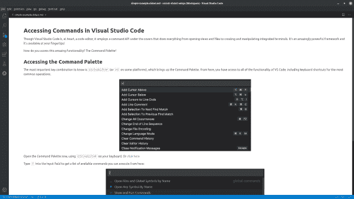
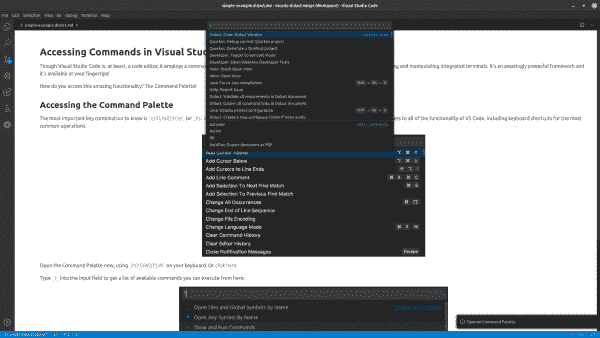

# 非开发人员如何用教学和代码轻松编写教程

> 原文：<https://developers.redhat.com/blog/2020/01/31/click-through-learning-with-vs-code-and-didact>

Didact 项目旨在填补 Visual Studio 代码中的空白，但它到底是什么呢？更重要的是，你为什么要在乎？

说教以“如果”开始。VS 代码没有提供一个很好的方法来引导用户逐步完成教程。“如果”我们可以通过结合以下内容来满足这一需求:

*   一种简单的标记语言(如 Markdown 或 AsciiDoc)。
*   使用 VS 代码 webview 将标记呈现为 HTML 的能力。
*   一种调用我们为每个 VS 代码扩展创建的命令的方法。

经过一天左右的编码过程，我有了一个工作原型。

## 为什么我们把它命名为教学

我们需要一个名字。在谷歌上搜索了在 VS 代码市场上找不到的独特词汇后，我遇到了 didact。韦氏词典对说教者的定义是一个有天赋、受过训练或打算教导他人的人。这是一个完美的术语来描述我们所追求的。

在高层次上，教学框架意味着指导用户完成任务。该项目通过文本、图像和活动链接的组合来实现这一点，这些链接展示了 VS 代码的实际功能。棘手的部分是让非开发人员不仅可以轻松编写教程，还可以与他们想要调用的命令进行交互。这就是 Markdown 和 AsiiDoc 等标记语言的用武之地。强大之处在于将这种简单性与 VS Code 的命令框架结合起来。

## Didact 是做什么的？

当开发人员编写 VS 代码扩展时，他们创建命令并通过菜单、按钮和命令面板调用它们。API 还提供了在其他地方调用它们的好方法。这就是我们利用 Didact 的方式。

Didact 的目标是采用“告诉他们，再告诉他们，然后告诉他们你告诉他们什么”的方法，结合使用文本(或文本和图像)和行动。假设您看到的是 VS 代码中的图 1。

Figure 1: Get help by using VS Code to open a Didact window. This Didact window demonstrates how to open the Command Palette.

这个窗口提供了一些东西。在顶部，它提供了一个简短的描述，解释了命令选项板的用途以及如何访问它。下面，它包括一个简单的链接，通过单击打开调色板，显示当您按下正确的一系列键(例如，Ctrl+Shift+P)时会发生什么。

如果您单击该链接，它将向您展示如何通过常规键或菜单项调用命令，如图 2 所示。

Figure 2: Click the link that shows how to reach a command in the palette.

正文是用 Markdown 写的。它引入了简单的图像和一些链接。一个简单的 URI 在活动的教学链接中做所有幕后的繁重工作:教学://？command id = work bench . action . show commands & completion = open % 20 command % 20 palette

如果我们打开 URI，我们会发现 VS 代码中 showCommands 命令 ID(当您按下键盘上的 Ctrl+Shift+P 时触发)和一个完成消息，它在右下角的一个小信息弹出窗口中显示了 Didact 在幕后做了什么，如图 2 所示。

在这种情况下，我们告诉你我们要告诉你什么，再告诉你一遍，用行动说明，然后再展示一遍，加强点击正确按键的效果。

## 迪达克的下一步是什么？

我们刚刚开始教学。我们有各种扩展的计划，包括项目脚手架功能。Scaffolding 允许您使用示例文件快速创建一个文件夹或文件结构，让您开始接触令人惊叹的技术和代码。

如果你有兴趣了解这个不断发展的框架或者想要参与其中，我们鼓励你浏览我们的 [GitHub 项目页面](https://github.com/redhat-developer/vscode-didact)。你也可以安装 [vscode-didact 扩展](https://marketplace.visualstudio.com/items?itemName=redhat.vscode-didact)并在本地使用它。

我们很高兴看到 Didact 如何发展。如果你对如何使用这个框架有想法，我们很乐意听到你的意见！

*Last updated: September 21, 2022*