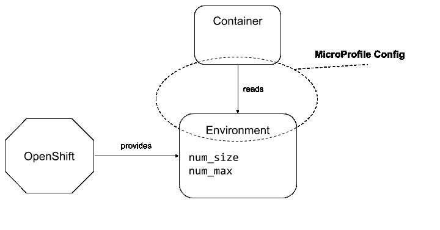
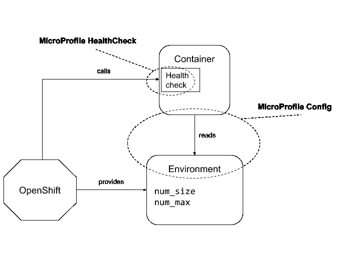

# 使用 MicroProfile(配置和健康检查)和 OpenShift 开发云原生应用

> 原文：<https://developers.redhat.com/blog/2018/03/05/cloud-native-microprofile-config-healthcheck-openshift>

前一篇文章描述了 Eclipse MicroProfile 1.2 版本中的规范以及基于 Java 的云原生应用程序的好处。本文展示了编写基于 Java 的微服务的软件开发人员如何利用这些规范来利用 Red Hat OpenShift 提供的管理功能。

MicroProfile 1.2 版本提供了解决 Java 开发人员在容器平台上构建和部署微服务时面临的常见挑战的规范:

*   Config 规范提供了一种统一的方式来配置 Java 应用程序，而不考虑部署环境(本地 JVM、持续集成的测试环境、生产部署的容器平台等)。).
*   健康检查规范提供了单个 HTTP 端点，可以查询该端点来确定应用程序的整体状态(可以在内部由许多不同且不相关的健康检查组成)。

本文的目的是提供微配置文件配置和健康检查规范的概述。它还将说明 Java 应用程序如何使用 API 来集成容器/云平台(如 Red Hat OpenShift 或 Kubernetes)提供的管理功能。

## Eclipse 微文件

如其网站上所述，Eclipse MicroProfile 的任务是定义:

> *这是一个开放式论坛，旨在通过跨多种实现进行创新，并以标准化为目标在共同感兴趣的领域进行合作，来优化微服务架构的企业 Java。*

Eclipse MicroProfile 项目为开发和部署基于微服务的 Java 应用程序提供了 Java 规范的保护伞。其中一些规范来自 Java EE(如 JAX-RS 或 JSON-P)，但是 Eclipse MicroProfile 还指定了一些新的规范，填补了现有 Java 规范或 API 未涵盖的空白。

在本文中，我们将关注 MicroProfile 1.2 版本中与应用程序配置和健康相关的两个规范:

*   微配置文件配置
*   微配置文件健康检查

### 微配置文件配置规范

[微文件配置规范](https://github.com/eclipse/microprofile-config/)是 Eclipse 微文件项目的第一个规范。它提供了一种通用的方法来检索来自各种来源(属性文件、系统属性、环境变量、数据库等)的配置。).API 非常简单，主要由两个对象组成:

*   一个`Config`接口可以用来从许多配置源中检索由名称标识的值(可能是可选的)。
*   使用 CDI 直接注入配置值的`@ConfigProperty`注释。

用于配置 API 的示例代码如下所示:

```
@Inject
@ConfigProperty(name = "num_size", defaultValue = "3")
private int numSize;

@Inject
@ConfigProperty(name = "num_max", defaultValue = "100")
private int numMax;
```

`@ConfigProperty`注释接受一个`defaultValue`参数，如果配置中不存在该属性，该参数将用于设置该字段。

或者，您可以使用注入的`Config`对象来获取属性值:

```
@Inject
Config config;
...
Optional<URL> url = config.getOptionalValue("my_url", URL.class);
...
```

`Config`对象提供了两种方法来检索属性:

*   `getValue(String, Class)`
*   `getOptionalValue(String, Class)`

如果属性不在配置中，将抛出异常。这种方法只能用于强制配置。

如果属性不在配置中，则`getOptionalValue()`返回一个空的`java.util.Optional`对象。此方法用于可选配置。

如果属性值(从配置中以`String`的形式检索)无法转换为作为第二个参数传递的预期 Java 类型，这两种方法都会抛出异常。

#### 配置源

API 还提供了一种添加不同配置源的方法，从这些配置源中获取属性。

默认情况下，它们可以来自:

*   JVM 系统属性(由`System.getProperties()`支持)
*   操作系统环境(由`System.getenv()`支持)
*   属性文件(存储在`META-INF/microprofile-config.properties`中的应用程序档案中)

Config API 的实现可以提供额外的配置源(例如，通过从关系数据库或键值存储中读取属性)。

使用配置 API 的应用程序也可以通过实现`org.eclipse.microprofile.config.spi.ConfigSource`来提供定制配置源，并使用定制实现的完全限定类名将其注册到文件`/META-INF/services/org.eclipse.microprofile.config.spi.ConfigSource`中。

#### 转换器

微配置文件配置规范将基于众所周知的转换方法(例如，带有`String`参数的构造函数以及名为`parse(CharSequence)`或`valueOf(String)`的静态方法)，自动尝试将属性值(作为`String`检索)转换为指定的类型(如上面代码示例中的`URL`)。

如果应用程序使用不符合这些命名约定的 Java 类型，应用程序可以提供额外的转换器来处理任何定制的转换。应用程序必须提供一个`org.eclipse.microprofile.config.spi.Converter`的实现，并用自定义实现的完全限定类名将其注册到文件`/META-INF/services/org.eclipse.microprofile.config.spi.Converter`中。

大多数映射到配置值的 Java 类型(`String`、原始类型如`long`或`boolean`，以及类如`java.time`或`URL`)都受到微配置文件配置规范所要求的隐式转换器的支持。

### 微文件健康检查规范

Eclipse 微文件健康检查规范定义了一个单一的容器运行时机制，用于验证微文件应用程序的可用性和状态。这主要是作为一种在容器化环境中使用的机制，比如 OpenShift 或 Kubernetes。

该规范定义了一个单独的`/health` HTTP 端点，容器平台可以查询这个端点来确定在容器内部运行的应用程序的状态。

该规范还定义了一个 Java API 来创建特定于应用程序的健康检查:

```
@FunctionalInterface
public interface HealthCheck {
  HealthCheckResponse call();
}
```

当容器查询`/health`端点时，微概要健康检查实现调用所有注册的`HealthCheck`实例来确定应用程序的整体状态。

由`HealthCheck`实例返回的`HealthCheckResponse`包含名称、结果和可选数据。例如:

```
public class CheckDiskspace implements HealthCheck {
  @Override
  public HealthCheckResponse call() {
    return HealthCheckResponse.named("diskspace")
             .withData("free", "780mb")
             .up()
             .buid();
  }
}
```

当应用程序启动时，MicroProfile HealthCheck 实现使用 CDI 加载`HealthCheck`(用`@Health`注释进行了注释)。

容器然后可以调用`/health`端点来确定应用程序的整体状态。

```
$ curl -v http://localhost:8080/health
...
< HTTP/1.1 200 OK
...
{"checks": [
{"name":"diskspace","state":"UP", "data":{"free": "780mb"}}],
"outcome": "UP"
}
```

如果健康检查的总体结果是`UP`，HTTP 返回一个`200 OK`响应。

如果一个或多个健康检查将返回`DOWN`，健康检查的总体结果将是`DOWN`，而 HTTP 请求将返回一个`503 Service Unavailable`响应。

## 在 OpenShift 上构建和部署一个微文件应用程序

为了说明 MicroProfile API 在 Java 应用程序中的使用，我们将使用一个非常简单的 Java 应用程序运行 [WildFly Swarm](http://wildfly-swarm.io/) 。我们先描述一下，在本地测试一下。然后我们将在 [OpenShift](https://www.openshift.com/) 上部署它，并说明微配置文件配置和健康检查如何利用 OpenShift 容器平台。

### 应用程序的描述

这个应用程序是一个简单的 Web 服务，有一个惟一的 HTTP 端点，它返回一个随机整数列表。

该应用程序的源代码存放在 https://github.com/jmesnil/microprofile-openshift-example/的。

当用户向 [http://localhost:8080/](http://localhost:8080/) 发送请求时，应用程序用一个 JSON 数组中的随机整数列表进行响应:

```
$ curl http://localhost:8080/
[630030638,1689535734,1995796600]
```

#### 应用程序配置

应用程序使用微配置文件配置来配置其行为。它定义了两个配置属性:

*   `num_size` -生成的随机整数个数(默认为`3`)
*   `num_max` -整数的最大值(默认为`100`)

这两个属性是使用 Eclipse MicroProfile 配置 API 在`NumbersGenerator`类中配置的:

```
@Inject
@ConfigProperty(name = "num_size", defaultValue = "3")
private int numSize;

@Inject
@ConfigProperty(name = "num_max", defaultValue = "100")
private int numMax;
```

如果没有更具体的配置，应用程序将返回 0 到 100 之间的 3 个整数的列表。

#### 应用程序运行状况检查

我们的演示应用程序非常简单，不需要您定义健康检查。然而，我们将添加一个，只是为了说明它们如何适用于更现实的应用。

我们将添加一个健康检查来确定`NumbersGenerator`的健康状况。健康检查将检查`NumbersGenerator`的配置，如果配置不正确，将返回`DOWN`(在实际例子中，如果配置错误，最好阻止应用程序启动)。

```
@ApplicationScoped
@Health
public static class ConfigHealthCheck implements HealthCheck {

  private static final String PROBE_NAME = "numbers.config";

  @Inject
  NumbersGenerator generator;

  @Override
  public HealthCheckResponse call() {
    if (generator.numSize < 0 ||
        generator.numMax <= MIN_VALUE) {
      return HealthCheckResponse.named(PROBE_NAME)
               .withData("num_size", generator.numSize)
               .withData("num_max", generator.numMax)
               .down()
               .build();
    } else {
      return HealthCheckResponse.named(PROBE_NAME)
              .up()
              .build();
    }
  }
}
```

如果`NumbersGenerator`配置正确，健康检查将返回`UP`。如果配置错误，健康检查将返回`DOWN`以及导致问题的配置值。

### 构建应用程序并在本地测试它

该应用程序是使用 Maven 构建的:

```
$ mvn clean package
```

该应用程序被打包成一个可以在本地运行的 Java UberJar:

```
$ java -jar target/numbers-swarm.jar
...
2018-01-15 11:58:50,658 INFO [org.jboss.as.server] (main) WFLYSRV0010: Deployed "numbers.war" (runtime-name : "numbers.war")
2018-01-15 11:58:50,677 INFO [org.wildfly.swarm] (main) WFSWARM99999: WildFly Swarm is Ready
```

我们可以重复使用 [http://localhost:8080/](http://localhost:8080/) 来生成随机整数列表:

```
$ curl http://localhost:8080/
[99,38,43]
[75,43,75]
[9,55,69]
```

我们现在可以通过使用环境变量为`num_size`和`num_max`属性指定不同的值来更改应用程序的配置。

```
$ num_size=5 num_max=10 java -jar target/numbers-swarm.jar
```

应用程序现在将返回 0 到 10 之间的 5 个随机整数的列表:

```
[2,2,5,9,7]
[6,4,0,0,2]
[1,9,4,0,3]
[1,9,5,3,6]
```

我们可以使用系统属性提供相同的配置(在命令行中使用`-D`):

```
$ java -jar target/numbers-swarm.jar -Dnum_size=5 -Dnum_max=10
```

微配置文件配置指定每个配置源都有一个序数值，该序数值决定哪个配置源将向应用程序提供实际的属性值。如果一个属性在多个配置源中可用，则序号最高的配置源胜出。

微配置文件配置指定来自环境变量的属性序号为 300，而来自 JVM 系统属性的属性序号为 400。

这意味着，如果在环境和 JVM 系统属性中都定义了`num_size`属性，则应用程序使用的值来自 JVM 系统属性:

```
$ num_size=5 java -jar target/numbers-swarm.jar -Dnum_size=1
```

在上面例子中，应用程序将使用 1 作为其`num_size`配置属性的值:

```
$ curl http://localhost:8080/
[96]
```

我们还可以在本地测试运行状况检查:

```
$ curl -v http://localhost:8080/
< HTTP/1.1 200 OK
...
{"checks": [
{"name":"numbers.config","state":"UP"}],
"outcome": "UP"
}
```

如果我们使用不正确的配置启动应用程序(例如使用-1 的`num_max`)，健康检查将返回`DOWN`:

```
$ java -jar target/numbers-swarm.jar -Dnum_max=-1
...

$ curl -v http://locahost:8080/health
< HTTP/1.1 503 Service Unavailable
...
{"checks": [
{"name":"numbers.config","state":"DOWN","data": {"num_size":3,"num_max":-1}}],
"outcome": "DOWN"
}
```

### 在 OpenShift 上部署

我们已经在本地测试了该应用程序。现在让我们在 OpenShift 上部署它。

该应用程序使用 fabric8 Maven 插件部署在 OpenShift 上。它有几个先决条件:

*   报名参加[https://manage.openshift.com](https://manage.openshift.com/)
*   确保将`oc`命令行配置为指向我们的 OpenShift 帐户(一旦您登录到 OpenShift Web 控制台，您就可以使用`"Copy Login Command"`并将其粘贴到您的终端)

```
$ oc login https:/xxxxx.openshift.com --token=xxxxx
$ oc status
```

从命令行登录后，可以通过运行 Maven 命令来部署应用程序:

```
$ mvn -Popenshift clean fabric8:deploy
```

Maven 使用`openshift`概要文件在 OpenShift 上部署名为`microprofile-openshift-example`的应用程序。

Java 应用程序被配置为自动向其 8080 端口公开路由。为了找到与应用程序交互的公开路由的名称，我们可以使用`oc`命令查看应用程序配置:

```
$ oc get routes/microprofile-openshift-example
NAME                             HOST/PORT                                                                        PATH      SERVICES                         PORT      TERMINATION   WILDCARD
microprofile-openshift-example   microprofile-openshift-example-microprofile-demo.1d35.starter-us-east-1.openshiftapps.com              microprofile-openshift-example   8080
```

如果你用自己的 OpenShift 账号部署应用，URL 会和我的不一样，是:[http://micro profile-open shift-example-micro profile-demo . 1d 35 . starter-us-east-1 . OpenShift apps . com](http://microprofile-openshift-example-microprofile-demo.1d35.starter-us-east-1.openshiftapps.com)。

此时，应用程序是可访问的，并返回一个随机整数列表:

```
$ curl http://microprofile-openshift-example-microprofile-demo.1d35.starter-us-east-1.openshiftapps.com
[94,48,3]
```

## 用于微轮廓应用程序的 OpenShift 服务

### OpenShift 环境配置

我们现在将修改 OpenShift 环境，以便它为应用程序提供配置值。



使用`oc`工具，我们可以为我们的 microprofile-openshift-example 应用程序列出环境变量:

```
$ oc env dc/microprofile-openshift-example --list
# deploymentconfigs microprofile-openshift-example, container wildfly-swarm
# KUBERNETES_NAMESPACE from field path metadata.namespace
```

现在，我们可以指定要返回一个由 0 到 10 之间的 5 个随机整数组成的列表:

```
$ oc env dc/microprofile-openshift-example num_size=5 num_max=10
```

OpenShift 检测到环境已经改变，并将推出应用程序以部署具有更新环境的版本。

部署完成后，我们可以检查应用程序返回的随机整数列表现在包含 5 个介于 0 和 10 之间的随机整数。

查看这里:[http://micro profile-open shift-example-micro profile-demo . 1d 35 . starter-us-east-1 . openshift apps . com](http://microprofile-openshift-example-microprofile-demo.1d35.starter-us-east-1.openshiftapps.com)

```
$ curl http://microprofile-openshift-example-microprofile-demo.1d35.starter-us-east-1.openshiftapps.com
[9,2,9,5,1]
```

### OpenShift 活性和就绪探测



准备就绪探测器在 OpenShift 中被自动配置为使用我们的应用程序的`/health`端点。此配置摘自 fabric8 Maven 插件的配置，在应用程序的 pom.xml 中配置:

```
<plugin>
 <groupId>io.fabric8</groupId>
 <artifactId>fabric8-maven-plugin</artifactId>
 ...
 <configuration>
   ...
   <enricher>
     <config>
       <wildfly-swarm-health-check>
         <path>/health</path>
       </wildfly-swarm-health-check>
     </config>
   </enricher>
 </configuration>
</plugin>
```

在 OpenShift Web 控制台中，应用程序的部署页面列出了探测器:

*   `Readiness Probe: GET /health on port 8080 (HTTP) 10s delay, 1s timeout`
*   `Liveness Probe: GET /health on port 8080 (HTTP) 180s delay, 1s timeout`

`oc`工具也可用于检查它们的配置是否正确:

```
$ oc describe dc/microprofile-openshift-example
Name:           microprofile-openshift-example
...
  Containers:
   wildfly-swarm:
    Liveness:   http-get http://:8080/health delay=180s timeout=1s period=10s #success=1 #failure=3
    Readiness:  http-get http://:8080/health delay=10s timeout=1s period=10s #success=1 #failure=3
```

## 摘要

MicroProfile 1.2 版本及其规范有助于开发和部署基于微服务的 Java 应用程序。

在本文中，我们使用了 MicroProfile 配置规范来为 Java 应用程序提供统一的配置。然后，我们展示了如何使用系统属性或环境变量为配置提供不同的值。

我们还使用了 MicroProfile 健康检查规范来定义健康探测器，并提供了一个 HTTP 入口点，OpenShift 等容器平台可以用它来查询 Java 应用程序的健康状况。

最后，我们已经在 OpenShift 上部署了 Java 应用程序，并演示了如何设置环境变量来配置应用程序。我们还配置了 OpenShift 活跃度和就绪性探测器，使用 MicroProfile Health Check HTTP 入口点来检查应用程序的健康状况。

## 贡献和协作

Microprofile 是一个开放的、充满活力的社区，由 Eclipse Foundation 托管。这一点，再加上将未来的 Java EE 规范工作转移到 Eclipse foundation 下的决定，为提供反馈、贡献和协作提供了一个极好的机会。

**Eclipse Microprofile 项目**

*   [https://projects.eclipse.org/proposals/eclipse-microprofile](https://projects.eclipse.org/proposals/eclipse-microprofile)

**Microprofile 1.2 规范**

*   [BOM 和 Maven 坐标](https://github.com/eclipse/microprofile-bom/releases/download/1.2/microprofile-spec-1.2.pdf)
*   [https://github.com/eclipse/microprofile-config/](https://github.com/eclipse/microprofile-config/)
*   [https://github.com/eclipse/microprofile-health/](https://github.com/eclipse/microprofile-health/)

**讨论组和邮件列表**

*   [https://groups.google.com/forum/#!forum/microprofile](https://groups.google.com/forum/#!forum/microprofile)

*Last updated: September 3, 2019*