# JBoss 数据虚拟化:在 Cloudera 上与 Impala 集成

> 原文：<https://developers.redhat.com/blog/2018/02/08/cloudera-impala-jboss-data-virtualization>

[Cloudera Impala](https://www.cloudera.com/documentation/enterprise/5-3-x/topics/impala_intro.html) 是一款使用 SQL 语法在 HBase 或 HDFS 中快速查询 Hadoop 数据的工具。您可以使用 [Red Hat JBoss 数据虚拟化](https://www.redhat.com/en/technologies/jboss-middleware/data-virtualization)通过 Impala 查询相同的数据，以利用其优化优势。您还可以实时地将该数据与其他数据源相结合。本指南的目标是从 Cloudera Impala 实例导入数据，操纵它，然后将数据作为数据服务公开。本指南包括使用示例脚本访问存储库、创建定制的基础和视图模型、将其作为数据服务公开，以及最终通过 REST 消费该数据。这是一篇关于[用 Red Hat JBoss 数据虚拟化](https://developers.redhat.com/blog/2017/05/11/unlock-your-cloudera-data-with-red-hat-jboss-data-virtualization/)解锁您的 Cloudera 数据的同行文章。

## 在 Cloudera 上与 Impala 集成

### 设置

*   为您安装的虚拟化平台下载 [Cloudera all in one vm](https://www.cloudera.com/downloads/quickstart_vms/5-10.html) 。这个例子是在 [KVM 上完成的。](https://www.linux-kvm.org/)
*   您需要填充您的 Impala 实例。这个例子使用了来自[Hadoop 入门教程的数据。](https://www.cloudera.com/developers/get-started-with-hadoop-tutorial/exercise-1.html)
*   我们将从**订单**表中导入数据。转到 Cloudera HUE 中的 Impala 接口，并验证示例数据已成功加载:

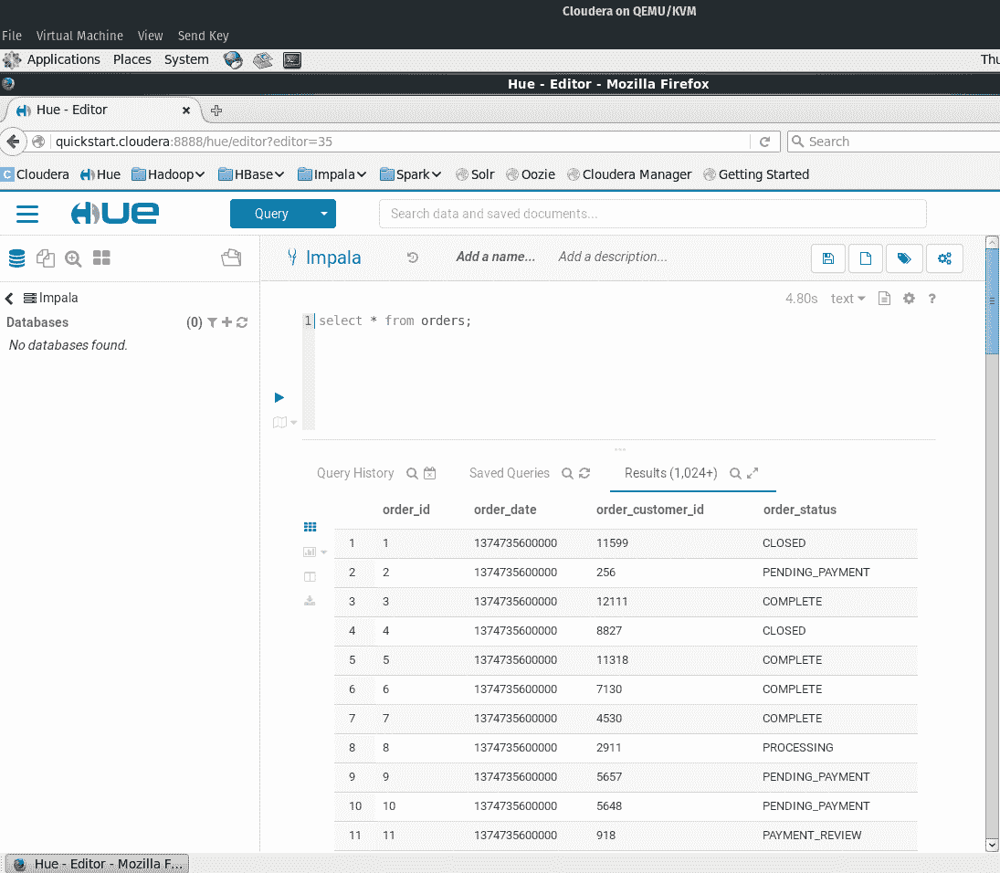

*   安装 [JBoss 数据虚拟化(JDV)](https://developers.redhat.com/products/datavirt/download/) 。在浏览安装向导时，确保选中了 **odata** 角色。
*   安装 [JBoss 开发者工作室(JBDS)](https://developers.redhat.com/products/devstudio/download/) 。安装完成后，在**软件/更新**标签下，安装 **JBoss 数据虚拟化开发**。如果您没有看到该选项，请选中右下角的**启用提前访问**复选框。
*   关于安装 JDV 和 JBDS 的细节可以在红帽的 [JDV 开发研讨会](http://redhatgov.io/workshops/jdv_dev/exercise1/)页面上找到。
*   您需要在 teiid 设计器之外创建一个 Cloudera 数据源，以便连接到 hive。该项目为 Cloudera Enterprise 带来了来自 [Impala JDBC 连接器 2.5.42 的库。](https://www.cloudera.com/downloads/connectors/impala/jdbc/2-5-42.html)
*   克隆 [jdv-cloudera](https://github.com/mechevarria/jdv-cloudera) repo 以获得一些助手脚本，在 jdv 服务器上创建数据源:

```
git clone https://github.com/mechevarria/jdv-cloudera
```

*   运行带有`add all`选项的`setup-ds.sh`脚本来创建和/或删除模块、驱动程序和数据源。您需要在 **cli.sh** 脚本中设置您的 **Jboss 主目录**的路径。您还需要调整 **cli/add-ds.cli** 来获得您特定的 **impala 连接**信息。如果成功，您将看到以下输出:

```
{"outcome" => "Success"}
```

*   为了验证数据源是否正确，在 [Jboss 管理控制台:](http://localhost:9990/console)中测试数据源连接

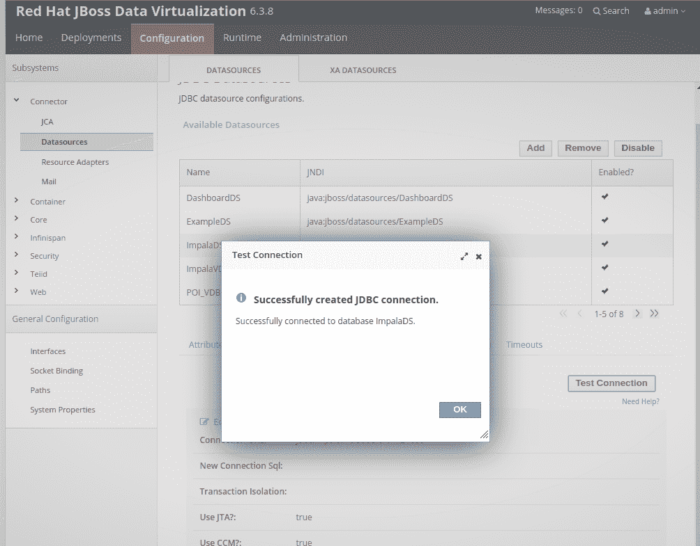

### 连接黑斑羚和 JDV

*   我们将在 JBoss Developer Studio 中创建一个新项目。打开 JBDS 后，您可以按照这些步骤和截图开始创建项目。
*   **文件- >新建->teid 模型项目**
*   (见截图)`server panel -> start the jdv server`。确保 admin 和 jdbc 连接(teiidUser)设置了正确的用户/通过安装:

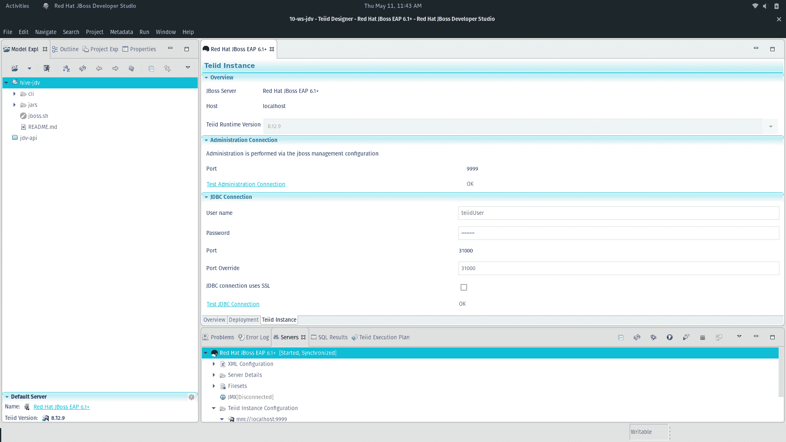

*   在设计器中，我们将使用专有的 Cloudera Impala 驱动程序，而不是内置的转换器。我们将按照相同的步骤导入数据源，但是只为 Impala 创建一个自定义连接:
*   `file -> import -> JDBC Database >> source model`
*   选择**新建**连接配置文件。
*   选择**通用 JDBC** ，然后选择**下一步:**

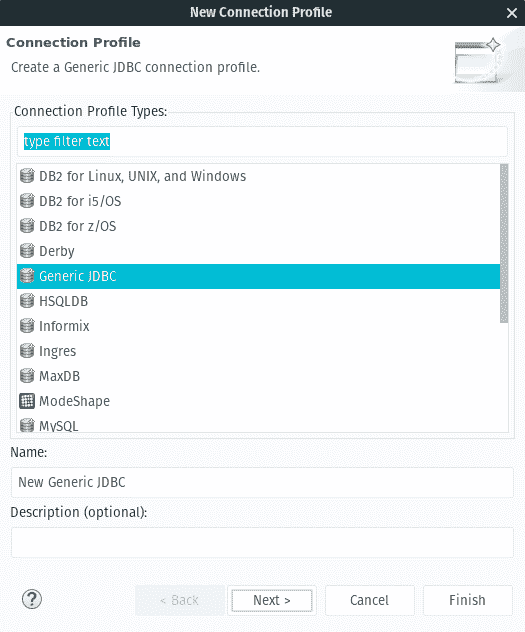

*   选择**新驱动定义**按钮。
*   在 **JAR 列表**选项卡下，添加来自 [jars](https://github.com/mechevarria/jdv-cloudera/tree/master/jars) 目录的所有 JAR:

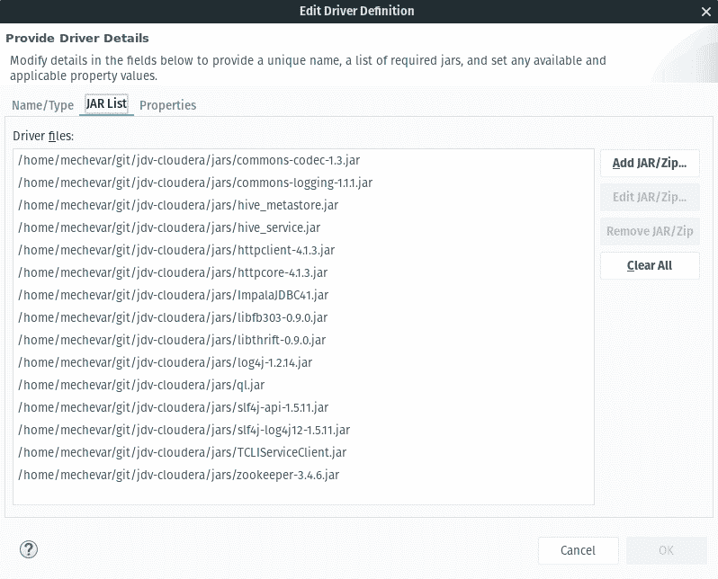

*   在属性选项卡下，将**驱动程序类**更新为`com.cloudera.impala.jdbc41.Driver`并将连接 url 更新为`jdbc:impala://localhost:21050`

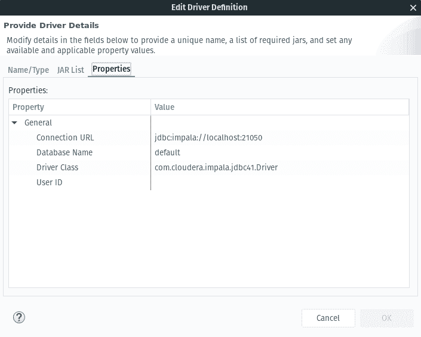

*   选择 **ok** 并返回连接配置文件后，将 **localhost** 更改为 impala 服务器的主机名或 IP 地址。在我的例子中，它是 **cloudera-vm。**
*   设置用户名和密码。对于快速启动虚拟机，这两个值都是 **cloudera。**
*   选择**下一个**，然后选择**订单**表进行导入:

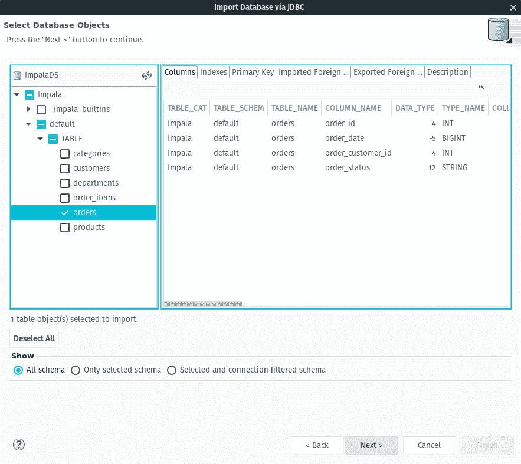

*   将**车型名称**设置为`OrderDS.xmi`，将 **JNDI 名称**设置为`java:/OrderDS`
*   选择**完成**将创建源模型。

### 检查源模型

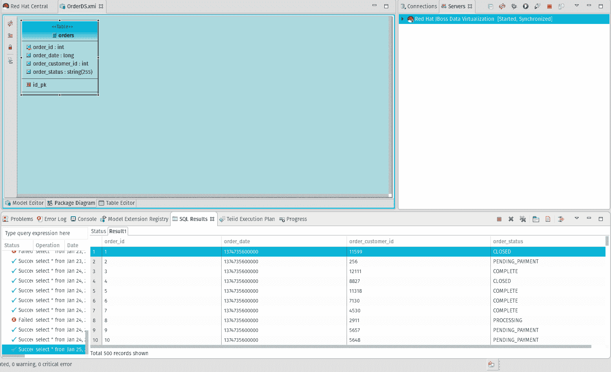

### 创建视图模型

*   现在我们已经导入了一个基础模型，我们将在这个基础模型之上创建一个视图模型。视图模型是数据合成的地方，我们将在这个视图模型中合成一个定制字段。
*   选择**文件- >新建->teid 元数据模型**
*   **名称:** `OrderView`，**型号:** `View Model`。从现有模型中选择**转换**，然后选择**。**
*   选择**订单**型号，选择**完成:**

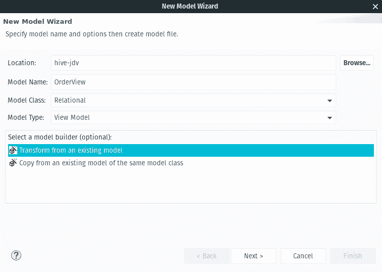

### 向视图添加自定义属性

*   我们将把 order date 列从一个以毫秒为单位的长值转换成一个可以被客户端应用程序过滤的时间戳。
*   双击 **OrderView** 建模图中的 **T** ，然后选择**调和 SQL 转换**按钮:

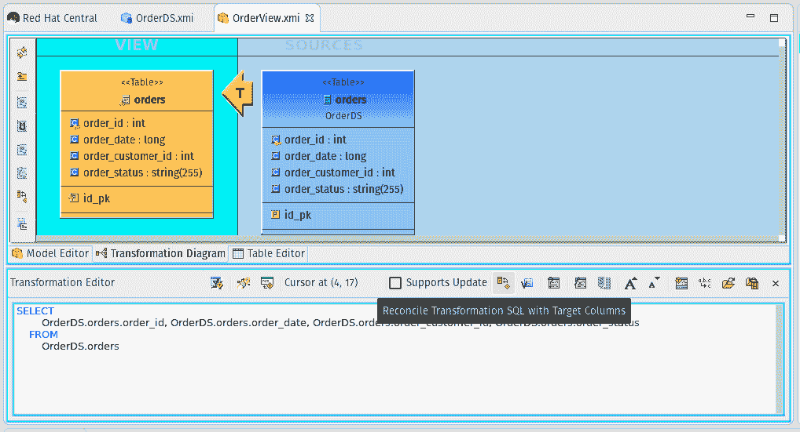

*   选择**加号按钮**，然后选择**订单日期。**
*   选择 **<新建**按钮，然后将该字段重命名为`order_data_formatted`
*   选择**确定。**
*   在**转换编辑器**中，将值`OrderDS.orders.order_date`替换为:

    ```
    TIMESTAMPADD(SQL_TSI_SECOND, cast((OrderDS.orders.order_date / 1000) AS integer), {ts'1970-01-01 23:59:59.0'})
    ```

*   作为参考，这些是可用的[日期/时间函数。](https://docs.jboss.org/author/display/TEIID/Date_Time+Functions)
*   选择**保存并确认**按钮。
*   保存更新的视图模型。
*   完整的转换查询应该是:

```
SELECT
OrderDS.orders.order_id,
OrderDS.orders.order_date,
OrderDS.orders.order_customer_id,
OrderDS.orders.order_status,
TIMESTAMPADD(SQL_TSI_SECOND, cast((OrderDS.orders.order_date / 1000) AS integer), {ts'1970-01-01 23:59:59.0'}) AS order_date_formatted
FROM
OrderDS.orders
```

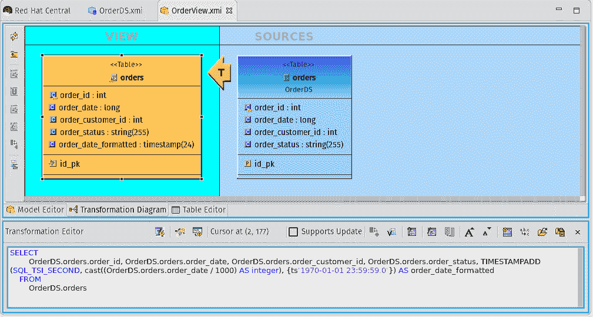

### 部署 VDB

*   既然我们已经创建了我们的模型，我们需要将它们从我们的工作室工作区中转移出来，并将它们部署到 JBoss 数据虚拟化服务器上。虚拟数据库或 vdb 是最终部署到正在运行的 JBoss 数据虚拟化服务器上的。我们需要将我们的模型添加到一个 vdb，只是将表添加到一个实际的数据库中。
*   **文件- >新建->teid vdb**
*   将 vdb **命名为 ImpalaVDB。**
*   选择**订单视图**进行添加并完成。这也将自动带来**订单**:


*   要展开，选择**展开**按钮。

### 通过 REST 消费数据服务

*   既然我们的数据服务是活动的，我们想访问这些数据。
*   在这个例子中，[邮递员](https://www.getpostman.com/)被用来测试。您也可以使用您的浏览器，但是您需要在`$format=json`的 url 中添加一个参数
*   本地服务器的示例 url 是:

    ```
    http://localhost:8080/odata4/ImpalaVDB/OrderView/orders?$count=true
    ```

*   您需要为**teid user 设置基本验证参数(用户/通行证)。**
*   在**授权标签**下选择**基本授权**，然后输入右边的凭证。
*   要过滤记录，选择**发送**按钮旁边的**参数**和一个名为 **$filter** 的参数，其值为`order_date_formatted gt 2014-07-25T00:00:00.000Z`
*   这将过滤时间戳大于 2014-07-25 的结果。关于 OData 参数和用法的更多细节可以在[OData.org 上找到。](http://www.odata.org)

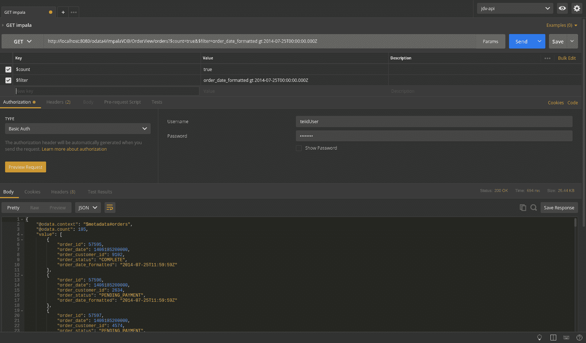

*   [Red Hat JBoss 数据虚拟化](https://www.redhat.com/en/technologies/jboss-middleware/data-virtualization)在企业集成中的强大之处不仅仅在于将数据作为服务公开，还在于组合多个来源并进行转换(比如时间戳)。希望这篇文章是有帮助的，感谢阅读！