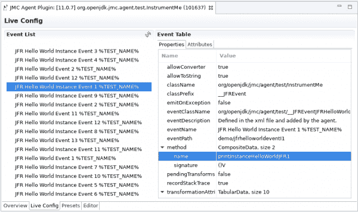
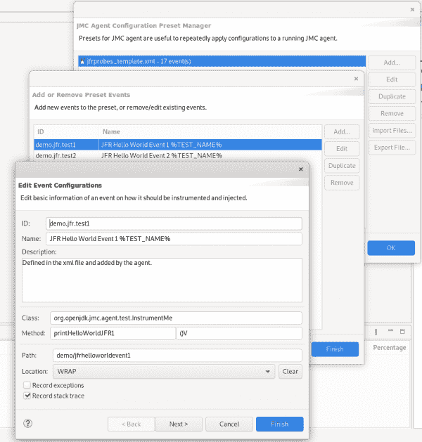

# 使用 JMC 代理在运行时收集 JDK 飞行记录器事件

> 原文：<https://developers.redhat.com/blog/2020/10/29/collect-jdk-flight-recorder-events-at-runtime-with-jmc-agent>

[JDK 飞行记录器](https://developers.redhat.com/blog/2020/08/25/get-started-with-jdk-flight-recorder-in-openjdk-8u/)或 JFR，是一个基于事件的生产环境分析器，可从 [OpenJDK 8u272](https://developers.redhat.com/products/openjdk/download) 获得。作为一个热点本地功能，JDK 飞行记录器在使用空间和时间方面的开销非常低。

虽然 JDK 飞行记录器默认收集基本的 [Java](https://developers.redhat.com/topics/enterprise-java) 运行时信息，但也可以使用 JFR 的事件 API 来收集自定义事件。想要收集应用程序级事件的开发人员必须在其应用程序源代码中主动定义和实例化这些事件。

在这篇文章中，我们将向您展示如何使用 JMC 代理和 JMC 代理插件来为您的应用程序类提供事件发射代码。当您将 JMC 代理与 JDK 飞行记录器事件 API 一起使用时，您不需要关闭 JVM 并重新编译应用程序代码。

**注意**:我们在本文中包括了 JDK 飞行记录器工具链的概述，但是我们将重点介绍 JMC 代理和 JMC 代理插件。要了解更多关于 JDK 飞行记录器的信息，请参见我们之前的文章， *[在 OpenJDK 8u](https://developers.redhat.com/blog/2020/08/25/get-started-with-jdk-flight-recorder-in-openjdk-8u/)* 中开始使用 JDK 飞行记录器。

## JDK 飞行记录器工具链综述

JMC 代理是 JDK 任务控制(JMC)项目的一个子部分。JDK 任务控制中心专注于与 JDK 飞行记录器互动，并分析它转储的记录。虽然我们主要介绍了 JMC 代理和 JMC 代理插件，但是工具链的概述将会很有帮助。

### JDK 飞行记录器

JDK 飞行记录器最初是 JRockit JVM 的一项功能。它捕获关键的 JVM 统计事件，并将它们记录在飞行记录文件中，以便进行离线分析。2018 年，Oracle 以 JDK 飞行记录器的名义开源了这一功能，并将其集成到 OpenJDK 11 中。JFR 也被反向移植到 OpenJDK 8。

开发人员使用 JDK 飞行记录器来分析生产环境中的 JVM。JFR 用紧凑的二进制形式记录事件。乍一看，它首先将这些事件存储在内存缓冲区中。它会定期将缓冲区刷新到文件系统或另一个存储。JFR 是一个“永远在线”的生产时间分析器，在大多数用例中，它的开销不到 2%。

### JDK 任务控制中心

拥有一个二进制格式的飞行记录本身是没有用的。OpenJDK 提供了访问这些记录并解码其内容的工具。然而， [JDK 任务控制](https://openjdk.java.net/projects/jmc/)是研究飞行记录最强大和最灵活的方法。

JDK 任务控制是一个图形用户界面工具，专门用于分析 JFR 录音。与 JDK 飞行记录器一起，JMC 给开发者一个应用程序运行时特征的深度视图。您可以使用这个视图来识别性能瓶颈并微调 JVM。JMC 还能够连接到本地运行的 JVM，获取新的记录，并控制正在进行的记录。

JMC 是一个 Eclipse 富客户端平台应用程序。可以用各种插件扩展。它还提供了一个强大的独立 API，用于独立于 GUI 应用程序读取和分析 JFR 录音。

**注** : JDK 任务控制可通过[红帽软件集合](https://developers.redhat.com/products/softwarecollections/overview) (RHSCL)在 Fedora 和[红帽企业 Linux (RHEL) 7](https://developers.redhat.com/products/rhel/overview) 中获得，可通过模块在 [RHEL 8 中获得，Windows 用户可从](https://access.redhat.com/documentation/en-us/red_hat_enterprise_linux/8/html/8.2_release_notes/rhel-8_2_1_release#new_features) [OpenJDK 开发者门户](https://developers.redhat.com/products/openjdk/download)获得。你也可以通过像 [AdoptOpenJDK](https://adoptopenjdk.net/jmc) 这样的下游发行版获得 JDK 任务控制。

### JMC 代理商

[JMC 代理](https://wiki.openjdk.java.net/display/jmc/The+JMC+Agent)是 JMC 的子项目。您可以使用这个字节码转换器以声明的方式将 JFR 工具添加到正在运行的应用程序中。当您使用 JMC 代理时，您不需要在源代码中编写 JFR 仪器。

因为代理在与 JVM 相同的地址空间中运行，所以它非常通用。您可以在应用程序启动时加载它，也可以随时动态加载它。正在运行的 JMC 代理通过远程 Java 管理扩展(JMX)公开 MBean 控制器以进行进一步配置。

### JMC 代理插件

JMC 代理插件是一项正在进行的工作，将 JMC 代理的功能集成到 JDK 任务控制中。它目前正在一个独立的项目中作为外部插件开发。最终，它将被重新命名为 JMC 的一个子模块。开发者可以使用 JMC 代理插件来管理 JMC 代理的生命周期和控制代理的行为。

虽然 JMC 代理插件处于早期开发阶段，但基本功能已经可用。在接下来的章节中，你会学到更多关于 JMC 代理和 JMC 代理插件的知识，包括如何构建一个可以在 JDK 任务控制中使用的代理插件。

## JMC 代理介绍

产生事件并将它们提交给 JDK 飞行记录器的最常见方法是使用标准的`jdk.jfr.*` API，它是在 JDK 9 中引入的。希望使用`jdk.jfr.*` API 来创建事件并操作其实例的开发人员必须手动扩展一个`jdk.jfr.Event`。JMC 代理提供的另一种方法是使用声明式热插拔配置。JDK 飞行记录器以同样的方式处理所有事件，不管是 JMC 代理还是标准 API 产生它们。

### 使用 JMC 代理创建和操作事件实例

JMC 代理在启动后立即使用 [Java Instrumentation API](https://docs.oracle.com/javase/8/docs/api/java/lang/instrument/package-summary.html) 注册一个`ClassFileTransformer`。当类加载器启动类加载时，代理`ClassFileTransformer`通过注入事件提交字节码来转换类字节码，这是根据提供的配置生成的。

只要代理可以获得对目标类的引用，还可以通过重新转换和重新加载类来恢复或更新插装。

在设计 JMC 代理时，我们优先考虑了以下要求:

*   声明性的:您可以使用 XML 配置来定义注入事件。
*   不引人注目:你不需要改变源代码来实现 JMC 代理。
*   最小的内存占用:你不需要使用反射；您只发出与事件相关的函数调用。
*   无痛:您永远不必关闭 JVM。

(见下文)。综上所述，这些特性有助于确保 JMC 剂使用安全且无副作用。当源不可用或者不可能立即关闭服务或维护时，它非常适合于生产使用。JMC 代理特别适用于需要为应用程序创建自定义工具的情况。

接下来，我们将看看如何使用 JMC 代理和 JMC 代理插件。

## 配置要记录在事件中的信息

JMC 代理工具适用于一个或多个函数。您可以在 XML 配置中启用或禁用以下信息:

*   函数运行时特征:开始时间、结束时间和持续时间。
*   函数输入和输出:参数、返回值和异常(如果有的话)。
*   事件元数据:标签、描述、线程 ID 和调用堆栈。

对于表达式求值，还可以使用 JMC 代理来启用或禁用主表达式的有限子集。JMC 代理接受所有 Java 主表达式，但包含方法调用、数组访问或数组或实例创建的表达式除外。这种设计旨在通过静态检查来加强评估安全性，并保证恒定的时间开销。

### 代理配置文件

一个*代理配置文件*是一个 XML 表示，控制 JMC 代理如何插入应用程序字节码:

*   文档根是一个`<jfragent>`元素。在当前实现中，JMC 代理不需要名称空间。一个`<jfragent>`元素没有内部文本，可以选择包含`<config>`和`<events>`元素。
*   `<config>`元素包含应用于所有事件的全局选项。目前选项有`<classprefix>`、`<allowconverter>`和`<allowtostring>`。
*   `<events>`元素包含任意数量的`<event>`元素，通常称为*探针*。每个`<event>`元素贡献于一个由`<class>`、`<method>`和方法`<descriptor>`识别的特定仪器点。
*   `<parameter>`和`<field>`元素相应地记录给定参数和表达式的值。

**注意**:参见 JMC 代理库的一个例子，展示了 Java Fight Recorder 模板的[常用用法。](https://github.com/openjdk/jmc/blob/master/agent/src/test/resources/org/openjdk/jmc/agent/test/jfrprobes_template.xml)

### JMC 代理的局限性

JMC 代理处于早期发展阶段。在撰写本文时，我们正在寻求解决以下制约因素:

*   JMC 代理无法使用合成类。
*   它也不能访问巢友的私有领域。
*   新上传的配置仅适用于用`SystemClassLoader`定义的类。
*   JMC 代理目前使用`[jdk.internal.misc.Unsafe](https://github.com/openjdk/jdk/blob/master/src/java.base/share/classes/jdk/internal/misc/Unsafe.java),`，因此您必须通过-添加-打开打开该模块(见下文)。
*   JMC 代理目前没有与 JDK 任务控制集成。

**注意**:插装合成类可以说是一个*非目标*。通常很难确定生成的类的确切名称，这使得它们很难使用。在大多数情况下，检测生成的代码是没有意义的。

## JMC 代理插件简介

谢天谢地，JMC 团队在可扩展的模块化 Eclipse 富客户端平台上开发了 JMC。因此，JMC 代理插件将代理相关的功能添加到 JDK 任务控制中，而不是创建新的客户端软件。

简而言之，JMC 代理插件对于 JMC 代理就像 JDK 任务控制对于 JDK 飞行记录器一样。也就是说，它控制着 JMC 的代理商。虽然仍在积极开发中，JMC 代理插件已经帮助导航 JMC 代理的生命周期。您可以使用该插件在本地 JVM 中启动 JMC 代理，然后通过 JMX API 连接到它。连接后，您可以应用新的或修改的配置。JMC 代理插件还显示关于结果转换的实时信息。您还可以使用预设管理器管理预定义的配置，并使用一组向导创建或编辑它们。

### 实时配置

动态配置页面是我们添加到 JMC 代理插件的第一个功能。您可以使用它以表格形式查看当前应用于 JMC 代理的配置。如图 1 所示，Live Config 屏幕的左侧列出了由您的 JMC 代理实例检测的所有事件。右侧包含每个事件的定义。

[](/sites/default/files/blog/2020/08/live-config-page.png)Figure 1\. JMC Agent Plugin Live Configuration Page

Figure 1: The JMC Agent Plugin's Live Configuration page.

**注意**:我们最终会支持将实时配置直接保存到预设管理器中，以便您以后使用。

### 编辑向导和预设管理器

编辑 XML 配置文件对初学者来说很难，对有经验的开发人员来说很乏味，而且容易出错。JMC 代理插件介绍了编辑向导，以节省您的麻烦。与预设管理器一起，编辑向导简化了本地配置模板的创建、修改和管理，也称为*预设*。当您不需要创建完整 XML 配置所需的所有配置或事件选项时，预设尤其有用。图 2 显示了预设管理器屏幕中 JMC 代理插件的预设编辑向导。

[](/sites/default/files/blog/2020/08/preset-and-event-wizards.png)Figure 2\. JMC Agent Plugin Preset Manager and Preset Editing Wizards

Figure 2: Use the present manager's editing wizards to create, modify, and manage event configurations.

作为使用向导编辑预设的替代方法，您可以使用内置的 XML 源代码编辑器来手动编辑原始配置文件。虽然我们还没有，但我们最终会在 XML 源代码编辑器中添加内联错误和警告指示。

已经向您介绍了 JMC 代理和 JMC 代理插件。最后，我们将简要介绍如何在您的应用程序中构建和运行这些工具。也请务必查看文章末尾的演示视频。

## 构建并运行 JMC 代理

要构建和运行 JMC 代理，您需要 JDK 7 或更高版本。首先，从 GitHub 库克隆 JMC 源代码树:

```
$ git clone https://github.com/openjdk/jmc.git
```

然后，使用代理文件夹中的 Maven:

```
$ mvn clean package
```

构建成功后，您将在`target`目录下找到代理 JAR:

```
$ ls target/org.openjdk.jmc.agent-*.jar
```

要在静态连接代理的情况下运行应用程序，请使用`-javaagent`选项来指定代理的 JAR 路径和可选的配置路径:

```
$ java -XX:+FlightRecorde  -javaagent:<path-to-agent-jar>[=<path-to-agent-config>]  <rest-of-your-app-cmd>

```

## 导出 JDK 9 及以上的不安全类

当使用 JDK 9 和更高版本时，记住导出带有`--add-opens`选项的`Unsafe`类供代理使用:

```
--add-opens java.base/jdk.internal.misc=ALL-UNNAMED
```

例如，要运行 JMC 代理附带的示例程序，您可以输入:

```
$ java --add-opens java.base/jdk.internal.misc=ALL-UNNAMED -XX:+FlightRecorder -javaagent:target/org.openjdk.jmc.agent-1.0.0-SNAPSHOT.jar=target/test-classes/org/openjdk/jmc/agent/test/jfrprobes_template.xml -cp target/org.openjdk.jmc.agent-1.0.0-SNAPSHOT.jar:target/test-classes/ org.openjdk.jmc.agent.test.InstrumentMe

```

## 启用 JMC 代理插件构建 JMC

在 JMC 代理插件与 JDK 任务控制打包在一起之前，你必须自己构建它。在您尝试按照这些说明进行操作之前，请确保您的系统上安装了 JDK 8 和 Maven。

首先，克隆 JMC 源代码树，如果您还没有这样做的话:

```
$ git clone https://github.com/openjdk/jmc.git

```

然后，克隆 JMC 代理插件源代码树:

```
$ git clone https://github.com/rh-jmc-team/jmc-agent-plugin.git

```

将 JMC 代理插件源代码树中的`agent plugin`和特性文件夹复制到 JMC:

```
$ cp -r jmc-agent-plugin/org.openjdk.jmc* jmc/application
```

将补丁程序应用到 JMC 的根目录:

```
$ cd jmc
$ patch -p0 < ../jmc-agent-plugin/scripts/diff.patch

```

将第三方依赖项放入本地`p2`存储库，并使其在`localhost`可用:

```
$ cd jmc/third-party && mvn p2:site && mvn jetty:run
```

最后，在另一个终端中，编译并打包 JMC:

```
$ cd jmc/core && mvn install && cd .. && mvn package
```

## 使用 JMC 代理做更多事情:视频演示和演示

这篇文章是基于我们向红帽 JDK 任务控制团队所做的一个内部演示，现在可供公众观看。

[https://www.youtube.com/embed/Yqz4UpIaU_M?autoplay=0&start=0&rel=0](https://www.youtube.com/embed/Yqz4UpIaU_M?autoplay=0&start=0&rel=0)

演示从 8:50 分钟开始，最近进行了更新，以反映最新的开发进度。您将在 GitHub 存储库上找到[哲学家进餐演示](https://github.com/tabjy/dining-philosophers-demo)的演示代码。

## 结论

JDK 飞行记录器旨在成为生产时间分析器。在这种情况下，JMC 代理是 JFR 工具链的有力补充。作为一名开发人员，JMC 代理可以让您在不关闭 JVM 的情况下检测运行时应用程序。您不需要重构和重新编译代码来重新部署应用程序。

当然，除了使用 JMC 代理，还有其他选择。例如， [Byteman](https://byteman.jboss.org/) 是一个强大的工具，您可以对其进行配置，将类似的工具插入到正在运行的应用程序中。然而，JMC 代理致力于 JFR 事件工具，使其更适合和更容易用于需要自定义 JFR 事件的问题。虽然这是一项正在进行中的工作，但将 JMC 代理插件添加到 JDK 任务控制中进一步提升了这个工具链的易用性。

JMC 代理和 JMC 代理插件目前都在开发中，新的功能正在计划和实施中。如果你想为这个项目做出贡献，或者有想法、建议或反馈，你可以在[JMC-开发邮件列表](https://mail.openjdk.java.net/mailman/listinfo/jmc-dev)上加入讨论。

*Last updated: December 4, 2020*