# 如何创建一个拉请求:为开放源码做贡献

> 原文：<https://developers.redhat.com/articles/command-line-heroes-game-pull-request>

[https://www.youtube.com/embed/k5FdgRxjdGU?autoplay=0&start=0&rel=0](https://www.youtube.com/embed/k5FdgRxjdGU?autoplay=0&start=0&rel=0)

我们每天都有数百万人使用开源软件。但是你有没有想过实际上回馈给你所关心的开源社区会是什么样的呢？本文将向您展示如何做到这一点。我们将派生一个 git repo，我们将做出改变，我们将创建一个 **pull 请求**,要求项目的维护者将我们的更新作为代码库的一部分。

顺便说一下，这是命令行英雄播客第二季第三集的姊妹篇，可在[https://www . red hat . com/en/Command-Line-Heroes/Season-2/ready-to-commit](https://www.redhat.com/en/command-line-heroes/season-2/ready-to-commit)获得:

[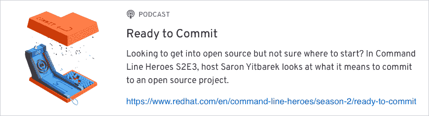](https://www.redhat.com/en/command-line-heroes/season-2/ready-to-commit)

## 派生项目代码

我们将在这里使用的示例项目是命令行英雄游戏。这是一个由 Jared Sprague 和 Michael Clayton 领导的 node 和 HTML5 项目。到目前为止，来自世界各地的许多人都表示有兴趣为这个游戏做贡献，所以这是一个向你展示如何开始的好地方。

你可以在 https://github.com/CommandLineHeroes/hero-engine 找到代码:

[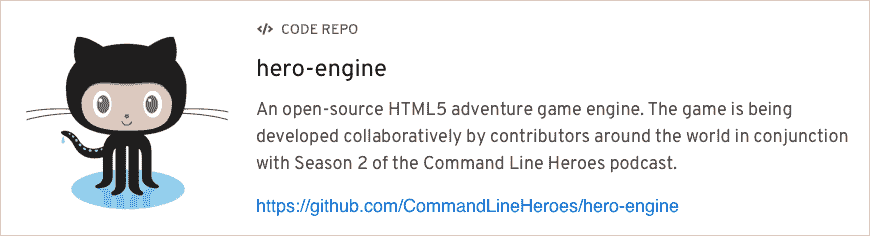](https://github.com/CommandLineHeroes/hero-engine)

当回购的页面加载时，你需要登录你的 GitHub 账户，如果你还没有的话。您将在右上角看到 Fork 按钮，以及一个显示代码被分叉次数的计数器。数字越大，项目及其社区越活跃:


单击 fork 按钮，几秒钟之内，您将获得一个包含原始回购所有代码的 Fork:

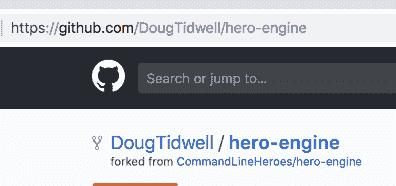

现在转到命令行，克隆你的分叉回购，现在是你的 GitHub 帐户的一部分。

```
doug@ovpn-120-92:~/Developer $ git clone https://github.com/DougTidwell/hero-engine.git
Cloning into 'hero-engine'...
remote: Enumerating objects: 7, done.
remote: Counting objects: 100% (7/7), done.
remote: Compressing objects: 100% (7/7), done.
remote: Total 225 (delta 0), reused 2 (delta 0), pack-reused 218
Receiving objects: 100% (225/225), 754.30 KiB | 2.21 MiB/s, done.
Resolving deltas: 100% (85/85), done.
```

(您最喜欢的 IDE 可能内置了 git 支持，您可以随意使用您喜欢的任何工具。)我们假设您的机器上已经安装了`node`和`npm`。如果没有，访问[nodejs.org](https://nodejs.org)下载并安装它们。现在运行`npm install`,将项目的所有依赖项下载到你的机器上:

```
doug@ovpn-120-92:~/Developer/hero-engine $ npm install
> fsevents@1.2.4 install /Users/doug/Developer/hero-engine/node_modules/fsevents
> node install

[fsevents] Success: "/Users/doug/Developer/hero-engine/node_modules/fsevents/lib/binding/Release/node-v57-darwin-x64/fse.node" already installed
Pass --update-binary to reinstall or --build-from-source to recompile

> git-pre-commit@2.1.4 postinstall /Users/doug/Developer/hero-engine/node_modules/git-pre-commit
> gulp hooks:install

[06:19:02] Using gulpfile ~/Developer/hero-engine/node_modules/git-pre-commit/gulpfile.js
[06:19:02] Starting 'hooks:install'...
[06:19:02] Starting 'hooks:clean'...
[06:19:02] "Deleting file: /Users/doug/Developer/hero-engine/.git/hooks/pre-commit,/Users/doug/Developer/hero-engine/.git/hooks/pre-commit.js,/Users/doug/Developer/hero-engine/.git/hooks/pre-commit-utils/"
[06:19:02] Finished 'hooks:clean' after 18 ms
[06:19:02] Starting 'hooks:install-pre-commit-files'...
[06:19:02] Starting 'hooks:install-util-files'...
[06:19:02] Finished 'hooks:install-pre-commit-files' after 25 ms
[06:19:02] Finished 'hooks:install-util-files' after 19 ms
[06:19:02] Starting 'hooks:pre-commit-permissions'...
[06:19:02] Finished 'hooks:pre-commit-permissions' after 13 ms
[06:19:02] Finished 'hooks:install' after 60 ms

> phaser@3.14.0 postinstall /Users/doug/Developer/hero-engine/node_modules/phaser
> node scripts/support.js

❤ Please help support Phaser development ❤
https://www.patreon.com/photonstorm/

added 726 packages from 491 contributors and audited 4840 packages in 10.165s
found 5 vulnerabilities (1 low, 4 high)
  run `npm audit fix` to fix them, or `npm audit` for details
```

所有这些依赖项大约需要 14，000 个新文件和目录。(说真的。我们没有夸大其词。这只是节点开发人员生活中的一天。

顺便说一句，为了保持我们在这些文章中建立的丰富而传奇的懒惰传统，请随意忽略安装过程中收到的任何安全警告。例如，信息`found 5 vulnerabilities (1 low, 4 high)`可能已经引起了你的注意。当然，作为一个负责任的公民，您可以在`package.json`文件中修复它们并提交一个拉取请求。

## 做出改变

如果我们要提交一个拉请求，我们实际上必须改变一些东西。从运行代码开始。因为这是一个节点项目，所以查看一下`package.json`文件的`scripts`部分，看看如何做:

```
    "scripts": {
        "test": "npm run eslint",
        "eslint": "./node_modules/.bin/eslint src",
        "eslint-fix": "./node_modules/.bin/eslint --fix src",
        "precommit": "npm run eslint-fix",
        "examples": "node ./node_modules/http-server/bin/http-server examples/ -o"
    },
```

对于初学者来说，`examples`脚本似乎是一个不错的起点，所以键入`npm run examples`开始代码:

```
doug@ovpn-120-92:~/Developer/hero-engine $ npm run examples

> hero-engine@0.1.0 examples /Users/doug/Developer/hero-engine
> node ./node_modules/http-server/bin/http-server examples/ -o

Starting up http-server, serving examples/
Available on:
  http://127.0.0.1:8080
  http://192.168.1.78:8080
  http://192.168.99.1:8080
  http://10.10.120.92:8080
Hit CTRL-C to stop the server
```

现在你可以打开浏览器，进入 [localhost:8080](http://localhost:8080) 看到这个页面:

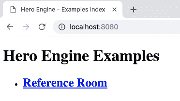

点击资料室链接，查看各种示例:

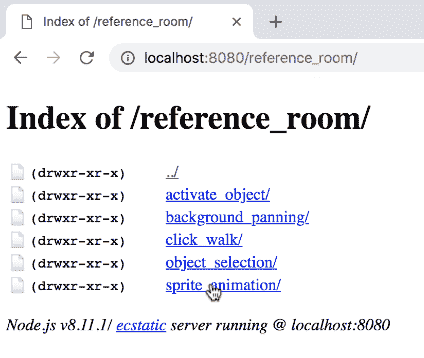

现在拿精灵 _ 动画链接:

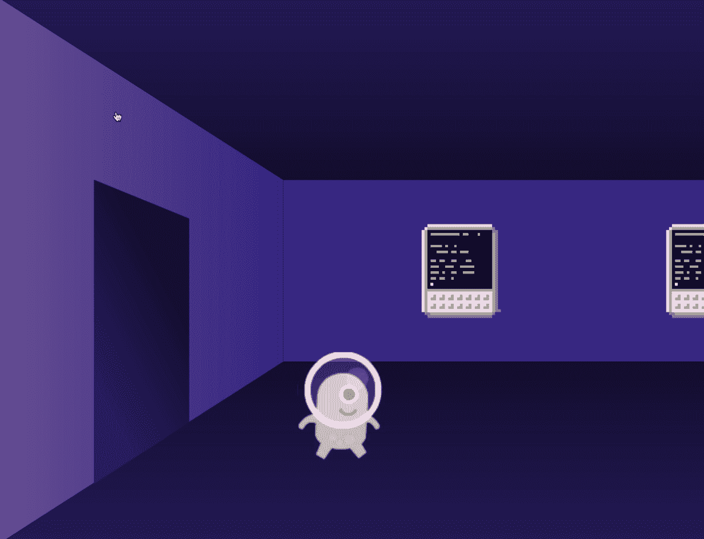

正如你所看到的，这是一个粉红色的小人在房间里蹦蹦跳跳。看着这个小东西来回走动后，你决定让他或她(或它)变得更大。哦，开始编码吧！

对任何开源项目做出贡献的很大一部分是学习代码库是如何工作的。看一下文件结构:

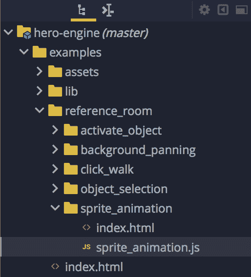

有一个目录名为`examples`。听起来很有希望，所以看看那里。现在你会发现一个叫做`reference_room`的东西。因为这是您用来获取示例的链接的名称，所以更深入一层。有一个目录叫做`sprite_animation`。你看到的页面来自这些文件似乎是合理的。再看`index.html`，那基本上只是一个导入一些 JavaScript 文件的外壳。所以看一看`sprite_animation.js`。很明显，这背后有大量关于游戏库和其他代码的知识，但是当你向下滚动时，你可以看到这段代码被很好地注释了:

```
    ...

    // Create the player sprite animation config
    let config = {
        key   : 'walk',
        frames: this.anims.generateFrameNumbers('player_sheet', {}),
        repeat: -1,
    };

    // Create the walk animation
    this.anims.create(config);

    // Create the player sprite
    player = this.add.sprite(300, 700, 'player');

    // Make player a bit bigger
    player.scaleX = 4;
    player.scaleY = 4;

    // Start the walking animation
    player.anims.play('walk');

    // Camera follows the target image
    this.cameras.main.startFollow(player);

    ...

```

良好注释的代码缩短了任何项目的学习曲线，并且是帮助新人成为开源社区一员的好方法。有个注释说`Make player a bit bigger`，后面把变量`scaleX`和`scaleY`设为`2`。将它们更改为 4，保存文件，然后重新运行代码。

现在你去精灵动画室，果然，人物更大了:

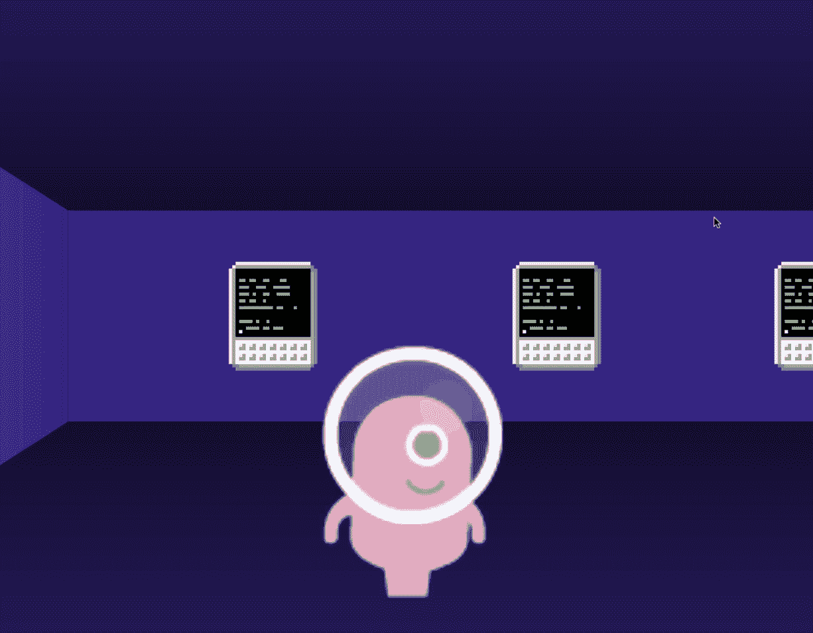

对自己成功地修改了代码感到满意，并且，至少在您看来，事情变得更好了，是时候提交您的拉请求了。

## 创建公关

表演时间到了！

首先，确保执行 git add / commit / push，将您的更改放入分叉的 repo 中:

```
doug@ovpn-120-92:~/Developer/hero-engine $ git add examples/reference_room/sprite_animation/sprite_animation.js 
doug@ovpn-120-92:~/Developer/hero-engine $ git commit -m "Supersized the minion-y thing." 

> hero-engine@0.1.0 precommit /Users/doug/Developer/hero-engine
> npm run eslint-fix

> hero-engine@0.1.0 eslint-fix /Users/doug/Developer/hero-engine
> eslint --fix src

[master d9db6ea] Supersized the minion-y thing.
 1 file changed, 2 insertions(+), 2 deletions(-)
doug@ovpn-120-92:~/Developer/hero-engine $ git push 
Counting objects: 6, done.
Delta compression using up to 8 threads.
Compressing objects: 100% (6/6), done.
Writing objects: 100% (6/6), 524 bytes | 524.00 KiB/s, done.
Total 6 (delta 4), reused 1 (delta 0)
remote: Resolving deltas: 100% (4/4), completed with 4 local objects.
To https://github.com/DougTidwell/hero-engine.git
   1920e0e..d9db6ea  master -> master
```

现在回到你的浏览器和 GitHub 页面。在顶部，单击“拉取请求”链接:

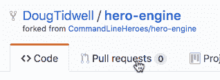

在那里，单击绿色的新提取请求按钮。这会将您带到原始回购，并假设您想要从分叉回购创建一个拉请求:

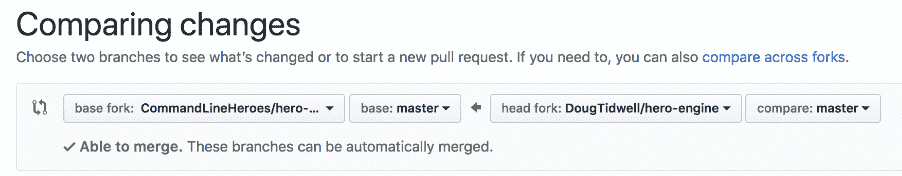

您可以更改分叉和分支，但默认是您想要的。

GitHub 向您展示了这里唯一的变化是`sprite_animation.js`文件中的两个变量:

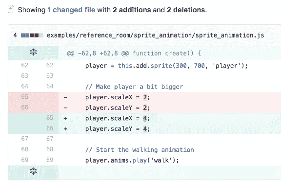

现在，单击绿色的“创建拉式请求”按钮来创建拉式请求:


您的 pull 请求的标题是您将代码推入分叉 repo 时使用的任何提交消息。在标题下面，你应该添加一段描述，确切地说明你修改了什么，以及为什么你认为这些修改是个好主意。如果您修复了一个 bug，请描述您发现的问题以及您是如何解决的。如果您更新了文档，请描述您所做的更改。

在我们的例子中，你做了一个美学上的改变，所以试着去证明迷你的大尺寸是合理的。你可以在文本区使用 markdown，如果你认为有帮助的话，你也可以附加文件。当您为自己的更改做好充分准备后，单击绿色的 Create pull request 按钮，一切都准备好了。

如今，现在....

## 等待是最难的部分

现在你已经创建了你的公关，下一步是等待回应。我们将在这里讨论四种可能的结果。

### 1.没有任何东西

第一种可能的反应是，嗯，完全没有反应。蟋蟀。你是个幽灵。别往心里去，尽可能耐心点。许多维护者是志愿者，他们在全职工作和家庭之间平衡管理社区。也许维护者在度假。也许是他们孩子的生日。也许他们工作忙得不可开交，不能给你的公关应有的时间。在一个活跃的社区中，你可能会在一两个工作日内得到回复，但是在你等待的时候，总是试着把维护者想得最好。

### 2.拒绝

当然，另一种可能的反应是拒绝。在这个例子中，你只是做了一个改变，因为你认为更大的 minion 看起来更好。这是一个品味问题，维护者没有义务将你的艺术观点看得比他们自己的更重要。无论什么情况，希望维护者在拒绝你的请求时是有风度的和有思想的。

### 3.接受

第三个可能发生的事情是 ***胜利*** 。维护人员认为您的更改是一个很棒的想法，所以他们接受了 PR，并将您的更改作为代码库的一部分。你的了不起现在很明显，但是为了你和他人的人际关系，试着保持谦逊。并意识到你的下一个请求可能不会如此顺利。

### D.变更请求

然而，第四种选择是维护者向您发送一个变更请求。也许你建议的改变给了维护者一个思路。不是默认的让小兵变大，也许小兵的尺寸应该在游戏中的某些点改变。维护人员可能会要求您将插件的 X 和 Y 维度参数添加到函数中。为了社区，这是最好的结果。你做了一个简单的改变，这个改变给了维护者一个扩展项目功能的想法，你有机会做这个改变。每个人都赢了。希望维护者喜欢你更新的 PR 并接受它，但是在你完成之前还会有更多的迭代。

## 在整个历史中提取请求

需要记住的一点是，无论 PR 如何解决，它都会在回购中继续存在。让我们来看看这个项目的拉请求历史，通过选择所有状态为 Closed 的项目(一个过滤器`is:pr is:closed`)来访问:

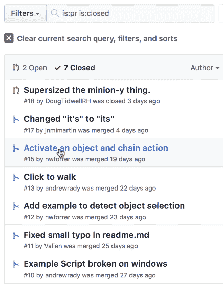

这是项目中的 PR #15:

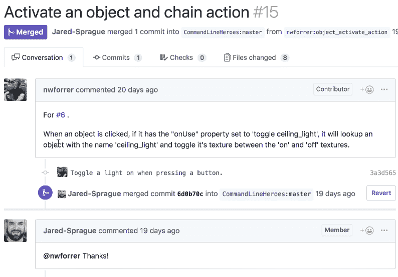

用户`nwforrer`添加到代码中，这样点击一个物体就可以打开和关闭顶灯。如你所见，Jared 愉快地接受了请求。

请求#17 是对文档的修复:

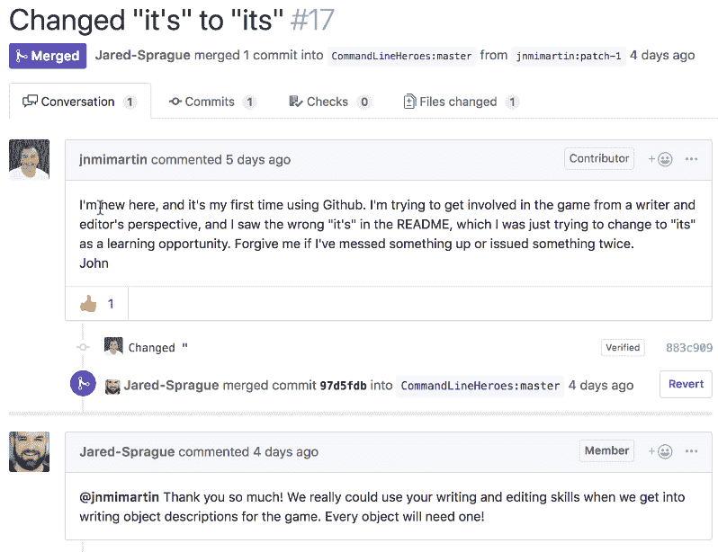

重要的是要记住，除了代码之外，还有很多方法可以为开源项目做出贡献。每个项目都需要文档，命令行英雄游戏也需要插图。Jared 在这里的亲切回应对任何地方的维护者来说都是一个很好的榜样。

## 是时候开始了！

这些是创建拉请求的基础，是你成为开源社区活跃成员的第一步。不难做到。诀窍是找到一个你关心的项目，并想办法把它做得更好。你可能正在创建或修复代码、文档、艺术品或其他东西，但是现在，你是一个贡献者。

我们鼓励你关注[英雄引擎回购](https://github.com/CommandLineHeroes/hero-engine)。关注游戏的发展，不要犹豫加入社区并做出贡献。或者加入任何你关心的社区，开始就好。

你和一个伟大的社区所能完成的是无限的。 祝好运，玩得开心！

*Last updated: April 21, 2021*