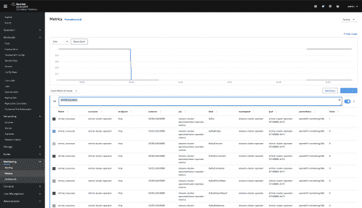
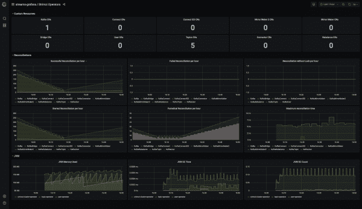
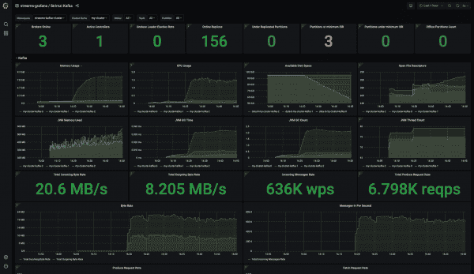
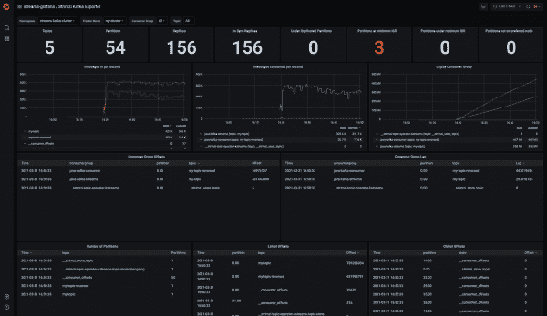

# 将 Red Hat AMQ 流连接到您的 Red Hat OpenShift 4 监控堆栈

> 原文：<https://developers.redhat.com/blog/2021/04/19/connect-amq-streams-to-your-red-hat-openshift-4-monitoring-stack>

监控使用中的系统是[云环境](/topics/kubernetes)中最大的挑战之一。用户总是想知道他们的应用程序在生产中是如何工作的。例如，他们想知道[红帽 OpenShift](/products/openshift/overview) 如何利用其资源；或者如何监控正在使用的系统，如[红帽 AMQ 流](/products/amq/download)。

AMQ 流，strim zi T1 的企业版，从 T2 Apache Kafka T3 集群、Apache Zookeeper 集群和其他组件中导出了许多有用的指标。我们可以使用[普罗米修斯](https://prometheus.io)来收集这些指标，并将它们显示在 [Grafana](https://grafana.com) 仪表盘中。将 AMQ 流指标导出到 Grafana 非常容易，在 OpenShift 4 上使用现有的监控堆栈也很容易。

本文向您展示了如何使用默认的 [OpenShift 4 监控堆栈](https://docs.openshift.com/container-platform/4.7/monitoring/configuring-the-monitoring-stack.html)快速设置一个新的或预先存在的 AMQ 流部署。

## 安装 AMQ 流和 Grafana

所有用户都可以通过以下两种方式之一使用现有的监视堆栈:创建新的名称空间并从头开始部署 AMQ 流，或者使用预先存在的 AMQ 流实例并更新其运行的配置名称空间。

无论哪种方式，下面的示例都假设您在一个名称空间中有集群范围的 AMQ 流[操作符](/topics/kubernetes/operators)，在不同的名称空间中有 Kafka 集群。我们将不创建新的命名空间；相反，我们将使用`streams-cluster-operator`作为 AMQ 流操作符，使用`streams-Kafka-cluster`作为 Kafka 集群，并在它们之间切换。

**注**:参见 OpenShift 上的 [*Hello World for AMQ 流，获得从头安装 AMQ 流的详细指南。你可以遵循那里的所有步骤，或者查看描述相同步骤的*](https://developers.redhat.com/products/amq/hello-world-amq-streams-openshift#fndtn-macos)*[红帽 AMQ 流文档](https://access.redhat.com/documentation/en-us/red_hat_amq/2020.q4/html/deploying_and_upgrading_amq_streams_on_openshift/deploy-tasks_str#cluster-operator-str)。*

### 确认您的新 AMQ 流安装

一旦您完成了 AMQ 流安装的设置，您应该会看到`strimzi-cluster-operator` pod 启动并运行:

```
$ oc get pod -n streams-cluster-operator

strimzi-cluster-operator-7bff5b4d65-jmgqr    1/1     Running   0          12m

```

### 部署 Kafka 集群

接下来，我们将部署一个配置了指标的 Kafka 集群。在安装 AMQ 流的过程中，您下载了带有安装文件的示例，包括 Operators、Kafka 和 metrics。带有指标的`Kafka`定制资源的示例存储在`examples/metrics/Kafka-metrics.yaml`下。`Kafka`指标现在存储在一个新的配置映射中，这个映射在`Kafka`定制资源中被引用。指标格式没有改变。每当您更改指标配置时，您还需要更改配置映射。

例如，您可以使用 AMQ 流的默认配置，并通过执行以下命令来部署一切:

```
$ oc apply -f examples/metrics/kafka-metrics.yaml -n streams-kafka-cluster
```

一段时间后，您应该会看到 Kafka 集群启动并运行:

```
$ oc get pod -n streams-kafka-cluster

my-cluster-entity-operator-cf887b59-645zt    3/3     Running   0          6m
my-cluster-kafka-0                           1/1     Running   0          9m
my-cluster-kafka-1                           1/1     Running   0          9m
my-cluster-kafka-2                           1/1     Running   0          9m
my-cluster-kafka-exported-fsf343r            1/1     Running   0          5m
my-cluster-zookeeper-0                       1/1     Running   0          11m
my-cluster-zookeeper-1                       1/1     Running   0          11m
my-cluster-zookeeper-2                       1/1     Running   0          11m

```

您可以在自定义资源中更改名称，并在不同的名称空间中部署其他集群。由于集群范围的安装，AMQ 流运营商将为部署到 OpenShift 集群的所有集群提供服务。

### 安装 Grafana 操作器

在本节中，我们将设置一个 Granfana 实例。Grafana 默认安装在每个 OpenShift 4 实例中。不幸的是，预装的 Grafana 实例是只读的，您只能使用预定义的 Grafana 仪表板。因此，我们被迫将自己的 Grafana 实例部署到 OpenShift 中。

让我们从一个名为`streams-grafana`的新名称空间开始。然后，我们将通过创建适当的`operatorgroup`和`subscription`从 OpenShift OperatorHub 安装 Grafana。以下是安装 Grafana 操作器的过程:

1.  创建新的名称空间:

    ```
    $ oc create namespace streams-grafana
    ```

2.  创建操作员组:

    ```
    $ cat << EOF | oc apply -f -
    apiVersion: operators.coreos.com/v1
    kind: OperatorGroup
    metadata:
      name: grafana-group
      namespace: streams-grafana
      labels:
        app: grafana
    spec:
      targetNamespaces:
        - streams-grafana
    EOF
    ```

3.  为 Grafana 操作员创建订阅:

    ```
    $ cat << EOF | oc apply -f -
    apiVersion: operators.coreos.com/v1alpha1
    kind: Subscription
    metadata:
      name: grafana-operator
      namespace:  streams-grafana
    spec:
      channel: alpha
      installPlanApproval: Automatic
      name: grafana-operator
      source: community-operators
      sourceNamespace: openshift-marketplace
      startingCSV: grafana-operator.v3.9.0
    EOF
    ```

4.  确认 Grafana 操作器安装成功:

    ```
    $ oc get pods -n streams-grafana

    NAME                               READY   STATUS    RESTARTS   AGE
    grafana-operator-957c6dcd9-wrljw   1/1     Running   0          65s

    ```

## 将 AMQ 流操作器和 Kafka 集群连接到您的监控堆栈

在 OpenShift 安装过程中，默认的 OpenShift 4 监控堆栈部署在`openshift-monitoring`名称空间中。通过额外的配置，您可以重用它来监控您的应用程序。

首先，您需要在您的 OpenShift 集群中允许`user-workloads`。您可以通过创建一个到`openshift-monitoring`名称空间的新配置映射来实现这一点。以下是我们示例的配置图:

```
$ cat << EOF | oc apply -f -
apiVersion: v1
kind: ConfigMap
metadata:
  name: cluster-monitoring-config
  namespace: openshift-monitoring
data:
  config.yaml: |
    enableUserWorkload: true
EOF

```

在应用配置映射后，您应该在`openshift-user-workload-monitoring`名称空间中看到新的 pod:

```
$ oc get po -n openshift-user-workload-monitoring

NAME                                   READY   STATUS    RESTARTS   AGE
prometheus-operator-868cd68496-jl44r   2/2     Running   0          118s
prometheus-user-workload-0             5/5     Running   1          112s
prometheus-user-workload-1             5/5     Running   1          112s
thanos-ruler-user-workload-0           3/3     Running   0          111s
thanos-ruler-user-workload-1           3/3     Running   0          111s

```

其次，您必须为所有 AMQ 流组件部署 pod 监视器。你可以在`examples/metrics/prometheus-install/strimzi-pod-monitor.yaml`中找到吊舱监视器 YAML。您需要为您使用的每个名称空间和组件创建一个 pod 监视器。通常，您需要在`kafka`名称空间中为`Kafka`准备一个 pod 监视器，在`cluster-operator`名称空间中为`cluster-operator`准备一个，以此类推:

```
$ cat examples/metrics/prometheus-install/strimzi-pod-monitor.yaml | sed "s#myproject#streams-kafka-cluster#g" | oc apply -n streams-kafka-cluster -f -
$ cat examples/metrics/prometheus-install/strimzi-pod-monitor.yaml | sed "s#myproject#streams-cluster-operator#g" | oc apply -n streams-cluster-operator -f -

```

请注意，您可以移除未使用的 pod 监视器，如`KafkaBridge`。

### 检查普罗米修斯的 strizzi 或卡夫卡查询

最后，在 OpenShift 管理员控制台中，导航到**监控**选项卡并打开**指标**。尝试一些与 Strimzi 或 Kafka 相关的查询。图 1 显示了对`strimzi_resources`的查询。

[](/sites/default/files/blog/2020/09/Screenshot-2020-09-24-at-15.27.50.png)

Figure 1: Querying Prometheus in the OpenShift administrator console.

## 将 Granfana 实例连接到 OpenShift 4 Prometheus

现在，我们准备创建一个 Grafana 实例。因为 Grafana 操作符已经启动并正在运行，所以我们只需要使用以下命令部署 Grafana 实例:

```
$ cat << EOF | oc apply -f -
apiVersion: integreatly.org/v1alpha1
kind: Grafana
metadata:
  name: grafana
  namespace: streams-grafana
spec:
  ingress:
    enabled: True
  config:
    log:
      mode: "console"
      level: "warn"
    security:
      admin_user: "admin"
      admin_password: "admin"
    auth:
      disable_login_form: False
      disable_signout_menu: True
    auth.anonymous:
      enabled: True
  dashboardLabelSelector:
    - matchExpressions:
        - { key: app, operator: In, values: [strimzi] }
  resources:
    limits:
      cpu: 2000m
      memory: 8000Mi
    requests:
      cpu: 100m
      memory: 200Mi
EOF
```

随着 Grafana 实例的运行，我们需要从 Prometheus 创建一个数据源。在此之前，我们需要为 Grafana 创建一个`ServiceAccount`和`ClusterRoleBinding`。这里是`ServiceAccount`:

```
$ cat << EOF | oc apply -f -
apiVersion: v1
kind: ServiceAccount
metadata:
  name: grafana-serviceaccount
  labels:
    app: strimzi
    namespace: streams-grafana
EOF

```

这里是`ClusterRoleBinding`:

```
$ cat << EOF | oc apply -f -
apiVersion: rbac.authorization.k8s.io/v1
kind: ClusterRoleBinding
metadata:
  name: grafana-cluster-monitoring-binding
  labels:
    app: strimzi
subjects:
  - kind: ServiceAccount
    name: grafana-serviceaccount
    namespace: streams-grafana
roleRef:
  kind: ClusterRole
  name: cluster-monitoring-view
  apiGroup: rbac.authorization.k8s.io
EOF
```

现在，我们可以得到一个令牌来授权 Grafana 进入普罗米修斯:

```
$ export TOKEN=$(oc serviceaccounts get-token grafana-serviceaccount -n streams-grafana)
```

拥有令牌后，运行以下命令创建一个数据源并将令牌传递给它:

```
$ cat << EOF | oc apply -f -
apiVersion: integreatly.org/v1alpha1
kind: GrafanaDataSource
metadata:
  name: grafanadatasource
  namespace: streams-grafana
spec:
  name: middleware.yaml
  datasources:
    - name: Prometheus
      type: prometheus
      access: proxy
      url: https://thanos-querier.openshift-monitoring.svc.cluster.local:9091
      basicAuth: false
      basicAuthUser: internal
      isDefault: true
      version: 1
      editable: true
      jsonData:
        tlsSkipVerify: true
        timeInterval: "5s"
        httpHeaderName1: "Authorization"
      secureJsonData:
        httpHeaderValue1: "Bearer $TOKEN"
EOF

```

## 在 Grafana 实例中设置您的 AMQ 流仪表板

在`examples/metrics/grafana-dashboards`文件夹中可以找到 AMQ 流的仪表板示例。在 Grafana 实例中包含仪表板有两种方法。一种选择是使用 Grafana 用户界面(UI)并导航到**仪表板**页面。您可以包括可用的仪表板，并选择适当的数据源。第二个选项是用 dashboard JSON 创建一个`GrafanaDashboard`定制资源。

对于这个例子，我们将采取第二种选择。下面是一个脚本，它从 examples 文件夹中获取 JSON 并创建一个集合运行器。转到您想要使用的 Grafana 仪表板，替换您的 JSON 仪表板的`.spec.name`和您的自定义资源(CR)定义的`.metadata.name`，如下所示:

```
$ cat << EOF > /tmp/dashboard.yaml
apiVersion: integreatly.org/v1alpha1
kind: GrafanaDashboard
metadata:
  labels:
    app: strimzi
    monitoring-key: middleware
  name: strimzi-operators
  namespace: streams-grafana
spec:
  name: strimzi-operators.json
  json: |
    PLACEHOLDER
EOF

$ DATA="$(jq 'del(.__inputs,.__requires)'  examples/metrics/grafana-dashboards/strimzi-operators.json)" yq eval ".spec.json = strenv(DATA)" /tmp/dashboard.yaml | sed -e '/DS_PROMETHEUS/d' | oc apply -f -
```

您也可以对其他仪表板使用相同的命令；请记住，如果这样做，您必须更改`.spec.name`和`.metadata.name`。

最后，您可以通过导出的路径访问 Grafana UI:

```
$ oc get route grafana-route -n streams-grafana -o=jsonpath='{.spec.host}'
```

进入 UI 后，您可以看到导入的仪表板。图 2 显示了 AMQ 流示例仪表板如何表示来自已安装的运营商的指标。

[](/sites/default/files/blog/2021/03/Screen-Shot-2021-03-31-at-16.50.54.png)

Figure 2: Metrics from the AMQ Streams Operators.

图 3 显示了示例仪表板中的 Kafka 指标。

[](/sites/default/files/blog/2021/03/Screen-Shot-2021-03-31-at-16.50.46.png)

Figure 3: A Kafka dashboard with collected data.

最后，图 4 显示了 Kafka Exporter 仪表板。该仪表板显示了各种主题以及附加到这些主题的客户端。

[](/sites/default/files/blog/2021/03/Screen-Shot-2021-03-31-at-16.50.36.png)

Figure 4: The Kafka Exporter dashboard with collected data.

## 在 OpenShift 4 中设置您的 AMQ 流仪表板

不安装 Grafana 也可以使用 OpenShift 仪表盘。与 Grafana 相比，OpenShift 仪表盘功能有限，但足以快速浏览。您将在管理控制台的**监控**下找到 OpenShift 仪表盘。例如，您可以使用以下命令导入 Strimzi 仪表板:

```
$ cat << EOF > /tmp/file.yaml
kind: ConfigMap
apiVersion: v1
metadata:
  name: strimzi-operators-dashboard
  namespace: openshift-config-managed
labels:
  console.openshift.io/dashboard: 'true'
data:
  strimzi-operators: |-
    PLACEHOLDER
EOF

$ DATA="$(jq 'del(.__inputs,.__requires)'  strimzi-examples/examples/metrics/grafana-dashboards/strimzi-operators.json)" yq eval ".data.strimzi-operators = env(DATA)" /tmp/file.yaml | sed -e 's/DS_PROMETHEUS/d' | oc apply -f -

```

现在，您应该能够在 OpenShift UI 中列出`strimzi-operators`仪表板，并看到类似于图 5 所示的内容。

[](/sites/default/files/blog/2021/02/Screen-Shot-2021-03-31-at-10.17.48.png)

Figure 5: An AMQ Streams dashboard in the OpenShift 4 dashboards view.

## 结论

在本文中，您已经看到了如何设置和使用 OpenShift 4 监控堆栈来监控 AMQ 流。您可以监视现有的 AMQ 流集群，而无需重新部署 AMQ 流，并且您还可以设置自己的 Grafana 仪表板来获得更详细的指标。应用适当的定制资源所需的一切都可以从`oc`客户端获得。如果想避免手动复制粘贴，可以使用`yq`命令。

*Last updated: October 14, 2022*