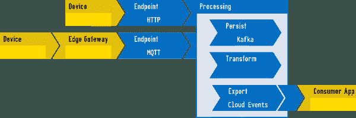
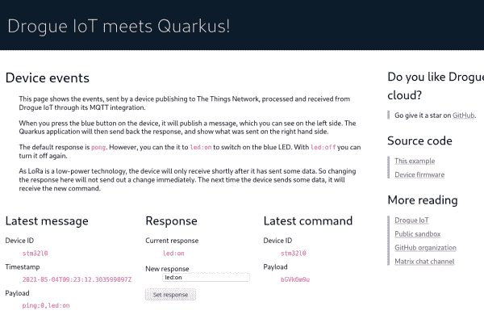

# 将 quartus 应用程序与 drogue iot 和 lorawan 连接起来

> 原文：<https://developers.redhat.com/articles/2021/06/10/connect-quarkus-applications-drogue-iot-and-lorawan>

[Drogue 物联网](https://drogue.io)项目的目标是让设备和基于云的应用程序之间的连接变得更加容易。在本文中，我们将展示如何实现基于 Drogue 设备的固件，该设备可以使用低功耗 [LoRaWAN](https://lora-alliance.org/) 协议与云中的 [Quarkus](/topics/quarkus/) 应用程序进行通信。

## 物联网毒品

很多开源技术已经存在于信息和物联网领域，所以尝试使用尽可能多的现有工具是有意义的。然而，技术随着时间而变化，并不是现在存在的一切都适合未来的世界。 [C 和 C++](/topics/c/) 仍然存在内存安全问题，而*云原生*、 *[无服务器](https://developers.redhat.com/topics/serverless-architecture/)* 和 *pods* 是在设计云端应用时可能需要不同方法的概念。所以，Drogue IoT 是来帮忙的。

Drogue Device 是一个用 [Rust](https://www.rust-lang.org/) 编写的固件框架，采用基于 actor 的编程模型。Drogue Cloud 是一个薄薄的服务层，它为现有技术(如 [Knative](https://knative.dev/) 和 [Apache Kafka](https://kafka.apache.org/) )创建了一个物联网友好的 API，并在另一端使用 [CloudEvents](https://cloudevents.io/) 提供了一个云友好的 API。这个想法不是提供独立的组件，而是给你一个随时可以运行的整体解决方案:物联网即服务。锥套物联网架构如图 1 所示。

[](/sites/default/files/blog/2021/05/architecture.png)

Figure 1: Overview diagram of the Drogue IoT architecture.

## 洛拉万网络覆盖

LoRaWAN 是一个低功耗的无线网络，可以让你用电池运行一个设备几个月，不时地向云发送遥测数据。为了实现这一点，你需要洛拉万网络覆盖，而[物联网](https://www.thethingsnetwork.org/) (TTN)正好提供了这一点。如果您所在的地区没有覆盖，您可以通过运行自己的网关来扩展 TTN 网络。TTN 提供了一种公共服务，允许您在设备和应用程序之间交换数据。

## 该死的装置

与锥套装置交换数据很容易。下面的代码片段关注于交换数据的实际代码:

```
let mut tx = String::<heapless::consts::U32>::new();
let led = match self.config.user_led.state().unwrap_or_default() {
    true => "on",
    false => "off",
};
write!(&mut tx, "ping:{},led:{}", self.counter, led).ok();
let tx = tx.into_bytes();

let mut rx = [0; 64];
let result = cfg
    .lora
    .request(LoraCommand::SendRecv(&tx, &mut rx))
    .unwrap()
    .await;
```

注意到`await`关键词了吗？是的，这确实是运行在嵌入式 [STM32 皮层-M0 设备](https://www.st.com/en/evaluation-tools/b-l072z-lrwan1.html)上的异步 Rust。由于 embassy 框架和 Drogue 设备中的驱动程序，异步编程变得非常简单。由于 Rust，您的代码不太可能导致任何未定义的行为，比如损坏的内存。

## 第四的

在云方面，我们希望有一个简单的“协调循环”设备报告其当前状态，我们从中得出所需的状态。这可能会产生一个我们想要发送回设备的命令。再次强调，关注重要的代码:

```
@Incoming("event-stream")
@Outgoing("device-commands")
@Broadcast
public DeviceCommand process(DeviceEvent event) {

    var parts = event.getPayload().split(",");

    // then we check if the payload is, what we expect...
    if (parts.length != 2 || !parts[0].startsWith("ping:") || !parts[1].startsWith("led:")) {
        // .. if not, return with no command
        return null;
    }

    // check if the configured response is about the LED, and if it matches ...
    if (!this.response.startsWith("led:") || parts[1].equals(this.response)) {
        // ... it is not, or it matches, so we return with no command
        return null;
    }

    var command = new DeviceCommand();
    command.setDeviceId(event.getDeviceId());
    command.setPayload(this.response.getBytes(StandardCharsets.UTF_8));

    return command;

}
```

很简单，不是吗？当然，你可以把它变得更复杂，但是我们让你来决定。

Quarkus 应用程序使用 CloudEvents，它为不同的消息传递技术提供了标准化的事件表示，比如 Kafka、HTTP 和 MQTT。

## 云毒品

到目前为止，这非常简单，只关注实际的用例。然而，我们在中间遗漏了一大块:我们如何将 Quarkus 与实际设备连接起来？当然，我们可以自己重新创建所有这些——实现 TTN API、注册设备、处理事件。或者，我们可以简单地使用锥套云，让它为我们做管道工作。

使用`drg`命令行工具创建新的应用程序和设备很容易:

```
$ drg create application my-app
$ drg create device --app my-app my-device
```

Drogue Cloud 中的设备注册表不仅存储设备信息，还可以与其他服务协调。添加以下信息将使其与 TTN 同步:

```
$ drg create application my-app --spec '{
    "ttn": {
            "api": {
                "apiKey": "...",
                "owner": "my-ttn-username",
            "region": "eu1"
            }
    }
}'
$ drg create --app my-app device my-device --spec '{
    "ttn": {
        "app_eui": "0123456789ABCDEF",
        "dev_eui": "ABCDEF0123456789",
            "app_key": "0123456789ABCDEF...",
        "frequency_plan_id": "...",
        "lorawan_phy_version": "PHY_V1_0",
            "lorawan_version": "MAC_V1_0"
    }
}'
```

这将创建一个新的 TTN 应用程序，注册设备，设置一个 webhook，在 Drogue Cloud 中创建网关配置，并确保凭证存在并同步。

## 在 LoRaWAN 端到端研讨会中了解更多信息

是不是有点太快了？是的，的确！对于一篇文章来说，这些信息太多了，所以我们想把重点放在最重要的部分。我们把你需要知道的一切都放在一个研讨会上，这样你就可以更详细地阅读它，并获得更多的背景知识。在本次研讨会结束时，您应该拥有一个 web 前端来控制您的设备，如图 2 所示。

[](/sites/default/files/blog/2021/05/quarkus-screen.png)

Figure 2: The Quarkus web front-end.

最重要的是，你将为在 Drogue IoT 上创建自己的应用打下坚实的基础。

*Last updated: August 26, 2022*