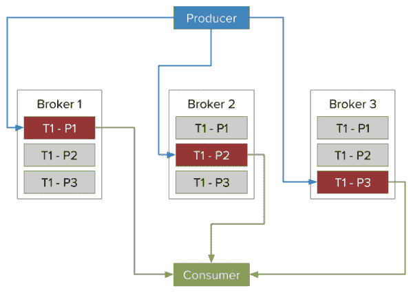
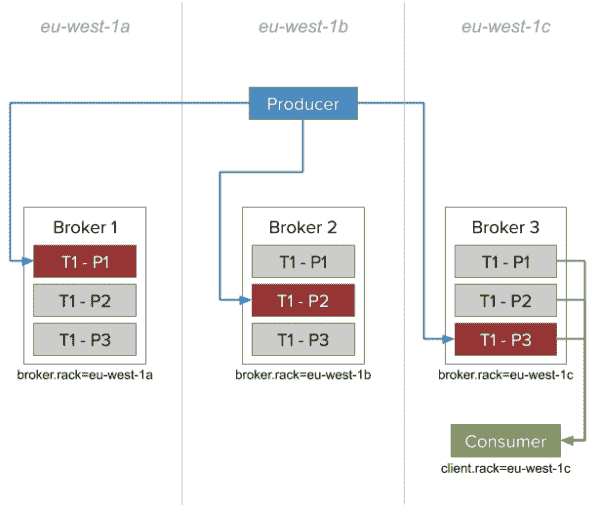

# 使用来自 Apache Kafka 2.4.0 和 AMQ 流中最近副本的消息

> 原文：<https://developers.redhat.com/blog/2020/04/29/consuming-messages-from-closest-replicas-in-apache-kafka-2-4-0-and-amq-streams>

由于 [Apache Kafka 2.4.0](https://downloads.apache.org/kafka/2.4.0/RELEASE_NOTES.html) 的变化，消费者不再需要连接到领导者副本来消费消息。在本文中，我将向您介绍 Apache Kafka 的新`ReplicaSelector`界面及其可定制的`RackAwareReplicaSelector`。我将简要解释新的机架感知选择器的优点，然后向您展示如何使用它更有效地平衡 Amazon Web Services (AWS)可用性区域的负载。

对于这个例子，我们将使用 Red Hat AMQ 流和运行在 Amazon AWS 上的 Red Hat OpenShift 容器平台 4.3。

**注意**:无论是 [AMQ 流](https://access.redhat.com/products/red-hat-amq) 1.4.0 还是 [Strimzi](https://strimzi.io/) 0.16.0 都实现了新的`ReplicaSelector`接口。

## Apache Kafka 消息传递系统概述

[阿帕奇卡夫卡](http://kafka.apache.org/)使用*主题*发送和接收信息。每个卡夫卡主题由一个或多个分区组成，这些分区充当*碎片*。由于有了分区，每个主题可以被分成更小的单元，并且这些单元是可伸缩的。当 Kafka 生产者发送消息时，它使用消息密钥来决定使用哪个分区。如果没有人设置消息密钥，那么*生成器*将使用循环调度。对于*消费者*来说，它选择它需要的分区数量，并从这些分区中消费消息。每个使用者所需的分区数量取决于同一个使用者组中运行的使用者数量。

在 Kafka broker 中，分区并不是最小的单元。每个*分区*由一个或多个*副本*组成。副本通过保留数据的拷贝和充当备用机制来帮助确保可用性。在每个分区中，一个副本被选为领导者，其余的副本是追随者。当失去领导者时，一个新的复制品将被选出，并开始向生产者和消费者提供信息。

## Apache Kafka 2.4.0 中的新功能

以前只有*首领*复制品可以接收生产者的消息，并发送给消费者。*跟随者*复制品只能复制和存储来自领导者的数据。图 1 是显示这个旧的消息传递模型的流程图。

[](/sites/default/files/blog/2020/03/Before-KIP-392.png)Producing and consuming messages from leader replica only

图一。从领导者副本生成和使用消息。">

Apache Kafka 2.4.0 实现了来自 [Kafka 改进建议(KIP) 392](https://cwiki.apache.org/confluence/display/KAFKA/KIP-392%3A+Allow+consumers+to+fetch+from+closest+replica) 的建议，显著改变了 Kafka 的消息传递行为。消费者现在可以直接使用来自跟随者副本的消息，他们不再需要连接到领导者副本。图 2 展示了这个新的数据流模型。

[](/sites/default/files/blog/2020/03/After-KIP-392.png)Consuming messages from follower replicas

图二。消费来自跟随者副本的消息。">

## 新的复制选择器接口

KIP-392 实现了一个新的代理插件接口`ReplicaSelector`，它允许您提供自定义逻辑来确定消费者应该使用哪个副本。您可以使用`replica.selector.class`选项来配置插件。Kafka 提供了两种选择器实现。`LeaderSelector`总是选择主副本，因此消息传递的工作方式和以前完全一样。`LeaderSelector`也是默认的选择器，因此默认情况下 Kafka 2.4.0 的消息传递行为与以前的版本相同。

`RackAwareReplicaSelector`尝试使用货架 ID 选择最接近消费者的复制品。您还可以选择提供一个自定义选择器来实现您自己的逻辑；然而，从最近的副本获取是最常见的用例，因此我们将重点关注这一点。

### 查找最近的副本

Kafka 已经允许你平衡不同机架上的复制品。您可以使用`broker.rack`配置为每个代理分配一个机架 ID。然后，经纪人会尝试将副本分散到尽可能多的机架上。此功能提高了应对机架故障的弹性。它以物理服务器机架命名，但大多数环境都有类似的概念。AMQ 流和 Strimzi 长期以来都支持机架感知。

对于熟悉在 Amazon Web Services 上运行 Apache Kafka 的开发人员来说，AWS 可用性区域对应于机架。图 3 显示了一个配置，其中所有代理都在可用性区域`us-east-1a`中运行。在这种情况下，机架配置将是`broker.rack=us-east-1a`。

[](/sites/default/files/blog/2020/03/KIP-392-in-AWS.png)Consuming from replicas in the same AWS Availability Zone

图 3。从同一个 AWS 可用性区域中的副本使用。">

### 配置消费者

与您为经纪人所做的一样，您可以配置新的`client.rack`来为消费者分配一个机架 ID。启用后，`RackAwareReplicaSelector`会尝试将消费者的`client.rack`与可用的`broker.rack`相匹配。然后，它会选择与客户端具有相同机架 ID 的副本。

如果同一个机架中有多个副本，`RackAwareReplicaSelector`总是选择最新的副本。如果未指定机架 ID，或者如果它找不到具有相同机架 ID 的复本，它将退回到主复本。

## 在 AMQ 流中使用试管架感知选择器

让我们运行一个示例，看看新的机架感知选择器在实践中是如何工作的。我们将使用运行在亚马逊 AWS 上的 Red Hat OpenShift 容器平台 4.3 的 [AMQ 流](https://www.redhat.com/en/resources/amq-streams-datasheet)。

### 步骤 1:部署 Apache Kafka 集群

我们要做的第一件事是部署一个 Apache Kafka 集群，如下所示:

```
apiVersion: kafka.strimzi.io/v1beta1
kind: Kafka
metadata:
    name: my-cluster
spec:
    kafka:
        version: 2.4.0
        replicas: 3
        listeners:
            plain: {}
            tls: {}
        rack:
            topologyKey: failure-domain.beta.kubernetes.io/zone
        config:
            replica.selector.class: org.apache.kafka.common.replica.RackAwareReplicaSelector
            auto.create.topics.enable: "false"
            offsets.topic.replication.factor: 3
            transaction.state.log.replication.factor: 3
            transaction.state.log.min.isr: 2
            log.message.format.version: "2.4"
        storage:
            type: jbod
            volumes:
              - id: 0
                type: persistent-claim
                size: 100Gi
                deleteClaim: false
    zookeeper:
        replicas: 3
        storage:
            type: persistent-claim
            size: 100Gi
            deleteClaim: false
    entityOperator:
        topicOperator: {}
        userOperator: {}

```

### 步骤 2:启用机架感知选择器

接下来，我们启用机架感知选择器。这包括两个部分。首先设置`rack`配置以使用代理运行的可用性区域。通过配置使用正确的 Kubernetes 节点的`failure-domain.beta.kubernetes.io/zone`标签来启用`rack-awareness`特性。

接下来，通过配置使用`replica.selector.class`选项并将其设置为`org.apache.kafka.common.replica.RackAwareReplicaSelector`来激活机架感知选择器。

### 步骤 3:创建一个有三个副本的主题

Kafka 集群有三个节点。我们使用了机架感知特性来配置相应的 Kubernetes 相似性规则，这确保了节点分布在我们的可用性区域中。现在，我们可以创建一个包含三个副本的主题:

```
apiVersion: kafka.strimzi.io/v1beta1
kind: KafkaTopic
metadata:
    name: my-topic
    labels:
        strimzi.io/cluster: my-cluster
spec:
    partitions: 3
    replicas: 3

```

### 步骤 4:检验配置

接下来，我们使用`kafka-topcis.sh`工具来验证主题是否被创建，以及三个分区的领导者是否分布在所有三个代理中:

```
$ bin/kafka-topics.sh --bootstrap-server my-cluster-kafka-bootstrap:9092 --describe --topic my-topic
Topic:my-topic  PartitionCount:3        ReplicationFactor:3 Configs:message.format.version=2.3-IV1
        Topic: my-topic Partition: 0    Leader: 1 Replicas: 1,0,2 Isr: 1,0,2
        Topic: my-topic Partition: 1    Leader: 2 Replicas: 2,1,0 Isr: 2,1,0
        Topic: my-topic Partition: 2    Leader: 0 Replicas: 0,2,1 Isr: 0,2,1

```

### 步骤 5:配置生产者和消费者

代理和主题已经准备好了，所以现在我们需要一个生产者和消费者。生产者在这里不起作用，所以我们可以使用 Kafka 控制台生产者或任何其他生产者来发送消息。在这种情况下，我们将使用 Kafka 生产者:

```
$ bin/kafka-console-producer.sh --broker-list=my-cluster-kafka-bootstrap:9092 --topic my-topic

```

`client.rack`选项定义了客户端将使用哪个区域来消费消息。在 Kafka 控制台消费者中，我们使用`--consumer-property`选项来指定一个`client.rack`:

```
$ bin/kafka-console-consumer.sh --bootstrap-server=my-cluster-kafka-bootstrap:9092 --topic my-topic --consumer-property client.rack=eu-west-1c

```

注意，`--consumer-property`选项并不局限于控制台消费者。您可以将它用于任何 Java 客户端或支持该特性的任何其他语言的客户端。您只需在配置消费者时指定`client.rack`:

```
Properties props = new Properties();
props.put(ConsumerConfig.BOOTSTRAP_SERVERS_CONFIG, ”my-cluster-kafka-bootstrap:9092”);
props.put(ConsumerConfig.CLIENT_RACK_CONFIG, ”eu-west-1c”);

```

### 步骤 6:将日志级别设置为调试

乍看起来，客户端就像其他消费者一样使用消息。那么我们如何确定它是从我们的跟随者副本中消耗的呢？我们需要将`org.apache.kafka.clients.consumer.internals.Fetcher`类的日志级别设置为`DEBUG`。

从代理获取消息时,`DEBUG`设置为我们提供了更详细的信息。指定了`client.rack`之后，我们现在可以看到这样的日志:

```
[2020-02-24 21:39:53,264] DEBUG [Consumer clientId=consumer-console-consumer-47576-1, groupId=console-consumer-47576] Added READ_UNCOMMITTED fetch request for partition my-topic-0 at position FetchPosition{offset=789, offsetEpoch=Optional[0], currentLeader=LeaderAndEpoch{leader=my-cluster-kafka-1.my-cluster-kafka-brokers.myproject.svc:9092 (id: 1 rack: eu-west-1b), epoch=0}} to node my-cluster-kafka-0.my-cluster-kafka-brokers.myproject.svc:9092 (id: 0 rack: eu-west-1c) (org.apache.kafka.clients.consumer.internals.Fetcher)
[2020-02-24 21:39:53,264] DEBUG [Consumer clientId=consumer-console-consumer-47576-1, groupId=console-consumer-47576] Added READ_UNCOMMITTED fetch request for partition my-topic-2 at position FetchPosition{offset=724, offsetEpoch=Optional[0], currentLeader=LeaderAndEpoch{leader=my-cluster-kafka-2.my-cluster-kafka-brokers.myproject.svc:9092 (id: 2 rack: eu-west-1a), epoch=0}} to node my-cluster-kafka-0.my-cluster-kafka-brokers.myproject.svc:9092 (id: 0 rack: eu-west-1c) (org.apache.kafka.clients.consumer.internals.Fetcher)
[2020-02-24 21:39:53,264] DEBUG [Consumer clientId=consumer-console-consumer-47576-1, groupId=console-consumer-47576] Added READ_UNCOMMITTED fetch request for partition my-topic-1 at position FetchPosition{offset=760, offsetEpoch=Optional[0], currentLeader=LeaderAndEpoch{leader=my-cluster-kafka-0.my-cluster-kafka-brokers.myproject.svc:9092 (id: 0 rack: eu-west-1c), epoch=0}} to node my-cluster-kafka-0.my-cluster-kafka-brokers.myproject.svc:9092 (id: 0 rack: eu-west-1c) (org.apache.kafka.clients.consumer.internals.Fetcher)

```

该日志向我们保证，客户端正在从我们为主题设置的三个不同分区获取消息。这个分区的领导者总是不同的代理，但是获取请求总是被发送到`my-cluster-kafka-0.my-cluster-kafka-brokers.myproject.svc:9092`。在我的例子中，这是运行在`eu-west-1c`区域的代理。

## 日志比较

您可能想知道如果我们不指定`client.rack`选项，这个配置会是什么样子。让我们看看如果我们只是运行会发生什么:

```
$ bin/kafka-console-consumer.sh --bootstrap-server=my-cluster-kafka-bootstrap:9092 --topic my-topic

```

在这种情况下，Kafka 将向每个分区的当选领导者发送获取请求:

```
[2020-02-24 21:44:49,952] DEBUG [Consumer clientId=consumer-console-consumer-94348-1, groupId=console-consumer-94348] Added READ_UNCOMMITTED fetch request for partition my-topic-2 at position FetchPosition{offset=823, offsetEpoch=Optional[0], currentLeader=LeaderAndEpoch{leader=my-cluster-kafka-2.my-cluster-kafka-brokers.myproject.svc:9092 (id: 2 rack: eu-west-1a), epoch=0}} to node my-cluster-kafka-2.my-cluster-kafka-brokers.myproject.svc:9092 (id: 2 rack: eu-west-1a) (org.apache.kafka.clients.consumer.internals.Fetcher)
[2020-02-24 21:44:50,092] DEBUG [Consumer clientId=consumer-console-consumer-94348-1, groupId=console-consumer-94348] Added READ_UNCOMMITTED fetch request for partition my-topic-1 at position FetchPosition{offset=856, offsetEpoch=Optional.empty, currentLeader=LeaderAndEpoch{leader=my-cluster-kafka-0.my-cluster-kafka-brokers.myproject.svc:9092 (id: 0 rack: eu-west-1c), epoch=0}} to node my-cluster-kafka-0.my-cluster-kafka-brokers.myproject.svc:9092 (id: 0 rack: eu-west-1c) (org.apache.kafka.clients.consumer.internals.Fetcher)
[2020-02-24 21:44:50,435] DEBUG [Consumer clientId=consumer-console-consumer-94348-1, groupId=console-consumer-94348] Added READ_UNCOMMITTED fetch request for partition my-topic-0 at position FetchPosition{offset=891, offsetEpoch=Optional[0], currentLeader=LeaderAndEpoch{leader=my-cluster-kafka-1.my-cluster-kafka-brokers.myproject.svc:9092 (id: 1 rack: eu-west-1b), epoch=0}} to node my-cluster-kafka-1.my-cluster-kafka-brokers.myproject.svc:9092 (id: 1 rack: eu-west-1b) (org.apache.kafka.clients.consumer.internals.Fetcher)

```

## 机架感知选择器是否适合您的使用案例？

新的`RackAwareReplicaSelector`并不适合所有人。根据您的配置，从复本可能没有主复本更新。在这种情况下，当从追随者而不是领导者那里获取数据时，生产者和消费者之间的等待时间会更长。KIP-392 提案详细描述了这些情况。

然而，新的选择器确实提供了一些明显的优势。Apache Kafka 是一个高吞吐量的消息传递平台，它会给网络带来很大的负载。这种负担在经纪人之间以及经纪人和客户之间分担。使用来自最近副本的消息有助于减少网络负载。

机架感知选择器对于公共云环境也有潜在的成本优势。例如，在 AWS 中，同一可用性区域中的代理和客户端之间的数据传输是免费的。跨不同可用性区域的数据传输需要付费。在 Apache Kafka 中处理大量数据是相当常见的，因此数据传输费用可能会增加。从同一可用性区域中的跟随者副本消费有助于降低这些成本。在重放旧数据的用例中，例如训练或验证人工智能和机器学习模型，延迟并不重要，但成本节约可能很大。

## 结论

新的机架感知功能看起来是否非常适合您的项目？试试看！机架感知选择器在 Apache Kafka 2.4.0 中可用，从 [AMQ 流 1.4.0](https://access.redhat.com/products/red-hat-amq) 和 [Strimzi 0.16](https://strimzi.io/) 开始。

*Last updated: January 4, 2022*