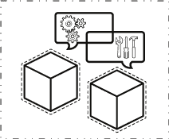

# OpenShift 的容器映像–第 4 部分:云就绪

> 原文：<https://developers.redhat.com/blog/2017/10/17/container-images-openshift-part-4-cloud-readiness>

这是我在 EMEA 红帽技术交流 2017 上的一次会议的文字记录，这是一次 EMEA 所有红帽解决方案架构师和顾问的聚会。它是关于创建将在 OpenShift 上运行的图像时的注意事项和良好实践。第四部分也是最后一部分重点关注云就绪应用程序的特定方面以及容器映像设计的相关结果。

## 要求

云就绪性要求方面的参考是[十二因素应用](https://12factor.net/)。OpenShift 使得创建这样的应用程序更加容易。在本博客的前几部分中，我们已经看到了如何创建映像，例如，如何在环境中存储配置、分离构建和运行阶段以及公开绑定服务的端口。我们现在将讨论其他要点:进程、并发性、可处置性和日志。然后，我们将进一步探讨自我修复、安全性以及从应用程序代码到基础设施的技术功能外部化等方面。

## 处理

在本博客的前几部分，我们已经看到，建议在一个容器中运行单个进程。然后，OpenShift 可以监控该过程，并且信号处理更容易(信号被简单地导向该过程)。这也允许通过启动一个新的容器实例来独立地水平扩展流程。当需要第二个进程通过共享内存、本地网络或文件系统与第一个进程通信时，最好的方法是为同一个 pod 的每个进程部分准备一个容器。监控和信号处理工作保持不变。然而，不可能再独立扩展。对于遗留应用程序，可能仍然需要在单个容器中包含几个进程。在这种情况下，推荐的方法是使用 systemd 容器。Systemd 将接收信号并相应地管理子进程。 **

云原生应用最好是无状态的，这意味着状态可以委托给 NoSQL、RDBMS 或数据网格后端。它使向上和向下扩展、自动故障恢复和零停机升级变得更加容易，因为每个实例都可以独立考虑。也就是说，有状态的遗留应用程序仍然可以受益于在像 OpenShift 这样的 PaaS 上作为容器运行。这里的挑战是，从[宠物与猫的类比](http://cloudscaling.com/blog/cloud-computing/the-history-of-pets-vs-cattle/)来看，容器最好被认为是宠物。用于集群中同步的工具包(如 JGroups)需要适应，并且可能需要询问 OpenShift API 或使用发现协议来检索集群的成员。集群也可以不依赖于固定身份，因为容器可以用不同的 IP 地址和在不同的主机上被停止和重启。 [Statefulset](https://kubernetes.io/docs/concepts/workloads/controllers/statefulset/) ，在 Kubernetes 1.8 中还是测试版，在 OpenShift 3.6 中是技术预览版，对于支持 OpenShift 中的“宠物”和运行像 [Elasticsearch](https://www.elastic.co/products/elasticsearch) 这样的工作负载或者使用 [Zookeeper](https://zookeeper.apache.org/) 的应用很有用。

这偏离了本博客的主要焦点:OpenShift 的容器映像，但是当您设计应用程序和打包它们的容器映像时，这些考虑是至关重要的。

## 一次性

容器的可处置性在自我修复(我们将在本博客后面讨论)、自动化升级和缩减规模中扮演着关键角色。除了前一章已经提到的信号处理方面，容器内的应用程序需要支持正常关闭。当 OpenShift 或用户决定终止容器时:

*   容器从服务和路由轮换中取出，用于请求处理。
*   然后向应用程序发送一个 SIGTERM，应用程序需要完成正在进行的请求处理，释放资源并关闭。如果容器在分配的时间内没有终止，它会收到一个 SIGKILL。

当您创建应用程序和容器时，您需要支持这一点，以便您的应用程序在云环境中表现良好。

## 日志

当在容器中运行应用程序时，建议将日志写入标准输出。然后由主机上运行的日志收集它们。使用 OpenShift，可以在 web 控制台中或通过 CLI 使用它们。OpenShift 还支持每个主机的 Fluentd 守护进程，该守护进程从 journald 收集应用程序和基础架构日志，并将它们发送到运行在 OpenShift 上的 Elasticsearch 集群或客户基础架构以进行日志聚合。然后，您可以在 Kibana 中构建跨容器和跨应用程序的查询和仪表板。在博客的第二部分看到的另一个方面是，最好以只读方式运行容器，这也是通过将日志写入标准输出来实现的。将日志从容器化的应用程序直接发送到远程聚合器(Rsyslog、Fluentd、Logstash server)可能是可以接受的，但是日志在 OpenShift web 控制台中既不可见，也不能通过 CLI 访问。

对于遗留应用程序，可能无法让流程直接写入标准输出。在这种情况下，边车集装箱模式是最好的方法。sidecar 容器是与您的应用程序容器放在同一个 pod 中的容器。两个容器共享卷，包括 emptyDir。您可以在 emptyDir 的挂载点上创建一个由 fifo ( [mkfifo](http://man7.org/linux/man-pages/man3/mkfifo.3.html) )支持的文件，并让您的应用程序将日志写入其中。sidecar 容器中的进程可以从 fifo 中读取日志，并将它们转发到标准输出。【T2

## 自愈

OpenShift 提供自我修复机制，提高应用程序的弹性。正如在本博客的第二部分中提到的，它们依赖于[就绪性和活性探测器](https://docs.openshift.com/container-platform/3.6/dev_guide/application_health.html)，这些探测器允许编排平台了解您的应用程序的健康状况。探测器提供二进制结果:OK/NOK。【T2

*   活性探测:它表明应用程序是否正常工作。当活跃度探测器发送一个 NOK 结果时，OpenShift 重新启动容器，使其回到初始状态。
*   就绪探测:它表明应用程序是否能够处理请求。当准备就绪探测器发送一个 NOK 结果时，OpenShift 不会向其转发任何请求(来自服务或路由)。这可能是因为您的应用程序尚未完成启动，或者因为它正在等待后端服务或数据存储等依赖项的可用性。在这种情况下，重新启动容器没有帮助。当探测器最终发送回 OK 时，容器被放回循环中以处理请求。

活跃度和就绪性探测可以作为容器、HTTP 或 TCP 套接字内的 shell 脚本来实现。当 shell 脚本返回 0 时，就可以了。其他的都不行。HTTP 200 就可以了，其他都不行。如果可以建立与 TCP 套接字的连接，则表示可以，否则表示不可以。当没有定义探针时，OpenShift 将默认监控该过程。只要它能跑，就没问题。

映像创建者的责任是定义准确表示应用程序状态的探测器。

## 技术功能的外部化

技术功能外化，意味着什么？许多非业务功能，如访问控制、[断路](https://en.wikipedia.org/wiki/Circuit_breaker_design_pattern)、客户端负载平衡、路由、跟踪、请求速率调节、策略实施，在历史上都是构建在应用程序代码中的。后来的实现可能使用了像 [Hystrix](https://github.com/Netflix/Hystrix) 、 [Zipkin](https://github.com/openzipkin/zipkin) 和其他库。这些与业务逻辑正交的功能可以通过使用 API 网关或上面提到的 sidecar 容器模式从应用程序代码中具体化。像 Istio 这样的项目正着眼于此。目标是拥有一个更简单、更清晰的应用程序代码，专注于业务逻辑。

## 安全性

安全性是一个广泛的话题。我将在这里列出创建容器图像时需要考虑的几点。

安全性通常是关于限制的。对于容器，您需要限制:

*   容器内安装了什么。
*   运行容器所需的功能。
    *   通过避免 root 权限，在不需要时装载主机文件系统或绑定主机端口。
    *   运行特权操作，如在构建时设置对文件系统的访问权限
    *   通过 [init containers](https://kubernetes.io/docs/concepts/workloads/pods/init-containers) 在启动时访问受保护的存储库或运行特殊操作，这样凭证就不是运行应用程序的容器的一部分。
*   通过使用 API 网关、sidecar 嵌入式反向代理访问应用程序，此外还可以在网络级别进行访问。
*   容器可以消耗的资源(CPU、RAM、存储、网络带宽)。

为了避免:

*   在容器内部运行 SSH 守护进程:可以使用 docker 或 oc exec。
*   Sudo，因为它具有不可预测的 TTY 和信号转发行为。
*   在映像中设置默认密码。

但是你应该:

*   支持任意用户 id。当遗留应用程序需要时，NSS 包装器可用于用户映射。

安全性的另一个方面是保证您的图像是它假装的样子。[集装箱图像签名](https://docs.openshift.com/container-platform/3.6/admin_guide/image_signatures.html)完成。

最后，您应该保持容器映像是最新的，并在它们可用时应用安全补丁。OpenSCAP 可以帮助您识别这方面的安全风险。

您现在已经到了我关于 OpenShift 容器图像的博客系列的结尾。我希望这对你有价值。编码快乐！

*Last updated: October 12, 2017*