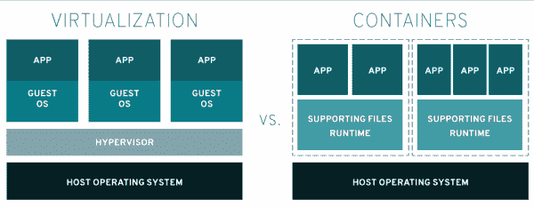
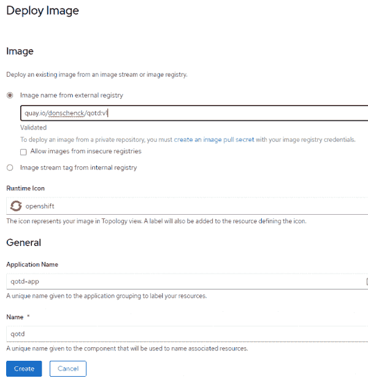
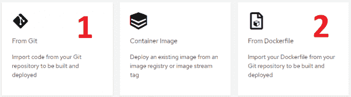
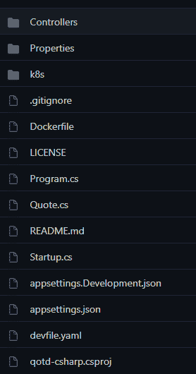
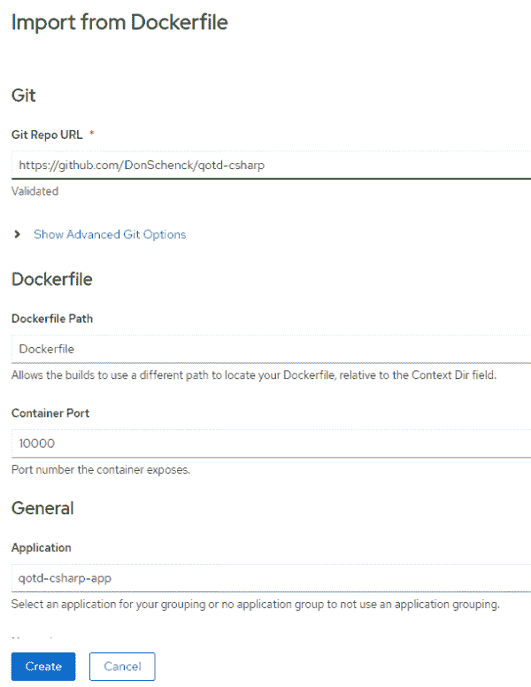

# 集装箱化。NET for Red Hat OpenShift: Linux 容器和。网络核心

> 原文：<https://developers.redhat.com/blog/2021/04/15/containerize-net-for-red-hat-openshift-linux-containers-and-net-core>

当[。NET](/topics/dotnet) 被发布到开源世界(2014 年 11 月 12 日——我不记得日期或任何事情)，它不仅仅带来了。NET 到开源；它给. NET 带来了开源。 [Linux 容器](/topics/containers)是当时蓬勃发展的技术之一。NET 开发人员。那时候一直是“码头工，码头工，码头工”。现在，是[波德曼和 Buildah](/blog/2019/02/21/podman-and-buildah-for-docker-users/) ，还有[库伯内特](/topics/kubernetes)，还有[红帽 OpenShift](/products/openshift/overview) ，还有[无服务器](/topics/serverless-architecture)，还有...嗯，你明白了。事情有了进展，你的。NET 应用程序也可以进步。

这篇文章是介绍三种容器化方法的系列文章的一部分。红帽 OpenShift 上的. NET 应用。我将从对 Linux 容器和。NET 核心，然后讨论几种构建和容器化的方法。NET 核心应用程序，并将它们部署在 OpenShift 上。

## Linux 容器如何工作

首先，让我们从高层次上看一下 Linux 容器是如何工作的。

一个*容器*是你运行你的图像的地方。也就是说，你构建一个映像，当它运行时，它在容器中运行。容器在主机系统上运行，并且可以访问主机的内核，而不管主机的 Linux 发行版(distro)。例如，您可能在一个[Red Hat Enterprise Linux](/products/rhel/overview)(RHEL)服务器上运行您的容器，但是在容器中运行的映像被构建为包含 Debian 作为运行时 Linux 发行版。更进一步，让事情变得更复杂，假设图像是在 Fedora 机器上构建的(例如，使用`podman build...`)。

对于高级可视化，可以将容器想象成运行应用程序的虚拟机(VM)。(事实并非如此，但这个类比可能会有所帮助。)现在，考虑图 1 中的图表。

[](/sites/default/files/blog/2021/02/containers.png)VM versus containers

Figure 1: Virtual machines versus containers.

什么？NET Core 允许你做的就是构建一个运行在 Linux 发行版上的. NET 应用程序。你的选择包括带有通用基础映像的 RHEL，或者 UBI 发行版。

现在，考虑 GitHub 仓库(repo)中的代码:[https://github.com/donschenck/qotd-csharp](https://github.com/donschenck/qotd-csharp)。

在文件“Dockerfile”中，我们可以看到以下引用作为我们的基本映像:

`FROM registry.access.redhat.com/ubi8/dotnet-31:3.1`

我们从红帽 UBI 图像开始。NET Core 3.1 已经安装，但是我们可以在一个由不同的 Linux 发行版托管的容器上运行结果映像。

## 在这里建造，在别处运行

底线是，你可以建造。NET 核心应用程序，并将生成的映像部署到 OpenShift。这是我喜欢的发展方式。网芯[微服务](/topics/microservices)。我喜欢在我的本地机器上构建并测试一个映像，然后将这个映像发布到 OpenShift 上——没有任何改变。这种方法让我对正在执行的位的保真度有了信心。它还消除了“但是它在我的机器上工作”的情况。

“在此构建，在别处运行”的方法基本上由三个步骤组成:

1.  在本地机器上构建(并测试)映像。
2.  将映像推送到映像注册表。
3.  使用**容器映像**选项将映像部署到您的 OpenShift 集群。

**记住**:因为你在用。NET Core，你是用 Linux 构建和运行的。您可以从您的 PC (macOS、Linux 或 Windows)进行构建，映像将在 OpenShift 上运行。

在我的本地机器上构建映像并将其推送到我自己的映像注册中心之后，图 2 显示了在我的集群中创建应用程序的样子。

[](/sites/default/files/blog/2021/03/deploy-image.png)Figure 1: Deploy image

Figure 2: Options for deploying the image in OpenShift.

## 在那里建造，在那里运行

另一个选择是使用 Red Hat OpenShift 构建您的图像。实际上，OpenShift 提供了两种构建映像的方法:源到映像(S2I)或从 docker 文件构建。第三种选择是从容器图像构建，这涉及到在 Red Hat OpenShift 之外构建图像*。我们将在以后的文章中讨论这个选项。现在，看一下图 3 中的概述。*

[](/sites/default/files/blog/2021/02/two-build-from-source-options.png)Two ways to build from source

Figure 3: Two ways to build from source.

### 从 Git 构建映像

这个选项使用 OpenShift 的 S2I 技术来获取您的源代码，构建它，并将其作为映像(在容器中运行)部署到 OpenShift。该选项不要求您创建构建配置(即 does 文件)；您只需创建代码，让 OpenShift 处理剩下的事情。很明显，您被剥夺了使用构建配置的灵活性，但是这是构建映像的一种快速而简单的方法。这种方法可能很好地满足了您的大部分需求。如果有用的话，为什么要破坏它呢？

### 从 Dockerfile 文件构建

这个“相同但不同”的选项依赖于 OpenShift 集群中的`docker build`命令，并使用源代码中包含的 docker 文件作为构建指令。基本上，这就像在本地机器上运行构建。图 4 显示了包含 Dockerfile 文件的项目的屏幕截图。

[](/sites/default/files/blog/2021/03/qotd-file-list.png)

Figure 4: A project including a Dockerfile.

以下是 Dockerfile 文件的内容:

```
FROM registry.access.redhat.com/ubi8/dotnet-31:3.1
USER 1001
RUN mkdir qotd-csharp
WORKDIR qotd-csharp
ADD . .

RUN dotnet publish -c Release

EXPOSE 10000

CMD ["dotnet", "./bin/Release/netcoreapp3.0/publish/qotd-csharp.dll"]

```

因为我们有一个有效的 Dockerfile，所以我们可以使用 **Import from Dockerfile** 选项。注意，我们需要确保我们有正确的端口——在本例中是 10000，如图 5 所示。

[](/sites/default/files/blog/2021/03/import-from-dockerfile.png)

Figure 5: Options for importing from a Dockerfile.

从 docker 文件导入会导致映像被构建和部署，并创建一个公开应用程序的路径。

## 结论:它就像任何其他语言一样

事实是利用。NET Core 和 Linux 就像大多数其他开发语言一样。您构建、测试、推送和部署。就这么简单。不需要特别的魔法。你是 Linux、容器、微服务、Kubernetes、Red Hat OpenShift 等等领域的一等公民。欢迎进来。

**注**:好奇移动现有。NET 框架代码转换为。净 5(。网芯)？看看[微软的。网络升级助手](https://devblogs.microsoft.com/dotnet/introducing-the-net-upgrade-assistant-preview/?ocid=AID3017126)。

*Last updated: April 14, 2021*