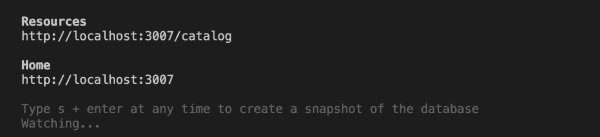

# 契约优先开发:使用 React 为真实的数据交互创建一个模拟后端

> 原文：<https://developers.redhat.com/blog/2020/04/28/contract-first-development-create-a-mock-back-end-for-realistic-data-interactions-with-react>

许多前端开发人员正在发现[契约优先开发](https://servicesblog.redhat.com/2019/09/05/achieving-the-promise-of-microservices-one-contract-at-a-time/)的好处。通过这种方法，前端和后端开发人员使用 [OpenAPI](https://www.openapis.org/) 来协作设计 API 规范。一旦完成了初始规范，前端开发人员就可以使用 API 定义和样本数据来开发离散的用户界面(UI)组件。定义一个单一的 OpenAPI 规范改善了跨团队协作，API 定义使前端开发人员能够设计我们的初始工作流，而不依赖于后端。

尽管如此，我们最终还是需要根据真实数据来验证我们对应用程序工作流的假设。这就是挑战所在。企业安全策略通常会阻止跨来源的资源共享( [CORS](https://developer.mozilla.org/en-US/docs/Web/HTTP/CORS) )，因此我们的数据请求会被浏览器拒绝。我们需要的是一种可靠的方法，在不更新后端安全策略的情况下进行更改。

在本文中，我将向您展示如何使用 [React.js](https://reactjs.org) 和一些简单的配置来创建一个假的后端，您可以使用它来测试您的前端与真实的数据交互。我还将向您展示如何将应用程序配置从伪后端切换到开发环境，以及如何解决第一次切换时出现的 CORS 错误。

## 用假的后端验证用户

大多数单页应用程序(spa)在开发时都考虑到了多个用户角色，因此前端开发人员为不同类型的用户设计我们的工作流。然而，很难将测试用户添加到 Active Directory 或公司 LDAP 系统中，这使得在企业环境中测试用户角色和工作流尤其具有挑战性。

我将介绍通过本地、开发和生产模式运行应用程序的三头配置。您将创建一个假的后端，将其与路由器集成，并针对它测试各种用户角色和工作流。后端将在您的本地开发机器上运行。

### 步骤 1:为本地开发配置一个假的后端

首先，看一下清单 1 中的示例 JavaScript。请注意，此配置独立于生产中使用的身份验证机制:

```
import { fakeAuth } from './helpers/fake-auth';
import configureSSO from './helpers/sso';

const dev = {
  init: () => {},
 auth: fakeAuth,
 useSSO: false,
 apiUrl: '',
};

const prod = {
 init: () => {
   configureSSO();
 },
 auth: null,
 useSSO: true,
 apiUrl: 'https://production.example.com',
};

const config = process.env.REACT_APP_STAGE === 'production' ? prod : dev;

export default {
 TITLE: 'My Fabulous App',
 ...config
};

```

清单 1。伪后端的配置(src/config.js)。

注意，`const prod`对象包含一个对`init`的函数调用，它使用单点登录(SSO)来设置身份验证。为了避免多次初始化，请确保在应用程序中只在一个地方引用`auth`。另外，请注意，您可以使用脚本底部的`export default`配置来管理公共的键/值对。

### 步骤 2:编写一个假的身份验证脚本

对于假身份验证，我们从为各种角色配置的模拟用户列表开始。正如您在清单 2 中看到的，拥有电子邮件`lreed@vu.com`的用户拥有`admin`角色，而其他人是普通用户:

```
export function fakeAuth(url, options) {
 let users = [
   {
     id: 0,
     email: 'lreed@vu.com',
     name: 'Lou Reed',
     password: '123',
     role: 'admin'
   },
   {
     id: 1,
     email: 'jcale@vu.com',
     name: 'John Cale',
     password: '123',
     role: 'user'
   },
   {
     id: 2,
     email: 'smorrison@vu.com',
     password: '123',
     name: 'Sterling Morrison',
     role: 'user'
   }
 ];

 return new Promise((resolve, reject) => {
   // authenticate - public
   if (url.endsWith('/login') && options.method === 'POST') {
     const params = JSON.parse(options.body);
     const user = users.find(
       x => x.email === params.email && x.password === params.password
     );
     if (!user) return error('Username or password is incorrect');
     return ok({
       email: user.email,
       role: user.role,
       name: user.name,
       token: `fake-jwt-token.${user.role}`
     });
   }

   // private helper functions
   function ok(body) {
     resolve({
       ok: true,
       text: () => Promise.resolve(JSON.stringify(body))
     });
   }

   function error(message) {
     resolve({
       status: 400,
       text: () => Promise.resolve(JSON.stringify({ message }))
     });
   }
 });

}

```

清单 2。一个假的认证脚本(src/helpers/fake-auth.js)。

注意，`export`函数的行为类似于`window.fetch`对`POST`请求的行为。这将使假后端很容易用一个行为相同的真实后端来替换。

脚本的其余部分很容易理解。如果我们通过电子邮件和密码找到匹配的用户，我们就返回它。否则，我们返回 400，表明电子邮件或密码不正确。我们将只为登录尝试调用`fakeAuth()`方法，所以我们不需要做任何花哨的事情，比如通过这个方法代理所有请求。

接下来，我们希望确保可以利用身份验证机制，并向我们的应用程序公开当前用户。

### 步骤 3:编写一个最小的用户服务

在清单 3 中，我们使用一个 [ECMAScript 6](https://www.w3schools.com/js/js_es6.asp) 类来创建`UserService`。我们可以将这个服务作为属性注入到我们的组件中，它将被部署来检查当前用户。以这种方式设计服务也使得为应用程序的`LoginPage`封装其功能变得更加容易:

```
import { BehaviorSubject } from 'rxjs';

class UserService {
 constructor(back end) {
   this.back end = back end;
   this.currentUserSubject = new BehaviorSubject(
     JSON.parse(localStorage.getItem('currentUser'))
   );
   this.currentUser = this.currentUserSubject.asObservable();
   window.addEventListener('storage', this._listenForStorageChanges);
 }

 _listenForStorageChanges = (win, event) => {
   const nextUser = JSON.parse(localStorage.getItem('currentUser'));
   if (nextUser !== this.currentUserSubject.value) {
     this.currentUserSubject.next(nextUser);
   }
 }

 login(email, password) {
   const requestOptions = {
     method: 'POST',
     headers: { 'Content-Type': 'application/json' },
     body: JSON.stringify({ email, password })
   };

   return this.back end('/login', requestOptions)
     .then(this._handleResponse)
     .then(user => {
       localStorage.setItem('currentUser', JSON.stringify(user));
       this.currentUserSubject.next(user);

       return user;
     });
 }

 logout() {
   localStorage.removeItem('currentUser');
   this.currentUserSubject.next(null);
 }

 get currentUserValue() {
   return this.currentUserSubject.value;
 }

 _handleResponse(response) {
   return response.text().then(text => {
     const data = text && JSON.parse(text);
     if (!response.ok) {
       if ([401, 403].indexOf(response.status) !== -1) {
         this.logout();
         window.location.reload(true);
       }

       const error = (data && data.message) || response.statusText;
       return Promise.reject(error);
     }

     return data;
   });
 }
}

export default UserService;

```

清单 3。一个最小的用户服务(src/services/UserService.js)。

`UserService`类使用依赖注入在后端传递。稍后，我们将能够用正确的后端`auth`替换我们的模拟配置。还要注意，我们在构建时检查本地存储中的用户。这允许像 [Keycloak](https://www.keycloak.org/docs/latest/securing_apps/) 这样的 SSO 实现来确保用户在应用程序进入时被设置。`logout()`方法只是将用户从本地存储中移除，并清除`BehaviorSubject`。

### 步骤 4:设置配置的入口点(index.js)

应用程序的根托管在`index.js`中，所以我们使用这个文件作为配置的入口点很重要。清单 4 显示了这个配置:

```
import React from 'react';
import ReactDOM from 'react-dom';
import './index.css';
import App from './App';
import config from './config';

ReactDOM.render(
&lt:App title={config.TITLE} ssoEnabled={config.useSSO} auth={config.auth} />,
 document.getElementById('root')
);

```

清单 4。将 index.js 设置为配置的入口点(src/index.js)。

请注意，我们还向应用程序传递了一个`auth`，以及一个声明我们是否正在使用 SSO 的标志。我们需要这个标志，因为 SSO 禁用了本地开发所需的登录页面。

## 使用 React.js 路由器控制访问

一旦我们有了认证用户的方法，我们就可以配置 [React.js 路由器](https://tylermcginnis.com/react-router-protected-routes-authentication/)来控制基于每个用户授权的可见内容。

在清单 5 中，我们配置了`App.js`,以便我们可以观察用户是否登录:

```
import React, { Component } from 'react';
… // imports hidden for brevity

class App extends Component {
 constructor(props) {
   super(props);
   this.state = {
     currentUser: null
   };
   this.userService = new UserService(props.auth);
 }

 componentDidMount() {
   this.userService.currentUser.subscribe(x =>
     this.setState({
       currentUser: x
     })
   );
   if (!this.state.currentUser && !this.props.sso) {
     history.push('/login');
   }
 }

 render() {
   const { currentUser } = this.state;

   return (
     <Container fluid={true}>
       <Heading history={history} userService={this.userService} />
       <Router history={history}>
         {!currentUser && !this.props.sso && (
           <Route path="/login" render={props => (
               <LoginPage history={history} userService={this.userService} />
             )}
           />
         )}
         {currentUser && (
           <Route path="/" render={props => (
               <MainContent {...props} user={this.state.currentUser} />
             )}
           />
         )}
       </Router>
     </Container>
   );
 }
}

export default App;

```

清单 5。将应用程序配置为使用 React.js 路由器(src/App.js)。

注意我们如何使用`componentDidMount`中的`UserService`类来订阅`currentUser`的状态。我们需要这些信息根据用户的授权向他们显示不同的页面。我们还可以将`currentUser`传递给各种子组件，或者通过我们的 React 上下文让用户可用。

接下来，我们将为我们的伪后端进行本地配置。

## 引入本地配置

我们现在准备设置一个假的后端，我们可以在本地使用它来提供数据。我们希望前端的行为就像它在与真正的后端对话一样，这样我们就可以确保我们的应用程序中没有静态数据。我们将使用一个名为 [json-server](https://github.com/typicode/json-server) 的包作为我们的虚拟后端。这样我们就不必克隆一个单独的项目，我们只需在主项目中创建一个名为`fake-back end`的子文件夹。

### 步骤 1:在本地环境中创建一个假的后端

在`fake-back end`目录下，使用`npm init`创建一个骨架`package.json`。编辑该文件，并将以下启动脚本添加到`scripts`部分:

```
 "scripts": {
   "start": "json-server -p 3007 -w db.json",
   "test": "echo Error: no test specified && exit 1"
 },

```

清单 6。json-server 的启动脚本(fake-back end/package.json 片段)。

我们需要能够从命令行运行`json-server`命令，所以我们将全局安装它。使用以下命令:

```
$ npm i -g json-server

```

接下来，我们需要创建一组数据，`json-server`将对其进行操作。在`fake-back end`文件夹中创建清单 7 所示的文件:

```
{
   "catalog": [
       {
           "id": 0,
           "title": "The Velvet Underground & Nico",
           "year": 1967,
           "label": "Polydor",
           "rating": 5.0
       },
       {
           "id": 1,
           "title": "White Light/White Heat",
           "year": 1968,
           "label": "Polydor/Verve",
           "rating": 5.0
       }
   ]
}

```

清单 7。json-server 的模拟数据集(fake-back end/db.json)。

这是一个非常简单的数据库，但它能满足我们的需求。接下来，我们将让目录服务为我们获取数据。

### 步骤 2:创建目录服务

清单 8 显示了`CatalogService`调用 [`axios`](https://github.com/axios/axios) 来获取相册列表:

```
import axios from 'axios';
import config from '../config';

export const getAlbums = async() => {
   const albums = await axios.get(`${config.apiUrl}/catalog`);
   return albums.data;
}

```

清单 8。CatalogService 调用 axios 获取相册列表(src/services/CatalogService.js)。

使用`async/await`简化了清单 9 所示的逻辑，您可以看到我们没有处理任何错误。通过这一点和对`config`的调整，我们可以看到我们的假后端正在工作:

```
import { fakeAuth } from './helpers/fake-auth';
import configureSSO from './helpers/sso';

const dev = {
  …  // still the same
};

const local = {
 init: () => {},
 auth: fakeAuth,
 useSSO: false,
 apiUrl: 'http://localhost:3007'
};

const prod = {
 … // still the same
};

let config;

if (process.env.REACT_APP_STAGE === 'production') {
 config = prod;
} else if (process.env.REACT_APP_STAGE === 'local') {
 config = local;
} else {
 config = dev;
}

config.init();

export default {
 TITLE: 'VU Catalog',
 ...config
};

```

清单 9。对 config.js 的调整确认了伪后端正在工作(src/config.js)。

引入本地配置让我们可以将 API URL 设置为运行伪后端的位置。我们将为`package.json`添加最后一个脚本:

```
"start:local": "REACT_APP_STAGE=local react-scripts start",

```

现在我们准备在本地环境中开始我们的基础项目。让我们开始吧！

## 用假的后端开始项目

为后端打开一个终端并运行`npm start`。您应该看到后端提供了关于它所服务的集合的信息，如图 1 所示。

[](/sites/default/files/blog/2020/03/Screen-Shot-2020-03-01-at-5.01.10-PM.png)Figure 1\. The fake back end starts up.">

在一个单独的终端中，通过运行`npm run start:local`启动基础项目。注意，当您的组件加载并调用服务时，您将看到它到达后端，如图 2 所示。

[](/sites/default/files/blog/2020/03/Screen-Shot-2020-03-02-at-8.33.18-AM.png)

Figure 2\. The service calls a catalog from the back end.

这个设置很简单，但是它允许您测试您的数据和工作流，而无需连接到真正的后端。

## 与开发环境集成

即使您正在使用一个假的后端来用各种数据集测试您的应用程序，您最终也需要连接到一个真正的后端。最后，我将向您展示如何从虚拟后端转移到实际的应用程序环境。我还将向您展示如何解决第一次尝试从真正的后端检索数据时出现的跨源问题。

### 切换到开发配置

您要做的第一件事是修改应用程序`config`文件中的`apiUrl`值，如清单 1 所示。只要把它切换到`dev`配置。接下来，转到后端所在的本地环境，用`npm start`脚本启动前端。这一更改将使用新指向开发后端的配置启动您的应用程序。

当您第一次尝试从后端检索数据时，您会得到一个惊喜。如果您打开 web 控制台并检查发生了什么，您将会看到如下错误:

```
Access to XMLHttpRequest at '...' from origin '...' has been blocked by CORS policy: Response to preflight request doesn't pass access control check: It does not have HTTP ok status.

```

### 当你被 CORS 阻挡时该怎么办

正如我在本文开头提到的，现代浏览器通过阻止跨源请求(也称为 CORS)来提供安全浏览。如果你的后端服务没有明确授权`localhost`访问，浏览器会阻止你的请求。幸运的是，您可以通过在前端的`express`服务器中插入中间件来解决这个问题。在 React.js 中，我们可以在应用程序的`src`文件夹中引入一个名为`setupProxy.js`的文件，如清单 10 所示:

```
const proxy = require('http-proxy-middleware');
const BACKEND = 'http://www.example.com';

module.exports = app => {
 if (process.env.REACT_APP_STAGE === 'dev') {
   app.use(
     '/catalog',
     proxy({ target: BACKEND, changeOrigin: true, logLevel: 'debug' })
   );
 }
};

```

清单 10。将代理中间件添加到源文件夹(src/setupProxy.js)。

将`logLevel`设置为 debug 是可选的，但是它将帮助您确切地看到当您向后端发出请求时发生了什么。这里的关键是`changeOrigin`标志。设置这个标志可以确保出站请求将`Origin`头设置为指向真正的后端。这样，你可以避免你的请求被退回。

现在，您可以用真实的后端测试您的前端更改，并且在创建拉请求之前，您可以在集群中验证这些更改。

## 更新生产配置

您要做的最后一件事是配置生产服务器。该服务器将使用您公司的 SSO 或另一种身份验证机制，并且它将被托管在满足后端 CORS 配置要求的源上。您可以使用环境变量`REACT_APP_STAGE=production`来进行设置。请注意，如果您使用一个容器来托管您的前端，那么您将使用这个配置的容器映像。我将把管理环境变量的主题留给另一篇文章。

## 结论

下次您发现自己在从事前端开发项目时，可以考虑使用我在本文中介绍的三头配置。首先，克隆或派生与三头配置相关联的 [GitHub 项目](https://github.com/redhat-appdev-practice/three-headed-config)。如果您需要帮助，也可以联系 Red Hat Services。

*Last updated: June 29, 2020*