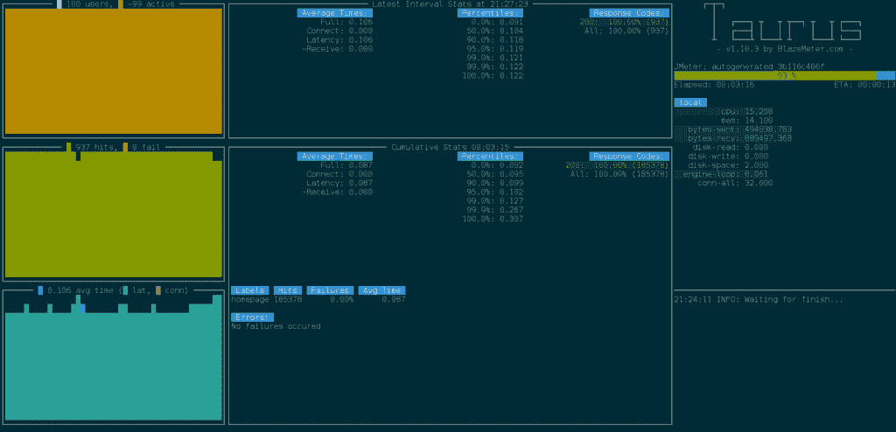
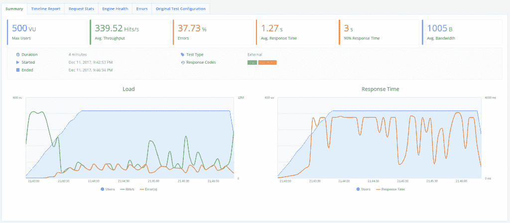
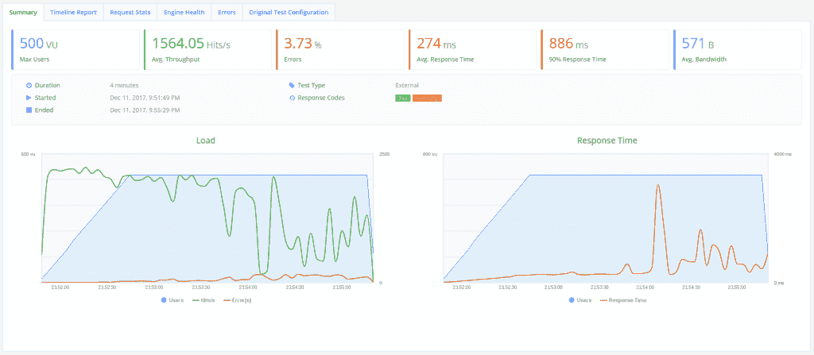

# 用 Falcon 和 RHSCL 创建可伸缩的 REST API

> 原文：<https://developers.redhat.com/blog/2017/12/29/create-scalable-rest-api-falcon-rhscl>

API 对于自动化、集成和开发云原生应用至关重要，并且它们能够被扩展以满足用户群的需求也是至关重要的。在本文中，我们将使用 Red Hat Software Collections(RHS cl)创建一个基于 Python Falcon 框架的数据库支持的 REST API，测试它的性能，并扩展以响应不断增长的用户群。

我们将使用以下组件来构建和测试我们的 API:

*   [猎鹰](https://falconframework.org/)
*   [PostgreSQL](https://www.postgresql.org/)
*   [红帽软件收藏](https://developers.redhat.com/products/softwarecollections/overview/)
*   [金牛座](https://gettaurus.org/)

## 为什么是猎鹰？

Falcon 是一个用于构建 web APIs 的极简框架，根据 [Falcon 网站](https://falconframework.org/)的说法，它可以实现比 Flask 快 10 倍的速度。猎鹰速度很快！

## 入门指南

对于本文，我假设您可以订阅 Red Hat Enterprise Linux。如果你还没有订阅，你可以获得一个[免费开发者订阅](https://developers.redhat.com/articles/rhel-what-you-need-to-know/)。

首先，让我们用 RHSCL 设置数据库。安装“rh-postgresql95”和“scl-utils”软件包，并初始化数据库:

```
# yum install rh-postgresql95 scl-utils
# scl enable rh-postgresql95 bash
# postgresql-setup --initdb
# systemctl start rh-postgresql95-postgresql
```

让我们创建一个数据库和一个用户:

```
# su - postgres -c 'scl enable rh-postgresql95 -- createdb orgdb'
# su - postgres -c 'scl enable rh-postgresql95 -- createuser --interactive orguser --pwprompt'
```

编辑 pg_hba.conf 文件以允许用户访问数据库:

```
# cat /var/opt/rh/rh-postgresql95/lib/pgsql/data/pg_hba.conf
...
# TYPE   DATABASE     USER           ADDRESS       METHOD

# "local" is for Unix domain socket connections only
local     all          all                         peer
host      orgdb        orguser       127.0.0.1/32  md5
host      all          all           127.0.0.1/32  ident
```

重新启动 postgresql 服务

```
# systemctl restart rh-postgresql95-postgresql
```

授予用户对新数据库的访问权限:

```
# su - postgres
$ scl enable rh-postgresql95 bash
$ psql

psql (9.5.4)
Type "help" for help.

postgres=# grant all privileges on database orgdb to orguser;
GRANT
```

现在我们已经配置了数据库，让我们构建我们的 Falcon 应用程序。

## 创建 API

我们的应用程序将使用 Python3.5。虽然 Python 2 总体上仍然更快，但这并没有超过我们在 Python 3 中得到的重大改进。你可以在 https://speed.python.org/[的](https://speed.python.org/)看到 Python 版本之间的详细基准对比

首先启用 RHSCL 存储库并安装 rh-python35

```
$ sudo subscription-manager repos --enable rhel-server-rhscl-7-rpms
$ sudo yum install rh-python35
```

现在，您可以启用 RHSCL rh-python35 模块并验证安装的 python 版本:

```
$ scl enable rh-python35 bash
$ python --version
python 3.5.1
```

现在 Python 3.5 已经配置好了，创建一个“app.py”文件来保存 API:

```
import falcon
from models import *
from playhouse.shortcuts import model_to_dict
import json

class UserIdResource():
     def on_get(self, req, resp, user_id):
     try:
         user = OrgUser.get(OrgUser.id == user_id)
         resp.body = json.dumps(model_to_dict(user))
     except OrgUser.DoesNotExist:
         resp.status = falcon.HTTP_404

class UserResource():
     def on_get(self, req, resp):
         users = OrgUser.select().order_by(OrgUser.id)
         resp.body = json.dumps([model_to_dict(u) for u in users])

api = falcon.API(middleware=[PeeweeConnectionMiddleware()])

users = UserResource()
users_id = UserIdResource()

api.add_route('/users/', users)
api.add_route('/users/{user_id}', users_id)
```

创建另一个名为“models.py”的文件，并添加以下内容:

```
from peewee import *
import uuid

psql_db = PostgresqlDatabase(
     'orgdb',
     user='orguser',
     password='orguser',
     host='127.0.0.1')

def init_tables():
     psql_db.create_tables([OrgUser], safe=True)

def generate_users(num_users):
     for i in range(num_users):
         user_name = str(uuid.uuid4())[0:8]
             OrgUser(username=user_name).save()

class PeeweeConnectionMiddleware(object):
     def process_request(self, req, resp):
         psql_db.get_conn()

class BaseModel(Model):
     class Meta:
         database = psql_db

class OrgUser(BaseModel):
    username = CharField(unique=True)

```

创建一个 virtualenv 并安装 API 的一些要求:

```
$ virtualenv ~/falconenv
$ source ~/falconenv/bin/activate
$ pip install peewee falcon
```

我们在这里创建了两个助手方法来设置应用程序，“init_tables”和“generate_users”。让我们运行这两个命令来初始化应用程序:

```
$ python
Python 3.5.1 (default, Sep 15 2016, 08:30:32) 
[GCC 4.8.3 20140911 (Red Hat 4.8.3-9)] on linux
Type "help", "copyright", "credits" or "license" for more information.
>>> from app import *
>>> init_tables()
>>> generate_users(20)
```

如果您登录到数据库，现在您将能够看到创建的用户:

```
# su - postgres
$ scl enable rh-postgresql95 bash
$ psql -d orgdb -U orguser -h 127.0.0.1

psql (9.5.4)
Type "help" for help.

orgdb=> select * from orguser;
 id | username 
----+----------
 1 | e60202a4
 2 | e780bdd4
 3 | cb29132d
 4 | 4016c71b
 5 | e0d5deba
 6 | e835ae28
 7 | 952ba94f
 8 | 8b03499e
 9 | b72a0e55
 10 | ad782bb8
 11 | ec832c5f
 12 | f59f2dec
 13 | 82d7149d
 14 | 870f486d
 15 | 6cdb6651
 16 | 45a09079
 17 | 612397f6
 18 | 901c2ab6
 19 | 59d86f87
 20 | 1bbbae00
(20 rows)

```

您现在可以测试 API 了:

```
$ gunicorn app:api -b 0.0.0.0:8000
[2017-12-11 23:19:40 +1100] [23493] [INFO] Starting gunicorn 19.7.1
[2017-12-11 23:19:40 +1100] [23493] [INFO] Listening at: http://0.0.0.0:8000 (23493)
[2017-12-11 23:19:40 +1100] [23493] [INFO] Using worker: sync
[2017-12-11 23:19:40 +1100] [23496] [INFO] Booting worker with pid: 23496
$ curl http://localhost:8000/users
[{"username": "e60202a4", "id": 1}, {"username": "e780bdd4", "id": 2}, {"username": "cb29132d", "id": 3}, {"username": "4016c71b", "id": 4}, {"username": "e0d5deba", "id": 5}, {"username": "e835ae28", "id": 6}, {"username": "952ba94f", "id": 7}, {"username": "8b03499e", "id": 8}, {"username": "b72a0e55", "id": 9}, {"username": "ad782bb8", "id": 10}, {"username": "ec832c5f", "id": 11}, {"username": "f59f2dec", "id": 12}, {"username": "82d7149d", "id": 13}, {"username": "870f486d", "id": 14}, {"username": "6cdb6651", "id": 15}, {"username": "45a09079", "id": 16}, {"username": "612397f6", "id": 17}, {"username": "901c2ab6", "id": 18}, {"username": "59d86f87", "id": 19}, {"username": "1bbbae00", "id": 20}]
```

## 我们表现如何？

让我们测试一下我们的 API 在使用 [Taurus](https://gettaurus.org/) 时的表现。如果可能的话，将 Taurus 部署到与你的 Falcon API 分开的另一个服务器上(我在一个[英特尔 NUC](https://www.intel.com.au/content/www/au/en/products/boards-kits/nuc.html) 上运行 Taurus)。

让我们先得到金牛座的一些依赖关系:

```
$ sudo yum install java-1.8.0-openjdk-headless python-devel libxml2-devel libxslt-devel zlib gcc
```

在我们的 virtualenv 中安装 Taurus。如果您在单独的服务器上运行 Taurus，首先为 Taurus 创建一个新的 virtualenv:

```
$ pip install bzt
```

现在我们可以为我们的测试创建一个场景。创建一个文件“bzt-config.yml”并添加以下内容(用 ip-addr 替换您的服务器 ip 地址):

```
execution: 
   concurrency: 100 
   hold-for: 2m30s
   ramp-up: 1m
   scenario:
     requests:
       - url: http://ip-addr:8000/users/
         method: GET
         label: api
         timeout: 3s
```

该测试将模拟 web 流量在一分钟内上升到 100 个用户，并在 2m30s 秒内保持在 100 个用户。

让我们从一个工人开始我们的 API:

```
$ gunicorn --workers 1 app:api -b 0.0.0.0:8000
```

我们现在可以运行金牛座。第一次运行 Taurus 时，它会下载所需的依赖项，这可能需要一些时间:

```
$ bzt bzt-config.yml -report
20:02:18 INFO: Taurus CLI Tool v1.10.3
20:02:18 INFO: Starting with configs: ['bzt-config.yml']
20:02:18 INFO: No personal config found, creating one at /home/user/.bzt-rc
20:02:18 INFO: Configuring...
20:02:18 INFO: Artifacts dir: /home/user/Documents/python-ws/coffee-api/2017-12-11_20-02-18.732736
20:02:18 INFO: Preparing...
20:02:18 INFO: Will install JMeter into /home/user/.bzt/jmeter-taurus/3.3
20:02:21 INFO: Downloading: https://archive.apache.org/dist/jmeter/binaries/apache-jmeter-3.3.zip
```

安装完所有依赖项后，您将看到一个控制台，显示您当前的测试运行:

[](https://developers.redhat.com/blog/wp-content/uploads/2017/12/100_users_1w_console.png)

我们使用'-report '选项将结果上传到 BlazeMeter，并生成一个 web 报告。测试运行结束时，您会看到 web 链接:

```
21:55:28 INFO: Ending data feeding...
21:55:29 INFO: Online report link: https://a.blazemeter.com/app/?public-token=iJlTHW5tceTBMwo7AZBR7A13Xe5dWXUPf2gRQN9OTz8mDvKNcR#reports/r-ext-5a2e63444b019/summary
21:55:29 INFO: Artifacts dir: /home/user/bzt/2017-12-11_21-51-43.083367
21:55:29 INFO: Done performing with code: 0
```

我们的 API 在 100 个用户中表现得相当好。我们实现了大约 1000 个请求/秒的吞吐量，没有错误，平均响应时间为 0.1 秒。

[](https://developers.redhat.com/blog/wp-content/uploads/2017/12/100users_1w_report.png)

好，现在 500 个用户怎么样？在“bzt-config.yml”文件中将“并发”值更新为 500，然后重新运行 Taurus。

[](https://developers.redhat.com/blog/wp-content/uploads/2017/12/500users_1w_report.png)

嗯。嗯，不幸的是，看起来我们的独立工作 API 已经崩溃成一堆闷烧。我们仍在处理请求，但由于 40%的错误率，我认为没有人会长期使用这个 API。

让我们试着扩大猎鹰工人的规模:

```
gunicorn --workers 20 app:api -b 0.0.0.0:8000
```

[](https://developers.redhat.com/blog/wp-content/uploads/2017/12/500users_20w_report.png)

好的——看起来好多了。我们仍然有相当高的错误率，但是我们已经将吞吐量提高到大约 1500 个请求/秒，并将平均响应时间保持在大约 270 毫秒。我想说这个 API 现在是可用的，当我的笔记本电脑上的平均负载达到峰值时有一点小问题。

## 进一步的性能调整

我们仍然有很高的错误率，当然可以降低平均响应时间，我们还可以做一些其他的事情来优化我们的 API 性能:

*   使用 [PgTune](http://pgtune.leopard.in.ua/) 为我们的硬件配置 PostgreSQL 设置
*   部署我们的 API 来 [OpenShift](https://www.redhat.com/en/technologies/cloud-computing/openshift) 和横向扩展 pod 以满足需求

这个 API 就是这样。感谢阅读！

* * *

**利用您的红帽开发者会员资格和** [**免费下载 RHEL**](http://developers.redhat.com/products/rhel/download/) **。**

*Last updated: September 3, 2019*