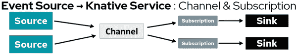
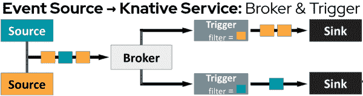
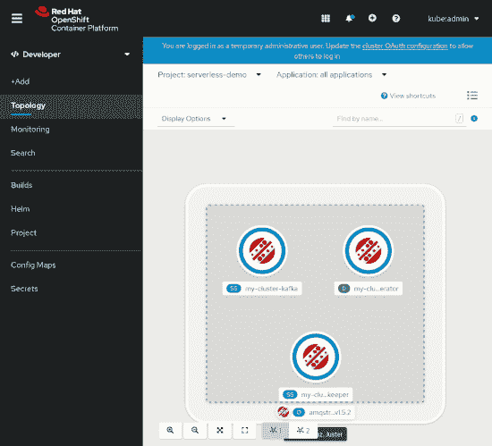
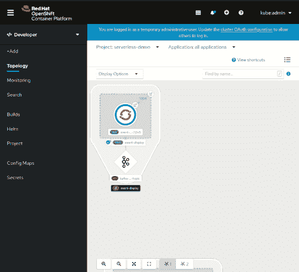
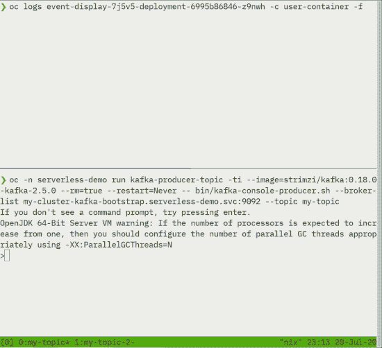

# 在 OpenShift 4.5 web 控制台中创建事件源

> 原文：<https://developers.redhat.com/blog/2020/07/28/creating-event-sources-in-the-openshift-4-5-web-console>

[Red Hat OpenShift 4.5](https://developers.redhat.com/blog/2020/07/16/whats-new-in-the-openshift-4-5-console-developer-experience/) 使部署和运行[事件驱动的应用](https://developers.redhat.com/topics/event-driven)变得前所未有的简单，这些应用通过事件通知对实时信息做出反应。在 [OpenShift 无服务器](https://developers.redhat.com/blog/2020/04/30/serverless-applications-made-faster-and-simpler-with-openshift-serverless-ga/)的支持下，应用程序通过事件变得栩栩如生，根据需要扩大资源(或达到预先配置的限制)，然后在资源爆发结束后缩小回零。

在本文中，我简要介绍了 OpenShift 4.5 中用于开发事件驱动应用程序的 OpenShift 无服务器特性。我还用一个例子展示了这些特性，这个例子展示了 [Knative services](https://developers.redhat.com/topics/serverless-architecture) 和一个 Kafka 事件源。

## 事件驱动的应用架构

事件为应用程序订阅各种事件源提供了一种简单的机制，包括您自己的应用程序、来自多个提供商的云服务、软件即服务(SaaS)系统和 Red Hat 服务，如 [AMQ 流](https://developers.redhat.com/products/amq/getting-started)。OpenShift 4.5 web 控制台中新的[开发者视角](https://developers.redhat.com/blog/2020/07/16/improved-navigation-in-the-openshift-4-5-developer-perspective/)使得部署事件驱动的应用程序更加容易，而不依赖于 YAML。

## OpenShift 4.5 中的无服务器事件

OpenShift Serverless 为构建事件驱动的应用程序提供了几种机制:

*   直接联系
*   频道和订阅
*   使用代理和触发器进行事件过滤

最佳使用方法取决于服务的需求。

### 直接联系

最简单的事件驱动架构是直接连接。图 1 显示了将 Knative 服务直接连接到事件源的架构。在本文的后面，我将向您展示如何使用新的 OpenShift Developer 透视图来创建直接连接。

Figure 1: The event-driven application architecture for a direct connection.

将源直接连接到服务效果很好，但是如果您需要将多个源分组呢？如果多个服务需要订阅这些组怎么办？

### 频道和订阅

多个源和接收器可以通过 OpenShift 无服务器通道和订阅一起工作。图 2 显示了事件驱动应用程序中的通道和订阅的架构。

Figure 2: The event-driven application architecture for channels and subscriptions.

事件通道使得事件源组易于重用。订阅提供了一种简单的方式将事件与服务联系起来。

### 事件代理和触发器

OpenShift Serverless 让我们可以快速分组和重用事件，但是过滤事件通知呢？一种选择是在应用程序代码中添加一个函数，只处理某些类型的事件。虽然这种方法可能有效，但是它冒着通知服务他们不需要的事件的风险，并且会直接丢弃。另一种方法是使用过滤通知，只在必要时通知服务。

OpenShift 无服务器事件代理和触发器构建在事件源之上，在通知服务之前过滤事件，如图 3 所示。

Figure 3: The event-driven application architecture for brokers and triggers.

## 创造创新服务

从 [OpenShift 4.4](https://developers.redhat.com/blog/2020/04/30/serverless-applications-made-faster-and-simpler-with-openshift-serverless-ga/) 开始，在向项目添加新应用程序时，可以选择一个 **Knative Service** 资源类型。添加一个 **Knative Service** 资源类型可以立即让任何应用程序受益于 OpenShift Serverless 的强大功能，如图 4 所示。

Figure 4: Creating a Knative service in OpenShift.

### 将事件源绑定到已知服务

您现在可以使用 OpenShift 开发人员透视图来创建事件源并将其绑定到 Knative 服务。如图 5 所示，您只需将事件源连接器(箭头图标)拖出现有的 Knative 服务，并选择**事件源**。然后，使用应该触发应用程序的事件类型来配置事件源(在本例中是 Kafka 事件源)。

Figure 5: Binding a Kafka event source to a Knative service in the OpenShift Developer perspective.

请注意，OpenShift Developer 透视图提供了一个简单的幻灯片，以便您可以快速查看与新创建的事件源相关的所有资源。

### 验证事件驱动的应用程序

构建事件驱动的应用程序的最后一步是验证服务正在接收通知。图 6 中的演示展示了 Kafka 事件源使用两个不同的 Kafka 主题来触发 Knative 服务。

Figure 6: Event notifications from a Kafka event source.

## 请给我们您的反馈！

OpenShift 开发人员体验流程的很大一部分是接收反馈并与我们的社区和客户合作。我们希望收到您的来信。我们希望您能在 [OpenShift 4.5 开发者体验反馈页面](https://forms.gle/zDd4tuWvjndCRVMD8)上分享您的想法。您还可以加入我们的 [OpenShift 开发者体验谷歌小组](https://groups.google.com/forum/#!forum/openshift-dev-users)，参与讨论并了解我们的办公时间会议，在那里您可以与我们合作，并提供关于您使用 OpenShift web 控制台的体验的反馈。

## 开始使用 OpenShift 4.5

你准备好开始使用新的 OpenShift 4.5 web 控制台了吗？[今天试试 open shift 4.5](http://www.openshift.com/try)。

*Last updated: July 27, 2020*