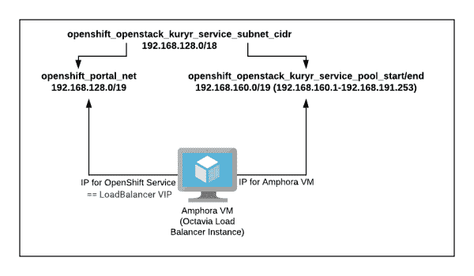

# 在 Red Hat OpenStack 13 上为 Red Hat OpenShift 3.11 定制和调整 Kuryr SDN

> 原文：<https://developers.redhat.com/blog/2020/10/02/customizing-and-tuning-the-kuryr-sdn-for-red-hat-openshift-3-11-on-red-hat-openstack-13>

在[上一篇文章](https://developers.redhat.com/blog/2019/11/01/how-to-customize-the-red-hat-openshift-3-11-sdn/)中，我向您展示了如何根据您组织的要求和限制来定制 [Red Hat OpenShift](https://developers.redhat.com/products/openshift/overview) 软件定义的网络(SDN)。在本文中，我们将看看如何使用 [Kuryr SDN](https://docs.openshift.com/container-platform/3.11/install_config/configuring_kuryrsdn.html) 来代替。在[红帽 OpenStack 13](https://access.redhat.com/documentation/en-us/red_hat_openstack_platform/13) 上使用带有 [OpenShift 3.11](https://docs.openshift.com/container-platform/3.11/welcome/index.html) 的 Kuryr 改变了定制要求，因为 Kuryr 直接与 OpenStack 中子和奥克塔维亚一起工作。

**注意**:这篇文章基于我上一篇文章中的讨论和例子。我建议先看前面的。

## 背景

传统的 OpenShift 安装利用了特定于 OpenShift 的`openshift-sdn`。使用`openshift-sdn`意味着你的容器运行在一个网络中的一个网络上。这种被称为*双重封装*的设置引入了额外的复杂性，这在排除网络问题时变得很明显。由于在网络中运行网络的开销，双重封装也影响网络性能。

如果您在 OpenStack 上运行 OpenShift，那么您可以选择使用 Kuryr SDN，它允许您直接访问 OpenStack 的中子服务，并避免双重封装。使用`kuryr-cni`意味着所有的 OpenShift 组件——网络、子网、负载平衡器、端口等等——实际上都是 OpenStack 资源。这种设置降低了网络层的复杂性。它还提高了网络性能。另一个好处是，您可以将浮动 IP 分配给任何 OpenShift 服务，这允许流量直接进入服务，而不必通过 OpenShift 路由器。

在某些情况下，您可能需要自定义 Kuryr 的网络范围默认值，例如默认值与您组织的网络重叠。让我们看看定制 Kuryr 网络的要求。

## 定制 Kuryr 网络

我们将使用与我在[上一篇文章](https://developers.redhat.com/blog/2019/11/01/how-to-customize-the-red-hat-openshift-3-11-sdn/)中的定制示例相同的基址范围:192.168.0.0/16。在这种情况下，我们将在服务网络(192.168.128.0/18)、pod 网络(192.168.0.0/17)和 docker-bridge 网络之间划分范围。对于这个具体的例子，我们打算用名称空间隔离来配置 Kuryr，类似于使用`openshift-sdn`时的`ovs-multitenant`。

**注意** : [我上一篇文章中提到的 OpenShift-Ansible](https://github.com/openshift/openshift-ansible) ，有更多的参数需求来提供与 Kuryr 容器网络接口(CNI)相同的网络 IP 范围定制。

### Kuryr 服务网络

因为 Kuryr 使用奥克塔维亚负载平衡器(它是 OpenStack 中的一个 Amphora VM)，所以每个 OpenShift 服务都是奥克塔维亚负载平衡器的一个实例。因此，`openshift_portal_net`是 OpenShift 用来给 OpenShift (Kubernetes)服务分配 IP 地址的地址范围。在故障转移的情况下，每个 IP 地址将与一个作为 VIP(虚拟 IP 或 OpenStack 中的浮动端口)的奥克塔维亚负载平衡器相关联。此外，因为奥克塔维亚负载平衡器是 Amphora 虚拟机，它们也需要一个端口/IP，这不应该与`openshift_portal_net`范围冲突。

使用以下范围可确保明确区分 Amphora VM IP 范围和 OpenShift 服务 IP 范围:

*   【OpenShift 服务 IP 和奥克塔维亚负载平衡器 Amphora VM IPs 使用的范围。在这种情况下，范围是 192.168.128.0/18，介于 192.168.128.0 和 192.168.191.254 之间。
*   `openshift_portal_net`:open shift 服务 IPs 专用范围。在这种情况下，范围是 192.168.128.0/19，介于 192.168.128.0 和 192.168.159.254 之间。
*   `openshift_openstack_kuryr_service_pool_start`:奥克塔维亚负载平衡器 Amphora VM IPs 要使用的范围的开始。在这种情况下，它是第一个参数(`openshift_openstack_kuryr_service_subnet_cidr`)中确定的范围的后一半。范围的开始是 192.168.160.0。
*   `openshift_openstack_kuryr_service_pool_end`:奥克塔维亚负载平衡器 Amphora VM IPs 使用的范围的结束。在本例中，它是 192.168.191.254。

图 1 显示了用 OpenShift 服务实现时 Amphora VM 的 IP 分配。

[](/sites/default/files/blog/2020/08/Amphora-VM-IP-in-service.png)

Figure 1: Clearly defining each range avoids IP collisions.

### 网络下的 Kuryr

pod 网络没有任何变化，这很简单。在我们的例子中，它是:

```
openshift_openstack_kuryr_pod_subnet_cidr: 192.168.0.0/17
```

## 自定义 Kuryr 库存参数

接下来，我们将了解成功配置定制的 OpenShift IP 范围所需的所有库存参数。

### 启用命名空间隔离

在 Kuryr 中启用名称空间隔离需要这些参数:

```
openshift_use_kuryr: True
openshift_use_openshift_sdn: False
use_trunk_ports: True
os_sdn_network_plugin_name: cni
openshift_node_proxy_mode: userspace
kuryr_openstack_pool_driver: nested

```

您必须确保`os_sdn_network_plugin_name`未设置。

### IP 范围

未能设置 IP 范围显然会导致`kuryr-controller`的性能问题和 IP 冲突:

```
#SERVICE:

openshift_portal_net: 192.168.128.0/19
openshift_openstack_kuryr_service_subnet_cidr: 192.168.128.0/18
openshift_openstack_kuryr_service_pool_start: 192.168.160.1
openshift_openstack_kuryr_service_pool_end: 192.168.191.253

#POD
openshift_openstack_kuryr_pod_subnet_cidr: 192.168.0.0/17

```

OpenShift 服务 IP 范围从 192.168.128.0 到 192 . 168 . 159 . 254；安芙兰 VM IP 范围从 192.168.160.1 到 19.168.191.254；pod IP 范围从 192.168.0.1 到 192.168.127.254。

请注意，以下类型的错误将导致 OpenShift 服务 IP 范围与 Amphora VM 的 IP 范围冲突:

```
ERROR kuryr_kubernetes.controller.drivers.lbaasv2 [-]
Error when creating loadbalancer: {"debuginfo": null, "faultcode":
 "Client", "faultstring": "IP address 192.168.123.123 already
allocated in subnet

```

### 预创建子端口

该值通常适用于平面网络，在平面网络中，预先创建子端口有助于提高需要网络资源的应用程序的整体部署速度。在大多数情况下，您可以将该值设置为 false:

```
openshift_kuryr_precreate_subports: false

```

### 集群规模

该参数改变了确定集群大小的方式，因此非常重要。每个名称空间的 pod 数量由`prefixlen`决定:

```
openshift_openstack_kuryr_pod_subnet_prefixlen

```

其中:

*   /24 =每个命名空间 256 个单元
*   /25 =每个命名空间 128 个单元
*   /26 =每个命名空间 64 个单元

### 池批次

需要根据`openshift_openstack_kuryr_pod_subnet_prefixlen`设置`kuryr_openstack_pool_batch`值:

```
kuryr_openstack_pool_max:

kuryr_openstack_pool_min:

```

以下是对以下`openshift_openstack_kuryr_pod_subnet_prefixlen`值的一些建议:

24:批次:5，最大值:10，最小值:1
25:批次:4，最大值:7，最小值:1
26:批次:3，最大值:5，最小值:1

还要注意，每个 OpenShift 节点都有自己的池，所以如果有三个 worker 节点，每个节点都有一个专用于该名称空间的池。这个需求根据`openshift_openstack_kuryr_pod_subnet_prefixlen`的大小限制了您可以使用的工作节点的数量。

### kuryr _ open stack _ CA:" MYORG _ CA _ bundle . txt "

如果不设置该值，Kuryr 将会失败。

### 形象

为图像提供特定值排除了默认图像不正确的风险:

```
openshift_openstack_kuryr_controller_image

openshift_openstack_kuryr_cni_image

```

### kuryr_openstack_public_net_id

你可以从`openstack network list`得到这个值。

### 全局名称空间

默认情况下，这些是唯一被认为是全局的名称空间，这意味着 Kuryr 允许其他名称空间访问这些名称空间，尽管名称空间是隔离的:

```
kuryr_openstack_global_namespaces: default,openshift-monitoring

```

### 名称空间隔离

名称空间隔离需要`openshift_kuryr_subnet_driver: namespace`和`openshift_kuryr_sg_driver: namespace`。

### DNS 查找

此处的值允许 DNS 查找:

```
openshift_master_open_ports:
- service: dns tcp
  port: 53/tcp
- service: dns udp
  port: 53/udp
openshift_node_open_ports:
- service: dns tcp
  port: 53/tcp
- service: dns udp
  port: 53/udp

```

### open shift _ open stack _ node _ sec group _ rules

```
# NOTE(shadower): the 53 rules are needed for Kuryr
  - direction: ingress
    protocol: tcp
    port_range_min: 53
    port_range_max: 53
  - direction: ingress
    protocol: udp
    port_range_min: 53
    port_range_max: 53
  - direction: ingress
    protocol: tcp
    port_range_min: 10250
    port_range_max: 10250
    remote_ip_prefix: "{{ openshift_openstack_kuryr_pod_subnet_cidr }}"
  - direction: ingress
    protocol: tcp
    port_range_min: 10250
    port_range_max: 10250
    remote_ip_prefix: "{{ openshift_openstack_subnet_cidr }}"
  - direction: ingress
    protocol: udp
    port_range_min: 4789
    port_range_max: 4789
    remote_ip_prefix: "{{ openshift_openstack_kuryr_pod_subnet_cidr }}"
  - direction: ingress
    protocol: udp
    port_range_min: 4789
    port_range_max: 4789
    remote_ip_prefix: "{{ openshift_openstack_subnet_cidr }}"
  - direction: ingress
    protocol: tcp
    port_range_min: 9100
    port_range_max: 9100
    remote_ip_prefix: "{{ openshift_openstack_kuryr_pod_subnet_cidr }}"
  - direction: ingress
    protocol: tcp
    port_range_min: 9100
    port_range_max: 9100
    remote_ip_prefix: "{{ openshift_openstack_subnet_cidr }}"
  - direction: ingress
    protocol: tcp
    port_range_min: 8444
    port_range_max: 8444
    remote_ip_prefix: "{{ openshift_openstack_kuryr_pod_subnet_cidr }}"
  - direction: ingress
    protocol: tcp
    port_range_min: 8444
    port_range_max: 8444
    remote_ip_prefix: "{{ openshift_openstack_subnet_cidr }}"

```

最重要的是，千万不要用`remote_group_id`。而是只用`remote_ip_prefix`。

## 结论

在 OpenStack 13 上使用 Kuryr 和 OpenShift 3.11 提供了将 OpenStack 的中子网络直接用于 OpenShift pods 和服务而不是 OpenShift SDN 的好处。避免双重封装提高了性能并降低了故障排除的复杂性，您还可以直接将浮动 IP 与 OpenShift 服务相关联，这在一些应用程序中非常有用。

然而，有一些参数必须正确配置，以便使用 Kuryr 获得最佳运行的 OpenShift 集群。本文确定了配置满足您需求的集群所需的所有重要参数和推荐值。

## 承认

我要感谢路易斯·托马斯·玻利瓦尔作为我的合著者，感谢 T2·冯阮作为我们的审稿人。

## 参考

欲了解更多信息:

*   参见“[如何定制 Red Hat open shift 3.11 SDN](https://developers.redhat.com/blog/2019/11/01/how-to-customize-the-red-hat-openshift-3-11-sdn/)”(Mohammad Ahmad，2019)作为本文基础的原始讨论和示例。
*   请参见“[利用 Kuryr](https://www.openshift.com/blog/accelerate-your-openshift-network-performance-on-openstack-with-kuryr) 在 OpenStack 上加速 OpenShift 网络性能”(Rodriguez、Malleni 和 Bolivar，2019)，了解 Kuryr SDN 与 OpenShift SDN 的架构概述和性能比较。
*   有关配置 Kuryr SDN 的详细信息，请参见 [Kuryr SDN 和 OpenShift 容器平台(OCP 3.11)文档](https://docs.openshift.com/container-platform/3.11/install_config/configuring_kuryrsdn.html)。
*   请参见[配置 OpenStack](https://docs.openshift.com/container-platform/3.11/install_config/configuring_openstack.html) (OCP 3.11)，了解有关配置 OCP 以访问 OpenStack 基础架构的更多信息。
*   有关配置 Kuryr SDN 的更多信息，请参见 [Kuryr SDN 管理](https://docs.openshift.com/container-platform/3.11/admin_guide/kuryr.html) (OCP 3.11)。