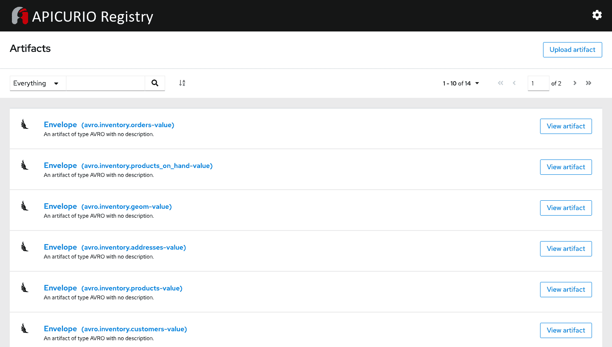

# 使用 Apache Avro 和 Apicurio 注册表的 Debezium 序列化

> 原文：<https://developers.redhat.com/blog/2020/12/11/debezium-serialization-with-apache-avro-and-apicurio-registry>

在本文中，您将了解如何将 Debezium 与 Apache Avro 和 Apicurio Registry 结合使用，以有效地监控 MySQL 数据库中的变更事件。我们将使用 Apache Avro 而不是默认的 JSON 转换器为 Debezium 序列化设置并运行一个演示。我们将使用 Apache Avro 和 Apicurio 服务注册中心来外部化 Debezium 的事件数据模式，并减少捕获事件的负载。

## 什么是 Debezium？

Debezium 是一组分布式服务，它捕获行级数据库的变化，以便应用程序可以查看和响应这些变化。Debezium 连接器将所有事件记录到一个[红帽 AMQ 流](https://developers.redhat.com/blog/2018/10/29/how-to-run-kafka-on-openshift-the-enterprise-kubernetes-with-amq-streams/)卡夫卡集群。应用程序使用 AMQ 流来消费变更事件。

Debezium 使用 [Apache Kafka Connect](https://developers.redhat.com/blog/2020/02/14/using-secrets-in-apache-kafka-connect-configuration/) 框架，该框架将 Debezium 的连接器转换为 Kafka 连接器源连接器。可以使用由 AMQ Streams 提供的 Kafka Connect 定制 [Kubernetes](https://developers.redhat.com/topics/kubernetes) 资源来部署和管理它们。

Debezium 支持以下数据库连接器:

*   MySQL 连接器
*   PostgreSQL 连接器
*   MongoDB 连接器
*   SQL Server 连接器

在我们的例子中，我们将使用 [MySQL 连接器](https://debezium.io/documentation/reference/1.3/connectors/mysql.html)。

## 使用 Apache Avro 的 Debezium 序列化

Debezium 使用 JSON 转换器将记录键和值序列化到 JSON 文档中。默认情况下，JSON 转换器包含一个记录的消息模式，因此每个记录都非常详细。另一种选择是使用 [Apache Avro](https://avro.apache.org/) 来序列化和反序列化每个记录的键和值。如果您想使用 Apache Avro 进行序列化，您还必须部署一个模式注册表，它管理 Avro 的消息模式及其版本。

[Apicurio Registry](https://github.com/Apicurio/apicurio-registry) 是一个与 Avro 合作的开源项目。它提供了一个 Avro 转换器以及一个 API 和模式注册表。您可以在 Debezium 连接器配置中指定 Avro 转换器。然后，转换器将 Kafka 连接模式映射到 Avro 模式。它使用 Avro 模式将记录键和值序列化为 Avro 的紧凑二进制形式。

Apicurio API 和 schema registry 跟踪 Kafka 主题中使用的 Avro 模式。Apicurio 还跟踪 Avro 转换器将生成的 Avro 模式发送到哪里。

**注意**:API curio 服务注册中心是完全受支持的，并且[作为 Red Hat 集成的一部分](https://developers.redhat.com/blog/2020/12/09/new-features-and-storage-options-in-red-hat-integration-service-registry-1-1-ga/)通常是可用的。

## 演示:使用 Apache Avro 和 Apicurio 的 Debezium 序列化

在这个演示中，我们将运行一个示例应用程序，它使用 Avro 进行序列化，使用 Apicurio 服务注册中心来跟踪 Debezium 事件。要成功运行示例应用程序，您需要在您的开发环境中安装并运行以下工具:

*   Docker:最新版本需要安装 [Linux 容器镜像](https://docs.docker.com/engine/install/)。
*   kafkacat:Kafka 的通用非 JVM 生产者和消费者。
*   jq :用于 JSON 处理的命令行实用程序。

### 步骤 1:启动服务

一旦您在开发环境中安装了所需的工具，我们就可以通过克隆`debezium-examples`存储库并启动所需的服务组件来开始演示:

1.  克隆存储库:

    ```
    $ git clone https://github.com/hguerrero/debezium-examples.git
    ```

2.  转到以下目录:

    ```
    $ cd debezium-examples/debezium-registry-avro
    ```

3.  启动环境:

    ```
    $ docker-compose up -d
    ```

最后一个命令启动以下组件:

*   单节点 Zookeeper 和 Kafka 集群
*   单节点 Kafka Connect 集群
*   Apicurio 服务注册实例
*   为变更数据捕获做好准备的 MySQL 数据库

### 步骤 2:配置 Debezium 连接器

接下来，我们配置 Debezium 连接器。配置文件指示 Debezium 连接器使用 Avro 进行序列化和反序列化。它还指定了 Apicurio 注册表的位置。

这个环境中使用的容器映像包括访问连接器和转换器所需的所有库。下面几行设置了键和值转换器以及它们各自的注册表配置:

```
        "key.converter": "io.apicurio.registry.utils.converter.AvroConverter",
        "key.converter.apicurio.registry.url": "http://registry:8080/api",
        "key.converter.apicurio.registry.global-id": "io.apicurio.registry.utils.serde.strategy.AutoRegisterIdStrategy",
        "kwy.converter.apicurio.registry.as-confluent": "true",
        "value.converter": "io.apicurio.registry.utils.converter.AvroConverter",
        "value.converter.apicurio.registry.url": "http://registry:8080/api",
        "value.converter.apicurio.registry.global-id": "io.apicurio.registry.utils.serde.strategy.AutoRegisterIdStrategy",
        "value.converter.apicurio.registry.as-confluent": "true"

```

注意，Apicurio 的兼容模式允许我们使用另一个提供者的工具来反序列化和重用 Apicurio 服务注册中心的模式。

### 步骤 3:创建连接器

接下来，我们创建 Debezium 连接器来开始捕获数据库中的变化。我们将使用 Kafka Connect cluster REST API 来创建 Debezium 连接器:

```
$ curl -X POST http://localhost:8083/connectors -H 'content-type:application/json' -d @dbz-mysql-connector-avro.json

```

### 第四步:检查数据

我们已经创建并启动了连接器。现在，我们注意到数据库中的初始数据已经被 Debezium 捕获并作为事件发送给 Kafka。使用以下`kafkacat`命令查看数据:

```
$ kafkacat -b localhost:9092 -t avro.inventory.customers -e

```

### 步骤 5:反序列化记录

当您查看数据时，您会注意到返回的信息不是人类可读的。这意味着 Avro 正确地序列化了它。为了获得数据的可读版本，我们可以指示`kafkacat`从 Apicurio 服务注册中心查询模式，并使用它来反序列化记录。使用注册表配置运行以下命令:

```
$ kafkacat -b localhost:9092 -t avro.inventory.customers -s avro -r http://localhost:8081/api/ccompat -e

```

如果您安装了`jq` JSON 实用程序，您可以使用以下命令:

```
$ kafkacat -b localhost:9092 -t avro.inventory.customers -s avro -r http://localhost:8081/api/ccompat -e | jq

```

您可以看到 Kafka 记录信息只包含有效负载，没有 Debezium 模式的开销。这种开销现在在 Apicurio 注册表中具体化了。

### 步骤 6:检查 Apicurio 模式注册表

最后，如果您想查看本例中所有模式工件的列表，您可以查看位于`http://localhost:8081/`的 Apicurio 模式注册表，如图 1 所示。

[](https://github.com/hguerrero/debezium-examples/raw/main/debezium-registry-avro/schemas.png)

图 Apicurio 模式注册中心中的模式工件。

## 开始使用 Debezium 和 Kafka Connect

您可以从 [Red Hat 开发者门户](https://developers.redhat.com/products)下载 Red Hat Integration Debezium 连接器。您还可以查看 [Gunnar Morling 关于 Debezium 和 Kafka](https://developers.redhat.com/videos/youtube/QYbXDp4Vu-8/)(2019 年 2 月)的网络研讨会，该研讨会来自[发展技术讲座](https://developers.redhat.com/devnation/the-show)系列。另外，请看他最近在 QCon(2020 年 1 月)上的 [Kafka 和 Debezium 演讲](https://www.infoq.com/presentations/data-streaming-kafka-debezium/)。

## 结论

尽管 Debezium 可以很容易地捕获数据库的变化并记录在 Kafka 中，但开发人员仍然需要决定如何在 Kafka 中序列化变化事件。Debezium 允许您从各种选项中指定键和值转换器。使用带有 Apicurio 服务注册中心的 Avro 连接器，您可以存储模式的外部化版本，并最小化您必须传播的负载。

[Debezium Apache Kafka 连接器](https://developers.redhat.com/topics/event-driven/connectors)可从[红帽集成](https://developers.redhat.com/integration)获得。Red Hat Integration 是一套全面的集成和消息传递技术，用于跨混合基础架构连接应用程序和数据。

*Last updated: May 13, 2021*