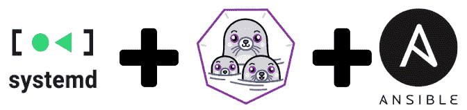
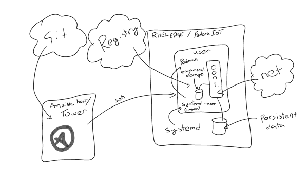
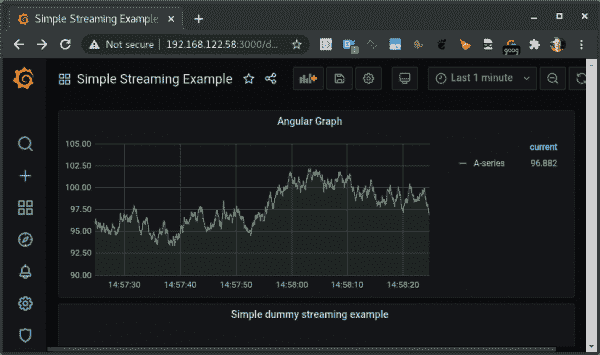
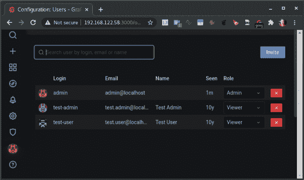

# 将您的应用交付到无根容器中的边缘和物联网设备

> 原文：<https://developers.redhat.com/blog/2021/02/03/deliver-your-applications-to-edge-and-iot-devices-in-rootless-containers>

应用程序通常在[容器](https://developers.redhat.com/topics/containers)中开发、测试和交付，而 [Red Hat OpenShift](https://developers.redhat.com/products/openshift/overview) 是一个非常好的平台。然而，有时目标机器比一个 [Kubernetes](https://developers.redhat.com/topics/kubernetes) 集群小得多。它可能是嵌入式服务器、工业 PC 硬件或单台服务器。


假设目标机器是一台[Red Hat Enterprise Linux](https://developers.redhat.com/products/rhel/overview)(RHEL)[边缘服务器](https://developers.redhat.com/topics/edge-computing)？你如何让你的容器在那个环境中自动运行？如果你有*成千上万个这样的设备*会怎么样？在这种情况下，你会想要一个全自动的无根容器来保证安全。但是如何自动化无根容器呢？

在本文中，您将了解如何使用 systemd、 [Podman](https://developers.redhat.com/articles/podman-next-generation-linux-container-tools) 和 [Red Hat Ansible Automation](https://developers.redhat.com/products/ansible/overview) 来自动化软件，并将软件作为容器推送到小规模 edge 和[物联网](https://developers.redhat.com/blog/category/iot/) (IoT)网关设备。

**注意**:虽然我没有在演示中包括[红帽安身塔](https://www.ansible.com/products/tower)，但是整合它将是下一个合理的步骤。

## 为什么是无根容器？

为什么要使用[无根容器](https://developers.redhat.com/blog/2020/09/25/rootless-containers-with-podman-the-basics/)向 edge 和物联网盒子交付应用？这是另一层安全措施。即使邪恶的 blackhat 设法闯入您的容器，找到安全漏洞，并穿透您的安全增强 Linux (SELinux)模块，无根容器也可以确保他们在系统中没有特权。

作为开发人员，您也不一定需要目标设备的 root 权限。您的团队可以将应用作为容器交付给终端设备，而只有管理员有权管理这些容器。

## 设置开发环境

我以前写过关于用 Ansible 自动化 Podman 容器的文章，但是我最近才把无根选项添加到我的 Ansible 角色中。在这个演示中，我们将使用[更新后的角色](https://galaxy.ansible.com/ikke_t/podman_container_systemd)和一个[角色模块用于 Grafana](https://github.com/ansible-collections/community.grafana) 。

我们将为 Grafana 设置一个虚拟仪表板，并对 RHEL 边缘服务器的用户进行测试。我还在 Fedora 物联网发行版和标准 RHEL 服务器上测试了这个例子。

我们的最终目标是使用 systemd、Podman 和 Ansible Tower 创建持久容器，其中容器只有用户特权。在这种情况下，systemd 管理用户进程，但是任何 Docker 容器都是一样的。图 1 显示了这些组件如何协同工作。

[](/sites/default/files/blog/2021/01/podman-user.png)

Figure 1: Creating persistent containers with systemd, Podman, and Ansible Tower.

在接下来的部分中，我们将设置和配置这种自动化。

## ansible 中的系统变更

首先，让我们看看需要做些什么来使 [podman_container_systemd](https://galaxy.ansible.com/ikke_t/podman_container_systemd) 角色在用户模式下工作。我们还将研究 Fedora CoreOS 和类似的只打算运行容器的服务器所需要的改变。

### 用户系统服务

我们要做的第一件事是将所有服务文件移动到用户的主目录，而不是系统配置目录中的`/etc/systemd/system`或`/usr/lib/systemd/system`。从技术上讲，我们可以使用`/usr/lib/systemd/user`目录，但是我们希望服务文件对用户是私有的。这样，如果需要，应用程序团队中的任何人都可以作为普通用户修改它们。

下面是这个步骤的[配置代码:](https://github.com/ikke-t/podman-container-systemd/blob/9a0bf79a47b569050e09dcfb3a367dffbf39b4d8/tasks/main.yml#L12)

```
   - name: set systemd dir if user is not root
      set_fact:
        service_files_dir: "{{ user_info.home }}/.config/systemd/user"
        systemd_scope: user
      changed_when: false

    - name: ensure systemd files directory exists if user not root
      file:
        path: "{{ service_files_dir }}"
        state: directory
        owner: "{{ container_run_as_user }}"
        group: "{{ container_run_as_group }}"

```

### 配置持续的 D-BUS 会话

对我来说最大的障碍是理解一个服务用户如何获得一个 [D-BUS 会话](https://www.freedesktop.org/wiki/Software/dbus/)，即使用户从未登录，它仍然可以通过 boots 访问。此外，systemd 必须能够控制用户的 Podman 会话。我们可以通过为用户设置一个[延迟会话](https://www.freedesktop.org/software/systemd/man/loginctl.html)来处理这些需求，它会在引导时为给定用户激活`dbus`。下面是[如何设置延迟会话](https://github.com/ikke-t/podman-container-systemd/blob/9a0bf79a47b569050e09dcfb3a367dffbf39b4d8/tasks/main.yml#L159):

```
 - name: Check if user is lingering
    stat:
      path: "/var/lib/systemd/linger/{{ container_run_as_user }}"
    register: user_lingering
    when: container_run_as_user != "root"

  - name: Enable lingering is needed
    command: "loginctl enable-linger {{ container_run_as_user }}"
    when:
      - container_run_as_user != "root"
      - not user_lingering.stat.exists

```

接下来，我们需要确保 systemd 命令是在用户范围中[执行的。因为我们不是作为目标用户登录，而是作为特权 Ansible 用户登录，所以我们将为`xdg_runtime_dir`设置一个环境变量。稍后我们可以使用这个变量来查找用户逗留的`dbus`会话。下面是如何](https://github.com/ikke-t/podman-container-systemd/blob/9a0bf79a47b569050e09dcfb3a367dffbf39b4d8/tasks/main.yml#L33)[将 systemd 的作用域设置为用户](https://github.com/ikke-t/podman-container-systemd/blob/9a0bf79a47b569050e09dcfb3a367dffbf39b4d8/tasks/main.yml#L33):

```
- name: set systemd runtime dir
  set_fact:
    xdg_runtime_dir: "/run/user/{{ container_run_as_uid.stdout }}"
  changed_when: false

- name: set systemd scope to system if needed
  set_fact:
    systemd_scope: system
    service_files_dir: '/etc/systemd/system'
    xdg_runtime_dir: "/run/user/{{ container_run_as_uid.stdout }}"
  when: container_run_as_user == "root"
  changed_when: false

```

## 设置默认目标

当 systemd 会话文件在无根模式下运行时，我们还需要将它更改为默认目标。下面是默认目标的[配置:](https://github.com/ikke-t/podman-container-systemd/blob/9a0bf79a47b569050e09dcfb3a367dffbf39b4d8/templates/systemd-service-single.j2#L26)

```
[Install]

WantedBy=multi-user.target


WantedBy=default.target


```

### 用户系统命令

我们已经设置了所有需要的变量。接下来，我们需要[告诉 Ansible 使用 D-BUS 会话](https://github.com/ikke-t/podman-container-systemd/blob/9a0bf79a47b569050e09dcfb3a367dffbf39b4d8/handlers/main.yml#L12):

```
- name: start service
  become: true
  become_user: "{{ container_run_as_user }}"
  environment:
    XDG_RUNTIME_DIR: "{{ xdg_runtime_dir }}"
  systemd:
    name: "{{ service_name }}"
    scope: "{{ systemd_scope }}"
    state: started

```

注意，我们切换到一个给定的用户，并设置运行时目录来捕获 D-BUS。此外，范围被设置为`user`而不是`system`。

### RPM-OSTREE 包处理

出于我自己的目的，我想在最小的、基于 Fedora CoreOS 的机器上运行这些容器。奇怪的是，Ansible 没有为这个设置提供合适的包模块。因此，我使用了下面的[方法来检查和安装软件包](https://github.com/ikke-t/podman-container-systemd/blob/9a0bf79a47b569050e09dcfb3a367dffbf39b4d8/tasks/main.yml#L227):

```
- name: ensure firewalld is installed (on fedora-iot)
    tags: firewall
    command: >-
      rpm-ostree install --idempotent --unchanged-exit-77
      --allow-inactive firewalld
    register: ostree
    failed_when: not ( ostree.rc == 77 or ostree.rc == 0 )
    changed_when: ostree.rc != 77
    when: ansible_pkg_mgr == "atomic_container"

  - name: reboot if new stuff was installed
    reboot:
      reboot_timeout: 300
    when:
      - ansible_pkg_mgr == "atomic_container"
      - ostree.rc != 77

```

您可能不想在那里安装任何东西，但是如果您这样做了，这个配置会处理所需的重新启动。在物联网系统中使用 Fedora CoreOS 是有意义的。

在这一点上，我们已经基本完成了更改。

## 尝试一下

如果你想自己尝试一下(为什么不呢？)，我将分享在您自己的环境中运行这个示例的命令。我在我的笔记本电脑上使用了 RHEL 8，并将 RHEL edge 服务器作为目标虚拟机。如果您无法访问 RHEL edge，也可以使用 Feroda-IoT 作为目标。

我喜欢将所有与任务相关的东西放在一个目录中，包括所需的集合和角色。我已经在示例项目存储库中设置了所有这些，包括需求文件。你需要做的就是得到它:

```
sudo dnf install ansible
git clone https://github.com/ikke-t/ansible-podman-sample.git
cd ansible-podman-sample

```

然后，安装角色和集合依赖项:

```
ansible-galaxy collection install -r collections/requirements.yml -p collections
ansible-galaxy role install -r roles/requirements.yml -p roles

```

运行剧本:

```
ln -s roles/ikke_t.grafana_podman/tests/test.yml run-container-grafana-podman.yml
ansible-playbook -i edge, -u cloud-user -b \
  -e container_state=running \
  -e ansible_pkg_mgr=atomic_container \
  run-container-grafana-podman.yml

```

您需要为您的系统更改以下设置:

*   如果[目标是 RHEL 边缘服务器](https://github.com/ansible/ansible/issues/73084)，则只需要`ansible_pkg_mgr`设置；否则，您可以删除此行。
*   `edge`是我的虚拟机服务器的 SSH 地址。
*   `cloud-user`是目标虚拟机中的`sudo`特权用户。

让它运行一分钟，然后...击鼓...哒哒！如图 2 所示，我们将 Grafana 仪表板作为一个容器(http://your_vm:3000)在用户会话中运行。

[](/sites/default/files/blog/2021/01/grafana-dashboard.png)grafana-dashboard

grafana-dashboard

图 3 显示了测试用户使用 Ansible Grafana 集合推送 API。

[](/sites/default/files/blog/2021/01/grafana-users.png)grafana-users

grafana-users

## 在目标中本地调试

我们作为用户运行容器，这个角色将它们放在 systemd 的用户上下文中。要作为给定用户使用 systemd，您需要设置一个与 D-BUS 相关的环境变量。但是，该用户没有登录凭证，因此需要使用`su`手动切换到该用户。(请注意，`sudo`不会工作，因为原始用户 ID 会显示您的`ssh`用户 ID。)

下面是用户手动切换的命令:

```
su - root
su - grafana
export XDG_RUNTIME_DIR=/run/user/$UID

```

设置`XDG_RUNTIME_DIR`后，您将能够使用`systemd --user`或`journalctl --user`命令来调查您为容器设置的 systemd 服务:

```
[cloud-user@edge ~]$ su -
Password:
Last login: Thu Dec 31 13:03:43 EET 2020 on pts/2
[root@edge ~]# su - grafana
Last login: Thu Dec 31 13:04:41 EET 2020 on pts/1
(failed reverse-i-search)`export': ^C
[grafana@edge ~]$ export XDG_RUNTIME_DIR=/run/user/$UID
[grafana@edge ~]$
[grafana@edge ~]$ systemctl --user status grafana-container-pod-grafana.service
 grafana-container-pod-grafana.service - grafana Podman Container   Loaded: loaded (/var/home/grafana/.config/systemd/user/grafana-container-pod-grafana.service; enabled; ve>
   Active: active (running) since Thu 2020-12-31 13:06:35 EET; 29min ago
   Process: 1122 ExecStartPre=/usr/bin/rm -f /tmp/grafana-container-pod-grafana.service-pid /tmp/grafana-cont>
 Main PID: 1126 (podman)
   CGroup: /user.slice/user-1002.slice/user@1002.service/grafana-container-pod-grafana.service
           ├─1126 /usr/bin/podman run --name grafana --rm -p 3000:3000/tcp -e GF_INSTALL_PLUGINS=flant-statu>
           ├─1158 /usr/bin/podman run --name grafana --rm -p 3000:3000/tcp -e GF_INSTALL_PLUGINS=flant-statu>
           ├─1167 /usr/bin/podman
           ├─1200 /usr/bin/slirp4netns --disable-host-loopback --mtu 65520 --enable-sandbox --enable-seccomp>
           ├─1206 /usr/bin/fuse-overlayfs -o lowerdir=/var/home/grafana/.local/share/containers/storage/over>
           ├─1214 containers-rootlessport
           ├─1227 containers-rootlessport-child
           ├─1240 /usr/bin/conmon --api-version 1 -c 2675941bf4743ff26860ff2e84ceaaae78f2fcfbe3fef218e0cfee9>
           └─2675941bf4743ff26860ff2e84ceaaae78f2fcfbe3fef218e0cfee914aa96b37
             └─1251 grafana-server --homepath=/usr/share/grafana --config=/etc/grafana/grafana.ini --packagi>
[grafana@edge ~]$ podman ps
CONTAINER ID  IMAGE                             COMMAND  CREATED         STATUS             PORTS                   NAMES
2675941bf474  docker.io/grafana/grafana:latest           29 minutes ago  Up 29 minutes ago  0.0.0.0:3000->3000/tcp  grafana
```

## 清理(核武器)

您已经看到了如何使用 Ansible 自动化无根 Podman 容器；现在是时候清理干净了。注意“`nuke=true`”选项会删除 Grafana 用户和数据。使用此选项之前，请确保您已经存储了不想丢失的任何数据。再次注意，如果您不在 RHEL 边缘目标上工作，您需要移除`pkg_mgr`:

```
ansible-playbook -i edge, -u cloud-user -b \
  -e container_state=absent \
  -e ansible_pkg_mgr=atomic_container \
  -e nuke=true \
  run-container-grafana-podman.yml

```

## 结论

Podman 和 systemd 对于在小型设置中运行容器非常有效，而 Kubernetes 可能有些过头了。Ansible 是创建这种设置的可靠方法。有时，正如我在这里展示的，您甚至不需要备份，因为 Ansible 可以非常容易地从头开始创建目标，包括应用程序安装和配置。如果您在边缘有一台或数千台机器，这也无关紧要；设置基本相同。还记得我们如何在 API 和配置文件上配置 Grafana 吗？考虑哪一种更适合您的应用程序。

对了，在边缘更新应用怎么样？在我的例子中，我设置了一个 Podman 容器标记来定期轮询容器的新版本。如果您[启用了服务](http://docs.podman.io/en/latest/markdown/podman-auto-update.1.html)，那么您只需要在 Red Hat OpenShift 中成功的 [CI/CD 管道结束时将容器的新版本推送到注册中心。集装箱化快乐！](https://developers.redhat.com/courses/middleware/openshift-pipelines)

## 资源

请参阅以下内容，了解有关 Podman 和 systemd 的更多信息:

*   Podman 文档包括 [podman-generate-systemd](http://docs.podman.io/en/latest/markdown/podman-generate-systemd.1.html#:~:text=DESCRIPTION,units%20on%20the%20remote%20system.) 手册页。
*   了解更多关于使用 Podman 和可共享 systemd 服务运行容器的信息。
*   了解 Podman 2.0 中与 systemd 的集成。
*   使用 [podman-auto-update](http://docs.podman.io/en/latest/markdown/podman-auto-update.1.html) 命令根据容器的自动更新策略自动更新容器。

*Last updated: October 7, 2022*