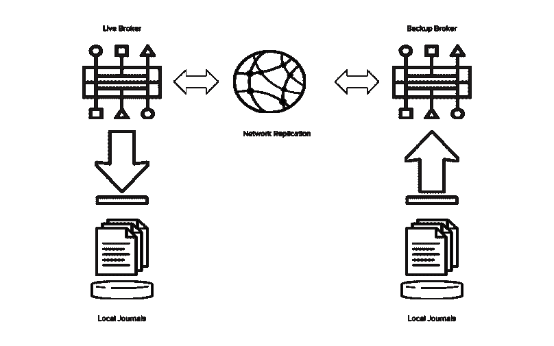

# 演示 Red Hat JBoss AMQ 7 HA 复制故障切换

> 原文：<https://developers.redhat.com/blog/2017/08/04/demonstrating-red-hat-jboss-amq-7-ha-replication-failover>

几周前，最新版本的[红帽 JBoss AMQ 发布](https://hguerreroo.wordpress.com/2017/05/04/jboss-amq-7-ga-announced-download-it-today/)。AMQ 7 是 Red Hat 为其中间件产品创建统一消息平台的成果。这个新版本最有趣的特性之一是在高可用性中配置时用于故障转移的新后备策略。此功能允许客户端连接在服务器出现故障时从一台服务器迁移到另一台服务器，以便客户端应用程序可以继续运行。

AMQ 6.x 已经有了一个选项来配置故障转移，使用一个*共享存储，*通常由一个共享文件系统或一个到数据库的 JDBC 连接来备份。然而，这一选择涉及在硬件和软件中使用外部基础设施附件，这意味着总体部署成本增加。

在 AMQ 7 中，增加了对基于网络的复制的支持。使用复制时，活动服务器和备份服务器不共享相同的数据目录；所有数据同步都是通过网络完成的。因此，实时服务器收到的所有(持久)数据都将复制到备份中。



上图显示了 AMQ 7 复制高可用性策略的基础。

[复制(无共享)演示](https://github.com/jbossdemocentral/amq-ha-replicated-demo)项目演示了新的 AMQ 7 复制高可用性功能，以避免使用共享存储。此项目演示了如何使用 AMQ 的命令行界面(CLI)设置实时代理及其相应的备份，并配置复制 ha 故障转移策略。

你需要一台至少有 2GB 内存(最好是 4GB)和几 GB 空闲磁盘空间的 Linux 或 Mac 笔记本电脑。系统中还应该安装 Java 虚拟机版本 8。有了这些先决条件，您可以按照下面的步骤部署您的代理:

1.  [下载并解压此演示](https://github.com/jbossdemocentral/amq-ha-replicated-demo/releases/latest)，克隆 [Github 库](https://github.com/jbossdemocentral/amq-ha-replicated-demo)。
2.  从红帽开发者门户下载 JBoss AMQ 经纪人:——[在此下载；](https://developers.redhat.com/products/amq/download/)添加到安装目录(参见安装/自述文件)。
3.  Deploy the demo using the automated installation script ‘init.sh’,

    ```
    ./init.sh 
    ```

    成功部署后，您可以测试故障转移。

#### **发送信息**

要向主代理发送消息，请执行以下命令:

```
$ target/amq-broker-7.0.1/instances/replicatedMaster/bin/artemis producer --message-count 10 --url "tcp://127.0.0.1:61616" --destination queue://haQueue 
```

#### **浏览主人**上的消息

要检查成功发送到代理的消息，请检查代理 web 控制台中的队列。

*   打开 web 浏览器并导航到 AMQ web 控制台，[http://localhost:8161/haw TiO](http://localhost:8161/hawtio)。
*   在左树中，导航至 127.0.0.1 >地址> haQueue >队列>任播> haQueue。
*   点击*浏览*(必要时刷新)。

您将看到生产者脚本发送的 10 条消息。

#### **浏览备份控制台**

由于 replicatedSlave 代理作为 replicatedMaster 的备份代理运行，因此没有活动地址或队列在侦听。

*   打开网络浏览器，导航到 AMQ 网络控制台[http://localhost:8261/haw TiO](http://localhost:8261/hawtio)
*   在左树中，导航至 127.0.0.1 >地址> haQueue >队列>任播> haQueue

您将只能看到有关集群广播配置的信息。

#### **主关机**

要关闭主代理，请执行以下命令:

```
$ target/amq-broker-7.0.1/instances/replicatedMaster/bin/artemis-service stop 
```

当主代理关闭时，备份代理将会注意到与主代理的连接断开，并且会变为活动状态。

#### **浏览从属**上的消息

要检查成功复制到从属代理的消息，请检查从属代理 web 控制台中的队列。

*   刷新 AMQ web 控制台[http://localhost:8261/hawtio](http://localhost:8261/hawtio)
*   在左树中，导航至 127.0.0.1 >地址> haQueue >队列>任播> haQueue
*   点击*浏览*(必要时刷新)

您将看到生产者脚本发送给主代理的 10 条消息。

#### **故障回复**

如果需要，可以再次启动复制的主代理，以查看备份如何回切到主代理。

```
$ target/amq-broker-7.0.1/instances/replicatedMaster/bin/artemis-service start 
```

主服务器将启动并检查是否有活动的代理。当备份服务器检测到主服务器再次变为可用时，它将再次失败并进入备份模式。

现在，您已经安装并运行了完全备份的 AMQ 7 代理！

要了解更多信息，请查看提供关于红帽 JBoss AMQ 有用博客和内容的[红帽开发者计划](https://developers.redhat.com/products/amq/overview/)网站。

* * *

**下载[红帽 JBoss AMQ](https://developers.redhat.com/products/amq/download/?intcmp=7016000000124eUAAQ) 用于开发使用。**

*Last updated: August 3, 2017*