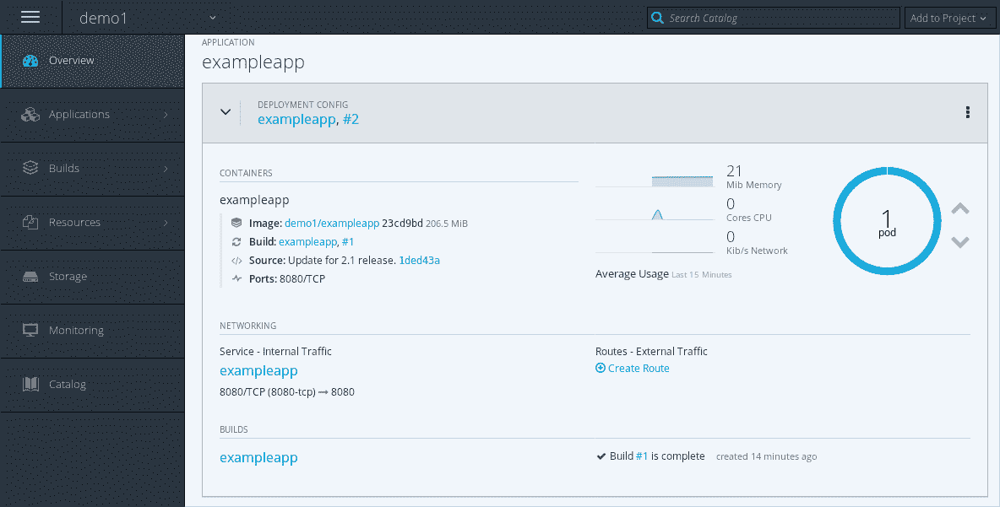

# 使用 OpenShift 进行部署。网络核心应用

> 原文：<https://developers.redhat.com/blog/2018/07/05/deploy-dotnet-core-apps-openshift>

容器是部署应用程序的新方式。它们提供了一种高效的机制，以可移植的方式跨云和操作系统发行版部署自包含的应用程序。在这篇博文中，我们将看看 OpenShift 带来了什么。特指网芯。

**立方结构与开放舱**

Kubernetes 是管理容器化应用程序的事实上的协调者。谷歌在 2014 年开源了 Kubernetes，红帽是首批与谷歌在 Kubernetes 上合作的公司之一。Red Hat 是 Kubernetes 上游项目的第二大贡献者。

OpenShift 是一个开源的 DevOps 平台，构建在 Kubernetes 之上。它直接与您的应用程序的源代码集成。这实现了持续集成/持续部署(CI/CD)工作流。工具可用于扩展和监控您的应用。OpenShift 目录使得设置中间件和数据库变得容易。OpenShift 附带了全面的文档来安装和管理您的安装。它可以在内部和公共云上运行，如 AWS、GCP 和 Azure。

**。OpenShift 上的 NET Core**

。NET Core 是一个开源的，跨平台的。NET 实现。它于 2015 年被微软开源。像 Kubernetes 和 OpenShift 一样，它允许任何人来构建、维护和支持。网芯。Red Hat 从 1.0 版本开始就这样做了，并且与微软合作，Red Hat 提供服务版本和新的。适用于 Red Hat Enterprise Linux (RHEL)和 OpenShift 的. NET 核心版本。最近，Red Hat [宣布。网芯 2.1](https://developers.redhat.com/blog/2018/06/14/announcing-net-core-2-1-for-red-hat-platforms/) 。

对 RHEL 来说，这意味着。NET Core SDK 和 runtime 可用于构建和运行应用程序。对于 OpenShift，这意味着有一个源到图像(s2i)生成器。NET 核心，使 OpenShift 了解如何构建。NET 核心应用程序。

s2i-builder 可以使用[变量](https://access.redhat.com/documentation/en-us/net_core/2.1/html/getting_started_guide/gs_dotnet_on_openshift#gs_env-var)进行调整，它支持许多典型的工作流程。如果需要更多的控制，可以使用直接控制构建的源代码对定制脚本(`.s2i/bin/assemble`)进行版本控制。在 OpenShift 上使用 Jenkins 可以实现更高级的场景，open shift 也支持。网芯。

**入门**

您可以使用 *minishift* 在您的开发机器上运行 OpenShift。minishift 是 Red Hat 容器开发工具包(CDK)的一部分。 [CDK 文档](https://access.redhat.com/documentation/en-us/red_hat_container_development_kit/3.1/html/getting_started_guide/getting_started_with_container_development_kit#quickstart)描述了如何安装和启动 minishift。CDK 可作为[免费开发订阅](https://developers.redhat.com/blog/2018/01/19/command-line-heros-podcast/)的一部分。它也可以在 Windows 和 macOS 上运行！

对于生产安装，您需要遵循 OpenShift 和云供应商特定的文档。如果想在公有云上试用 OpenShift 而不自己安装，可以在 [OpenShift Online](https://manage.openshift.com/) 创建免费账号。

一旦运行了 OpenShift 实例，就可以通过 OpenShift web UI(称为“控制台”)或 OpenShift cli ( `oc`)来部署应用程序。cli 是 CDK 安装的一部分，你也可以从 [openshift/origin GitHub 项目](https://github.com/openshift/origin/releases)下载。为了部署应用程序，我们使用了`oc new-app`命令:

```
$ oc new-app --name=exampleapp dotnet:2.1~https://github.com/redhat-developer/s2i-dotnetcore-ex#dotnetcore-2.1 --build-env DOTNET_STARTUP_PROJECT=app
```

这告诉 OpenShift 部署一个. NET 核心应用程序，并将其命名为 **exampleapp** 。 **dotnet:2.1** 是 s2i-builder 的名字。网芯 2.1。**https://github.com/redhat-developer/s2i-dotnetcore-ex**和 **dotnetcore-2.1** 分别是 git 回购和分支。我们设置 **DOTNET_STARTUP_PROJECT** 来告诉 s2i-builder 我们的应用程序在 **app** 目录中。

控制台显示构建和部署的状态:



请注意，我们不必编写 docker 文件并使用它在本地构建映像。OpenShift 从 git 获取我们的源代码，并在一个包含的、受控的环境中构建它们！

当新服务发布时。NET Core 变得可用时，应用程序将自动重新构建并重新部署以使用最新的补丁版本。为了启用 CI/CD 工作流，OpenShift 也可以配置为根据源分支更改进行重建和重新部署。

**结论**

在这篇博文中，我们讨论了 Kubernetes 和 OpenShift 之间的区别。我们还研究了 OpenShift 如何支持。网芯。[。NET Core 入门指南](https://access.redhat.com/documentation/en-us/net_core/2.1/html/getting_started_guide/index)有更多关于跑步的信息。RHEL 和 OpenShift 上的 NET Core。

要开始开发，请下载 [Red Hat 容器开发工具包](https://developers.redhat.com/products/cdk/overview/)。您将获得一个可以在 Windows、Mac 或 Linux 笔记本电脑上运行的 VM 中的 OpenShift(和 Kubernetes)开发环境。

OpenShift 文档可在[https://docs.openshift.com/](https://docs.openshift.com/)获得。也可以下载免费电子书， [*部署到 OpenShift*](https://www.openshift.com/deploying-to-openshift/) 。

*Last updated: September 3, 2019*