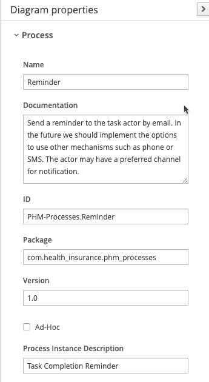
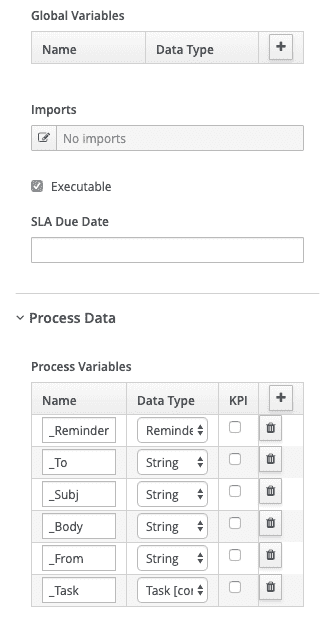
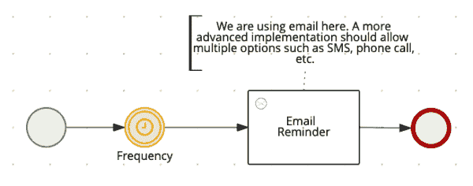
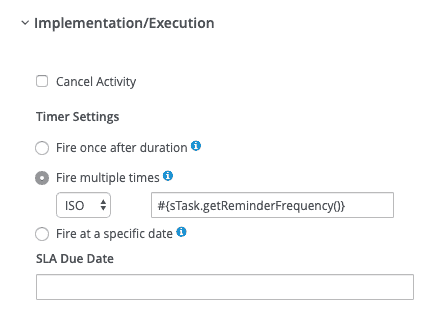
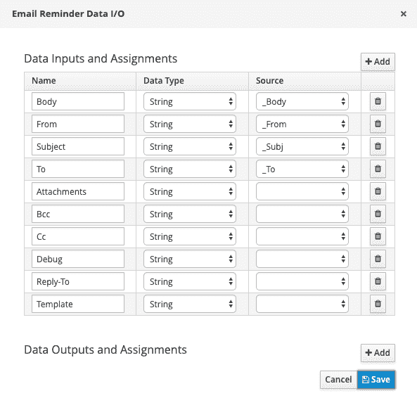
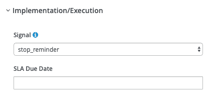
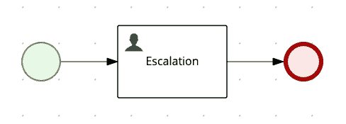

# 大规模设计事件驱动的流程:第 3 部分

> 原文：<https://developers.redhat.com/blog/2020/02/21/designing-an-event-driven-process-at-scale-part-3>

在本系列的第一篇文章 [*大规模设计事件驱动的业务流程:健康管理示例，第 1 部分*](https://developers.redhat.com/blog/2020/02/19/designing-an-event-driven-business-process-at-scale-a-health-management-example-part-1/) 中，您找到了健康管理行业具体示例的业务用例及数据模型。然后，通过创建触发流程，您开始在 [jBPM](https://www.jbpm.org/) (一个开源业务自动化套件)中实现这个例子。

在第二篇文章的[中，您实现了任务子流程，此外，您还为任务子流程中的提醒和升级子流程配置了呼叫参数。现在，您将实现这些子流程。](https://developers.redhat.com/blog/2020/02/20/designing-an-event-driven-process-at-scale-part-2/)

## 提醒子流程

现在，您应该创建电子邮件提醒子流程，其属性如图 1 所示。

[](/sites/default/files/blog/2020/02/PHM-Process-Fig-7.png)Figure 1:Figure 1: Assigning properties to the email reminder subprocess.">

这个子流程需要定义如图 2 所示的变量。

[](/sites/default/files/blog/2020/02/PHM-Processes-Fig-8.png)Figure 2:Figure 2: Defining the variables for the email reminder subprocess.">

现在，创建如图 3 所示的流程图。

[](/sites/default/files/blog/2020/02/2020-03-01_09-15-10.png)Figure 3: Create the email reminder subprocess workflow diagram.Figure 3: Create the email reminder subprocess workflow diagram.">

接下来，您需要一个计时器，它将导致电子邮件提醒以在`Task`对象的`reminderFrequency`属性中定义的频率执行，如图 4 所示。

[](/sites/default/files/blog/2020/02/PHM-Processes-Fig-16.png)Figure 4:Figure 4: Implementing the email reminder timer.">

电子邮件提醒由预先安装在 jBPM 中的[电子邮件定制工作项处理程序](https://github.com/kiegroup/jbpm/tree/master/jbpm-workitems/jbpm-workitems-email/src/main/java/org/jbpm/process/workitem/email)组成。您可以在图 5 中看到服务任务参数。

[](/sites/default/files/blog/2020/02/PHM-Processes-Fig-10.png)Figure 5:Figure 5: Define the email reminder service task's parameters.">

您可以使用[以下进入动作](https://gist.github.com/mauriziocarioli/1f753e1de6ef7b15551c08e16a7ff801)来设置电子邮件服务任务的参数:

```
Reminder r = (Reminder)kcontext.getVariable("_Reminder");
kcontext.setVariable("_To",r.getAddress());
kcontext.setVariable("_Subj",r.getSubject());
kcontext.setVariable("_Body",r.getBody());
kcontext.setVariable("_From",r.getFrom());
```

不要忘记捕捉停止提醒的信号，如图 6 所示。

[](/sites/default/files/blog/2020/02/PHM-Processes-Fig-12.png)Figure 6: Capturing the email reminder's stop signal.">

## 升级子流程

这个过程是最简单的。正如您在图 7 中看到的，这只是一个人工任务。

[](/sites/default/files/blog/2020/02/PHM-Processes-Fig-17.png)Figure 7: The Escalation subprocess.">

## 获取数据服务

获取数据服务在 [node.js](https://nodejs.org/en/) 上的 [Express](https://expressjs.com/) 框架中实现，可以从 [GitHub](https://github.com/mauriziocarioli/PHM-API) 中克隆。这是一个简单的 REST 服务，带有硬编码的响应。它的唯一目的是在本系列中描述的业务流程的现场演示中使用。在以后的文章中，我将向您展示如何使用业务规则实现这项服务。这样，这个设置将不再是硬编码的，非技术人员可以很容易地配置“触发器”,而无需开发人员参与。敬请期待！

下面是[`app.js`](https://gist.github.com/mauriziocarioli/bf8e2eca55ce1fa61a8edae7eb8d1c2f):

```
const express = require('express')
const app = express()
const bodyparser = require('body-parser')
const port = process.env.PORT || 3200

app.use(bodyparser.json())
app.use(
  bodyparser.urlencoded({
    extended: false
  })
)

app.get('/get_trigger/:trigger_id/:member_id', (req, res) => {
  res.status(200).send([
    /**
    * Getting Provider Info
    */
  {
    task: {
      id: 35,
      origId: 'A490.0',
      suppressed: false,
      suppressionPeriod: '',
      expirationDate: '2020-12-31T12:00:00.000Z',
      close: 'HARD',
      reminderInitiation: 'P15D',
      reminderFrequency: 'R/P15D',
      escalationTimer: 'P30D',
      description: 'Getting provider info'
    },
    assignment: {
      actor: 'Peter',
      channel: 'MCC',
      escalationActor: 'Patricia',
      escalationChannel: 'CCN'
    },
    reminder: {
      address: 'peter@doctor.com',
      body: 'XYZ',
      from: 'PHM@healthinsurance.com',
      subject: 'Reminder'
    }
  },
/**
* Getting Community Health Worker Info
*/
{
  task: {
    id: 58,
    origId: 'B143',
    suppressed: false,
    suppressionPeriod: '',
    expirationDate: '2020-12-31T12:00:00.000Z',
    close: 'HARD',
    reminderInitiation: 'P30D',
    reminderFrequency: 'R/P30D',
    // reminderInitiation : 'PT60S',
    // reminderFrequency : 'R/PT60S',
    escalationTimer: 'P90D',
    // escalationTimer : 'PT60S',
    decription: 'Getting Community Info'
  },
  assignment: {
    actor: 'Charlie',
    channel: 'CCN',
    escalationActor: 'Marc',
    escalationChannel: 'CCN'
  },
  reminder: {
    address: 'charlie@healthinsurance.com',
    body: 'XYZ',
    from: 'PHM@healthinsurance.com',
    subject: 'Reminder'
  }
},
/**
* Getting Member Info
*/
{
  task: {
    id: 128,
    origId: 'C201',
    predecessor: 'A490.0',
    suppressed: false,
    suppressionPeriod: '',
    expirationDate: '2020-12-31T12:00:00.000Z',
    close: 'SOFT',
    reminderInitiation: 'P7D',
    reminderFrequency: 'R/P7D',
    escalationTimer: 'P30D',
    description: 'Getting member info'
  },
  assignment: {
    actor: 'Mary',
    channel: 'MLP',
    escalationActor: 'Charlie',
    escalationChannel: 'CCN'
  },
  reminder: {
    address: 'mary@mail.com',
    body: 'XYZ',
    from: 'PHM@healthinsurance.com',
    subject: 'Reminder'
  }
},
/**
* Getting Pharmacist Info
*/
{
         task: {
           id: 112,
           origId: 'C178',
           predecessor: 'A490.0',
           suppressed: false,
           suppressionPeriod: '',
           expirationDate: '2020-12-31T12:00:00.000Z',
           close: 'SOFT',
           reminderInitiation: 'P7D',
           reminderFrequency: 'R/P7D',
           escalationTimer: 'P30D',
           description: 'Geting member info'
          },
          assignment: {
            actor: 'Robert',
            channel: 'CCN',
            escalationActor: 'Matthew',
            escalationChannel: 'CCN'
          },
          reminder: {
            address: 'robert@pharmacy.com',
            body: 'XYZ',
            from: 'PHM@healthinsurance.com',
            subject: 'Reminder'
          }
    }
  ])
})

app.listen(port, () => {
  console.log(`running at port ${port}`)
})
```

这是`src/main/resources/META-INF/kie-deployment-descriptor.xml` 中的部署描述符[:](https://gist.github.com/mauriziocarioli/040d6e57439d36fb89a6b9a25ed81392)

```
<work-item-handler>
    <resolver>mvel</resolver>
    <identifier>new org.jbpm.process.workitem.rest.RESTWorkItemHandler(System.getenv("DEMO_REST_USER"), System.getenv("DEMO_REST_PWD"))</identifier>
    <parameters/>
    <name>Rest</name>
</work-item-handler>

```

### 电子邮件服务

This is the deployment descriptor for the [Email service task](https://gist.github.com/mauriziocarioli/4d75c14c508a1e801ff98b7b566326d5):

```
<work-item-handler>
    <resolver>mvel</resolver>
    <identifier>new org.jbpm.process.workitem.email.EmailWorkItemHandler(System.getenv("DEMO_SMTP_SERVER"), System.getenv("DEMO_SMTP_PORT),System.getenv("DEMO_SMTP_USER"),System.getenv("DEMO_SMTP_PWD"))</identifier>
    <parameters/>
    <name>Email</name>
</work-item-handler>
```

The SMTP server parameters are passed from the environment variables. When trying this task out, one can use an email test service such as [Mailtrap](https://mailtrap.io/).

## 使用计时器时的注意事项

默认情况下，jBPM 使用 [EJB 定时器服务](https://docs.jboss.org/author/display/AS72/EJB+3+Reference+Guide)来实现部署在 Java EE (Jakarta EE)服务器上的定时器。EJB 定时器不推荐用于高音量的场合。[石英](http://www.quartz-scheduler.org/)是更好的选择，也可用于 Spring Boot 部署。

另一种选择是使用节点的服务级别协议(SLA)到期日期属性。Maciej Swiderski 的这篇[博客](http://mswiderski.blogspot.com/2018/02/track-your-processes-and-activities.html)涵盖了 jBPM 中的 SLA 到期日功能。

无论您选择计时器还是 SLA，每种功能都有优点和缺点。根据您的具体用例做出选择。这里，虽然成员的数量可能很大，但是在给定的时间段内每个成员的 PHM 触发器的数量通常很小。每个定时器的周期都很大(数周)，所以很多定时器同时触发的几率不高。

## 形式

可以为每个人工任务和每个流程自动生成数据输入表单。这些表单主要用于测试开发过程中的流程执行。通常，人工任务的生产用户界面是定制的。在这个特定的用例中，每个任务的参与者应该使用现有的应用程序输入数据，该应用程序通过 jBPM 公开的 REST API 将数据传递给 jBPM。因此，您不会关心 UI 开发。

## 事件监听器

jBPM 项目被配置为使用[事件监听器](https://docs.jboss.org/jbpm/release/latest/jbpm-docs/html_single/#_event_listeners)在运行时跟踪流程和规则信息。如果您想利用事件监听器，您需要克隆[PHM 跟踪](https://github.com/mauriziocarioli/PHM-Tracing)和[跟踪项目](https://github.com/mauriziocarioli/Tracing)，然后构建两个 jar 文件安装在 Kie 服务器的`lib`目录中。否则，只需[在流程部署描述符](https://gist.github.com/mauriziocarioli/bc5b6c19189a793a6dfae4e5996804fe)中注销它们:

```
<event-listeners>
        <event-listener>
            <resolver>mvel</resolver>
            <identifier>new com.health_insurance.tracing.PHMProcessEventListener()</identifier>
            <parameters/>
        </event-listener>
        <event-listener>
            <resolver>mvel</resolver>
            <identifier>new com.health_insurance.tracing.PHMAgendaEventListener()</identifier>
            <parameters/>
        </event-listener>
    </event-listeners>
    <task-event-listeners>
        <task-event-listener>
            <resolver>mvel</resolver>
            <identifier>new com.health_insurance.tracing.PHMTaskLifeCycleEventListener()</identifier>
            <parameters/>
        </task-event-listener>
    </task-event-listeners>
```

## 演示用户

目录`src/main/sh`中提供了一个 shell 脚本，它创建用户和组来运行这个业务流程的一些场景。这个脚本旨在与 [JBoss Wildfly](https://wildfly.org/) 一起使用。

## 结论

现在，您已经使用 jBPM 实现了自己的事件驱动流程的健康管理演示，该流程旨在随着事件逻辑的复杂性以及事件的数量而扩展。现在，通过实施这一过程，您应该更好地理解了几个主题:

*   业务流程抽象。
*   服务任务或工作项处理程序。
*   REST API 调用来自进程内部。
*   从流程内部发送电子邮件。
*   信号发送和捕捉。
*   基于计时器的提醒和升级。

当然，一个流程的设计和开发是不够的。您肯定也希望看到这一过程的运行。本系列的下一篇文章将讨论部署和执行这个过程。

*Last updated: June 29, 2020*