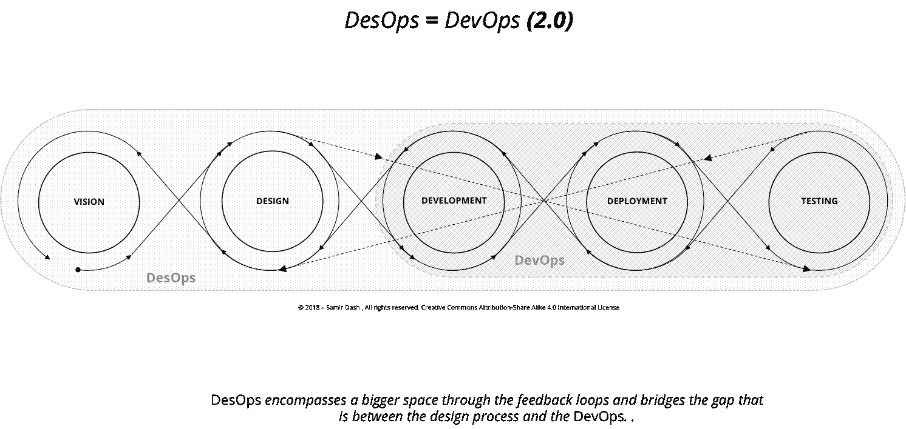
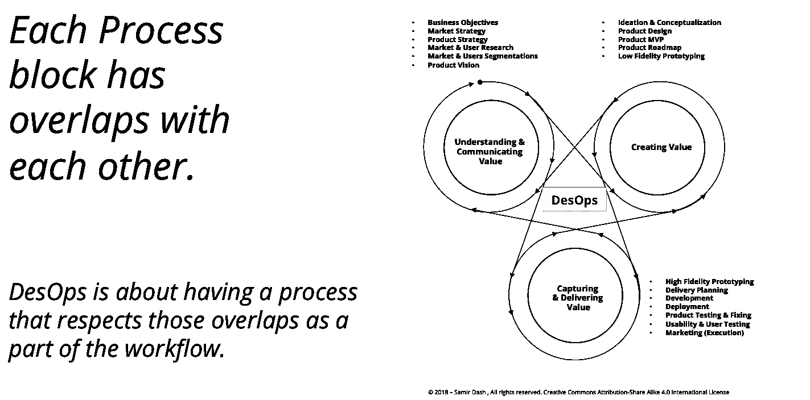
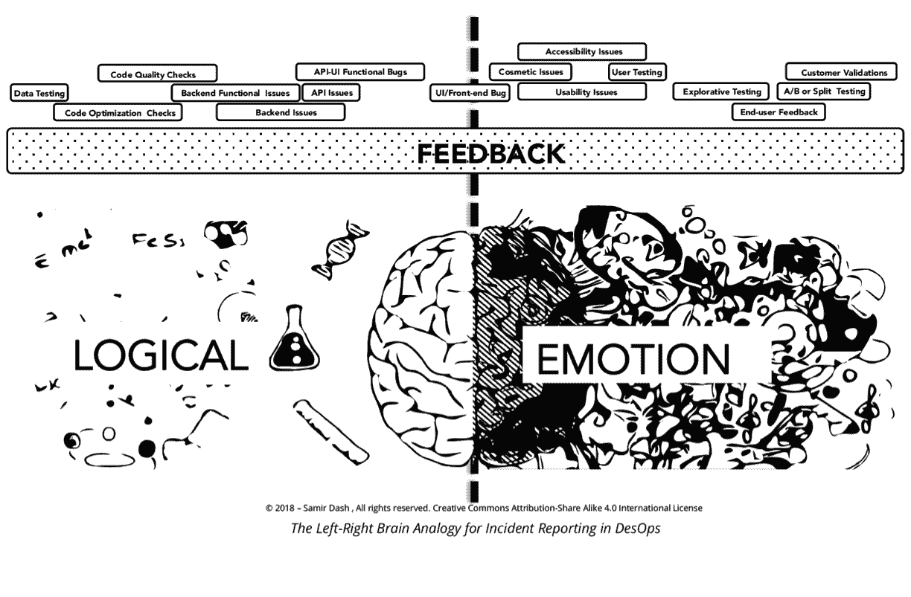
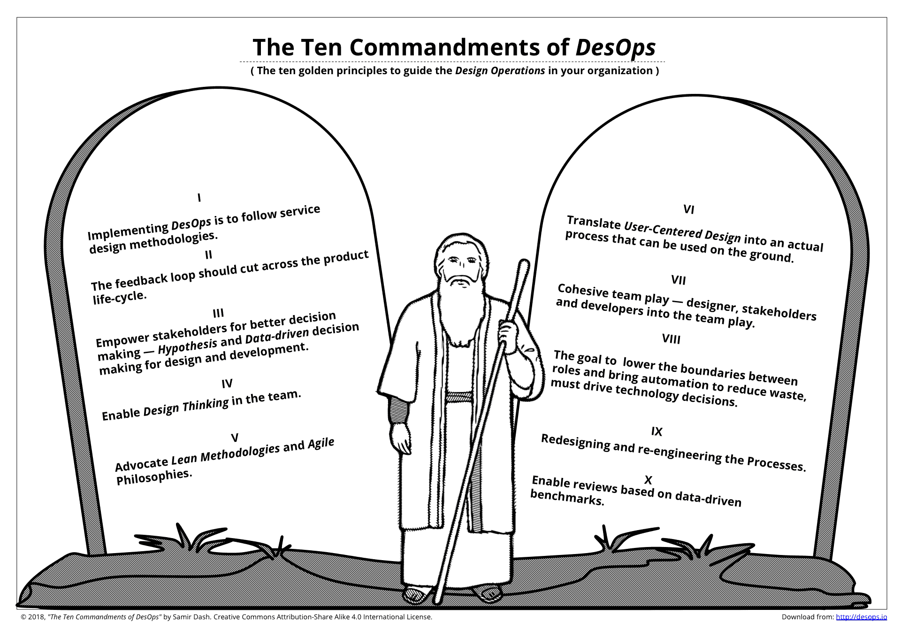
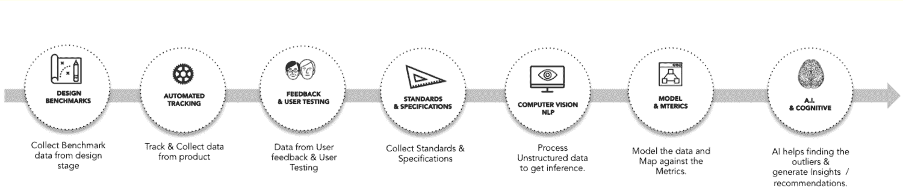

# DesOps 是“DevOps 2.0”

> 原文：<https://developers.redhat.com/blog/2018/06/27/desops-is-devops-2-0>

正如我们在[上一篇文章](https://developers.redhat.com/blog/2018/06/22/desops-the-next-wave-in-design/)中所讨论的，今天大多数 [*开发人员*关注的是主要影响产品](https://developers.redhat.com/topics/devops/)的工程或技术方面的流程块，而不是设计方面。尽管 *DesOps* 最初是出于如何大规模设计的基本需求，但塑造它的因素与塑造 *DevOps* 的因素具有相似的性质。

在最近的软件交付过程中，例如，代码的敏捷过程和持续集成(CI)和持续部署(CD)， *DevOps* 方法提供了一条更快的高速公路，以确保更快的交付和更低的风险。因此，随着时间的推移，早期的 SDLC 模型被敏捷和 *DevOps* 重新定义为当前的形状。

然而，由于设计是交付的任何产品不可或缺的一部分，因此需要确保传统设计生命周期和快速开发生命周期之间的差距得以弥合。*德索普斯*和*德索普斯*两者相辅相成。设计交付流程改进试图优化整体交付流程，从而有助于 *DevOps* ，例如，在涉及设计方面、可用性、可访问性等的产品测试方面。

设计团队和工程团队之间需要更紧密的集成，这是确保大规模设计的必要条件。在过去的两到三年里，五大公司在这一领域进行了大量投资，为其他组织和设计社区在这一领域的探索铺平了道路。

结果反映了 *DesOps* 的含义，团队和规程之间的孤岛减少了。与此同时， *DesOps* 改善了跨职能团队之间的协作和工作实践，这有助于最大限度地减少交付过程中的浪费。

每个产品生命周期都有一个核心目标:通过交付价值来满足客户的需求。与 *DesOps* 相关的设计流程有助于理解、捕捉和传递该价值。

但是传统的业务流程更热衷于获得每个流程块的输出，这些输出可以被提供给下一个流程块，从而到达最终交付价值的阶段。许多这样的实践未能获得客户的满意，因为所使用的过程不是基于客户从输出到结果的转变。

如果我们从价值体系的角度来看待 *DesOps* 流程，我们会发现 *DesOps* 涉及三个主要领域:

1.  理解价值
2.  创造价值
3.  获取和传递价值

正如上一篇文章中所讨论的，在价值系统方法中，*理解价值*是关于达成愿景。*创造价值*大体上是与*最小可行产品* (MVP)达成路线图。*获取和交付价值*是关于运行 backlog 和 sprints，并确保交付，直到最终用户可以访问。

因为设计与实体和属性相关联，超出了与定性方法的情感方面相关联的学科相联系的可量化科学，所以 *DesOps* 的实现比 *DevOps* 的情况更加灵活。

例如，如果我们根据左脑-右脑类比绘制任何领域的技术和实践，我们可以看到大多数具有软属性或处理人类情感、目的和行为的实践都属于创造性方面，这涉及某种解决问题的设计方法。

例如，您可以在下图中看到，右侧显示了与软件事件报告相关的实践映射。在这里你可以很容易地注意到这种模式。

典型的信念是，大脑的左侧主要处理逻辑思维，而右侧更多地处理情感思维。根据这个流行的类比，当我们从左到右(参考上图)绘制一条直线，描述数字产品 SDLC 不同阶段所涉及的不同方面时，我们会注意到逻辑和更以人为中心的方面被一条从中心开始的假想线分开。我们还会注意到，从左到右，各个部分的情绪指数逐渐增加。这有助于展示当我们从 DevOps 触及的领域转移到 *DesOps* 触及的领域时，更多人的角度是如何涉及的，因为 *DesOps* 触及了价值链的设计和业务方面。

根据基本准则， *DevOps* 激发了 *DesOps* 高水平的思维模式:

1.  与客户合作提高商业价值
2.  共同努力实现共同愿景
3.  提供增值
4.  投资于质量
5.  授权给团队成员
6.  在团队中建立明确的责任
7.  从经验中学习
8.  倡导开放的沟通和透明度
9.  敏捷并适应变化

在这样的背景下，如果我们研究一下 *DesOps* ，我们会发现以下关键原则很有意义:

1.  实施 *DesOps* 以遵循服务设计方法。
2.  反馈循环应该贯穿整个产品生命周期。
3.  支持利益相关者做出更好的决策——针对设计和开发的假设和数据驱动的决策。
4.  赋能设计思维。
5.  倡导精益方法和敏捷哲学。
6.  将以用户为中心的设计转化为可以实际应用的实际流程。
7.  提倡有凝聚力的设计师、利益相关者和开发人员参与团队活动。
8.  技术决策应该通过降低角色和自动化之间的界限来指导，以减少浪费和减少为产品和项目工作的重复性工作。
9.  重新设计和再造流程。
10.  支持基于数据驱动基准的审核。

那么这一切是怎么回事呢？粗略来看， *DesOps* 流程在技术和生态系统方面的转换可能类似于以下结构，与 DevOps 类似。

1.  首先，我们应该从设计阶段的信息中创建设计基准(包括定性和定量指标)，这些信息可以用来将产品特性与基于该设计基准的指标进行比较。
2.  然后，在运行时(在实时和真实的环境中)自动化并执行产品的手动跟踪，然后对这些数据进行分类和整理。
3.  这涉及到创建特性来支持用户反馈周期和用户测试方面(探索性的，分割测试能力)。
4.  收集试探法不同方面的所有标准和规范，以确保至少在基本层面上遵循标准原则。
5.  在地面上，在生态系统和技术的背景下，构建关键组件，这些组件将收集和处理在所有这些阶段收集的所有数据，并生成所需的指标和推断，还将有助于带来持续集成和持续交付块来运行该流程。
6.  构建单元以生成映射数据的模型，并将其与指标进行比较。
7.  构建认知单元，该认知单元可以比较数据并应用正确的模型和指标来执行数据筛选，并生成可作为可操作输出共享给最终用户/客户的见解。
8.  并确保在所有这些阶段中，反馈回路在空间上相互连接，并作为一个有意义的神经网络，帮助做出明智的决策。

请继续收听我的 *DesOps* 之旅！

**(注:根据我的书*《德索普斯企业:概述&文化* )**

*Last updated: September 3, 2019*