# 宣布 Eclipse 2018-09 的 Red Hat Developer Studio 12.9.0.GA 和 JBoss Tools 4.9.0.Final

> 原文：<https://developers.redhat.com/blog/2018/10/09/devstudio-12-9-jboss-tools-4-9-eclipse-2018-09>

桌面 IDE 用户注意:[红帽开发者工作室 12.9](https://developers.redhat.com/products/devstudio/overview/) 和社区版，[JBoss Tools 4 . 9 . 0](http://tools.jboss.org/downloads/jbosstools/2018-09/4.9.0.Final.html)Eclipse 2018-09 现已上市。您可以下载 [Developer Studio 捆绑安装程序](https://developers.redhat.com/products/devstudio/download/)，它会安装 Eclipse 4.9 以及所有已经配置好的 JBoss 工具。或者，如果您已经安装了 Eclipse 4.9 (2018-09)，您可以下载 JBoss 工具包。

本文重点介绍了 JBoss 工具和 Eclipse Photon 中的一些新特性，涵盖了 WildFly、Spring Boot、Camel、Maven 和许多与 Java 相关的改进——包括对 Java 11 的全面支持。

Developer Studio/JBoss Tools 提供了一个桌面 IDE，其中包含了一系列涵盖多种编程模型和框架的工具。如果您正在进行[容器](https://developers.redhat.com/blog/category/containers/)/云开发，那么可以使用 [Red Hat OpenShift](http://openshift.com/) 、 [Kubernetes](https://developers.redhat.com/topics/kubernetes/) 、 [Red Hat 容器开发工具包](https://developers.redhat.com/products/cdk/overview/)和 [Red Hat OpenShift 应用运行时](https://developers.redhat.com/products/rhoar/overview/)的集成功能。对于集成项目，有涵盖 Camel 和 [Red Hat Fuse](https://developers.redhat.com/products/fuse/overview/) 的工具，可以在本地和云部署中使用。

## 装置

### 红帽开发者工作室:完全安装

下载 [Developer Studio 安装程序](https://developers.redhat.com/products/devstudio/download/)。下载是一个单独的可执行 JAR 文件。你需要安装一个 JDK。然后，像这样运行安装程序:

```
java -jar jboss-devstudio-<installername>.jar
```

### 将 JBoss 工具添加到现有的 Eclipse 4.9 环境中

JBoss Tools，也被称为自带 Eclipse (BYOE)选项，至少需要 Eclipse 4.9 (2018-09)，但我们建议使用最新的 [Eclipse 4.9 2018-09 JEE 捆绑包](http://www.eclipse.org/downloads/packages/release/2018-09/r/eclipse-ide-java-ee-developers)，因为这样你将预装大多数依赖项。

一旦你安装了 Eclipse，你可以在 *JBoss Tools* 下的 *Eclipse Marketplace* 或者 *Red Hat Developer Studio* 中找到我们。

或者，对于 JBoss 工具，您也可以直接使用我们的更新站点:

```
http://download.jboss.org/jbosstools/photon/stable/updates/

```

## 有什么新鲜事？

我们这次发布的主要焦点是 Java 11 的采用、基于容器的开发的改进和错误修复。Eclipse 2018-09 本身有很多新的很酷的东西，但让我强调一下 Eclipse 2018-09 和 JBoss Tools 插件中我认为值得一提的几个更新。

### 改进的 OpenShift 开发工具

#### Spring Boot 应用的内部环路

尽管 OpenShift 服务器适配器已经支持 Spring Boot 应用程序，但全球开发人员的体验已经得到了增强。让我们看看完整的工作流程。

##### 引导您的 Spring Boot 应用程序

JBoss 工具中增加了一个新的生成器(向导)。它被称为 Launcher 应用程序，因为它基于 fabric8-launcher 项目。当您启动 JBoss 工具时，您应该在 Red Hat Central 中看到以下内容:

[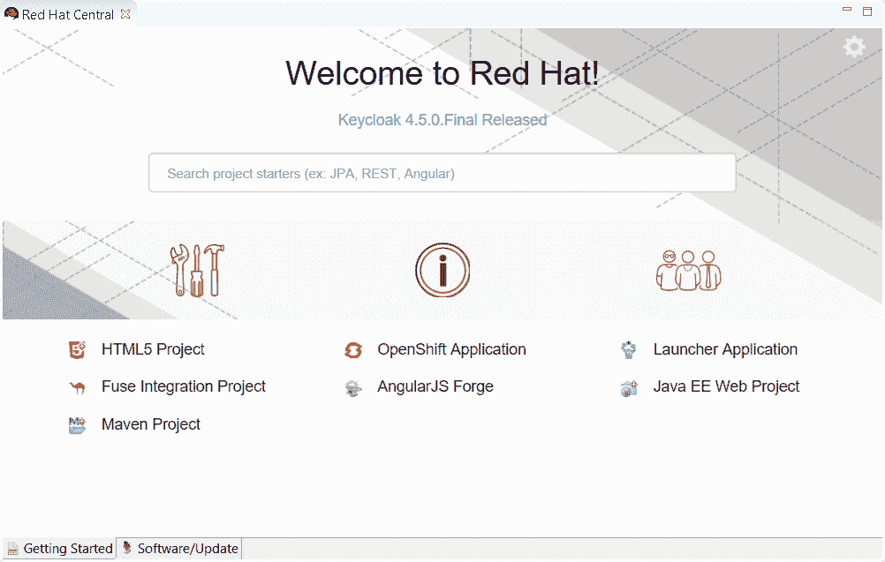](https://developers.redhat.com/blog/wp-content/uploads/2018/10/img_5bbb053f25f63.png)

点击**启动器应用**链接，将出现以下向导:

[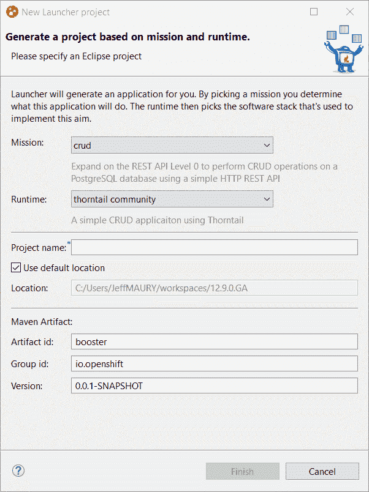](https://developers.redhat.com/blog/wp-content/uploads/2018/10/img_5bbb05bbf2af5.png)

将**任务**字段设置为`rest-http`，因为我们想要生成一个简单的 REST 应用程序，将**运行时**字段设置为`spring-boot current-community`，因为我们想要生成一个基于 Spring Boot 的应用程序。

然后将**项目名称**字段设置为`myfirstrestapp`，其他字段保持不变。

[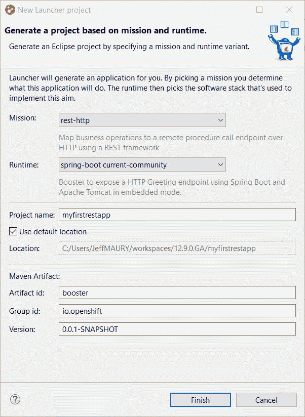](https://developers.redhat.com/blog/wp-content/uploads/2018/10/img_5bbb05e20249a.png)

点击**完成**按钮。一个新项目将被添加到您的本地工作区。这可能需要一些时间，因为 Maven 将解析所有的 Spring Boot 依赖项，因此需要从互联网上下载它们。

当构建项目时，如果您在项目浏览器窗口中展开 **myfirstrestapp** 项，您应该会看到:

[](https://developers.redhat.com/blog/wp-content/uploads/2018/10/img_5bbb060e73998.png)

##### 在 GitHub 上存储您的源代码

因为 OpenShift builder 映像在 Git 存储库上检索代码，所以我们首先需要将刚刚生成的应用程序代码推送到 GitHub。下一节假设您在 GitHub 帐户下创建了一个名为`myfirstrestapp`的存储库。

我们将首先为我们的应用程序代码创建一个本地 Git 存储库，然后将代码推送到 GitHub。

选择 **myfirstrestapp** 项目，右击**团队- >共享项目**菜单项:

[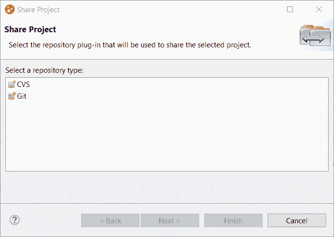](https://developers.redhat.com/blog/wp-content/uploads/2018/10/img_5bbb1c6161ae2.png)

然后选择 **Git** 仓库类型并点击**下一步**按钮:

[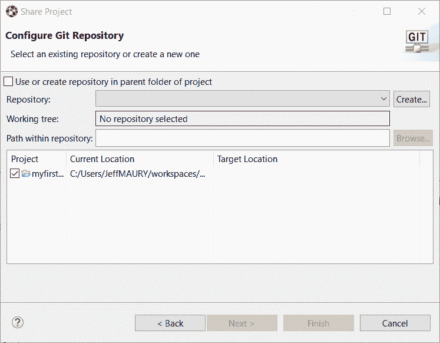](https://developers.redhat.com/blog/wp-content/uploads/2018/10/img_5bbb1e9084eeb.png)

选中**在项目**的父文件夹中使用或创建存储库复选框，然后选择 **myfirstrestapp** 项目:

[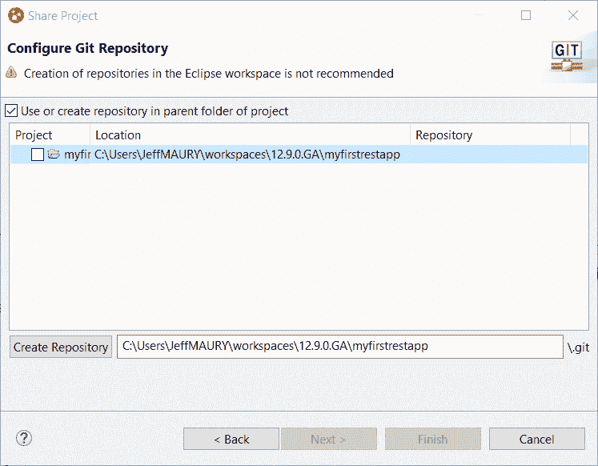](https://developers.redhat.com/blog/wp-content/uploads/2018/10/img_5bbb1eba85267.png)

点击**创建存储库**按钮，然后点击**完成**按钮。

项目浏览器视图已更新:

[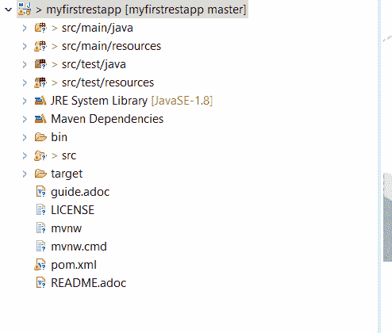](https://developers.redhat.com/blog/wp-content/uploads/2018/10/img_5bbb1edecb8a6.png)

选择 **myfirstrestapp** 项目，右键单击**团队- >在存储库视图中显示**菜单项。一个名为 **Git 仓库**的新视图将被添加到透视图中:

[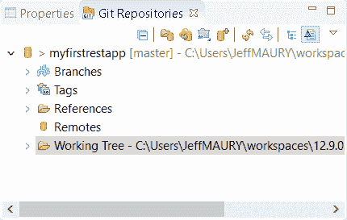](https://developers.redhat.com/blog/wp-content/uploads/2018/10/img_5bbb1f070067a.png)

在该视图中，选择 **Remotes** 节点，右键单击 **Create Remote** 菜单项。将显示以下对话框:

[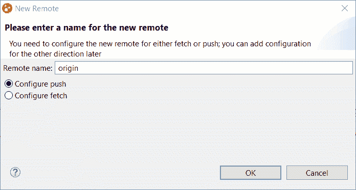](https://developers.redhat.com/blog/wp-content/uploads/2018/10/img_5bbb1f21b89cf.png)

点击**确定**按钮，将显示如下对话框:

[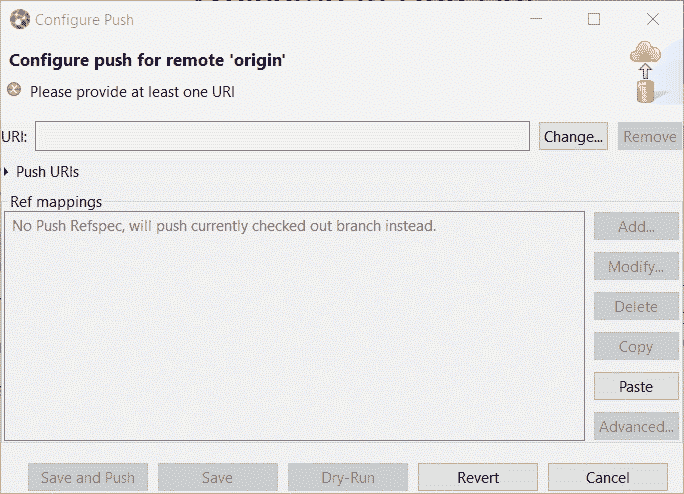](https://developers.redhat.com/blog/wp-content/uploads/2018/10/img_5bbb1f3d4e1e7.png)

点击**更改**按钮，在 **URI** 字段输入`git@github.com:GITHUB_USER/myfirstrestapp`，用你真实的吉斯用户名替换`GITHUB_USER`。

然后点击**完成**按钮，再点击**保存**按钮。

我们现在准备将我们的应用程序代码推送到 GitHub。在**项目浏览器**视图中选择 **myfirstrestapp** 项目，然后右键单击**团队- >提交**菜单项。一个新的视图调用 **Git Staging** 将会打开:

[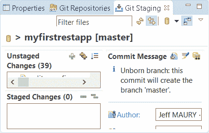](https://developers.redhat.com/blog/wp-content/uploads/2018/10/img_5bbb1fa14889c.png)

双击视图标题以最大化视图:

[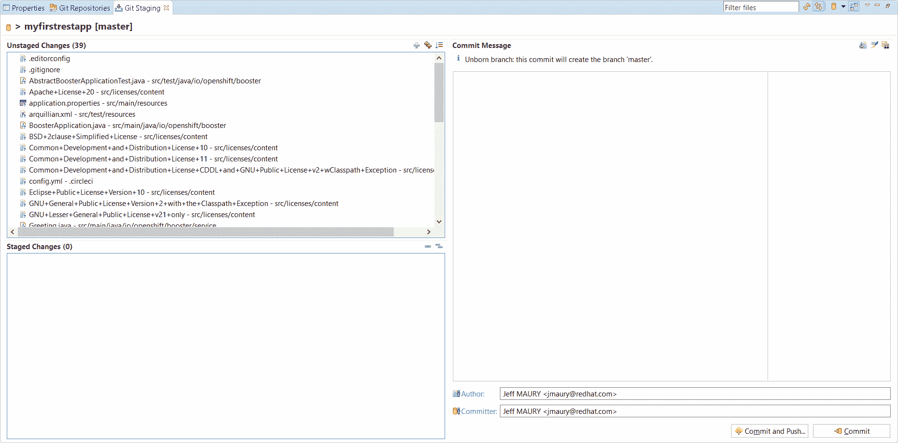](https://developers.redhat.com/blog/wp-content/uploads/2018/10/img_5bbb1fbbf1bb0.png)

选择**未分级变更**列表中列出的所有文件，点击 **+** 按钮。然后，文件将移动到**阶段变更**列表中:

[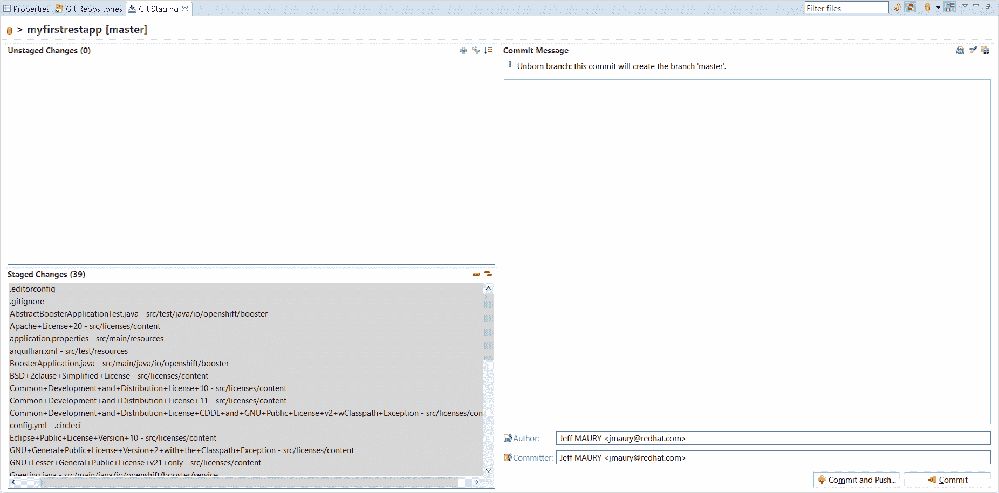](https://developers.redhat.com/blog/wp-content/uploads/2018/10/img_5bbb1fd637635.png)

输入提交消息(例如，“初始版本”)，点击**提交并按下**按钮。将显示以下对话框:

[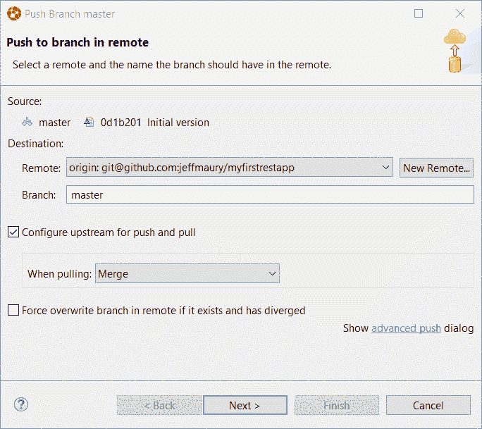](https://developers.redhat.com/blog/wp-content/uploads/2018/10/spring-boot-inner-loop14.png)

点击**下一个**按钮:

[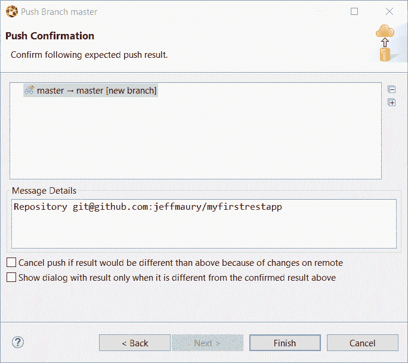](https://developers.redhat.com/blog/wp-content/uploads/2018/10/img_5bbb201a9bdd4.png)

点击**完成**按钮开始推送操作。

将显示一个包含推送操作结果的对话框。点击**确定**解除。

##### 将 Spring Boot 开发工具添加到打包的应用程序中

为了支持 OpenShift 集群上的实时更新，我们必须将 Spring Boot 开发工具添加到我们的 Spring Boot 应用程序中。

打开`myfirstrestapp`项目中的`pom.xml`文件。找到`spring-boot-maven-plugin`并添加以下部分:

```
<configuration>
  <excludeDevtools>false</excludeDevtools>
</configuration>
```

整个`spring-boot-maven-plugin`部分如下所示:

```
<plugin>
  <groupId>org.springframework.boot</groupId>
  <artifactId>spring-boot-maven-plugin</artifactId>
  <executions>
    <execution>
      <goals>
        <goal>repackage</goal>
      </goals>
      <configuration>
        <excludeDevtools>false</excludeDevtools>
      </configuration>
    </execution>
  </executions>
</plugin>
```

关闭并保存`pom.xml`文件。

将变更推送到 GitHub:选择 **Team - > Commit** 用一个新的提交消息(例如，“用 DevTools”)。

##### 在 OpenShift 上部署应用程序

在 OpenShift 上部署应用程序之前，我们必须首先在 OpenShift 集群上创建一个 ImageStream。原因是 Spring Boot 的支持依赖于 S2I 的构建，当 Spring Boot·德夫 Tools 出现时，这个构建会引爆 Spring Boot 的超级罐子。因为基于 Java 的 S2I 映像不支持这个，所以我们将使用一个支持它的映像，即`fabric8/s2i-java:2.2`。

首先，在`myfirstrestapp`项目中，创建一个名为`springboot.json`的新 JSON 文件，并将该文件的内容设置为:

```
{
    "apiVersion": "image.openshift.io/v1",
    "kind": "ImageStream",
	"metadata": {
		"name": "springboot"
	},
    "spec": {
        "lookupPolicy": {
            "local": false
        },
        "tags": [
            {
                "annotations": {
					"tags": "builder,java"
				},
                "from": {
                    "kind": "DockerImage",
                    "name": "registry.access.redhat.com/fuse7/fuse-java-openshift:1.1"
                },
                "importPolicy": {},
                "name": "1.1",
                "referencePolicy": {
                    "type": "Source"
                }
            }
        ]
    }
}
```

然后，从 OpenShift Explorer 视图中，为您的集群选择 OpenShift 连接(如果您还没有定义，您必须定义它)，并右键单击 **New - > Resource** 菜单项。将显示以下对话框:

[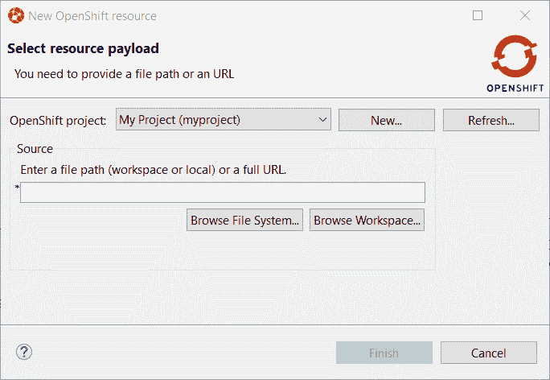](https://developers.redhat.com/blog/wp-content/uploads/2018/10/img_5bbb20d5e374c.png)

您可以选择想要使用的 OpenShift 项目，然后点击**浏览工作区**按钮，选择 **myfirstrestapp** 项目中的`springboot.json`文件:

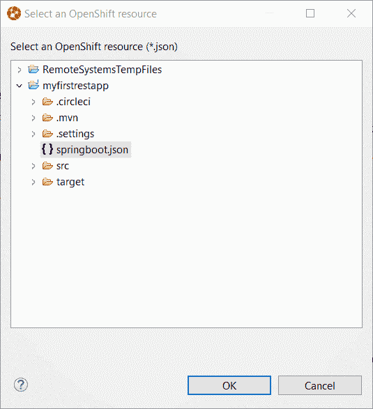

点击**确定**和**完成**按钮。将创建新的图像流，并显示状态对话框:

[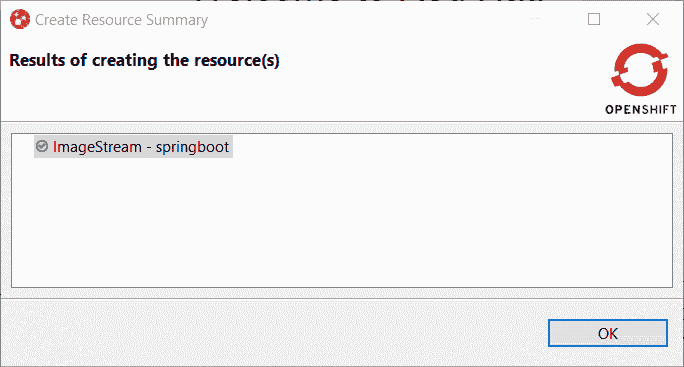](https://developers.redhat.com/blog/wp-content/uploads/2018/10/img_5bbb2111a2dcc.png)

##### 在 OpenShift 上创建应用程序

我们现在准备在 OpenShift 集群上创建应用程序。选择 OpenShift 连接，右键**新建- >应用**菜单项。如果您向下滚动列表，您应该会看到我们刚刚创建的`springboot`图像流:

[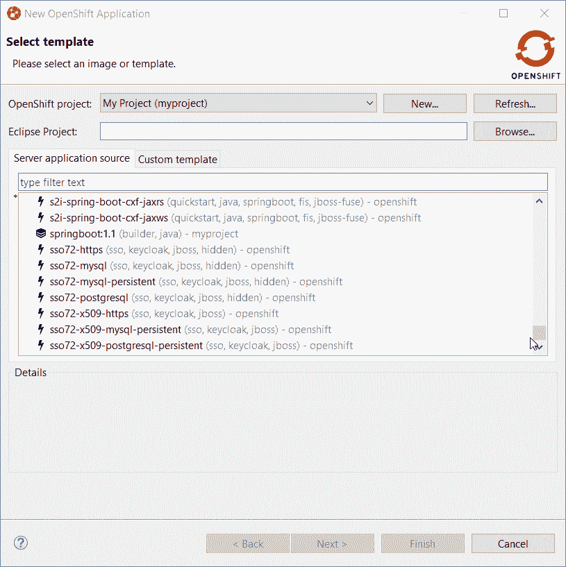](https://developers.redhat.com/blog/wp-content/uploads/2018/10/img_5bbb214788d9c.png)

选择图像流并点击**下一个**按钮:

[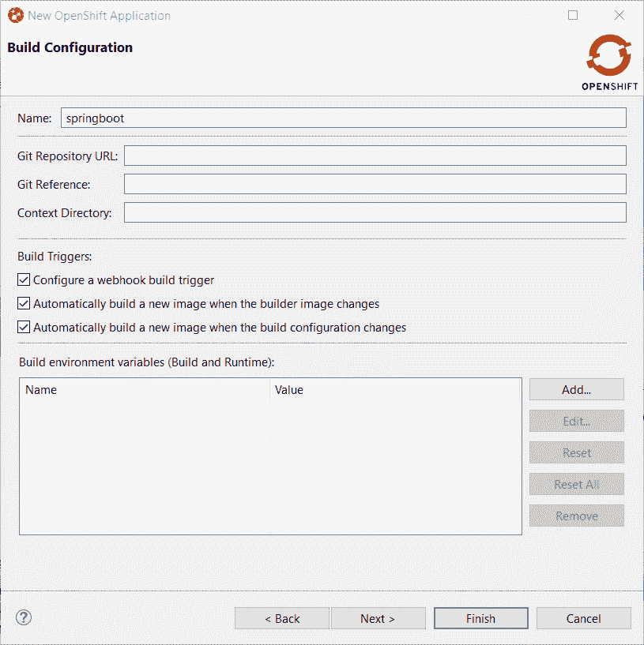](https://developers.redhat.com/blog/wp-content/uploads/2018/10/img_5bbb21626c12f.png)

在**名称**字段中输入`myfirstrestapp`，在 **Git 资源库 URL** 字段中输入`https://github.com/GITHUB_USER/myfirstrestapp `，用您真实的 GITHUB 用户名替换 GITHUB_USER，然后点击**下一步**按钮。

在 Deployment Configuration & Scalability 对话框中，单击**下一个**按钮。

在服务和路由设置对话框中，选择 **8778-tcp** 端口，点击**编辑**按钮。将`8787`值更改为`8080`:

[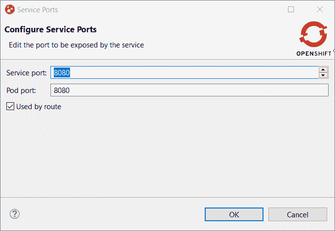](https://developers.redhat.com/blog/wp-content/uploads/2018/10/img_5bbb2199545b3.png)

点击**确定**按钮，然后点击**完成**按钮。

创建的 OpenShift 资源列表将显示在对话框中:

[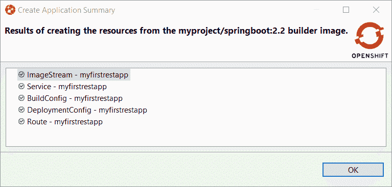](https://developers.redhat.com/blog/wp-content/uploads/2018/10/img_5bbb21b8375b5.png)

点击 **OK** 按钮关闭对话框，当要求导入应用程序代码时，点击 **Cancel** 按钮，因为我们已经有了源代码。

在构建运行之后(这可能需要几分钟，因为 Maven 构建下载了很多依赖项)，您应该会看到一个正在运行的 pod:

[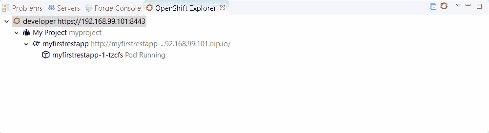](https://developers.redhat.com/blog/wp-content/uploads/2018/10/img_5bbb21e6e19e0.png)

##### 内环设置

我们将同步本地 Eclipse 项目和远程 OpenShift pod。每次本地修改文件时，pod 都会相应地更新。

在 OpenShift Explorer 中选择 running pod，右键单击 **Server Adapter** 菜单项，将显示如下对话框:

[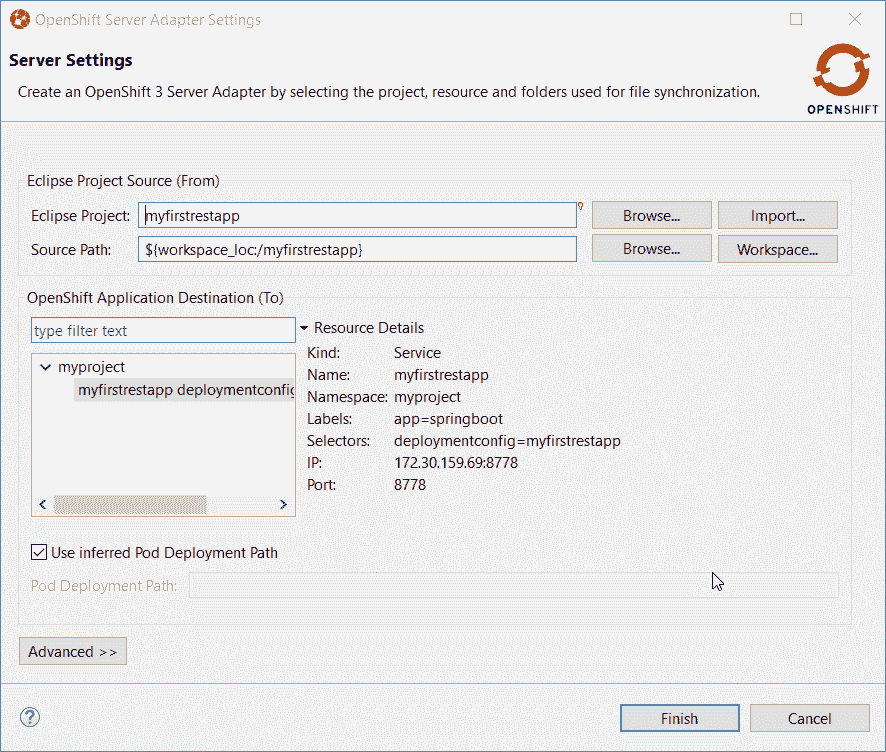](https://developers.redhat.com/blog/wp-content/uploads/2018/10/img_5bbb221e38d34.png)

点击**确定**按钮。将启动初始同步，并显示服务器视图:

[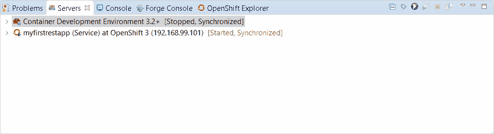](https://developers.redhat.com/blog/wp-content/uploads/2018/10/img_5bbb223d3e84c.png)

我们还没有在本地 Eclipse 项目和远程 OpenShift 项目之间建立同步。本地完成的每个修改都将在远程 OpenShift 集群上报告。

让我们修改我们的本地应用程序代码，并查看几乎立即应用的更改:

编辑`myfirstrestapp`项目中的文件`src/main/java/io/openshift/booster/service/Greeting.java`，将`FORMAT`字符串值从`Hello, %s!`更改为`Hello, Mr %s!`，然后保存文件。

文件现在应该是这样的:

```
/*
 * Copyright 2016-2017 Red Hat, Inc, and individual contributors.
 *
 * Licensed under the Apache License, Version 2.0 (the "License");
 * you may not use this file except in compliance with the License.
 * You may obtain a copy of the License at
 *
 * http://www.apache.org/licenses/LICENSE-2.0
 *
 * Unless required by applicable law or agreed to in writing, software
 * distributed under the License is distributed on an "AS IS" BASIS,
 * WITHOUT WARRANTIES OR CONDITIONS OF ANY KIND, either express or implied.
 * See the License for the specific language governing permissions and
 * limitations under the License.
 */
package io.openshift.booster.service;

// tag::snippet-greeting[]
public class Greeting {

    public static final String FORMAT = "Hello, Mr %s!";

    private final String content;

    public Greeting() {
        this.content = null;
    }

    public Greeting(String content) {
        this.content = content;
    }

    public String getContent() {
        return content;
    }
}
// end::snippet-greeting[]
```

然后，在`OpenShift explorer`视图中，选择`myfirstrestapp`部署并选择`Show In -> Web Browser`菜单项，一旦显示网络浏览器，点击`Invoke`按钮，您应该会看到以下视图:

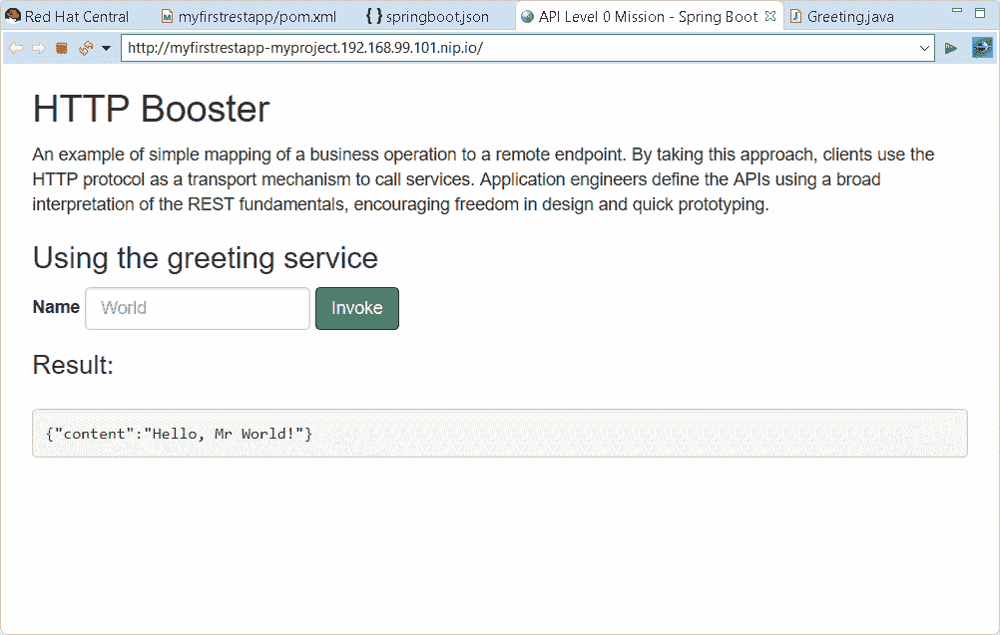

您刚刚体验了 Spring Boot 应用程序的内部循环:本地所做的任何更改都会被报告，并且几乎可以立即在 OpenShift 集群上进行测试。

您可以在调试模式下重新启动部署，并且能够远程调试您的 Spring Boot 应用程序。很神奇，不是吗？

### 服务器工具

#### Wildfly 14 服务器适配器

一个服务器适配器已被添加到 Wildfly 14 中。它增加了对 Java EE 8 的支持。

### 休眠工具

#### 运行时提供程序更新

Hibernate 5.3 运行时提供程序现在合并了 Hibernate 核心版本 5.3.6.Final 和 Hibernate 工具版本 5.3.6.Final。

Hibernate 5.2 运行时提供程序现在合并了 Hibernate 核心版本 5.2.17.Final 和 Hibernate 工具版本 5.2.11.Final。

Hibernate 5.1 运行时提供程序现在合并了 Hibernate 核心版本 5.1.16.Final 和 Hibernate 工具版本 5.1.10.Final。

### 保险丝工具

#### REST 查看器成为编辑器

以前，有一个只读的 REST 编辑器。对已经定义的 Camel REST DSL 定义有一个很好的概述是很有用的。现在，编辑器及其相关的属性选项卡也提供了编辑功能，允许更快地开发。

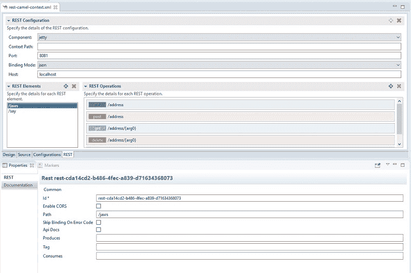

您现在可以:

*   创建和删除 REST 配置
*   创建和删除新的 REST 元素
*   创建和删除新的 REST 操作
*   在 properties 视图中编辑所选 REST 元素的属性
*   在属性视图中编辑选定 REST 操作的属性

此外，我们还通过修复 REST 元素和 REST 操作列表的滚动功能改进了外观。

### java 开发工具 _jdt)

#### Java 编辑器

##### 改进了黑暗主题的面包屑导航

在 **Java 编辑器**中的**面包屑**现在在深色主题中使用深色背景。

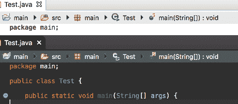

在 Light 主题中， **Breadcrumb** 使用的是平面风格，而不是渐变。

##### 创建抽象方法的快速修复

现有的创建缺失方法的快速修复已得到改进，可以创建抽象方法声明。该选项仅在目标类是抽象类时出现。

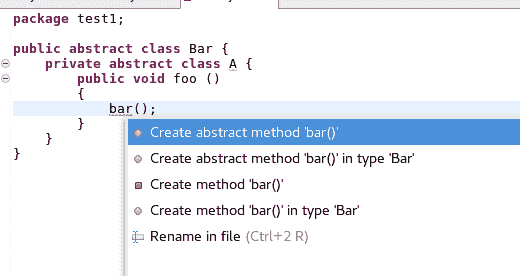

##### 转换为静态导入的快速修复

实现了一个新的快速修复，允许用户将静态字段访问和静态方法转换为使用静态导入。也可以同时替换所有事件。


#### Java 代码生成

##### 改进的 hashCode()和 equals()生成

在**源>生成 hashCode()和 equals()…** 工具中的一个新选项允许您使用 Java 7 `Objects.equals`和`Objects.hash`方法创建实现。

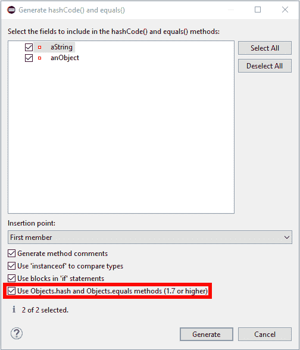

上述设置生成以下代码:

[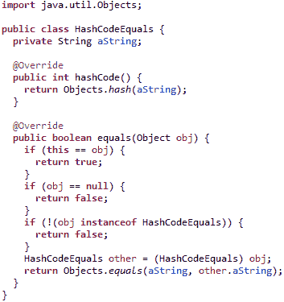](https://developers.redhat.com/blog/wp-content/uploads/2018/10/img_5bbb4cf4389df.png)

此外，数组的处理更加巧妙。在处理`Object[]`、`Serializable[]`和`Cloneable[]`或者扩展这些类型的任何类型变量时，这一代人更喜欢使用`Arrays.deepHashCode`和`Arrays.deepEquals`方法。

#### Java 视图和对话框

##### JRE 编译器兼容性问题标记的快速修复

在 **JRE 编译器兼容性**问题标记上提供了一个新的快速修复，当编译器兼容性与正在使用的 JRE 不匹配时会创建该标记。这个快速修复提供了打开项目的**编译器兼容性**页面来修复问题的选项。

[](https://developers.redhat.com/blog/wp-content/uploads/2018/10/img_5bbb4d2a28b2b.png)

选择此选项将打开指定项目的**编译器兼容性**属性页，如下所示。

[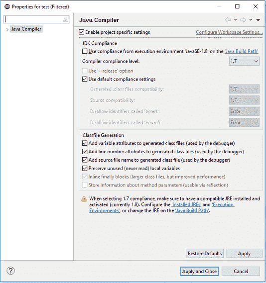](https://developers.redhat.com/blog/wp-content/uploads/2018/10/img_5bbb4d45a81fd.png)

##### 现在打开的类型对话框总是显示完整的路径

**打开类型**对话框现在总是显示所有匹配项目的完整路径。

[](https://developers.redhat.com/blog/wp-content/uploads/2018/10/img_5bbb4d6d96f3e.png)

#### Java 格式化程序

##### 将简单的循环放在一行中

添加了新的格式化程序设置，可以使简单循环体(没有括号)与它们的头保持在同一行，类似于以前存在的简单`if`语句的设置。不同种类的回路(`for`、`while`、`do while`)可以独立控制。

这些设置可以在控制语句>简单循环中的**新行>下的配置文件编辑器中找到。**

[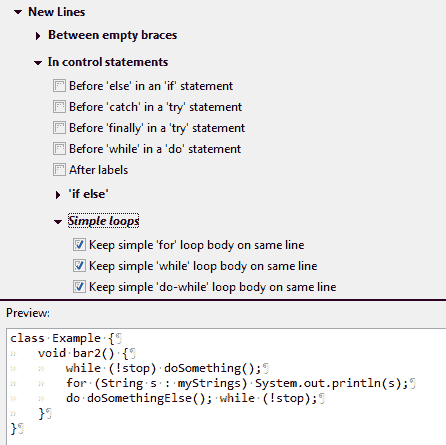](https://developers.redhat.com/blog/wp-content/uploads/2018/10/img_5bbb4d9c29779.png)

还有一个新的设置来控制这些循环在超过最大线宽时应该如何处理。它位于**换行>换行设置>语句>紧凑循环(' for '，' while '，' do while')** 下。

[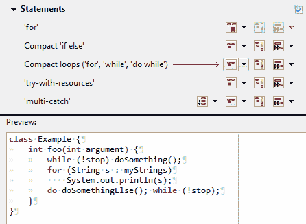](https://developers.redhat.com/blog/wp-content/uploads/2018/10/img_5bbb4db6c2592.png)

##### 对齐列中的项目

以前称为**对齐列**中的字段的特性已经扩展，现在也可以用于**变量声明**和**赋值语句**。

还增加了一个选项，总是**与空格**对齐，即使制表符用于一般缩进。这非常类似于**使用空格来缩进换行**选项，有助于使代码在不同标签宽度的编辑器中看起来更好。

所有与对齐相关的设置现在都在新的首选项子部分中:**缩进>对齐列中的项目**。

[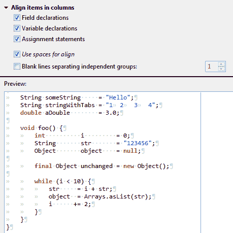](https://developers.redhat.com/blog/wp-content/uploads/2018/10/img_5bbb4dda1a489.png)

#### 调试

##### 步骤操作结果超时

观察步骤操作的结果可能会降低执行速度，如果一个步骤已经花费了很长时间，这可能会使观察结果变得不可用。因此，引入了超时(默认值为 7000 ms ),之后观察机制被禁用，直到步进操作结束。

[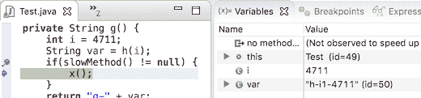](https://developers.redhat.com/blog/wp-content/uploads/2018/10/img_5bbb4e0757d71.png)

超时可以在**首选项> Java >调试>中配置如果步进操作时间超过(毫秒)**则不显示。

##### 在调试视图中隐藏正在运行的线程的选项

在**调试**视图中引入了一个新选项来显示或隐藏正在运行的线程。

当调试多线程应用程序时，如果很难在成百上千个正在运行的线程中找到在断点处停止的线程，隐藏正在运行的线程会很有用。

[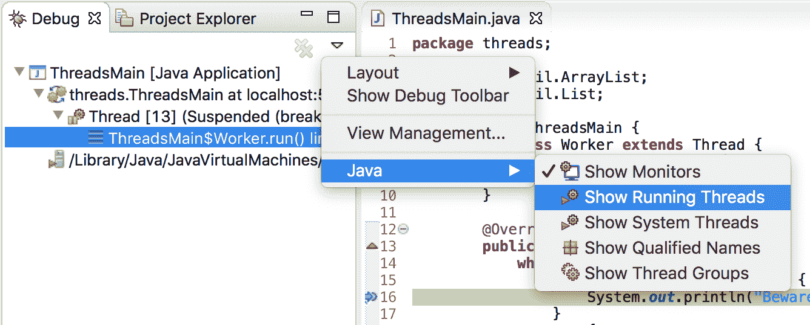](https://developers.redhat.com/blog/wp-content/uploads/2018/10/img_5bbb4e34ddb5a.png)

##### 在启动配置中显示命令行按钮

在 **Java 启动配置**对话框中增加了一个新的**显示命令行**按钮。

[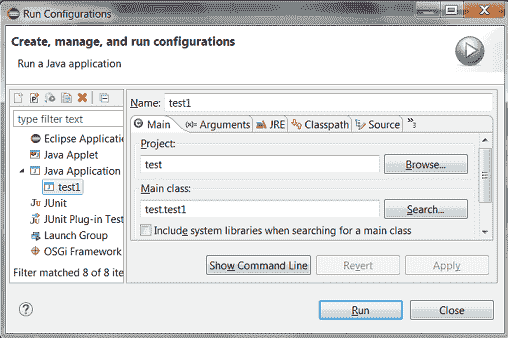](https://developers.redhat.com/blog/wp-content/uploads/2018/10/img_5bbb4e593f9d8.png)

单击该按钮将打开一个对话框，显示用于启动应用程序的命令行。

[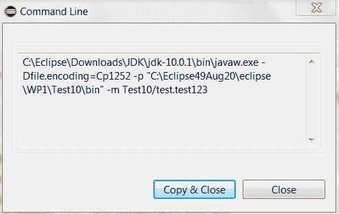](https://developers.redhat.com/blog/wp-content/uploads/2018/10/img_5bbb4e73e21d4.png)

##### 在调试视图中禁用线程名称更改的选项

被调试的 JVM 中的线程名称变化反映在 **Debug** 视图中。如果不需要名称更新所需的 JVM 通信，现在可以使用 VM 选项来禁用这种行为。

可以通过指定以下 VM 选项来禁用该功能:

```
-Dorg.eclipse.jdt.internal.debug.core.model.ThreadNameChangeListener.disable=true
```

##### 支持长类路径/模块路径

如果类路径和/或模块路径超过了当前操作系统的限制，它们现在会被缩短。

如果需要一个临时 JAR 来缩短类路径(Java 8 和以前的版本)，会显示一个对话框要求确认。

[](https://developers.redhat.com/blog/wp-content/uploads/2018/10/img_5bbb4ecd8d76a.png)

在**运行/调试配置**对话框的**类路径**选项卡中有**使用临时 jar 指定类路径(避免类路径长度限制)**选项。

[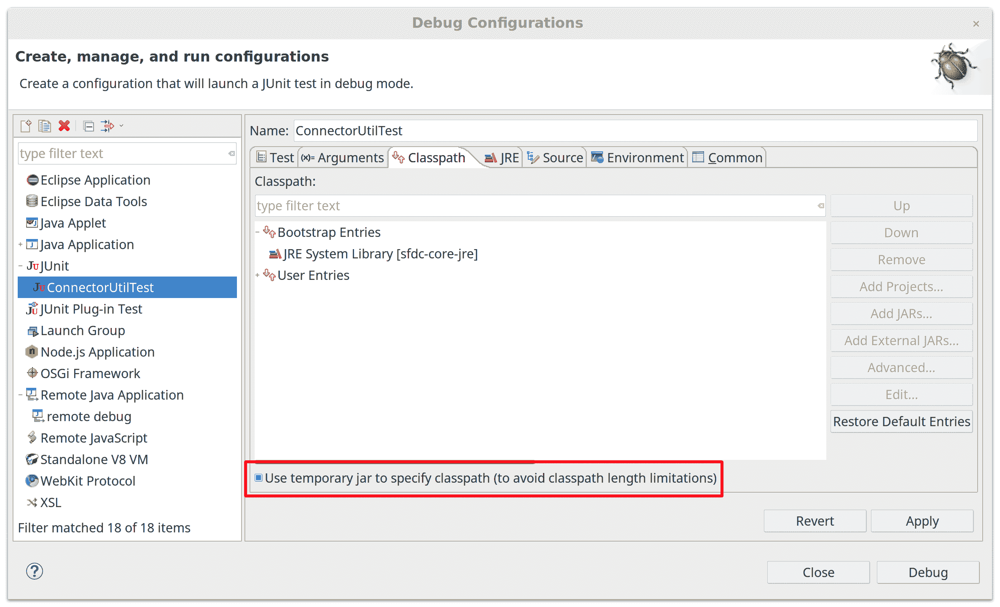](https://developers.redhat.com/blog/wp-content/uploads/2018/10/img_5bbb4ee94e73f.png)

### 还有更多…

您可以在本页的[中找到更多值得注意的更新。](http://tools.stage.jboss.org/documentation/whatsnew/jbosstools/4.9.0.Final.html)

## 下一步是什么？

现在 JBoss Tools 4.9.0 和 Red Hat Developer Studio 12.9 已经出来了，我们已经在着手 Eclipse 2018-12 的下一个版本了。

尽情享受吧！

*Last updated: March 19, 2020*