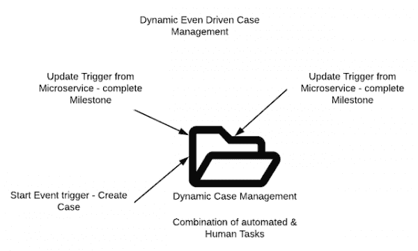
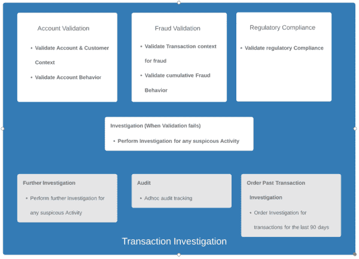
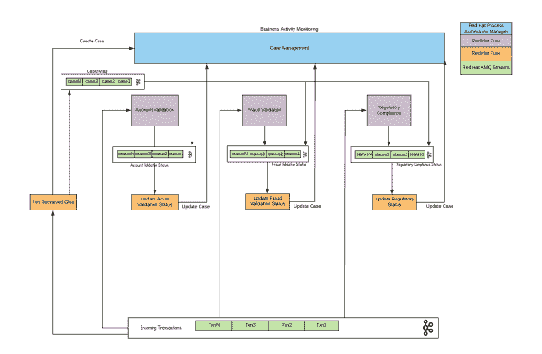
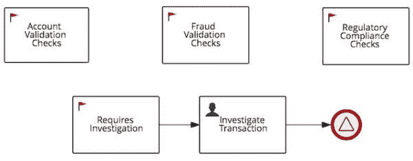
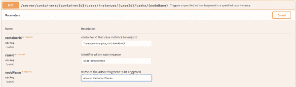
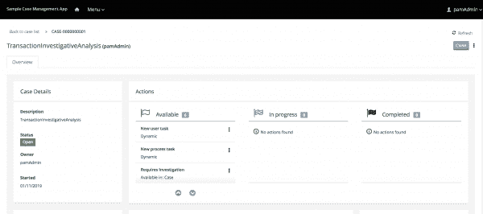
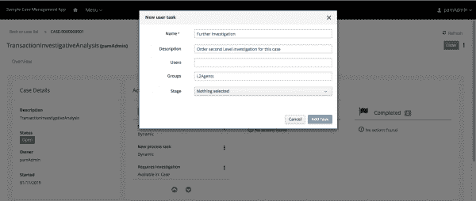
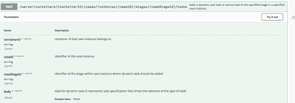
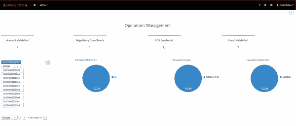

# 事件驱动时代的动态案例管理

> 原文：<https://developers.redhat.com/blog/2020/01/03/dynamic-case-management-in-the-event-driven-era>

案例管理应用程序旨在处理人工和自动化任务的复杂组合。所有案例更新和案例数据都被捕获为案例文件，该文件充当管理的中枢。这将作为未来审计和跟踪的记录系统。这些工作流的主要特征是它们本质上是临时的。没有单一的解决方案，通常，一种尺寸并不适合所有情况。

案例管理没有结构化的时间限制。所有案例通常不会同时解决。考虑客户入职、争议解决、欺诈调查等例子。，它试图根据特定的用例提供定制的解决方案。随着更现代的技术框架和实践的出现，如[微服务](https://developers.redhat.com/topics/microservices/)和事件驱动处理，案件管理解决方案的潜力进一步打开。本文描述了如何在当今时代利用案例管理进行动态工作流处理，包括诸如[红帽 OpenShift](https://developers.redhat.com/openshift/) 、[红帽 AMQ 流](https://developers.redhat.com/products/amq/overview)、[红帽 Fuse](https://developers.redhat.com/products/fuse/overview) 和[红帽流程自动化管理器](https://developers.redhat.com/products/rhpam/overview)等组件。

## 动态事件驱动的案例管理

Figure 1: The event-driven case management model.">

保持案例管理精神不变，它提供了一种编排自动化和人工任务的方法。正如您在图 1 中看到的，没有离开案例管理层的服务的直接调用。这个事实已经颠倒了。对动态案例执行特定任务的每个服务助手通过事件流与案例通信。

这种方法有几个优点:

*   案例不需要等待这些异步任务完成；相反，它只是等待一个信号。
*   因为没有直接耦合，所以有更多的余地以优雅的方式处理故障。
*   案例管理不仅协调执行案例任务的各种微服务，还提供对案例的人工干预，以及动态创建临时任务和案例数据的能力。

## 交易调查概述

让我们考虑一个事务调查用例。“帐户验证”、“欺诈验证”和“法规遵从性”这三个步骤是强制性的，在每种情况下都会调用(没有特定的顺序)。如果任何验证失败，将下令进行调查。该流程中可能还涉及其他步骤，包括审计或历史数据的二级调查，如图 2 所示:

Figure 2: An example transaction investigation.">

## 动态案例管理体系结构概述

事件不断被创建并被推送到事件流中。案例评估的强制步骤(包括帐户验证、欺诈验证和法规遵从性)被建模为微服务，微服务在新交易出现在流中时寻找新交易。微服务评估完成后，状态将通过案例关联服务在案例管理层进行更新，如图 3 所示:

Figure 3: The example through the Case Management layer.">

现在让我们更详细地看一下每一部分。

#### 红帽 OpenShift

[Red Hat OpenShift](https://developers.redhat.com/products/openshift/overview) 通过快速容器供应、部署、扩展、自动修复和管理，实现高效的容器编排。

#### 红帽 AMQ 溪流

AMQ 流提供分布式消息传递功能，可以满足规模和性能需求。 [AMQ 流](https://access.redhat.com/products/red-hat-amq-streams)采用创新方法，将 Kafka 的功能集成到 Red Hat OpenShift 容器平台，这是市场领先的综合性[企业 Kubernetes 平台](https://www.redhat.com/en/technologies/cloud-computing/openshift)。

#### 红帽保险丝

Red Hat Fuse 使开发人员能够在开发解决方案时采用敏捷集成方法。通过构建和组合微服务，它提供了一个分布式集成模型。它有 200 多个现成的连接器，可以很容易地快速创建 API 和集成解决方案。

#### Red Hat 流程自动化经理

Red Hat Process Automation Manager(以前的 Red Hat JBoss BPM Suite)是一个平台，用于开发自动化业务决策和流程的容器化微服务和应用程序。它提供了一个全面的案例管理平台，允许协调静态和动态任务。

## **运行中的动态案例管理**

如果您仔细观察，您会发现没有一个系统直接相互通信。流是系统中每个实体之间的通信通道。此外，您可能会注意到，我们将验证逻辑与更新状态逻辑分开了。其中每个都作为单独的微服务运行。

这种整体架构提供了许多优势:

*   “无紧密耦合”意味着更强的弹性。Kafka 提供了优雅的容错能力，这意味着单个故障不会完全导致系统崩溃。
*   将微服务问题分离出来意味着每个单元都可以根据负载进行必要的扩展。
*   主题数据的完全分离意味着不止一个消费者可以同时处理它(例如，举报)。
*   将案例管理引入到架构中，为动态处理案例提供了可能性。
*   业务活动监控提供了对这些不同微服务的编排的洞察，并允许关键性能指标(KPI)度量报告和跟踪。

## 交易调查案例:拯救的里程碑

Figure 4:Figure 4: The mandatory milestones and steps for this use case.">

案例的强制步骤，包括帐户验证检查、欺诈验证检查和法规遵从性检查(如图 4 所示)，被表示为案例的里程碑。里程碑是一种特殊的服务任务，可以通过将里程碑节点添加到流程设计器面板中，在案例定义设计器中对其进行配置。案例管理里程碑通常发生在一个阶段的末尾，但它们也可能是实现其他里程碑的结果。在本例中，我们使用该功能通过外部微服务发出任务完成信号。

让我们以帐户验证检查为例。典型的步骤顺序如图 5 所示:

Figure 5: The typical steps for Account Validation checks.">

这些步骤细分如下:

1.  案例关联服务从传入事务主题中读取传入事务，该服务创建一个带有事务有效负载的案例，并将其推送到案例映射主题(传入事务和案例 ID 的映射)。
2.  微服务读取传入的事务主题，并将评估状态推送到状态主题。
3.  关联微服务从状态主题和案例映射主题中读取，以通过 REST API 更新该案例的案例里程碑:

Figure 6: The updated case milestone.">

然后对所有三个验证检查重复这一顺序。案例里程碑也可以通过匹配条件开始。正如我们前面所定义的，当任何一个验证检查失败时，就会触发所需的调查。然后，该流程会将其分配给调查人员进行审查。

请注意，我们没有将里程碑审计、订购过去的交易和进一步调查定义为常规案例的一部分。这是因为我们可以根据需要将这些以及任何其他任务或变量动态添加到案例中。Red Hat Process Automation Manager 提供了 API 来实现这一特性。

图 7 是一个[案例管理应用程序](https://access.redhat.com/documentation/en-us/red_hat_process_automation_manager/7.5/html/using_the_showcase_application_for_case_management/index)的示例:

Figure 7: An example case management application.">

如前所述，我们既支持案例需要完成的静态里程碑集，也支持可以按需旋转的特别任务，如图 8 所示:

Figure 8: The milestones and ad hoc tasks.">

case management Showcase 使用由 Kie-Server 公开的 REST API 方法来添加这些动态任务，如图 9 所示:

Figure 9: Example showing API for dynamic task management">

## 业务活动监控

这种性质的复杂系统的一个关键部分是能够洞察这些不同的微服务和人工任务的状态。监控 KPI 指标和响应问题趋势是 case management 运营经理不可或缺的工作。Red Hat Process Automation Manager 提供了正在运行的实例的仪表板视图，并允许您管理和跟踪 SLA。

流程和任务级别的 SLA 指标加上与案例相关的细分的组合有利于识别趋势并在必要时重组劳动力。图 10 显示了这种仪表板的典型示例:

Figure 10: A breakdown of cases and task-level SLA metrics.">

该控制面板提供了对案例数据指标的高级洞察。我们还可以创建向下钻取报告，以平移到特定实例中进行跟踪，如图 11 所示:

Figure 11: A specific instance drill-down report.">

## 摘要

通过结合动态案例管理、分布式企业集成和事件流的力量，我们可以创建一个完全基于事件的系统，它是云原生的、有弹性的、可扩展的和自适应的。Red Hat Process Automation Manager 和 Red Hat 和谐地集成在一起，可以使这种情况在风格上发生。

## 参考

*   [红帽整合](https://www.redhat.com/en/products/integration?extIdCarryOver=true&sc_cid=701f20000012i69AAA)
*   [红帽引信](https://developers.redhat.com/products/fuse/overview)
*   [红帽流程自动化经理](https://access.redhat.com/documentation/en-us/red_hat_process_automation_manager/7.5/)

*Last updated: June 29, 2020*