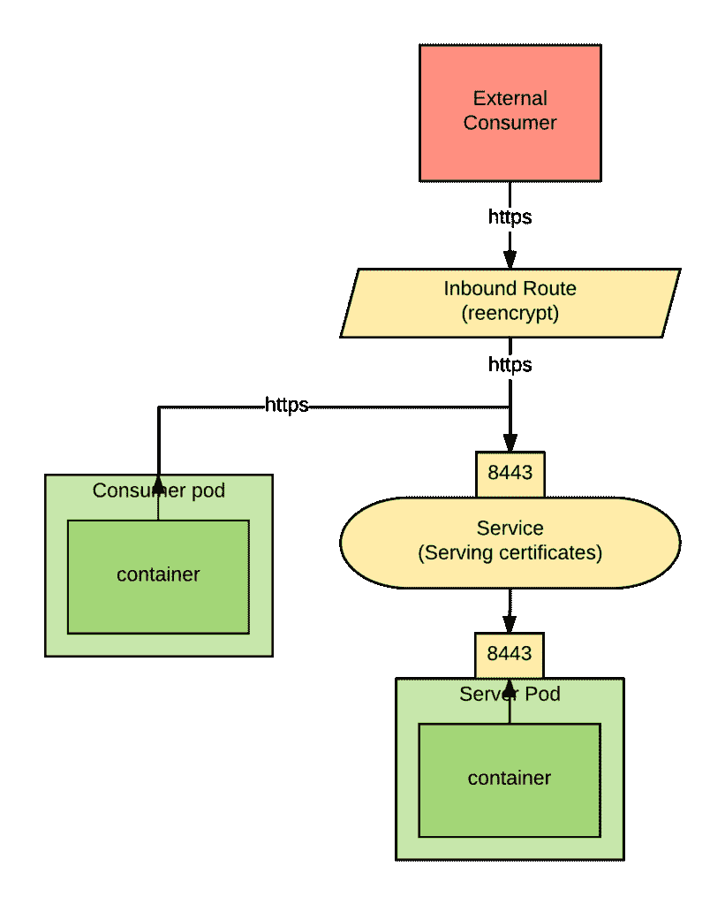
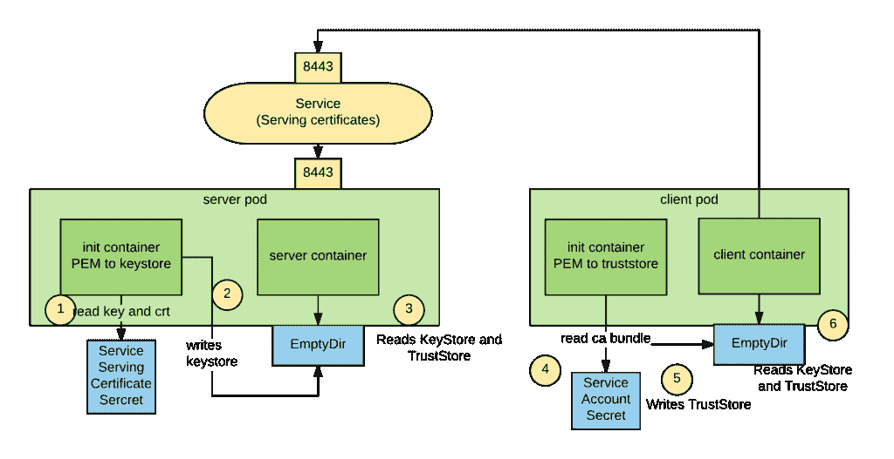
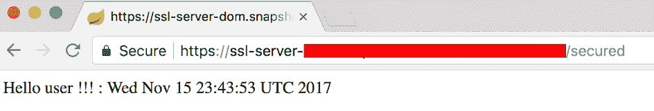
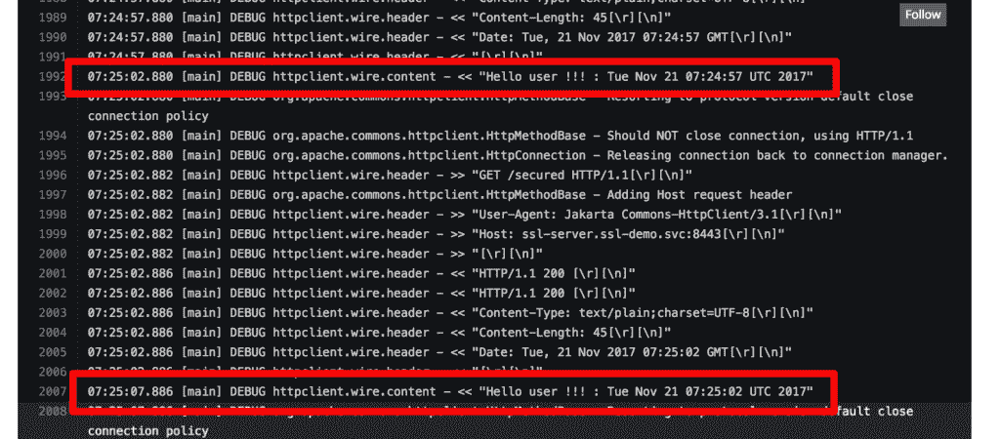

# 在 OpenShift 中动态创建 Java 密钥库

> 原文：<https://developers.redhat.com/blog/2017/11/22/dynamically-creating-java-keystores-openshift>

## 简介

通过对一个服务的简单注释，可以在 OpenShift 中 [动态创建证书](https://docs.openshift.com/container-platform/3.6/dev_guide/secrets.html#service-serving-certificate-secrets) 。

这样创建的证书是[PEM](https://support.ssl.com/Knowledgebase/Article/View/19/0/der-vs-crt-vs-cer-vs-pem-certificates-and-how-to-convert-them)(base64 编码的证书)格式，不能被 Java 应用程序直接使用，Java 应用程序需要将证书存储在 [Java 密钥库中](https://en.wikipedia.org/wiki/Keystore) 。

在本帖中，我们将展示一种简单的方法，让 Java 应用程序从 OpenShift 动态创建的证书中受益。

## 为什么要证书

证书是 [PKI 基础设施](https://en.wikipedia.org/wiki/Public_key_infrastructure) 的一部分，可用于认证和保护(加密)网络通信。

OpenShift 有一个内部的 [证书颁发机构](https://en.wikipedia.org/wiki/Certificate_authority) (CA)，它可以用它来生成新的证书。

有些应用要求所有通信都必须加密，即使在 OpenShift 集群内部也是如此(例如，PCI 范围内通信通常有此要求)。

通常，在 OpenShift 中，这个用例分为两个场景:

1.  来自集群外部的入站通信。
2.  在集群内部运行的两个 pod 之间的通信。

下图显示了两个用例:



对于路由，我们选择了 [重新加密](https://docs.openshift.com/container-platform/3.6/architecture/networking/routes.html#secured-routes) ，这样我们可以在服务器组件中使用相同的证书来服务内部和外部请求，并且仍然使用 OpenShift 提供的自动化。

如果您的应用程序需要将其证书直接暴露给入站连接，那么您将不得不使用[](https://docs.openshift.com/container-platform/3.6/architecture/networking/routes.html#secured-routes)。在这个场景中，您可以使用 OpenShift 自动化功能。

使用这个 [服务中的注释](https://docs.openshift.com/container-platform/3.6/dev_guide/secrets.html#service-serving-certificate-secrets) 在我们的服务器 pod 前面，我们可以让 OpenShift 生成代表服务 FQDN 的证书，并把它们放在一个秘密:

```
*service.alpha.openshift.io/serving-cert-secret-name: service-certs*
```

另外，路由器和消费 pod 都需要能够信任动态生成的证书。默认情况下，路由将信任由 OpenShift 创建的任何证书。对于消费服务，我们可以使用服务帐户 CA 包来信任生成的证书。

服务帐户 CA 包总是可以在这里找到:

```
*/var/run/secrets/kubernetes.io/serviceaccount/service-ca.crt*
```

不幸的是，Java 应用程序不能直接使用 PEM 格式的证书，我们必须首先将它们转换成 Java 密钥库。

## 从 Java 应用程序中使用动态生成的证书

为了将 PEM 格式的证书转换成 Java 密钥库，我们将使用一个 [init 容器](https://docs.openshift.com/container-platform/3.6/architecture/core_concepts/pods_and_services.html#pods-services-init-containers) 。

事件的架构和顺序如下图所示:



我们使用一个 [emptyDir 卷](https://kubernetes.io/docs/concepts/storage/volumes/#emptydir) 来存储密钥库和信任库文件，以便我们的应用程序容器最终可以读取它们。

转换 PEM 格式的证书和私钥的命令序列如下:

```
*openssl pkcs12 -export -inkey $keyfile -in $crtfile -out $keystore.pkcs12 -password pass:$password*
*keytool -importkeystore -noprompt -srckeystore $keystore.pkcs12 -srcstoretype pkcs12 -destkeystore $keystore.jks -storepass $password -srcstorepass $password*
```

其中:

*   *$keyfile* 是关键文件。
*   *$crtfile* 是证书文件。
*   *$ keystore _ jks*是将要创建的 keystore 文件。
*   *$password* 是 keystore 的密码。
*   *$ keystore _ pkcs12*是在进程中创建的 pkcs12 格式的密钥库文件。

我们的初始化容器将如下所示:

```
 *initContainers:*
 *- name: pem-to-keystore*
 *image: registry.access.redhat.com/redhat-sso-7/sso71-openshift:**1.1-16*
 *env:*
 *- name: keyfile*
 *value: /var/run/secrets/openshift.io/services_serving_certs/tls.key*
 *- name: crtfile*
 *value: /var/run/secrets/openshift.io/services_serving_certs/tls.crt*
 *- name: keystore_pkcs12*
 *value: /var/run/secrets/java.io/keystores/keystore.pkcs12*
 *- name: keystore_jks*
 *value: /var/run/secrets/java.io/keystores/keystore.jks*
 *- name: password*
 *value: changeit*
 *command: ['/bin/bash']*
 *args: ['-c', "openssl pkcs12 -export -inkey $keyfile -in $crtfile -out $keystore_pkcs12 -password pass:$password && keytool -importkeystore -noprompt -srckeystore $keystore_pkcs12 -srcstoretype pkcs12 -destkeystore $keystore_jks -storepass $password -srcstorepass $password"]*
 *volumeMounts:*
 *- name: keystore-volume*
 *mountPath: /var/run/secrets/java.io/keystores*
 *- name: service-certs*
 *mountPath: /var/run/secrets/openshift.io/services_serving_certs*
*volumes:*
 *- name: keystore-volume*
 *emptyDir: {}*
 *- name: service-certs*
 *secret:*
 *secretName: service-certs* 
```

从 CA 包开始创建 Java 信任库的命令如下:

```
*csplit -z -f crt- service-ca.crt '/-----BEGIN CERTIFICATE-----/' '{*}'*
*for file in crt-*; do keytool -import -noprompt -keystore truststore.jks -file $file -storepass changeit -alias service-$file; done*
```

其中:

*   *$ trust store _ jks*是 CA 捆绑文件。
*   *$ca_bundle* 是生成的信任库文件。
*   *$password* 是 truststore 文件的密码。

因为 keytool 一次只导入一个证书，所以需要这个循环。

我们的初始化容器将如下所示:

```
*initContainers:*
*- name: pem-to-truststore*
 *image: registry.access.redhat.com/redhat-sso-7/sso71-openshift:**1.1-16*
 *env:*
 *- name: ca_bundle*
 *value: /var/run/secrets/kubernetes.io/serviceaccount/service-ca.crt*
 *- name: truststore_jks*
 *value: /var/run/secrets/java.io/keystores/truststore.jks*
 *- name: password*
 *value: changeit*
 *command: ['/bin/bash']*
 *args: ['-c', "csplit -z -f crt- $ca_bundle '/-----BEGIN CERTIFICATE-----/' '{*}' && for file in crt-*; do keytool -import -noprompt -keystore $truststore_jks -file $file -storepass changeit -alias service-$file; done"]*
 *volumeMounts:*
 *- name: keystore-volume*
 *mountPath: /var/run/secrets/java.io/keystores*
*volumes:*
 *- name: keystore-volume*
 *emptyDir: {}* 
```

**注意:**对于这个例子，我们使用的是 Red Hat 单点登录映像(版本 1.1-16)。这张图片碰巧同时带有 openssl 和 keytool，这是我们在这里需要的两个工具。此外，RHSSO 包含在任何 openshift 订阅中。你显然可以塑造自己的形象。

## 端到端跳靴演示

为了证明这种方法，我们创建了一个安全的 [SpringBoot 服务器](https://github.com/domenicbove/openshift-ssl-server) 和 [客户端](https://github.com/domenicbove/openshift-ssl-client) ，它们通过 SSL 连接到服务器。

### SSL 服务器

对于服务器，其服务对象将需要***serving-cert-secret-name***注释来创建其证书，部署将使用“PEM-to-keystore”init container 从生成的证书中创建服务器的密钥库。下面是服务、部署配置和路由定义:

```
*- apiVersion: v1*
 *kind: Service*
 *metadata:*
 *annotations:*
 *service.alpha.openshift.io/serving-cert-secret-name: service-certs*
 *labels:*
 *app: ssl-server*
 *name: ssl-server*
 *spec:*
 *ports:*
 *- name: 8443-tcp*
 *port: 8443*
 *protocol: TCP*
 *targetPort: 8443*
 *selector:*
 *deploymentconfig: ssl-server*
*- apiVersion: v1*
 *kind: DeploymentConfig*
 *metadata:*
 *labels:*
 *app: ssl-server*
 *name: ssl-server*
 *spec:*
 *replicas: 1*
 *selector:*
 *deploymentconfig: ssl-server*
 *template:*
 *metadata:*
 *labels:*
 *app: ssl-server*
 *deploymentconfig: ssl-server*
 *spec:*
 *containers:*
 *- name: ssl-server*
 *image: ssl-server*
 *env:*
 *- name: keystore_jks*
 *value: /var/run/secrets/java.io/keystores/keystore.jks*
 *- name: password*
 *value: changeit*
 *ports:*
 *- containerPort: 8443*
 *protocol: TCP*
 *resources: {}*
 *volumeMounts:*
 *- mountPath: /var/run/secrets/java.io/keystores*
 *name: keystore-volume*
 *initContainers:*
 *- name: pem-to-keystore*
 *image: registry.access.redhat.com/redhat-sso-7/sso71-openshift:1.1-16*
 *env:*
 *- name: keyfile*
 *value: /var/run/secrets/openshift.io/services_serving_certs/tls.key*
 *- name: crtfile*
 *value: /var/run/secrets/openshift.io/services_serving_certs/tls.crt*
 *- name: keystore_pkcs12*
 *value: /var/run/secrets/java.io/keystores/keystore.pkcs12*
 *- name: keystore_jks*
 *value: /var/run/secrets/java.io/keystores/keystore.jks*
 *- name: password*
 *value: changeit*
*command: ['/bin/bash']*
*args: ['-c', "openssl pkcs12 -export -inkey $keyfile -in $crtfile -out $keystore_pkcs12 -password pass:$password && keytool -importkeystore -noprompt -srckeystore $keystore_pkcs12 -srcstoretype pkcs12 -destkeystore $keystore_jks -storepass $password -srcstorepass $password"]*
 *volumeMounts:*
 *- mountPath: /var/run/secrets/java.io/keystores*
 *name: keystore-volume*
 *- mountPath: /var/run/secrets/openshift.io/services_serving_certs*
 *name: service-certs*
 *volumes:*
 *- name: keystore-volume*
 *emptyDir: {}*
 *- name: service-certs*
 *secret:*
 *secretName: service-certs*
*- apiVersion: v1*
 *kind: Route*
 *metadata:*
 *labels:*
 *app: ssl-server*
 *name: ssl-server*
 *spec:*
 *port:*
 *targetPort: 8443-tcp*
 *tls:*
 *termination: reencrypt*
 *to:*
 *kind: Service*
 *name: ssl-server*
 *weight: 100*
 *wildcardPolicy: None*
```

我们将 *keystore_jks* 和 *password* 值作为环境变量传递给 app 容器，然后在 spring boot*application . properties*文件中有:

```
*server.port=8443*
*server.ssl.key-password=${password}*
*server.ssl.key-store=${keystore_jks}*
*server.ssl.key-store-provider=SUN*
*server.ssl.key-store-type=JKS* 
```

阅读 SpringBoot 文档中关于配置 SSL 的内容。该应用程序通过公开了一个简单/安全的端点

```
*@RestController**class SecuredServerController {* *@RequestMapping("/secured")* *public String secured(){* *System.out.println("Inside secured()");* *return "Hello user !!! : " + new Date();* *}**}*
```

启动服务器运行:

```
*oc new-project ssl-demo*
*oc process -f https://raw.githubusercontent.com/domenicbove/openshift-ssl-server/master/template.yaml | oc create -f -*
```

这将触发服务的构建和最终部署。您可以通过将/secured 附加到自动生成的路由主机名来测试外部路由。



### SSL 客户端

现在，为了使客户端与服务器建立安全连接，它需要由“PEM-to-trust store”init container 生成的信任存储。下面是客户端的应用部署配置:

```
*- apiVersion: v1*
 *kind: DeploymentConfig*
 *metadata:*
 *labels:*
 *app: ssl-client*
 *name: ssl-client*
 *spec:*
 *replicas: 1*
 *selector:*
 *deploymentconfig: ssl-client*
 *template:*
 *metadata:*
 *labels:*
 *app: ssl-client*
 *deploymentconfig: ssl-client*
 *spec:*
 *containers:*
 *- name: ssl-client*
 *image: ssl-client*
 *imagePullPolicy: Always*
 *env:*
 *- name: JAVA_OPTIONS*
 *value: -Djavax.net.ssl.trustStore=/var/run/secrets/java.io/keystores/truststore.jks -Djavax.net.ssl.trustStorePassword=changeit*
 *- name: POD_NAMESPACE*
 *valueFrom:*
 *fieldRef:*
 *apiVersion: v1*
 *fieldPath: metadata.namespace*
 *volumeMounts:*
 *- mountPath: /var/run/secrets/java.io/keystores*
 *name: keystore-volume*
 *initContainers:*
 *- name: pem-to-truststore*
 *image: registry.access.redhat.com/redhat-sso-7/sso71-openshift:1.1-16*
 *env:*
 *- name: ca_bundle*
 *value: /var/run/secrets/kubernetes.io/serviceaccount/service-ca.crt*
 *- name: truststore_jks*
 *value: /var/run/secrets/java.io/keystores/truststore.jks*
 *- name: password*
 *value: changeit*
*command: ['/bin/bash']*
*args: ['-c', "csplit -z -f crt- $ca_bundle '/-----BEGIN CERTIFICATE-----/' '{*}' && for file in crt-*; do keytool -import -noprompt -keystore $truststore_jks -file $file -storepass changeit -alias service-$file; done"]*
 *volumeMounts:*
 *- mountPath: /var/run/secrets/java.io/keystores*
 *name: keystore-volume*
 *volumes:*
 *- emtpyDir: {}*
 *name: keystore-volume*
```

您会注意到，我们利用了 openjdk18-openshift 映像上可用的 *JAVA_OPTIONS* 环境变量来将信任库文件路径和密码添加到映像的启动 JAVA 命令中。

所有的客户端源代码都被重复调用到服务器 *https://ssl-client。<命名空间>。SVC:8443/担保*

```
*public static void main(String[] args) throws IOException, InterruptedException {*
 *HttpClient client = new HttpClient();*
 *GetMethod method = new GetMethod();*
 *String uri = "https://ssl-server." + System.getenv("POD_NAMESPACE") + ".svc:8443/secured";*
 *method.setURI(new URI(uri, false));*
 *while(true) {*
 *client.executeMethod(method);*
 *Thread.sleep(5000);*
 *}* *}*
```

在 OpenShift 中运行客户端应用:

```
*oc process -f https://raw.githubusercontent.com/domenicbove/openshift-ssl-client/master/template.yaml | oc create -f -*
```

这将触发项目中的自动构建和部署。当应用程序部署后，点击 pod 日志，您应该会看到来自 SSL 服务器的响应:



### 其他发现

如果您的客户端需要默认的 Java CA 证书以及在 pod 中找到的 CA 包，请在“PEM-to-trust store”init container 中使用此参数。

```
*args: ['-c', "keytool -importkeystore -srckeystore $JAVA_HOME/jre/lib/security/cacerts -srcstoretype JKS -destkeystore $truststore_jks -storepass changeit -srcstorepass changeit && csplit -z -f crt- $ca_bundle '/-----BEGIN CERTIFICATE-----/' '{*}' && for file in crt-*; do keytool -import -noprompt -keystore $truststore_jks -file $file -storepass changeit -alias service-$file; done"]*
```

### 故障排除

使用服务证书机密时，您可能会发现服务上有错误注释。这意味着生成的秘密已经存在。您只需删除秘密并重新创建服务。在这里阅读 [故障排除指南](https://docs.openshift.com/container-platform/3.5/dev_guide/secrets.html#secrets-troubleshooting) 。

## 结论

这篇文章展示了一种基于 init 容器的简单方法，它允许 Java 应用程序利用 OpenShift 动态生成的证书。

看[Kubernetes](https://kubernetes.io/)(OpenShift 上游项目之一)看起来未来 open shift 生成证书的能力将通过允许 [插件外部 ca](https://kubernetes.io/docs/tasks/tls/managing-tls-in-a-cluster/)得到提升。因此，我认为现在是开始将这一特性用于 Java 应用程序的好时机。

* * *

要构建您的 Java EE 微服务 **请访问 WildFly Swarm 并下载备忘单。**

*Last updated: January 4, 2022*