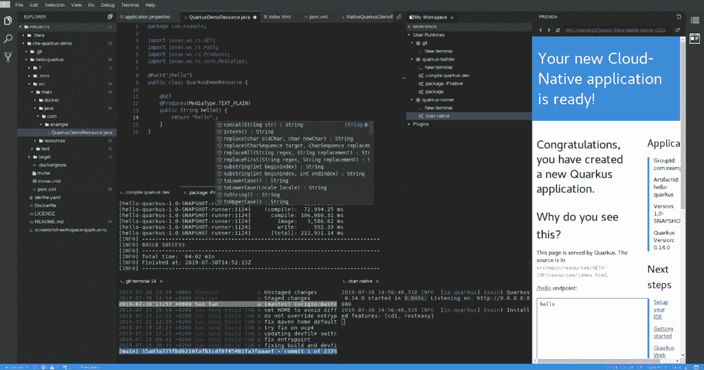

# Eclipse Che，Kubernetes-原生 IDE，第 7 版现已推出

> 原文：<https://developers.redhat.com/blog/2019/09/17/eclipse-che-kubernetes-native-ide-version-7-now-available>

今天，Eclipse Foundation 宣布发布 Kubernetes 原生 IDE[Eclipse Che 7](https://www.eclipse.org/che/)，使开发团队能够编码、构建、测试和运行云原生应用。我们对此次发布以及该版本为构建容器化应用程序的社区和开发人员提供的新功能感到兴奋。

**Eclipse Che 7 曾经构建了一个 [Quarkus](https://quarkus.io/) 云原生应用。**

此版本引入了:

*   **基于 Kubernetes 的开发人员工作区:**完全容器化的开发人员工作区，允许将您的应用程序运行时轻松带回您的开发环境。
*   **新编辑器** **:** 基于 Eclipse 忒伊亚，新的默认基于 web 的编辑器在浏览器中提供了类似 VSCode 的体验。
*   **Devfile——作为代码的开发环境:**为您的项目配置一个 dev file，并获得可重复使用的可移植开发环境。
*   **新插件和扩展性模型**:通过 VSCode 扩展兼容性获得项目所需的插件。用定制的 ide 交换，比如 Jupyter、 [Eclipse 飞船](https://www.dirigible.io/)或其他。
*   **Kubernetes 和 Red Hat OpenShift 支持:**部署在任何公共云和本地 Kubernetes 上。
*   **易于监控和管理:** Prometheus 和 Grafana 仪表板可以轻松控制您的 Eclipse Che 部署。
*   Chectl :管理 Eclipse Che 的新命令行工具。

你可以在下面的 release note 博客文章中了解更多关于 [Eclipse Che 7 版本的信息。](https://medium.com/p/40ae07120b38)

**尝试 Eclipse Che 7，在** [**上托管 Che at Che . open shift . io**](https://che.openshift.io/)**并浏览已经可用的** [**样本**](https://www.eclipse.org/che/getting-started/cloud/) **。**

## **Kube-app 从 0 到英雄**

Eclipse Che 7 使得 [Kubernetes](https://developers.redhat.com/developer-tools/kubernetes) 开发对开发团队来说是可访问的，为您的整个团队提供一键开发工作区并消除本地环境配置。 **Che 将您的 Kubernetes 应用程序带入您的开发环境**，允许您编码、构建、测试和运行应用程序，就像它们在生产环境中运行一样，为开发人员提供改进的内循环开发工作流程。

## 集中托管的 Kubernetes 团队工作区

Eclipse Che 可以部署在公共 K8S 集群上，也可以安装在您的防火墙后面。

Che 允许管理人员建立他们团队的开发环境的配置，定义技术栈和 IDE 工具，并为他们的团队提供超越笔记本电脑限制的资源，同时保护对源代码的访问。

## **月蚀车操作员**

Eclipse Che 7 提供了一个操作符，可以在任何安装了 OLM 的 K8S 集群上管理 Eclipse Che。今天在 OperatorHub.IO 上已经有[了，如果你已经在使用 Red Hat OpenShift 4.x，安装可以直接从 OpenShift 控制台顺利进行。](https://operatorhub.io/operator/eclipse-che)

要了解在 Red Hat OpenShift 上安装 Eclipse Che 的更多信息:

*   【OpenShift 3.11 安装指南
*   【OpenShift 4.x 的安装指南

## 与 Red Hat OpenShift 原生集成

Eclipse Che 运行在 Red Hat OpenShift 上，允许开发人员在他们的应用程序上编写代码，就像他们在产品上运行一样。Eclipse Che 7 从 3.11 版本开始兼容 OpenShift。

未来的集成将变得越来越无缝，允许开发人员直接从 OpenShift 开发人员控制台(随 OpenShift 4.2 一起提供)的按需开发人员环境中受益。

## Eclipse Che 7 和 Red Hat CodeReady Workspaces 2.0

Red Hat CodeReady Workspaces 是 Eclipse Che for OpenShift 的支持版本。Eclipse Che 第 7 版将集成到 CodeReady Workspaces 2.0 中，提供最新的开源 Kubernetes-native IDE，在 OpenShift 上为 OpenShift 构建云原生应用。

### 了解更多信息

*   月食车:[https://www.eclipse.org/che](https://www.eclipse.org/che)
*   红帽 CodeReady 工作区:[https://developers . red Hat . com/products/code ready-work spaces/overview](https://developers.redhat.com/products/codeready-workspaces/overview)
*   Che 由红帽开发者托管: [https://che.openshift.io](https://che.openshift.io)

*Last updated: February 24, 2022*