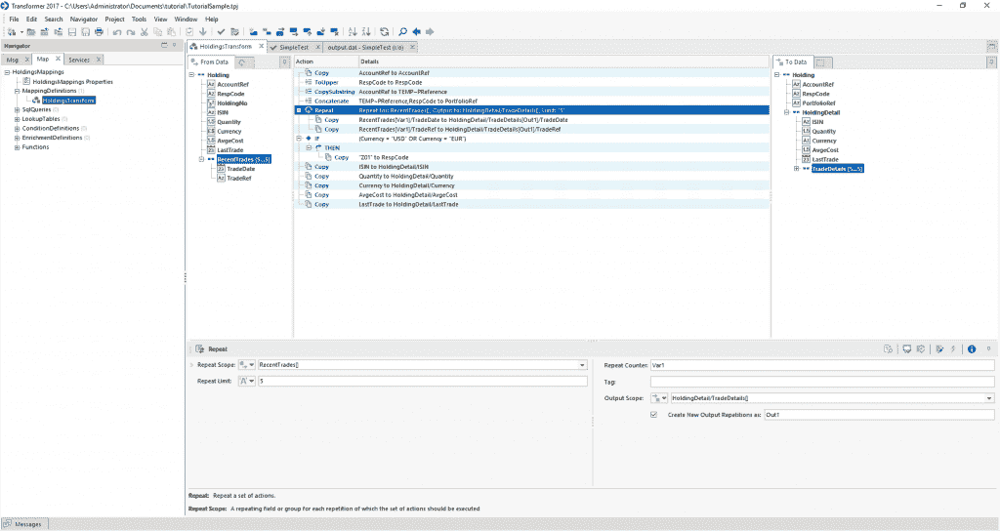
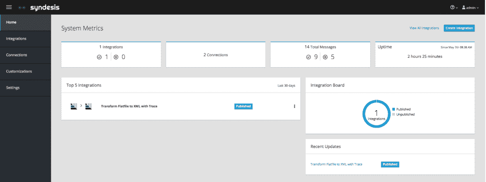

# 带熔丝点火器和跟踪变压器的 EDI 转换

> 原文：<https://developers.redhat.com/blog/2018/06/12/edi-transformations-with-fuse-ignite-and-trace-transformer>

作为红帽 JBoss Fuse 7 的一部分，红帽引入了一个新的集成平台即服务(iPaaS)，名为 Fuse Ignite。Gartner 使用术语 c *itizen integrators* 来描述 iPaaS 的目标市场:不经常关注集成的人。在我看来，这个市场包括电子数据交换(EDI)分析师，他们专注于业务规则和验证，而不是担心代码行或 Apache 骆驼路线。因此，Fuse Ignite 引入了一种分离关注点的机制，允许 EDI 分析师专注于他们的业务映射和转换。另一方面，开发人员可以专注于与系统的低级集成和编写代码。Fuse Ignite 提供了一个平台，市民集成商和开发人员可以在该平台上共存、协作，并为端到端集成做出贡献。

## 跟踪变压器

Java 在转换我们在 EDI 中发现的复杂文本格式和标准方面有不良记录。尽管 Apache Camel 在基本转换方面有所帮助，但它自己永远无法处理复杂的 EDI 标准。因此，我建议使用我们的合作伙伴 Trace 的 EDI 工具。任何 EDI 分析师都可以学习 Trace 的复杂拖放工具 Transformer，它支持任何可以想象的 EDI 标准。

在过去，Trace 将 EDI 映射作为 OSGi 包导出，很容易部署到 JBoss Fuse 并与 Camel 互操作。但是随着 Spring Boot 和红帽 OpenShift 的出现，最好的前进道路是什么？答案是导火索点燃！

## 保险丝点燃

Fuse Ignite 只是一个 c *itizen integrator 友好的*界面，用于促进集成流程。无论是连接到复杂的 Salesforce API 还是发布到 JMS 队列或主题，Fuse Ignite 都允许公民集成商创建自己的集成流程。有了 Trace Transformer，他们现在有能力编写、维护和操作他们复杂的 EDI 转换，而不用担心编写单一的 Camel route。这种机制被称为 s *tep 扩展，*让开发人员能够添加他们自己的定制步骤，公民集成商可以将这些步骤包含在他们的集成中。我们现在有了一个易于使用的 web 界面来创建、监控和操作集成。当然，它是建立在 OpenShift 之上的，以处理我们的集成如何大规模部署。

我在 GitHub 中创建了一个[示例项目](https://github.com/sigreen/trace-transformer-syndesis-extension)，演示了使用带有 Fuse Ignite 的 Trace Transformer。此外，点击下面观看我的视频演示保险丝点燃与跟踪变压器步骤扩展。

[https://www.youtube.com/embed/iC0ucIbbYf4?autoplay=0&start=0&rel=0](https://www.youtube.com/embed/iC0ucIbbYf4?autoplay=0&start=0&rel=0)

*Last updated: June 11, 2018*