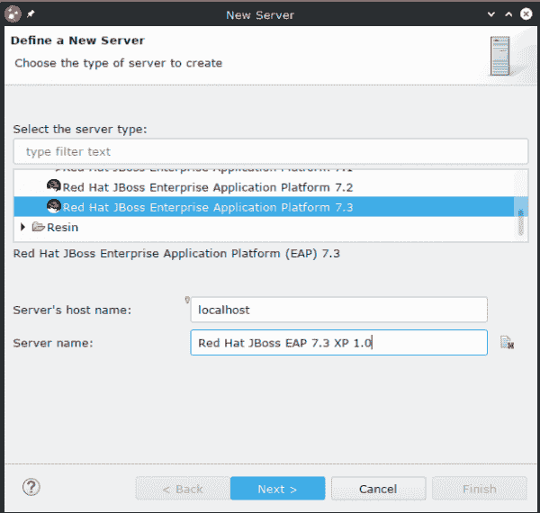
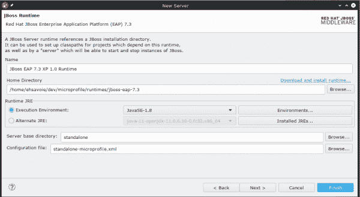
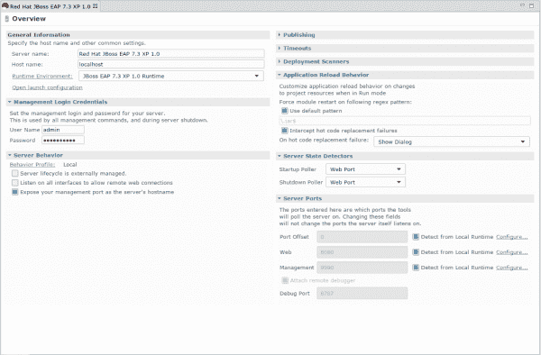
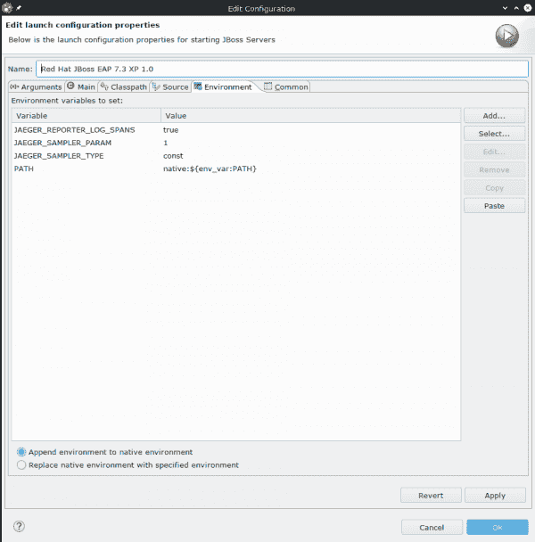
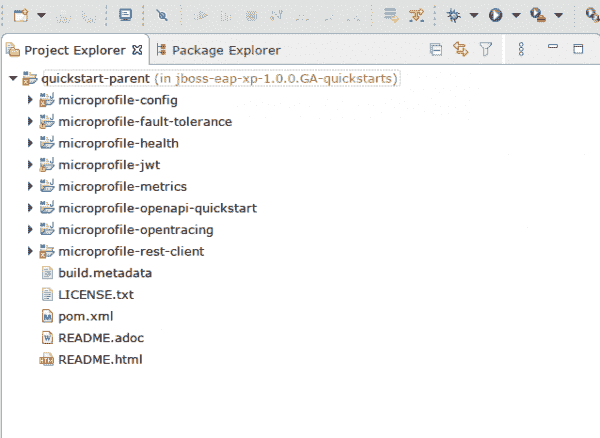

# 在 Red Hat JBoss 企业应用程序平台 7.3 上启用 Eclipse MicroProfile 应用程序

> 原文：<https://developers.redhat.com/blog/2020/06/16/enable-eclipse-microprofile-applications-on-red-hat-jboss-enterprise-application-platform-7-3>

在本文中，我们将向您展示如何安装[Red Hat JBoss Enterprise Application Platform(JBoss EAP)](https://developers.redhat.com/products/eap/overview)XP 1 . 0 . 0 . ga 并在 JBoss EAP 上启用 Eclipse MicroProfile 支持。一旦启用了 MicroProfile 支持，您就可以开始使用快速入门示例或开始开发自己的应用程序。

你可以在本文末尾找到一个演示视频。

## 正在安装 JBoss EAP XP 1.0.0.GA

要安装 [JBoss EAP XP 1.0.0.GA](https://access.redhat.com/jbossnetwork/restricted/listSoftware.html?product=appplatform.xp&downloadType=distributions) :

1.  从产品下载页面下载以下软件:

    *   JBoss EAP XP 管理器
    *   JBoss EAP 7.3.1 GA 补丁
    *   JBoss EAP XP 1.0

2.  应用 JBoss EAP 7.3.1 GA 补丁程序:

    ```
    $ patch apply /*DOWNLOAD/PATH*/jboss-eap-7.3.1-patch.zip
    ```

3.  使用以下 CLI 命令设置 JBoss EAP XP 管理器:

    ```
    $ java -jar jboss-eap-xp-1.0.0.GA-CR1-manager.jar setup --jboss-home=/INSTALL_PATH/jboss-eap-7.3
    ```

4.  使用以下管理命令应用 JBoss EAP XP 1.0 修补程序:

    ```
    $ patch apply /*DOWNLOAD/PATH*/jboss-eap-xp-1.0.0.GA-patch.zip
    ```

## 配置 CodeReady Studio

为了在 JBoss EAP 上启用 Eclipse MicroProfile 支持，我们首先需要为 JBoss EAP XP 1.0.0(我们刚刚安装的)注册一个新的运行时服务器。为此，我们将创建一个新的 JBoss EAP 7.3.0 服务器，名为 Red Hat JBoss EAP 7.3 XP 1.0。

该服务器将使用新创建的 JBoss EAP 7.3 XP 1.0 运行时，该运行时指向新安装的运行时并使用`standalone-microprofile.xml`配置文件。设置如图 1 所示的**新服务器**对话框:

1.  选择服务器类型**红帽 JBoss 企业应用平台 7.3** 。
2.  将**服务器的主机名**设置为`localhost`。
3.  在**服务器名**中，输入`Red Hat JBoss EAP 7.3 XP 1.0`。
4.  点击**下一个**。

[](/sites/default/files/blog/2020/05/create_server_1.png)Create Red Hat JBoss EAP 7.3 XP 1.0 serverFigure 1: Define your new server.">

在下一个对话框中，如图 2 所示配置您的新服务器:

1.  如果不想使用默认设置，请设置**主目录**。
2.  确保您的**执行环境**设置为 **JavaSE-1.8** 。
3.  如果不想要默认值，请更改**服务器基本目录**和**配置文件**的设置。
4.  点击**完成**。

[](/sites/default/files/blog/2020/05/create_server_2.png)Create JBoss EAP 7.3 XP 1.0 Runtime

Figure 2: Configure your new server.

为了使用**micro profile-open tracing**quick start(图 5 ),我们需要在运行时设置环境变量。为此，在图 3 所示的红帽 JBoss EAP 7.3 XP 1.0 服务器**概述**对话框中，点击**打开启动配置**。

[](/sites/default/files/blog/2020/05/server_environment_1.png)Server Configuration

Figure 3: Set environment variables from the server Overview dialog box.

特别是，您需要创建三个环境变量，如图 4 所示:

*   `JAEGER_REPORTER_LOG_SPANS`设置为`true`
*   `JAEGER_SAMPLER_PARAM`设置为`1`
*   `JAEGER_SAMPLER_TYPE`设置为`const`

[](/sites/default/files/blog/2020/05/server_environment_2.png)Server OpenLaunch Configuration

Figure 4: Configure your runtime's environment variables.

## 使用快速入门

选择 Quickstart 父级`pom.xml`来导入它，如图 5 所示，您就可以开始了。

[](/sites/default/files/blog/2020/05/import_quickstarts.png)Importing QuickstartsFigure 5: Import quickstart-parent to turn on kickstarts.">

打开 kickstarts 后，您可以在已安装的服务器上运行和测试一些简单的示例，包括:

*   Eclipse 微配置文件配置
*   Eclipse 微概要文件容错
*   Eclipse 微概要健康
*   Eclipse 微配置文件 JWT
*   Eclipse 微概要度量
*   Eclipse MicroProfile OpenAPI
*   Eclipse 微文件 OpenTracing
*   Eclipse MicroProfile REST 客户端

要了解更多关于 Eclipse MicroProfile 的信息，请看一下规格说明书，查看一下 T2 的 MicroProfile Starter。如果您喜欢观看演示，请点击此处查看:

[https://www.youtube.com/embed/5sblsEHFQu4?autoplay=0&start=0&rel=0](https://www.youtube.com/embed/5sblsEHFQu4?autoplay=0&start=0&rel=0)

*Last updated: June 25, 2020*