# 在 Red Hat OpenShift 上启用 OpenShift 虚拟化

> 原文：<https://developers.redhat.com/blog/2020/08/28/enable-openshift-virtualization-on-red-hat-openshift>

想象一个一切都很理想的信息技术(IT)世界:每个公司都转向了云原生应用程序，每个应用程序都被容器化了，一切都自动化了，IT 人员看到这个世界是美好的。然而，正如我们所知，现实世界中的事情并不那么理想。应用程序仍然与传统的虚拟机(VM)资源紧密耦合，例如软件库和硬件资源。将它们从虚拟机迁移到[容器](https://developers.redhat.com/topics/containers)的努力似乎无法完成，需要开发人员和软件架构师花费数年的时间和精力。

进退两难的是，公司希望他们所有的应用程序最终都在容器上运行，但他们也需要支持在虚拟机上运行的应用程序，直到这一辉煌的转变发生。考虑到从虚拟机到容器的应用迁移需要很长时间，一些公司正在探索一种[提升和转移的方法](https://developers.redhat.com/blog/2018/10/18/modernize-your-application-deployment-with-lift-and-shift/)。理论上，提升和转移可以让我们将紧密耦合的遗留应用程序迁移到类似 [Red Hat OpenShift](https://developers.redhat.com/products/openshift/getting-started) 的容器平台上。开发人员不用重写应用程序代码，只需编写与现有结构兼容的接口(本质上，用模式编码)。

不幸的是，这种场景对于涉及数百个应用程序模块和包的遗留项目来说是不现实的。因此，合乎逻辑的问题是:如果有一种方法可以在一个统一的基于容器的平台中支持运行在虚拟机*上的现有应用程序和运行在容器*上的新应用程序，会怎么样？

幸运的是，有一种方法:使用基于 Kubernetes 的平台，比如 OpenShift。

在本文中，我将介绍 [OpenShift 虚拟化](https://www.redhat.com/en/topics/containers/what-is-container-native-virtualization)，这是[红帽 OpenShift 容器平台](https://developers.redhat.com/products/openshift/getting-started) (OCP)的一个特性。OpenShift 虚拟化允许您在运行和管理容器工作负载的同时运行和管理虚拟机工作负载。

> **注**:从 CNV 正式上市的 2.4 版本开始，容器原生虚拟化更名为 OpenShift 虚拟化。

## OpenShift 虚拟化概述

基于开源项目 [KubeVirt](https://kubevirt.io/) ，OpenShift 虚拟化的目标是帮助企业[从基于虚拟机的基础设施迁移到基于 Kubernetes 和容器的堆栈](https://www.redhat.com/en/resources/developer-guide-lift-and-shift-cloud-migration)，一次一个应用。这意味着我们必须能够像对待本地 Kubernetes 应用程序一样对待基于传统虚拟机工作流的应用程序，包括管理和路由。同时，其中许多应用程序需要大量的虚拟机本机配置才能运行。

OpenShift 虚拟化允许您在 OpenShift 上部署、运行和管理虚拟机和容器，open shift 是 Red Hat 基于 Kubernetes 的企业平台。OpenShift 虚拟化已正式上市，OCP 4.5 和 OpenShift 虚拟化 2.4 完全支持它。自 2020 年 7 月下旬以来一直如此。

[](/sites/default/files/blog/2020/08/Screen-Shot-2020-09-03-at-10.35.50-PM.png)Figure 1: Openshift Virtualization makes it possible to run a VM inside OpenShift.Figure 1: OpenShift Virtualization makes it possible to run a VM inside OpenShift.">

在接下来的小节中，我将向您展示如何在 OpenShift 上启用 OpenShift 虚拟化。作为奖励，我还将向您展示如何安装`virtctl`，这是用于管理 OpenShift 虚拟化资源的命令行界面(CLI)。

## 先决条件

我在这个演示中使用了以下技术:

*   亚马逊 Web 服务弹性计算云上的 Red Hat OpenShift 4.5.6
*   红帽 OpenShift 虚拟化 2.4.0。GA 通过运营商中心，可通过 Red Hat OpenShift 容器平台获得
*   用于`virtctl`安装的 MacOS

**警告** : OpenShift 虚拟化在 x86 裸机上完全支持，但仅在本地支持。我们目前在任何情况下都不支持公共云部署。然而，Red Hat 在我们的路线图上有这个。虽然 TCG 模拟模式在技术上应该可以工作，但它不受支持，也不是推荐的部署方式。同样，那些希望进行试验的人可以自由地这样做，但是 Red Hat 目前并不鼓励或支持最终的部署。

## OpenShift 上的 OpenShift 虚拟化

对于这个安装，我在 Amazon Web Services (AWS)上使用 Red Hat OpenShift 4.4.3。我还使用 OpenShift OperatorHub 安装了 **OpenShift 虚拟化操作符**。虽然您可以在 Red Hat OpenShift 3.11 及更高版本上启用 OpenShift 虚拟化，但如果您不使用 OpenShift OperatorHub，过程会有所不同。此外，Red Hat OpenShift 的 OpenShift 虚拟化引入了许多更新，包括:

*   一个增强的 web 控制台提供了一个图形门户来管理虚拟化资源以及 OCP 集群容器和基础架构。
*   能够通过[OVN-库伯内特](https://docs.openshift.com/container-platform/4.4/networking/ovn_kubernetes_network_provider/about-ovn-kubernetes.html)或 [OpenShift SDN](https://docs.openshift.com/container-platform/4.5/welcome/index.html) 网络提供商使用 OpenShift 虚拟化。
*   能够将虚拟机磁盘导入、上传和克隆到受 CPU 和内存资源限制的命名空间中。
*   `virtctl`工具，异步监控服务器端上传后处理。它还更准确地报告了[虚拟机磁盘上传](https://docs.openshift.com/container-platform/4.4/cnv/cnv_virtual_machines/cnv_virtual_disks/cnv-uploading-local-disk-images-virtctl.html#cnv-uploading-local-disk-images-virtctl)的状态。

记住这些警告，让我们在 Red Hat OpenShift 4.4 上启用 OpenShift 虚拟化。

## 步骤 1:安装 OpenShift 操作符和 CRD

首先，我们需要在 OpenShift OperatorHub 中定位 **OpenShift 虚拟化**。输入关键字`virtualization`进行搜索，如图 2 所示。

[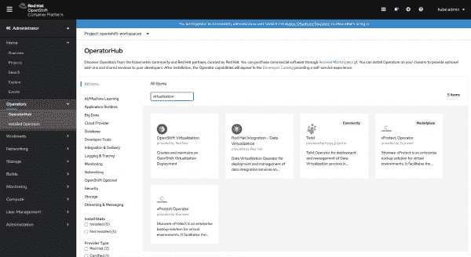](/sites/default/files/blog/2020/08/Screen-Shot-2020-09-03-at-10.16.55-PM.png)Openshift Virtualization in Operator HubFigure 2: OpenShift Virtualization in Operator Hub">

点击 **OpenShift 虚拟化**的图标。这将弹出如图 3 所示的窗口，其中包含对 OpenShift 虚拟化的简短介绍，包括它的描述、当前版本、存储库等等。点击**安装**继续。

[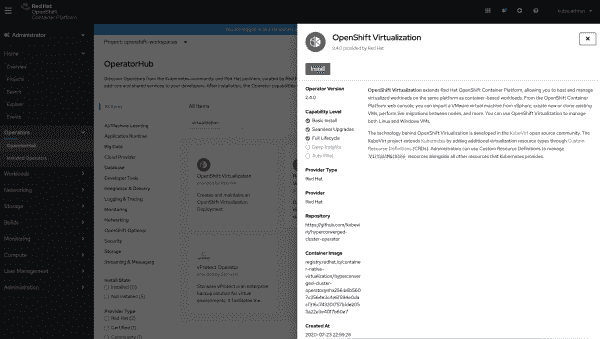](/sites/default/files/blog/2020/08/Screen-Shot-2020-09-03-at-10.18.36-PM.png)Install Openshift Virtualization with a clickFigure 3: Install OpenShift Virtualization with a click.">

如图 4 所示，下一个屏幕询问您是否想要订阅 OpenShift 虚拟化。注意，在这个屏幕上，您可以更改 OpenShift 虚拟化的版本以及您想要安装 OpenShift 虚拟化实例的名称空间/项目。如果您之前没有创建名称空间，那么将创建一个名为 **openshift-cnv** 的新名称空间，它将是您的 openshift 虚拟化部署的默认名称空间。(我没有创建新的名称空间，所以我将保持原样。)点击**订阅**继续。

[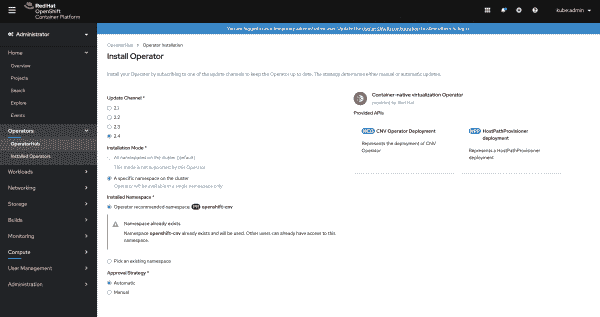](/sites/default/files/blog/2020/08/Screen-Shot-2020-09-03-at-10.21.21-PM.png)Figure 4: Configure the Openshift Virtualization installation.Figure 4: Configure the OpenShift Virtualization installation.">

### 基于操作员的安装

Red Hat OpenShift 4 使用基于操作员的安装，因此 OpenShift 虚拟化操作员收集所有资源和要求，为 OpenShift 虚拟化设置做准备。在等待这个神奇的时刻之后，您将看到 OpenShift 虚拟化操作符的安装状态变为 **Succeeded** ，如图 5 所示。

[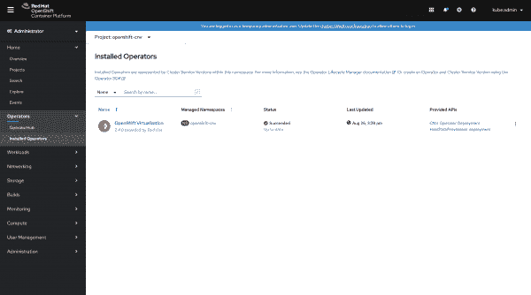](/sites/default/files/blog/2020/08/Screen-Shot-2020-09-03-at-10.23.32-PM.png)Figure 5: The Openshift Virtualization Operator installation was successful.Figure 5: The OpenShift Virtualization Operator installation was successful.">

一些 Kubernetes 和 OpenShift 操作符，如[Red Hat code ready work spaces](https://developers.redhat.com/blog/2020/06/12/how-to-install-codeready-workspaces-in-a-restricted-openshift-4-environment/)，不会立即启动部署。OpenShift 虚拟化操作员在您完成操作员订阅后立即开始部署 pod。检查**工作负载**->**pod**是在继续之前确认成功订阅的好方法，如图 6 所示。

[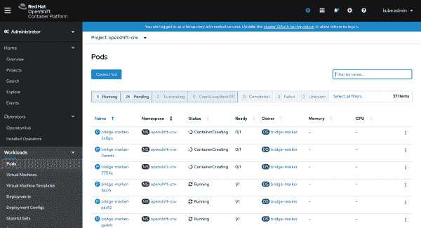](/sites/default/files/blog/2020/06/5-1.png)Few Pods will start deploying after CNV Operator subscription

Figure 6: Pods should begin deploying immediately.

## 步骤 2:创建超融合集群

在这一步中，我们将安装一个超融合集群。转述维基百科中的[:](https://en.wikipedia.org/wiki/Hyper-converged_infrastructure)

> *超融合集群包括用于虚拟化计算、软件定义的存储和虚拟化网络的虚拟机管理程序，它们通常运行在标准的现成服务器上。*

现在，让我们回到我们在 **Installed Operators** 中安装的 OpenShift 虚拟化，并点击它。您将再次看到 OpenShift 虚拟化操作符的概述，包括其提供者 API、文档链接以及您可以执行的操作。我们对 **OpenShift 虚拟化操作员部署**动作感兴趣，所以让我们单击该选项卡，如图 7 所示。

[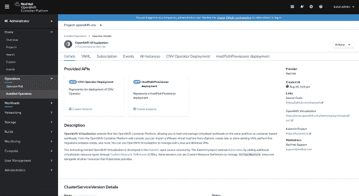](/sites/default/files/blog/2020/08/Screen-Shot-2020-09-03-at-10.25.25-PM.png)Figure 7: Inside the Openshift Virtualization overview page.Figure 7: Inside the OpenShift Virtualization overview page.">

如图 8 所示，这个屏幕上只有一个选项，所以请点击**Create HyperConverged Cluster**按钮。

[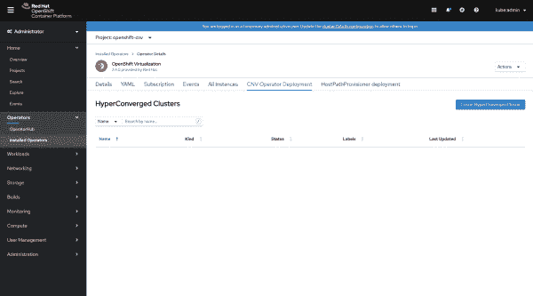](/sites/default/files/blog/2020/08/Screen-Shot-2020-09-03-at-10.26.46-PM.png)Figure 8: The Openshift Virtualization Operator deployment.Figure 8: The OpenShift Virtualization Operator deployment.">

接下来，您将看到超收敛集群的[定制资源定义](https://coreos.com/blog/custom-resource-kubernetes-v17) (CRD)文件。CRD 用自定义资源的概念扩展了 API。它是一个稳定的对象，开发人员可以用它来创建定制的控制器和操作符。对于像 OpenShift 虚拟化这样的基于 KubeVirt 的项目，CRD 是一个指导虚拟机在 Kubernetes 平台上运行的接口。

如图 9 所示，确保文件名为 **kubevirt-hyperconverged** ，然后点击 **Create** 继续。

[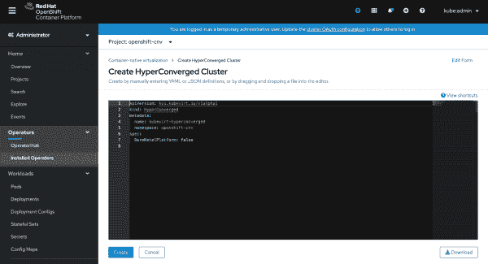](/sites/default/files/blog/2020/06/8-1.png)YAML file for CreateHyper Converged Infrastructure

Figure 9: The YAML file for creating a HyperConverged infrastructure.

创建 CRD 实际上是安装超融合集群。这还不算太糟，是吗？我们现在可以再次检查我们的吊舱，以确保一切都部署正确，没有打嗝。

[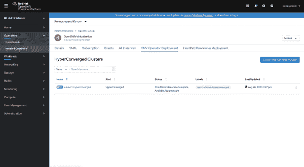](/sites/default/files/blog/2020/08/Screen-Shot-2020-09-03-at-10.28.18-PM.png)Figure 10: Confirm the HyperConverged cluster installation is complete.Figure 10: Confirm the HyperConverged cluster installation is complete.">

### 故障排除窗格

当您检查您的 pod 时，一定要监视在超融合集群安装之后可能出现的任何问题。如果您看到任何问题——例如 pod 停留在挂起状态，显示 **Err Image Pull** 状态，等等——您可以进入有问题的 pod 并查看其事件和日志，以发现问题的可能原因。如果没有问题，您的 OpenShift 虚拟化安装就完成了。

[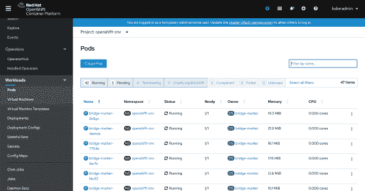](/sites/default/files/blog/2020/06/10-1.png)Check Pods again to troubleshoot any deployment issue

Figure 11: Check the pods troubleshoot deployment issues.

## 步骤 3:试用 OpenShift 虚拟化

让我们带着我们安装的 OpenShift 虚拟化操作器进行一次短途驾驶。在本文中，我不会深入探讨 OpenShift 虚拟化可以做什么，但我们至少可以启动一个虚拟机

在**工作负载**下，点击**虚拟机**。这将弹出一个屏幕，此时您只能看到一个选项，即**创建虚拟机**按钮。点击该按钮会出现一个下拉列表，其中有三个选项:**使用向导**新建、**使用向导**导入，以及**从 YAML 新建**。用向导选择**新建**选项，如图 12 所示。

[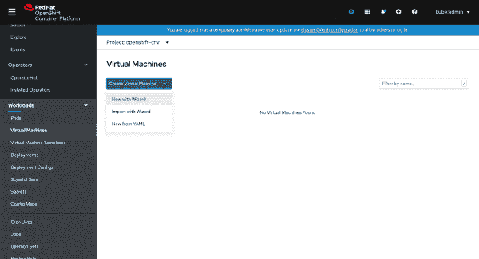](/sites/default/files/blog/2020/06/Screen-Shot-2020-06-27-at-12.16.50-AM.png)Installation Popup for CNV Operator

Figure 12: Go to Workloads, then Virtual Machines to create your first VM through OpenShift Virtualization.

万岁！您会看到一个很好的向导界面，在这里您可以在 OpenShift 中创建 VM，如图 13 所示。

[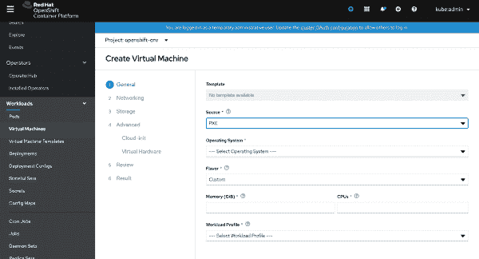](/sites/default/files/blog/2020/06/13.png)Graphic wizard to create a VM

Figure 13: The interface to create a virtual machine using Openshift Virtualization.

我将在另一篇文章中介绍 Openshift 虚拟化的功能。

## 安装 virtctl CLI

在结束本文之前，我想介绍一下 [virtctl](https://github.com/kubevirt/kubevirt/releases) ，这是 OpenShift 虚拟化的命令行实用程序，用于管理 OpenShift 虚拟化资源。虽然您可以使用 OpenShift CLI 来管理这些 OpenShift 资源，但`virtctl`允许您与 OpenShift 或 Kubernetes 集群中调配的虚拟机进行交互。

在基于 [CentOS](https://www.centos.org/) 或[Red Hat Enterprise Linux(RHEL)](https://developers.redhat.com/topics/linux)的环境中，您可以轻松使用 subscription manager 安装`virtctl`:

```
subscription-manager repos --enable {repository}

```

对存储库使用以下选项之一:

*   红帽企业版 Linux 8 资源库:`cnv-2.4-for-rhel-8-x86_64-rpms`
*   红帽企业版 Linux 7 存储库:`rhel-7-server-cnv-2.4-rpms`

### 在其他平台上安装 virtctl

如果您使用的是 RHEL 以外的操作系统，如 macOS、Windows 或另一个 Linux 平台，该怎么办？在这种情况下，您可以下载`virtctl`并将其作为可执行文件运行。

首先，从 [GitHub 发布库](https://github.com/kubevirt/kubevirt/releases)中找到您需要的`virtctl`版本，如图 14 所示。

[](/sites/default/files/blog/2020/06/Screen-Shot-2020-06-27-at-7.29.43-PM.png)Virtctl can be downloaded from its GitHub repo

Figure 14: Download virtctl from its GitHub repository.

如果您有类似于`wget`或`curl`的工具，使用以下命令使下载的包可执行:

```
$ wget -O virtctl https://github.com/kubevirt/kubevirt/releases/download/${KUBEVIRT_VERSION}/virtctl-${KUBEVIRT_VERSION}-linux-amd64

$ chmod +x virtctl

```

### macOS 安装

我用的是 MacBook Pro，所以决定手动下载`virtctl`。下载后，我将文件重命名为 **virtctl** ，并将其放在指定的目录下，如图 15 所示。

[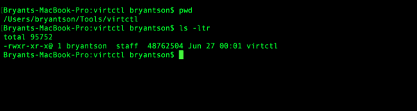](/sites/default/files/blog/2020/06/Screen-Shot-2020-06-27-at-7.37.31-PM.png)

Figure 15: Put virctl in a place where you won't forget it.

您可以通过输入命令:`chmod +x ./virtctl`使下载的文件可执行。

之后，抓取路径并在`~/.bashrc`中导出，如图 16 所示。一旦你做到了这一点，`virtctl`将随处可见，只需输入`virtctl`。

[](/sites/default/files/blog/2020/06/Screen-Shot-2020-06-27-at-7.37.52-PM.png)Add virtctl path to ~/.bashrc

Figure 16: Add the virtctl path to ~/.bashrc.

图 17 显示了当我输入`~/.bashrc`命令然后输入`virtctl`时会发生什么:

[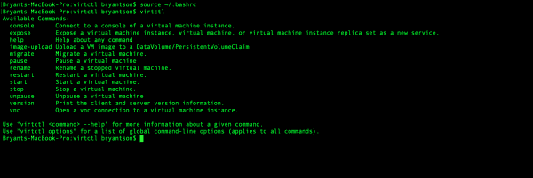](/sites/default/files/blog/2020/06/Screen-Shot-2020-06-27-at-7.39.07-PM.png)Type virtctl to execute it

## 结论

我希望这篇文章能帮助您理解什么是 OpenShift 虚拟化，以及如何为 Red Hat OpenShift 启用它。请阅读我的下一篇文章，我们将深入探讨 OpenShift 虚拟化可以做些什么。

*Last updated: September 8, 2020*