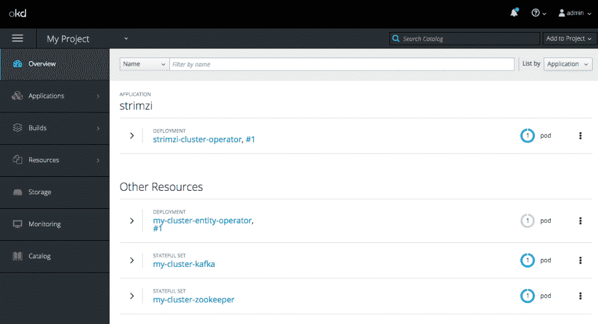
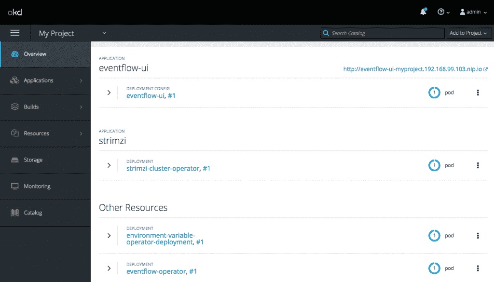
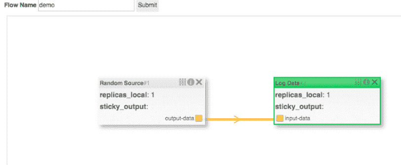
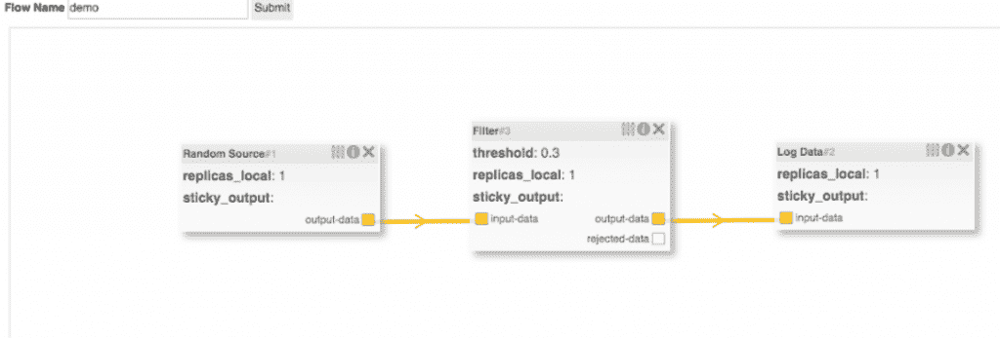

# Event flow:Red Hat open shift 上的事件驱动微服务(第 2 部分)

> 原文：<https://developers.redhat.com/blog/2019/06/05/eventflow-event-driven-microservices-on-red-hat-openshift-part-2>

在第 1 部分的[中，我介绍了使用红帽 AMQ 流开发、部署和管理事件驱动的](https://developers.redhat.com/blog/2018/10/15/eventflow-event-driven-microservices-on-openshift-part-1/)[微服务](https://developers.redhat.com/topics/microservices/)的 EventFlow 平台。这篇文章将演示如何在 [Red Hat OpenShift](https://developers.redhat.com/openshift/) 上部署 EventFlow 平台，安装一组示例处理器，并构建一个流。

## 部署 EventFlow 平台

EventFlow 平台需要 Red Hat OpenShift，这些指令已经在运行于 [Minishift](https://www.okd.io/minishift/) 1.2.5 上的 OpenShift 3.11 上进行了测试。这个帖子将使用上游 [Strimzi](http://www.strimzi.io) 项目来代替[红帽 AMQ 流](https://access.redhat.com/products/red-hat-amq#streams)，但是除了集群操作符的[安装之外，指令应该是相同的。](https://access.redhat.com/documentation/en-us/red_hat_amq/7.3/html/using_amq_streams_on_openshift_container_platform/getting-started-str#downloads-str)

### 先决条件— Minishift 和 Strimzi

一旦安装了 Minishift，第一步是使用稍微改变的默认配置启动 Minishift，增加可用的 CPU 和内存量:

```
minishift config set openshift-version v3.11.0
minishift config set memory 8GB
minishift config set cpus 4
minishift config set disk-size 50g
minishift config set image-caching true
minishift addons enable admin-user
minishift addons enable anyuid
minishift start

```

这可能需要几分钟才能开始，但一旦开始，您就可以继续配置:

```
eval $(minishift oc-env)
eval $(minishift docker-env)

```

这将在会话中设置正确的环境变量。因为 EventFlow 使用 Apache Kafka 进行通信，所以下一步是安装 Strimzi Kafka 集群:

```
oc login -u system:admin
oc apply -f https://github.com/strimzi/strimzi-kafka-operator/releases/download/0.11.3/strimzi-cluster-operator-0.11.3.yaml -n myproject

```

这一步设置了一个可以按需创建集群的操作符，因此下一步就是这样做，并创建一个带有单个 broker 实例的小型 Kafka 集群:

```
oc apply -f https://raw.githubusercontent.com/strimzi/strimzi-kafka-operator/0.11.3/examples/kafka/kafka-persistent-single.yaml -n myproject

```

在此过程中，您可以使用以下命令来监控进度:

```
oc get pods -w

```

或者使用以下方式打开控制台:

```
minishift console

```



它应该显示 Strimzi 安装正在运行。

### 安装 EventFlow 组件

EventFlow 包含许多组件，接下来必须安装这些组件。第一项是自定义资源定义(CRD)，用于表示流结构、单个处理器元素和目标部署云的表示。这是通过安装以下三个 yaml 定义来实现的:

```
oc create -f https://raw.githubusercontent.com/rh-event-flow/eventflow/master/ui/src/main/resources/processor-crd.yml
oc create -f https://raw.githubusercontent.com/rh-event-flow/eventflow/master/ui/src/main/resources/flow-crd.yml
oc create -f https://raw.githubusercontent.com/rh-event-flow/eventflow/master/ui/src/main/resources/cloud-crd.yml

```

完成后，安装的下一步是授予 EventFlow 操作员监视定制资源的权限:

```
oc adm policy add-cluster-role-to-user cluster-admin system:serviceaccount:myproject:default

```

最后，需要部署和配置 EventFlow 操作符、用户界面和环境变量操作符:

```
https://raw.githubusercontent.com/rh-event-flow/eventflow/master/yaml/00-deploy-components.yaml.txt

```



### 部署示例微服务

在这个概念验证中，有几个示例处理器可供使用；这些都是 DockerHub 中的容器，可以通过运行以下命令来注册:

```
oc create -f https://raw.githubusercontent.com/rh-event-flow/eventflow-processor-samples/master/data-source/src/main/resources/source-cr.yml
oc create -f https://raw.githubusercontent.com/rh-event-flow/eventflow-processor-samples/master/data-processor/src/main/resources/processor-cr.yml
oc create -f https://raw.githubusercontent.com/rh-event-flow/eventflow-processor-samples/master/data-sink/src/main/resources/sink-cr.yml

```

这将在描述流处理器的 Red Hat OpenShift 中注册许多自定义资源。`Processor`自定义资源用于描述服务提供给流程的接口。可以定义用户可编辑的参数以及处理器的输入和输出数量。一个流可以包含三种类型的处理器(生产者、消费者和处理器),示例中每种类型都包含一个。样本的来源可以从[https://github . com/RH-event-flow/event flow-processor-samples](https://github.com/project-streamzi/eventflow-processor-samples)下载。

### 构建微服务

到目前为止，我们已经展示了如何安装必要的组件和注册一组示例微服务。完成后，可以使用 EventFlow UI 将微服务集成到流中。

EventFlow 的安装脚本将为管理器 UI 公开一个 OpenShift 路由。要确定流管理器的 URL，请检查 OpenShift 路由的`HOST/PORT`部分:

```
oc get route eventflow-ui

```

从流管理器 UI 中，可以创建和编辑流。示例处理器将包括一个`source`，它将生成随机的`double`和一个`sink`，将数据记录到控制台。右键单击画布，添加这两个处理器，并将它们连接在一起。然后，给这个流一个惟一的名称，并点击*提交*按钮。这将部署您的流。



重新访问 Red Hat OpenShift 控制台，您将看到容器正在运行。`flow`实际上并不存在，但是已经部署了一组微服务，创建了 Apache Kafka 主题，并且这些服务将被配置为通过这些主题进行通信。`-logdata-XXX`容器的日志将显示收到的消息。

EventFlow 平台组件之一——flow operator——监视流并在流发生变化时做出反应。如果流被重新配置(例如，过滤处理器被添加到数据源和日志数据微服务之间的流)，则 FlowOperator 将检测到这种变化并做出相应的响应。在这种情况下，过滤器的新微服务将被实例化，这将使用来自数据源的消息。日志数据微服务将被重新配置为使用过滤器的输出，而不是原始数据源。FlowOperator 只重新配置流中已经改变的部分；因此，随机数据微服务将保持不变。

事件驱动的微服务的动态重新配置是一个强有力的工具。不仅可以将新的微服务引入到正在运行的流程中，还可以编辑应用程序设置(例如，更改过滤器上的阈值，仅重新部署该容器)，并且可以修改非功能属性(例如，每个容器的副本数量)。

随着时间的推移，更多的运行时设置将暴露给流接口，包括自动缩放属性、监控和指标，以及由于通信是通过 Apache Kafka 完成的，新处理器是否应该从偏移量开始消耗(本主题的“开始”)。这最后一点允许重新配置流，然后表现得(一旦它赶上了)好像新版本已经被最初部署了一样。



因为流被表示为 Kubernetes 定制资源，所以它们被集成到 Red Hat OpenShift API 中。可以从命令行创建、列出和删除它们——以拆除流程运行`$ oc delete flow demo`。处理器也可以这样交互，比如`$ oc get processors`。

创建流的抽象表示并利用操作符在容器平台中部署它的一个优点是，可以在不同的中间件技术上支持相同的流结构。本系列的第 3 部分将详细探讨这一点，并在 Knative 上演示 EventFlow 概念的重新实现，kna tive 是最近发布的云原生服务和事件项目，旨在原生工作在 Kubernetes 和 Red Hat Openshift 中。

### 了解更多信息

*   [红帽 AMQ 溪流](https://access.redhat.com/documentation/en-us/red_hat_amq/7.3/html/using_amq_streams_on_openshift_container_platform/overview-str)
*   [事件流](https://github.com/rh-event-flow/eventflow)
*   [条纹图](https://strimzi.io/)

*Last updated: September 3, 2019*