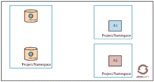
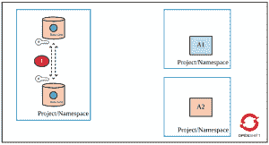
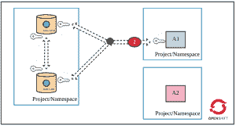
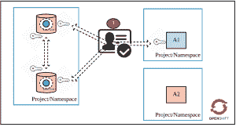
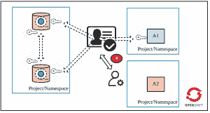
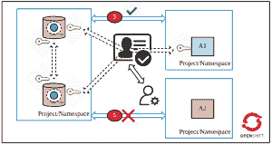

# OpenShift 上红帽数据网格的五层安全

> 原文：<https://developers.redhat.com/blog/2019/03/25/five-layers-of-security-for-red-hat-data-grid-on-openshift>

[Red Hat Data Grid](https://developers.redhat.com/products/datagrid/overview) 是一款内存分布式 NoSQL 数据存储解决方案。有了它，您的应用程序可以以内存速度访问、处理和分析数据，从而提供卓越的用户体验。内存数据网格在当今环境中有多种使用案例，例如低延迟应用程序的快速数据访问、在数据存储中存储对象(NoSQL)、通过数据分布/分区实现线性可伸缩性以及跨地理位置的数据高可用性等。随着[容器](https://developers.redhat.com/topics/containers)越来越受到关注，让数据网格在像 [OpenShift](http://openshift.com/) 这样的容器平台上运行的需求变得明显，我们看到越来越多的客户将他们的架构与在容器平台上本地运行的数据存储结合起来。

在本文中，我将讨论在 OpenShift 上部署数据网格时可用的多层安全性。安全层提供了由数据网格和 OpenShift/ [Kubernetes](https://developers.redhat.com/topics/kubernetes/) 提供的安全措施的组合。

Red Hat 团队通过公开多个开箱即用的 OpenShift 模板，使得数据网格的部署变得非常容易。你可以在 GitHub 中看到各种可用的选择[。这些模板使用相同的底层图像，可从](https://github.com/jboss-openshift/application-templates/tree/master/datagrid)[红帽容器图像门户](https://access.redhat.com/containers/?tab=tags#/registry.access.redhat.com/jboss-datagrid-7/datagrid73-openshift)获得。不同的模板公开了在部署时配置数据网格的不同参数。这使得部署非常标准和容易。“HTTPS 模板”暴露了一堆安全参数。其他模板不定义这些参数；但是，您可以在部署时使用这些参数。

如果你想实践以下建议(除了第 5 条)，请在 GitHub 上查看 OpenShift 上的 [JDG 和启用飞车手罗德和安全的](https://github.com/kgshukla/jboss-datagrid-ocp-hotrod-secure/)。在那里，您可以找到代码片段和命令。

## 在 OpenShift 上保护数据网格部署

为了理解这五层安全性，让我们假设在 OpenShift 中满足以下要求(如图所示):

1.  数据网格以集群模式部署。
2.  仅允许应用 1 (A1)访问数据网格(通过飞车手罗德)。
3.  数据网格中声明了缓存。
4.  应用和数据网格部署在不同的项目/名称空间中(它们也可以部署在同一个项目中)。

### 第 1 层:集群中数据网格单元之间的加密通信

在集群模式下，您需要数据网格单元来安全地相互通信。当 A1 访问数据网格时，定位密钥的请求可以到达集群中的任何 pod。如果该 pod 不持有密钥，则请求将被转移到持有密钥的另一个 pod。此外，数据网格集群中的任何新 pod 都应该首先进行身份验证，然后加入集群，这一点很重要。否则，您会在数据网格集群部署中留下安全漏洞。

因此，第一层安全要求数据网格单元在加入集群之前进行身份验证，并安全地相互通信。参见[加密集群服务器之间的流量](https://access.redhat.com/documentation/en-us/red_hat_data_grid/7.2/html/data_grid_for_openshift/os_traffic#encrypting_traffic_between_clustered_servers)了解更多关于您可以选择的不同加密类型(SYM 或 ASYM)。

要实现加密，您必须创建一个密钥库来保存证书(自签名或 CA 授权)。在 OpenShift 中将密钥库文件作为秘密对象上传。然后，您应该在部署 HTTPS 数据网格模板时设置以下参数:

*   `JGROUPS_ENCRYPT_NAME`:密钥库别名
*   `JGROUPS_ENCRYPT_SECRET`:保存密钥的 OpenShift 秘密对象名
*   `JGROUPS_ENCRYPT_KEYSTORE`:保存密钥库值的秘密对象中的密钥的名称
*   `JGROUPS_ENCRYPT_PASSWORD`:访问密钥库的密码

HTTPS 模板自动生成认证凭证，并将它们存储在`JGROUPS_CLUSTER_PASSWORD`参数中。Pods 在加入集群时使用该参数值进行身份验证。当然，您可以在部署数据网格集群时覆盖这个参数。

### 第 2 层:应用程序和数据网格集群之间的加密通信

客户机和数据网格集群之间的加密通信是下一个建议。这很重要，因为如果存在安全漏洞，流量可能会被拦截。有几种方法可以访问数据网格集群:

*   从 OpenShift 中运行的应用程序
*   来自运行在数据网格之外的应用

在第一个场景中，应用程序通过 OpenShift 的服务对象直接访问数据网格，因此，需要以一种将服务 URL 公开为启用加密的“公开”URL 的方式来部署数据网格。(注意，访问数据网格有多种方式，即 REST 和飞车手罗德)。在第二个场景中，OpenShift 操作符应该在数据网格 route 对象中进行更改，该对象只是通过 OpenShift 路由器上的流量。流量解密将发生在数据网格集群上。下图描述了第二个安全要求。(大多数情况下，您会*而不是*希望为任何在 OpenShift 之外运行的应用程序提供对数据网格的直接访问)。参见[加密客户端到服务器的通信](https://access.redhat.com/documentation/en-us/red_hat_data_grid/7.2/html/data_grid_for_openshift/os_traffic#encrypting_client_to_server_communication)以了解更多关于此安全建议的信息。

在这个场景中，同样需要使用证书和密钥库密码来创建密钥库。创建密钥库，并在 OpenShift 中将它作为秘密对象上传。部署 HTTPS 数据网格模板时，设置以下参数:

*   `HOTROD_SERVICE_NAME` : OpesnSift 的服务对象名称
*   `HOTROD_ENCRYPTION`:设定为`true`
*   `HTTPS_NAME`:密钥库别名
*   `HTTPS_SECRET`:保存密钥库文件的 OpenShift 秘密对象名
*   `HTTPS_KEYSTORE`:secret 对象中密钥的名称，其值为 keystore
*   `HTTPS_PASSWORD`:打开密钥库的密码

### 第 3 层:缓存验证

既然流量已经加密，下一个安全建议是在客户端应用程序试图访问数据网格集群中的缓存时对其进行身份验证。下图强调了这一要求。

在部署期间设置`USERNAME`和`PASSWORD`参数(在 HTTPS 模板中定义)。

### 第 4 层:缓存授权

客户端应用程序现在可以针对数据网格集群进行身份验证，但是您还需要定义客户端可以在缓存上执行的操作。RBAC 控制将帮助您实现这一目标。在数据网格部署期间，您可以定义自定义角色并为其分配权限。您还可以将自定义角色与缓存进行映射(在部署数据网格集群时，您可以创建多个缓存)。在数据网格中有许多定义授权的方法。参见 [Red Hat JBoss 数据网格安全:授权和认证](https://access.redhat.com/documentation/en-us/red_hat_data_grid/7.2/html/administration_and_configuration_guide/red_hat_jboss_data_grid_security_authorization_and_authentication#red_hat_jboss_data_grid_security_authorization_and_authentication_2)了解更多信息。

在 HTTPS 模板部署期间设置以下参数:

*   `ADMIN_GROUP`:自定义角色的名称
*   `CONTAINER_SECURITY_ROLES`:具有一个或多个缓存权限的已定义角色的定义
*   `<CACHE_NAME>_CACHE_SECURITY_AUTHORIZATION_ENABLED`:设置为`true`，在`<CACHE_NAME>`上启用授权
*   `<CACHE_NAME>_CACHE_SECURITY_AUTHORIZATION_ROLES`:将`<CACHE_NAME>`分配给之前定义的自定义角色

### 第 5 层:使用 OpenShift 的网络策略来限制应用程序之间的流量

现在，您的数据网格集群已经正确地设置好了:集群的所有单元都安全地进行了通信，客户机也安全地与数据网格进行了通信，并且为访问缓存设置了正确的身份验证和授权。但是，我建议您通过 OpenShift 的 [NetworkPolicy](https://docs.openshift.com/container-platform/3.11/admin_guide/managing_networking.html#admin-guide-networking-networkpolicy) 对象(或 Istio)进一步加强数据网格的安全性。网络策略是限制应用程序之间通信的功能。您可以声明性地定义这些规则，并将这些规则与数据网格一起部署在 OpenShift 集群中。在我们的场景中，我们只希望 app1 访问数据网格集群。所以，这是最后的安全措施:

## 结论

在容器平台中部署数据库/缓存时应该小心，因为该平台是多租户的，您的数据存储可能存储敏感信息。如果你想实践这些建议(除了上面的第 5 条)，请在 GitHub 上查看 Openshift 上的“ [JDG 和启用飞车手罗德和安全的](https://github.com/kgshukla/jboss-datagrid-ocp-hotrod-secure/)。在那里，您可以找到在 OpenShift 上安全部署数据网格的代码片段和命令。

*Last updated: September 3, 2019*