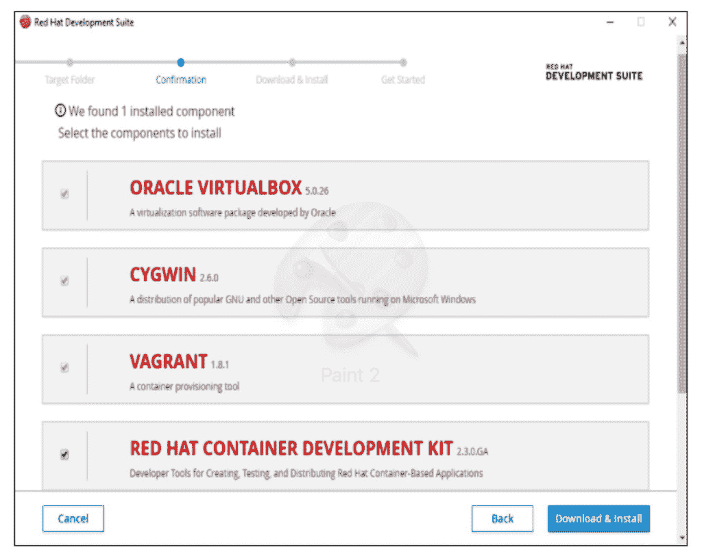

# 五分钟五个 OpenShift 开发环境

> 原文：<https://developers.redhat.com/blog/2017/07/11/five-openshift-development-environments-in-five-minutes>

距离我在红帽峰会上的演讲已经过去了一个多月，现在尘埃落定，我想你可能会有兴趣阅读我的 五分钟内关于五个 OpenShift 开发环境的闪电演讲的简要总结。

在演讲中，我谈到了五种不同的方法，可以在几分钟内创建一个 OpenShift 开发环境。这包括 oc cluster up、全包式漫游、Minishift、Fabric8 技术和 Red Hat 开发套件。我做这个演示的目的是让开发人员快速上手使用 OpenShift。

**oc 集群上升**

这是 OpenShift Origin 3.3+和 Red Hat OpenShift Container Platform 3.3+中包含的，允许您在容器化的环境中创建 open shift 容器平台环境。它实际上是在一个容器中创建一个容器化的平台。它有很大的灵活性，可以在 Windows、Linux 和 macOS 上运行。

这是我们这里唯一允许你同时使用 Origin 和 Red Hat Enterprise 的选项，Origin 是 OpenShift 的上游版本。这非常简单，运行它所需要的只是 Docker 和 OpenShift 客户端工具(oc)。如果您已经安装了这些，这是一个简单的 oc cluster up 命令，您就有了一个可以开始运行的环境。

`$ oc cluster up --use-existing-config \`
`--host-data-dir=/usr/data \`
`--metrics=true \`
`--image=registry.access.redhat.com/openshift3/ose \`

**流浪一体机**

这是一个虚拟机，由 OpenShift 社区使用 vagger 创建。流浪者的一个工具，建立和管理虚拟机。这是一个非常受欢迎的项目，也是能够为 OpenShift 创建这些开发环境的最初项目之一。如果你有一个流浪的环境，这仍然是非常有效的方法。然而，社区现在正在转向，一语双关，转向 Minishift，我们接下来会谈到。

如果用户真的想用游民，这还是一个有效的方法。必须明白，这个特定的流浪者盒子将停留在 3.3 版本。不打算升级了，但是还有其他的流浪箱可以用。

`$ vagrant init openshift/origin-all-in-one`

**微移**

这获得了很多关注，也是社区的发展方向。不管你是 Windows、Linux 还是 Mac。与使用容器的 oc cluster up 不同，该工具使用 virtualbox、kvm、xhyve 或 Hyper-V 等驱动程序，通过虚拟机中的单节点 OpenShift 集群在本地运行 OpenShift。许多人发现了 Minishift 的价值，因为它提供了定制设置的参数，如磁盘大小、cpu 和内存。

`$ minishift start --cpus=2 --disk-size=20g --memory=2048`

**Fabric8 Maven 插件**

这是一个开源微服务平台，利用 Docker，Jenkins 和 OpenShift，Kubernetes。事实上，通过这种微服务类型的框架，您可以轻松创建自己的 OpenShift 环境。我特意调用了这个 Maven 插件，主要是因为我想展示在 Maven 项目中运行 OpenShift 是很容易的。反过来，这在幕后调用 Minishift。您还可以在 Maven 环境中获得 Minishift 的所有功能。

`$ mvn fabric8:cluster-start -Dfabric8.cluster.kind=openshift`

**红帽开发套件**

Red Hat Development Suite 是通过 Red Hat Developer subscription 提供的产品，对开发者是免费的，目前仅适用于 Windows 和 Macintosh。我提到了 RH 开发套件，因为它有一个非常简单的安装程序，允许你选择所有你系统中没有安装的组件，并为你配置一切。几分钟之内，您就有了 VirtualBox、vaggers 和 Red Hat Container 开发工具包，它们都已安装完毕，您可以开始将其用作 OpenShift 环境了。

如果您使用的是 Linux，您仍然可以通过使用 Red Hat 容器开发工具包获得相同的功能，只是没有安装程序。

我以一个我最喜欢的选项的演示来结束我的演讲， **oc cluster up** ，它需要很少的前期准备，在容器化的环境中运行，并允许使用 OpenShift 容器平台。

* * *

**利用您的红帽开发者会员资格和** [**免费下载 RHEL**](http://developers.redhat.com/products/rhel/download/) **。**

*Last updated: July 10, 2017*