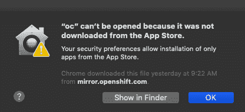
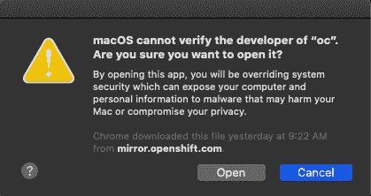

# 修复 macOS 上的 oc 和 Red Hat OpenShift 安装“未下载”错误

> 原文：<https://developers.redhat.com/blog/2019/11/20/fixing-the-oc-and-red-hat-openshift-install-not-downloaded-error-on-macos>

我最近决定用我的 macOS 机器创建一个 Red Hat OpenShift 集群。然而，在下载并运行了`openshift-install`命令行工具后，我收到了以下错误:

(是的，我知道上面的错误与`oc`命令有关，但它也抛出了错误，并且，在我修复了`openshift-install`命令之后，我无法“取消修复”它。)

## 内部谈话

这个错误是由 MAC OS“gate keeper”子系统抛出的，该子系统检查以确保可执行文件经过了构建器的公证。任何从应用商店下载的应用程序都必须首先经过公证。不通过应用商店安装的应用程序可能仍然需要开发者的公证——这是他们的选择。然而，未公证的申请将抛出这个错误，你被停止。

## 答案

答案很简单:在 Finder 中找到应用，右键点击，选择打开，会显示一个这样的对话框:

只需点击“打开”按钮，该应用程序将被视为安全。现在，您可以从命令行毫无问题地执行它。

*Last updated: July 1, 2020*