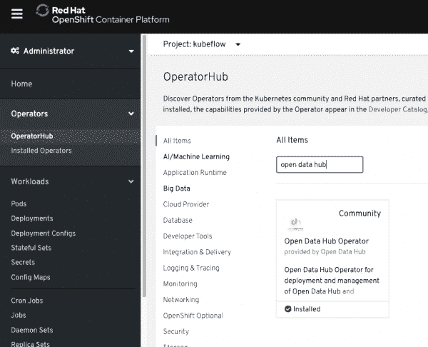
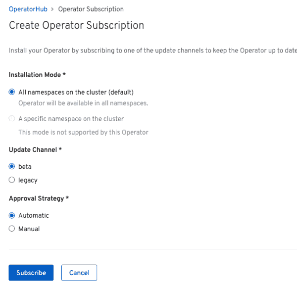
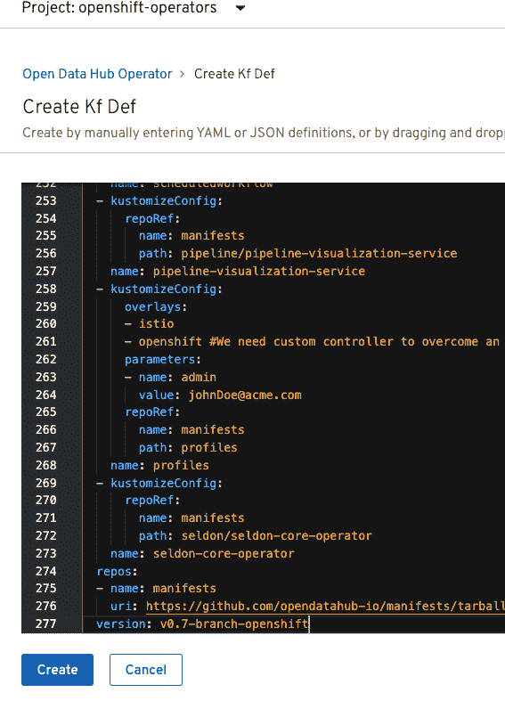
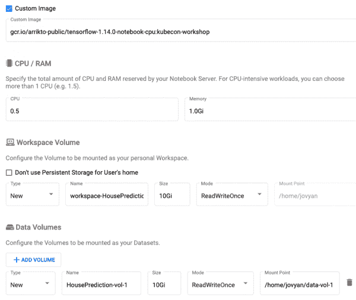
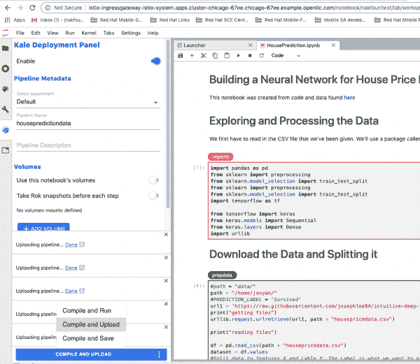
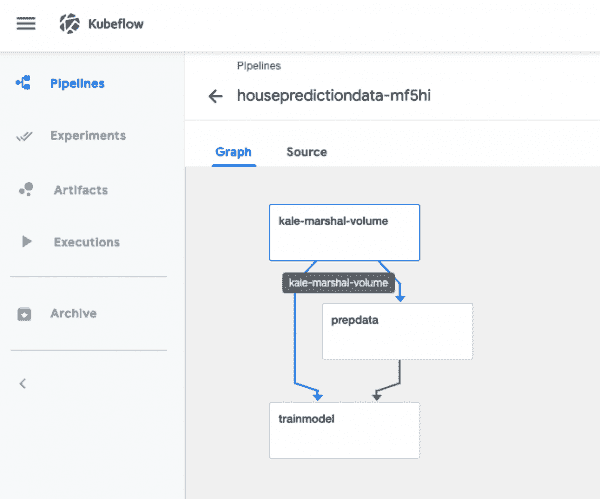
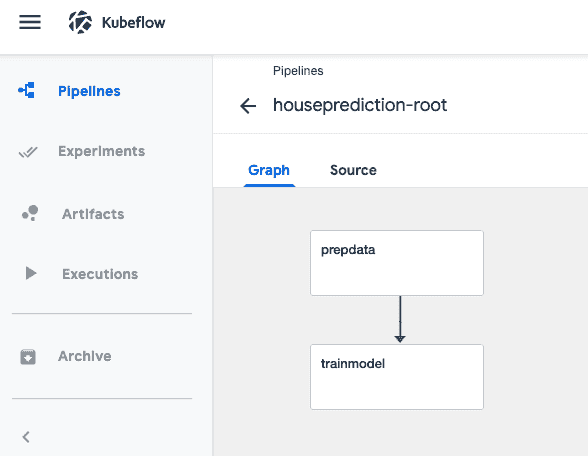

# 从笔记本到管道:在 OpenShift 上使用开放数据中心和 Kubeflow

> 原文：<https://developers.redhat.com/blog/2020/07/29/from-notebooks-to-pipelines-using-open-data-hub-and-kubeflow-on-openshift>

数据科学家经常使用笔记本来探索数据，并创建和试验模型。在这个探索阶段的最后是产品交付阶段，基本上就是将最终模型投入生产。然而，为生产中的模型服务不是一步到位的最终过程。这是一个培训、开发和数据监控的连续阶段，最好使用管道来捕获或自动化。这给我们带来了一个难题:如何将代码从笔记本移动到管道中编排的容器，并安排管道在特定的触发条件(如时间、新的批处理数据和监控指标)后运行？

如今，有多种工具和提议的方法可以将代码从笔记本转移到管道。例如，工具 [nachlass](https://github.com/nachlass-tools/nachlass) 使用源到图像(S2I)方法将笔记本最终转换为容器。在这篇文章和我最初的开发演示中的[，我们探索了一个新的 Kubeflow 提议的工具:Kale。Kale 是一个](https://developers.redhat.com/devnation/tech-talks/kubeflow-kubernetes/?sc_cid=7013a000002gW1BAAU) [Kubeflow](https://developers.redhat.com/blog/2020/02/10/installing-kubeflow-v0-7-on-openshift-4-2/) 扩展，集成了 [JupyterLab](https://jupyterlab.readthedocs.io/en/stable/) 的用户界面(UI)。它为数据科学家提供了一种 UI 驱动的方式，将笔记本电脑转换为 Kubeflow 管道，并在实验中运行管道。

我们在 [Red Hat OpenShift](https://developers.redhat.com/products/openshift/overview) 上运行这些工具作为开放数据中心安装的一部分。Open Data Hub 由多个开源工具组成，这些工具打包在 ODH Operator 中。当您安装 ODH 时，您可以指定要安装的工具，如 Airflow、Argo、Seldon、Jupyterhub 和 Spark。

## 先决条件

要运行此演示，您需要使用集群管理权限访问 OpenShift 4.x 集群，以安装集群范围的 Open Data Hub Operator。

## 在 OpenShift 上安装 Kubeflow

我们可以使用 Open Data Hub Operator 在 OpenShift 上安装 Kubeflow。从 OpenShift 门户进入 OperatorHub，搜索 **Open Data Hub** ，如图 1 所示。

Figure 1: Installing Open Data Hub from the OpenShift OperatorHub.

点击**安装**，进入下一屏。目前，Open Data Hub 提供两种安装渠道:beta 和 legacy。测试通道是针对新的开放数据中心版本，包括 Kubeflow。保持该频道的默认设置，点击**订阅**，如图 2 所示。

Figure 2: Create a subscription to the Open Data Hub Operator using the beta update channel.

在您订阅之后，Open Data Hub Operator 将被安装在`openshift-operators`名称空间中，在集群范围内可用。

接下来，创建一个名为`kubeflow`的新名称空间。从那里，转到 **Installed Operators** ，点击 Open Data Hub Operator，并创建一个新的`kfdef`资源实例。默认情况下是一个示例`kfdef`实例(一个 YAML 文件)，它安装了开放数据中心组件，如 Prometheus、Grafana、JupyterHub、Argo 和 Seldon。要安装 Kubeflow，您需要用 Kubeflow 中的实例替换示例`kfdef`实例。用这个替换示例文件[，然后点击**创建**。您将看到如图 3 所示的文件。](https://raw.githubusercontent.com/opendatahub-io/manifests/v0.7-branch-openshift/kfdef/kfctl_openshift_apiv1.yaml)

Figure 3: Create the kfdef resource for Kubeflow.

这就是在 OpenShift 上安装 Kubeflow 所需要的全部内容。观察命名空间中的 pod 安装，并等到所有的 pod 都在运行，然后再开始下一步

## 笔记本电脑即将上市

安装成功完成后，下一步是在您的开发命名空间中创建一个笔记本服务器，然后创建一个包含创建和验证模型任务的笔记本。要访问 Kubeflow 门户，请前往 **istio-system** 名称空间，然后点击**istio-Ingres gateway**路线。这条路线将您带到主 Kubeflow 门户，在这里您必须创建一个新的概要文件和一个工作名称空间。从主菜单左侧的菜单栏，前往**笔记本服务器**，点击**新服务器**。将打开一个新表单，您可以在其中创建一个笔记本服务器来托管您的笔记本。确保在下拉菜单中选择了您刚刚创建的名称空间。

在这个表单中，您必须指定一个包含羽衣甘蓝组件的自定义图像。指定自定义镜像:**gcr . io/arrikto-public/tensor flow-1 . 14 . 0-notebook-CPU:kube con-workshop**。

添加新的数据卷，如图 4 所示，然后点击 **Launch** 。

Figure 4: Launching a new notebook server.

准备就绪后，您可以连接到刚刚创建的笔记本服务器。新的笔记本服务器让你进入主 JupyterLab 门户，其中包括 Kubeflow 的 Kale 扩展。

## 笔记本示例

我们将基于[这个例子](https://github.com/josephlee94/intuitive-deep-learning)使用一个非常简单的笔记本。笔记本预测房屋价值是低于还是高于平均水平。在本次演示中，我们简化了笔记本电脑，并为流水线做好了准备。你可以[从 GitHub](https://github.com/nakfour/DevnationJune202) 下载转换后的笔记本。

该笔记本中的任务包括下载房屋预测数据、准备数据以及创建一个具有三层的神经网络，该网络可以预测给定房屋的价值。此时，示例笔记本看起来像一个普通的笔记本，您可以运行单元以确保它们正在工作。

要在笔记本中启用 Kale，点击左侧菜单栏上的 Kubeflow 图标，然后点击**启用**。您应该会看到类似于图 5 中的截图。

Figure 5: Click the Kubeflow icon on the left-side menu bar and enable Kale.

您可以通过点击每个单元格右上角的**编辑**按钮来指定每个单元格的角色。如图 5 所示，我们有一个**导入**部分和一个 **prepdata** 管道步骤，以及一个依赖于 **prepdata** 步骤的 **trainmodel** 管道步骤(未显示)。命名实验和管道，然后点击**编译并上传**。

现在，我们将只创建管道，并推迟到以后运行它。当你得到一个**ok**消息时，前往主 Kubeflow 门户，选择**管道**。列出的第一个管道是 Kale 生成的管道。如果您点击它，您应该看到如图 6 所示的管道细节。

Figure 6: Exploring the Kale-generated pipeline.

## 调整管道

您可以研究代码并查看管道中的不同步骤。这是一个生成的管道，假设底层 Argo 使用 docker 容器。因此，这个管道不会在 OpenShift 上运行，open shift 使用 CRI-O 容器引擎和 Argo 的`k8sapi`执行器。

另外，请注意，用于每个步骤的容器映像需要 root 权限，因此我们必须为运行工作流的服务帐户授予 root 权限(`oc adm policy add-role-to-user admin system:serviceaccount:namespace:default-editor`)。显然，这种在 OpenShift 上运行容器的方法是不推荐的。将来，我们希望改变容器，使其不需要 root 权限。

您可以[从 GitHub 下载调整后的管道和一个卷 YAML 资源](https://github.com/nakfour/DevnationJune202)。在上传和运行调整后的管道之前创建卷，如图 7 所示。

**注意**:这种调整不会改变容器本身。相反，更改了管道结构、权限和添加的卷。

Figure 7: The adjusted pipeline.

## 结论

在本文中，您了解了如何使用 Open Data Hub 操作符在 OpenShift 上安装 Kubeflow，并且我们探索了使用 Kubeflow 的 Kale 扩展将笔记本转换为管道。将代码从笔记本移动到管道是人工智能和机器学习(AI/ML)端到端工作流中的关键一步，有多种技术可以解决这个问题。虽然这些转换工具可能还不成熟，还在开发中，但我们看到了巨大的潜力和改进空间。请加入我们的[开放数据中心社区](https://opendatahub.io/community.html)，为在 OpenShift 上开发 AI/ML 端到端技术做出贡献。

*Last updated: July 27, 2020*