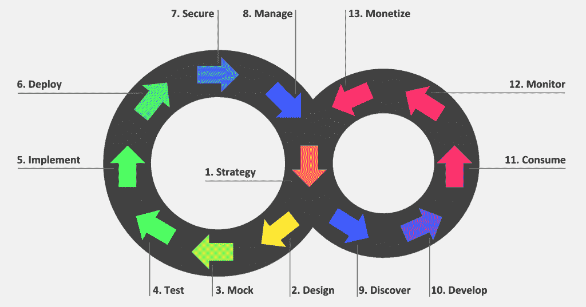

# 完整的 API 生命周期管理:入门

> 原文：<https://developers.redhat.com/blog/2019/02/25/full-api-lifecycle-management-a-primer>

API 是最近许多突破的基石:从移动应用程序到物联网，再到云计算。所有这些技术都公开、使用 API，并建立在 API 之上。这些 API 是创造新收入的关键驱动力。Salesforce 的收入来自 API，Expedia,易贝 60%。随着 API 变得如此重要，处理完整的 API 生命周期管理变得至关重要。您的数字化转型项目能否成功取决于此！

本文描述了一组完整的 API 生命周期管理活动，可以指导您从想法到实现，从 API 程序的开始到整个公司的大规模管理。

如下所示，API 的生命周期是双重的。最左边的循环包括生产者活动，而最右边的循环包括消费者活动。

## 你的 API 的目标是什么？

任何 API 程序都必须从一个**策略**阶段开始，在这个阶段你必须定义你想用 API 实现的目标。它还规定了你需要进入哪些市场，你拥有哪些资源，你实现目标的时间框架等等。这是帮助你把精力放在最重要的地方的关键一步。

**设计**阶段将确保您的组织使用契约优先的方法。这个阶段需要尽早收集反馈，打破项目之间的依赖关系，并降低风险。此外，众所周知，合同优先的方法可以缩短上市时间。

在**设计**阶段，你设计你的 API 的契约，并与你未来的消费者分享。**设计**阶段的结果是一个 API 契约，它描述了可以与您的 API 交换的消息。

## 指定您的 API

在**模拟**阶段，您将[定义您的 API](https://developers.redhat.com/blog/2018/04/11/api-journey-idea-deployment-agile-part1/)的有意义的有效负载示例，并尝试根据常见和边缘情况的业务预期来细化您的规范。这些例子然后被转化成一个真实的模拟，可以暴露给你的第一批消费者。“业务期望”包含了所有不能用正式模式描述的东西。例如，当按状态查询项目时，所有返回的项目都必须具有所需的状态。您还可以考虑字段之间的互斥选项或依赖关系:例如，如果设置了字段 companyName，则字段 accountType 需要为“enterprise”

在[验收测试驱动的开发](https://en.wikipedia.org/wiki/Acceptance_test%E2%80%93driven_development)方法中，在实现你的 API 之前，你必须[基于例子定义你的测试用例。这将有助于提炼关于你的 API 的商业期望；在开发人员、测试人员和商业客户之间共享它们；然后确保您的 API 符合这些期望。](https://developers.redhat.com/blog/2018/04/19/api-journey-idea-deployment-agile-way-part2/)

这里有一个例子可以突出**模拟**和**测试**阶段的重要性。如果你是一家零售公司，如果 21 岁以下的人试图购买酒，你将不得不返回一个错误。这不是你可以在 API 契约中正式建模的东西，但是它会反映在你的模拟和测试中。

## 开发和部署您的 API

然后，在**实现**阶段，实际的 API 是用[红帽 Fuse](https://developers.redhat.com/products/fuse/overview/) 之类的集成框架或者你选择的开发语言**开发的**。使用集成框架应该是 API 生命周期的关键部分，以促进重用、快速迭代和通过编排增加价值。它还有助于使信息系统的现有部分现代化。通常的敏捷开发实践在这里适用。

在**部署**阶段，您将确保您拥有一个持续集成/持续部署(CI/CD)管道，该管道可以自动将您的 API 交付到生产环境中。CI/CD 管道重用您之前定义的测试，以确保要部署的 API 不违反您的规范。这些集成测试是自动化的，并作为流水线的一部分自动运行。

自动化集成测试还应该确保 API 的向后兼容性。如果发布了 API 的 1.2 版本，它必须向后兼容 1.x 分支的任何版本(1.0、1.1 等等)。

**安全**阶段提醒我们安全性是 API 生命周期中的关键一步。自动化的安全测试，比如静态分析或者漏洞测试，应该是你的 CD 管道的一部分。安全开发实践，如代码审查、安全开发生命周期或 OWASP Top 10，也应该是您开发生命周期的一部分。

在**管理**阶段，在部署和保护 API 之后，需要对它们进行管理。此活动包括版本控制、弃用和淘汰。作为最佳实践，版本控制应该遵循[语义版本控制](https://semver.org/)方案。这意味着当它被部署时，API 的任何新的次要版本都会替换先前的版本。所有使用先前版本的消费者现在都在使用最新版本。当重大变更发生时，主版本会与前一个版本一起发布和部署。消费者可以从以前的版本迁移到当前版本。他们按照自己的速度进行迁移，让代码适应新版本。

完整 API 生命周期管理的生产者周期到此结束，我们现在可以谈论消费者周期了。

## 推广你的 API

当您的 API 被部署到生产环境中并且它们是“活动的”时，您就进入了**发现**阶段。在这个阶段，你需要帮助你的合作伙伴和其他第三方发现你的 API。就像你的公司网站是你的产品和服务的陈列室一样，API 开发者门户是你的 API 的陈列室。如果你想通过 API 增加收入，请确保你对这个展厅的投入和对公司网站的投入一样多！

在**开发**阶段，第三方将开始发现您的 API 并基于您的 API 开发应用程序。这些应用程序的用户体验不仅取决于 API 的质量，还取决于客户端应用程序。确保你为开发者提供了足够的资源来充分利用你的 API。这些资源可以是最佳实践、关于如何处理安全性和错误重试的信息等等。

在**消费**阶段，客户端应用程序将开始消费您的 API，您可能希望制定阶段性计划来满足它们不断增长的消费需求。为了确保高质量的用户体验，您可能还希望建立一个应用程序验证过程来访问您的生产 API——当然，如果这是您的 API 策略的一部分的话。

## 提炼你的 API

在你的第一个版本发布后，你将需要准备下一个版本和下一个版本。这就需要你建立一种反馈回路，知道接下来要改进什么。这是**监控**阶段。

为了在你的反馈循环中获得准确的数据，你必须监控你的 API 的各个方面。这包括从开发者参与到 API 健康，到 API 使用等等。“世界，你好！”是一个有用的衡量标准，可以用来了解您的 API 是否足够简单，可以让新开发人员很快学会。

随着您的 API 的成熟，您的业务模型也在成熟。在某些时候，您可能会对根据您的消费者对您的 API 的使用情况向他们收费感兴趣；如果是这样，这就是**货币化**阶段。如果你的目标是无数的小型第三方，以从群体效应中获益，那么你就特别有可能产生赚钱的欲望。在这种情况下，你肯定希望有内置的计费和支付货币化。

## 确保循环重复的 API 策略

循环重复，这是两个循环的中心。这不是巧合:一个 **API 策略**是一个成功的 API 程序的基石。知道你需要达到的目标会帮助你关注最重要的事情。

Red Hat 技术和社区可以帮助实现完整的 API 生命周期管理。下图显示了用于完整 API 生命周期管理的工具:

像 [Apicurio](https://www.apicur.io/) 和 [Microcks](http://microcks.github.io/) 这样的社区将帮助你进行设计、模拟和测试。诸如 [Red Hat Fuse](https://www.redhat.com/en/technologies/jboss-middleware/fuse) 、 [Red Hat OpenShift 应用运行时](https://developers.redhat.com/products/rhoar/overview/)或[Red Hat code ready work spaces](https://developers.redhat.com/blog/2019/01/21/codeready-workspaces-streamline-jboss-eap-development/)等完整的开发产品可以帮助您开发可靠的 API 后端。[Red Hat ansi ble Automation](https://www.redhat.com/en/technologies/management/ansible)可以帮助您持续交付 API。 [Red Hat 单点登录](https://developers.redhat.com/blog/2019/02/07/red-hat-single-sign-on-give-it-a-try-for-no-cost/)可以帮助保护您的 API，而 [Red Hat 3scale API 管理](https://developers.redhat.com/products/3scale/overview/)处理 API 生命周期的其余部分。最后但同样重要的是，Red Hat 可以通过一个服务产品帮助您定义您的 API 策略:API 模型画布。

Red Hat OpenShift 是这个生命周期的核心，因为它是带来敏捷性并使这种方法更容易流动的组件。

你呢？你在你的公司里处理过完整的 API 生命周期管理吗？请在评论中告诉我们。

## 额外资源

*   [第一部分 API 之旅:以敏捷的方式从想法到部署](https://developers.redhat.com/blog/2018/04/11/api-journey-idea-deployment-agile-part1/)
*   [第二部分——API 模拟和即用测试:开发、部署和测试](https://developers.redhat.com/blog/2018/04/19/api-journey-idea-deployment-agile-way-part2/)
*   [第三部分——向外界公开 API:端到端流程和 API 生命周期](https://developers.redhat.com/blog/2018/04/26/api-journey-idea-deployment-agile-way-part3/)
*   [使用 Red Hat 集成轻松创建完整 API 生命周期的 API(第 1 部分)](https://developers.redhat.com/blog/2019/02/11/red-hat-integration-effortless-api-creation/)
*   [通过 Red Hat 集成(第 2 部分)与 Salesforce 完全集成](https://developers.redhat.com/blog/2019/02/13/red-hat-integration-salesforce/)
*   [借助 Red Hat 3scale API 管理，添加 API 网关策略变得更加容易](https://developers.redhat.com/blog/2018/05/30/3scale-api-gateway-policies/)
*   [将第三方身份提供商与 Red Hat 3scale API 管理集成](https://developers.redhat.com/blog/2018/10/09/3scale-3rd-party-idp-oidc/)

*Last updated: September 3, 2019*