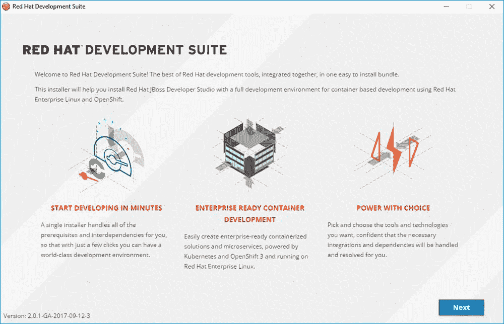
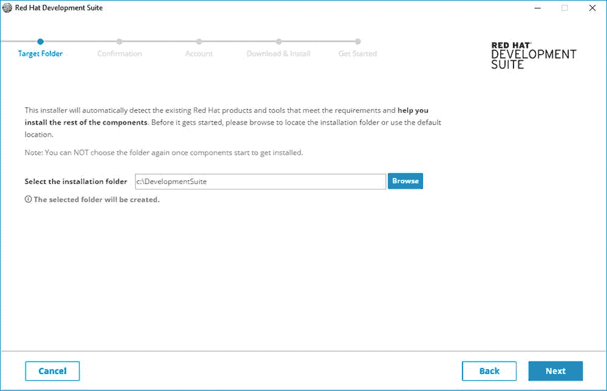
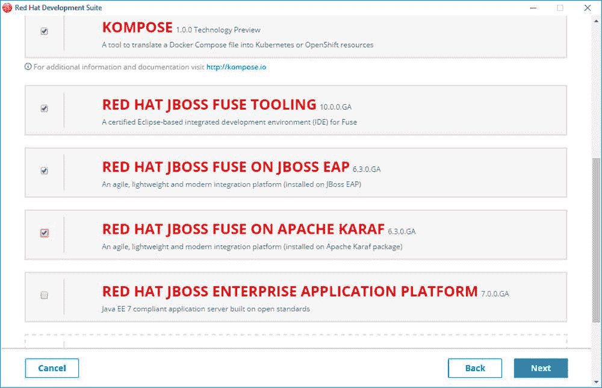
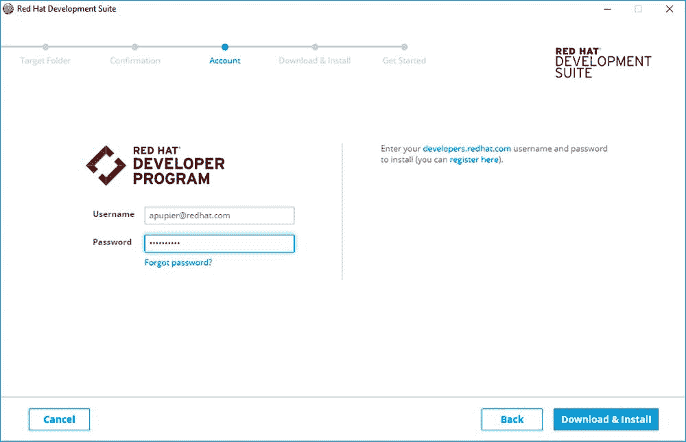
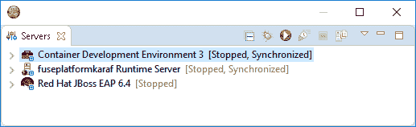

# 将开发环境与开发套件安装程序融合

> 原文：<https://developers.redhat.com/blog/2017/10/10/fuse-development-environment-development-suite-installer>

[Red Hat JBoss Fuse](http://developers.redhat.com/products/fuse/overview/) 是一个开源、轻量级和模块化的集成平台，允许您连接整个应用组合中的服务和系统。如果你熟悉 Fuse，你可能熟悉[Red Hat JBoss Developer Studio](http://developers.redhat.com/products/devstudio/overview/)附带的 Fuse 工具。

如果你仔细阅读了红帽开发工具的[最后公告，你可能已经注意到 Fuse 工具和 Fuse 运行时现在是](https://developers.redhat.com/blog/2017/08/15/red-hat-releases-new-development-tools/)[开发套件](https://developers.redhat.com/products/devsuite/overview/)的一部分。这个新特性看起来像是一个小的更新，但事实上，它极大地简化了为 Windows 和 Mac 用户设置 Fuse 开发环境的工作。

通过使用开发套件安装程序，用户现在只需点击几下鼠标，就可以在本地安装 Fuse 的所有可能的部署运行时(Karaf、EAP 和 OpenShift)。这些运行时甚至被预先配置为与 Fuse 工具一起使用。让我们仔细看看这有多简单。

### 安装步骤

1.  点击下载开发套件安装程序
2.  启动安装程序
3.  Click Next on the Welcome page

    

4.  Choose installation path and click Next

    

5.  检查组件的完整保险丝环境:
    1.  红帽开发者工作室
    2.  容器开发工具包
    3.  红帽 JBoss 保险丝工具
    4.  JBoss EAP 上的红帽 JBoss 保险丝
    5.  阿帕奇 Karaf 上的红帽 JBoss 引信
6.  单击下一步
7.  Enter credentials and click "Download & install"

    

8.  等待组件下载并安装完毕
9.  点击“打开红帽 JBoss 开发者工作室”

### 开始开发

您将在 Servers 视图中注意到，Fuse 目标运行时已经预先配置好了:

对于进一步的阅读，我推荐:

*   阅读[保险丝工具文档](https://access.redhat.com/documentation/en-us/red_hat_jboss_fuse/6.3/html/tooling_user_guide/pr01)
*   观看保险丝工具[视频](https://www.youtube.com/playlist?list=PLU-T8l-XOWOPh0z14IXs0Oa3OJpwSLHqr)
*   跟随 [@FuseTooling](https://twitter.com/FuseTooling)

给 Linux 用户的最后一个提示，请遵循 [Fuse Hello World 页面](https://developers.redhat.com/products/fuse/hello-world/)上指示的步骤。

*Last updated: October 6, 2017*