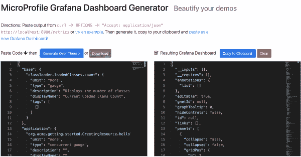
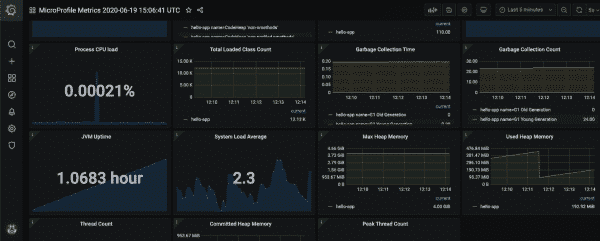

# 为 MicroProfile 应用程序生成自动化 Grafana 指标仪表板

> 原文：<https://developers.redhat.com/blog/2020/07/10/generate-automated-grafana-metrics-dashboards-for-microprofile-apps>

Grafana 是一个非常棒的可视化工具，可以查看应用程序的实时指标，您可以将它与 [MicroProfile](https://microprofile.io) 和类似的工具结合起来，为多个项目创建一个仪表板。然而，不同的项目使用不同的度量名称，因此为每个项目手工制作度量通常是必要的(并且是乏味的)。此外，每个项目可以公开它自己的定制度量，并且每个 MicroProfile 供应商也可以产生定制度量，所以如果您想在一个地方看到您的所有度量，需要很多手工步骤。

如果您可以简单地检查一个正在运行的应用程序，并生成一个包含所有公开指标的仪表板会怎么样？这正是你可以用[MicroProfile Metrics Generator](https://github.com/jamesfalkner/microprofile-grafana)做的事情，这是我创建的一个新的开源工具，通过捕获和监控你所有的项目度量，为任何 micro profile 项目动态生成 Grafana 仪表板。一旦您创建了一个仪表板，您就可以将它与 Grafana 一起使用，定制它以满足特定的需求，并将其保存为一个 JSON 文件。您还可以定期重新生成仪表板，以引入您在应用程序中公开的新指标。

在本文中，您将学习如何做到这一点:使用 MicroProfile Metrics Generator 为您的项目的所有度量创建一个统一的仪表板。

另外，如果你想在本地运行发电机，你需要安装 [Jsonnet](https://jsonnet.org/) 和 [Grafonnet](https://github.com/grafana/grafonnet-lib) 。如果想在本地运行 Grafana 和 Prometheus，还需要一个`docker`容器。

## 关于微配置文件度量

Eclipse MicroProfile 项目被分成多个子项目，其中一个是 [MicroProfile Metrics](https://github.com/eclipse/microprofile-metrics) 。微文件度量规范定义了一组度量的[基线](https://github.com/eclipse/microprofile-metrics/blob/master/spec/src/main/asciidoc/required-metrics.adoc)，这些度量在所有微文件兼容项目中是通用的。它还定义了自定义、按供应商和按应用程序的指标，开发人员可以使用这些指标来收集他们正在运行的应用程序的独特视图。

例如，每个微文件供应商都必须公开`memory.usedHeap`指标，该指标显示在任何时间点应用程序可用的 Java 堆内存量。供应商还可以选择公开特定于供应商的指标，如内部缓存统计数据。应用程序开发人员还可以对他们的应用程序进行检测(例如，使用像`@Timed`这样的 [Java](https://developers.redhat.com/topics/enterprise-java/) 注释)来收集特定于应用程序的指标。

但是，问题就在这里:作为一名开发人员，您需要供应商和应用程序度量的文档，并且您不会知道一个 MicroProfile 应用程序公开了什么度量，除非该信息被明确地文档化。结果，许多开发人员最终为他们的项目手工制作仪表板，并在添加和删除度量时手工更新他们的仪表板。

这就是 MicroProfile Metrics 生成器发挥作用的地方。

## 微轮廓度量生成器

MicroProfile 规范定义了一种机制，在一个方便的 RESTful 端点中列出度量元数据(名称、描述、单位和度量类型)。因此，假设您有一个正在运行的启用了 [MicroProfile Metrics](https://developers.redhat.com/cheat-sheets/microprofile-metrics) 的 MicroProfile 应用程序，监听 http://localhost:8080。要访问这些元数据，只需输入:

```
$ curl -X OPTIONS -H "Accept: application/json" http://localhost:8080/metrics
```

`OPTIONS /metrics` endpoint 适用于任何 MicroProfile 应用程序，并为您提供一组元数据，如下所示:

```
{
    "base": {
        "classloader.loadedClasses.count": {
            "unit": "none",
            "type": "gauge",
            "description": "Displays the number of classes that are currently loaded in the Java virtual machine.",
            "displayName": "Current Loaded Class Count",
            "tags": [
                [
                ]
            ]
        },
        ...
    },
    "vendor": { ... },
    "application": { ... }
}

```

请注意`base`(必需)、`vendor`和`application`指标的单独部分。

MicroProfile Metrics Generator 使用该输出创建一个 Grafana 仪表板，该仪表板符合 [Grafana 仪表板 JSON 模型规范](https://grafana.com/docs/grafana/latest/reference/dashboard/)。它还使用 MicroProfile Metrics 规范来创建适当的 [OpenMetrics 名称](https://github.com/eclipse/microprofile-metrics/blob/master/spec/src/main/asciidoc/rest-endpoints.adoc#openmetrics-format)，这些名称将在运行的应用程序的实际度量输出中使用。

然后，您可以使用该工具的输出来生成 Grafana 仪表板，您所要做的就是将内容从`OPTIONS /metrics`端点传递到该工具。另一个端点`GET /metrics`，让您看到应用程序公开指标的时间点。在这种情况下，您可以输入以下内容来查看正在运行的示例应用程序的指标:

```
$ curl http://localhost:8080/metrics
```

一旦连接到这些端点，您就可以设置这些指标，让类似于 [Prometheus](https://prometheus.io/) 的工具定期读取和使用，这是当前生成器的底层工具。Prometheus 存储这些指标，并提供警报和查询功能，然后您可以从 Grafana 这样的可视化工具访问这些功能。

## 生成示例组合仪表板

让我们使用[micro profile Metrics Generator 的存储库](https://github.com/jamesfalkner/microprofile-grafana)来看一个例子。您将需要以下工具来完成此示例:

*   [curl](https://curl.haxx.se/) -用于访问应用程序的指标。
*   [Git](https://git-scm.com/)——克隆[回购](https://github.com/jamesfalkner/microprofile-grafana)。
*   [Grafana](https://grafana.com/) -可视化仪表盘。
*   [Java](https://developers.redhat.com/topics/enterprise-java/)——运行示例应用程序。
*   [Node.js](https://developers.redhat.com/blog/category/node-js/) -运行生成器的 web 前端。
*   Prometheus -从应用程序中抓取指标。

**注意**:如果你想尝试一个已经运行过的版本，试试 small rye[micro profile Grafana Dashboard Generator](https://microprofile-grafana.quarkusdemos.net)的简单试驾。

### 运行微概要文件度量生成器

首先按照自述文件中的[说明启动并运行 MicroProfile Metrics Generator。MicroProfile Metrics Generator 存储库包括一个](https://github.com/jamesfalkner/microprofile-grafana/blob/master/README.md)[样例应用程序](https://github.com/jamesfalkner/microprofile-grafana/tree/master/sampleapp)，您可以使用它来生成度量。这是一个简单的 [Quarkus](https://developers.redhat.com/products/quarkus) 应用程序，增加了一些指标。您可以使用`mvn quarkus:dev -f sampleapp`从 repo 的根目录运行应用程序。Quarkus 包括 [SmallRye 微概要实现](https://smallrye.io/)。您可以通过阅读[*quar kus micro profile Metrics*guide](https://quarkus.io/guides/microprofile-metrics)了解更多信息。

**注意**:最终目标是从 JSON 元数据产生一个 JSON 仪表板，那么还有什么比 [Jsonnet](https://jsonnet.org/) 更好的工具呢？您可以用 Java、[、JavaScript](https://developers.redhat.com/blog/category/javascript/) 或其他语言进行 JSON 到 JSON 的映射，但是 Jsonnet 非常适合这项任务。Grafonnet 库只是让生成 Grafana JSON 不那么痛苦。

### 生成 Grafana 指标仪表板

这个例子假设您有一个启用了 MicroProfile Metrics 的 MicroProfile 应用程序，它运行在`localhost:8080`上。您还可以在`localhost:8081`上运行 MicroProfile Metrics Generator。

要查看应用程序的原始指标，请输入:

```
$ curl http://localhost:8080/metrics
```

接下来，生成指标元数据:

```
$ curl -X OPTIONS -H "Accept: application/json" http://localhost:8080/metrics
```

现在，在`http://localhost:8081`进入发电机前端。将之前命令的输出复制粘贴到左边的框中，点击**生成**。您将看到类似于图 1 中的屏幕截图。

[](/sites/default/files/blog/2020/06/dash.png)

Figure 1: View the application metrics on the generator's front end.

### 使用 Prometheus 导入 Grafana 仪表板

注意，在继续之前，您必须用 Prometheus 数据源配置 Grafana。反过来，Prometheus 必须配置为抓取应用程序的`/metrics`端点。如果您没有运行 Prometheus 和 Grafana，您可以使用示例脚本，这需要您使用`docker`来运行它们(更多细节参见[自述文件](https://github.com/jamesfalkner/microprofile-grafana/blob/master/README.md))。

现在来导入仪表板。复制生成器右侧的输出(图 1)。然后，打开 Grafana，将内容粘贴到 **Grafana 仪表板导入**框中(详见[自述文件](https://github.com/jamesfalkner/microprofile-grafana/blob/master/README.md))。或者，您可以点击治疗仪屏幕左侧的**下载**按钮下载`.json`文件。

图 2 显示了我使用这个工具生成的一个漂亮的 Grafana 仪表板示例:

[](/sites/default/files/blog/2020/06/grafana.png)

Figure 2: A Grafana dashboard for MicroProfile apps.

您还可以使用生成器的`/processRaw`端点来生成仪表板。这里有一个例子:

```
$ curl -X OPTIONS -H "Accept: application/json" http://localhost:8080/metrics | \
  curl -d @- http://localhost:8081/processRaw

```

## 实施细节

micro profile Metrics Generator[的魔力是用 Jsonnet 语法](https://github.com/jamesfalkner/microprofile-grafana/blob/master/dashboards/microprofile.jsonnet)编写的，还有其他典型的编程结构来完成这项工作。Jsonnet“消费”可以用编程表达式来检测的 JSON 文件，这会产生另一个 JSON 对象。

例如:

```
$ echo '["hello world"]' | jsonnet -
[
   "hello world"
]

```

那里没什么令人兴奋的；但这更有趣:

```
$ echo '[i for i in [1,2,3]]' | jsonnet -
[
   1,
   2,
   3
]

```

**注意**:有趣的[设计选择](https://jsonnet.org/articles/design.html)(比如是密封的)使得用 Jsonnet 动态使用 JSON 变得更加困难。它的[语法](https://jsonnet.org/ref/spec.html)也需要一些调整。

注意`for`循环。您可以使用许多其他编程元素来生成 JSON 最终对象。其他一切都很标准:你只需要一个 [Node.js](https://developers.redhat.com/blog/category/node-js/) 运行时和工具让 Prometheus 和 Grafana 在本地运行。

## 包裹

MicroProfile Metrics Generator 允许您为 MicroProfile 应用程序中的所有指标动态生成 Grafana 仪表板。这对于演示或为您的生产应用程序生成指标非常有用。如果你的应用程序运行不正常，你也可以使用 Prometheus 和 Grafana 来设置提醒。如果你有改进发电机的想法，我很想听听。

*Last updated: July 13, 2020*